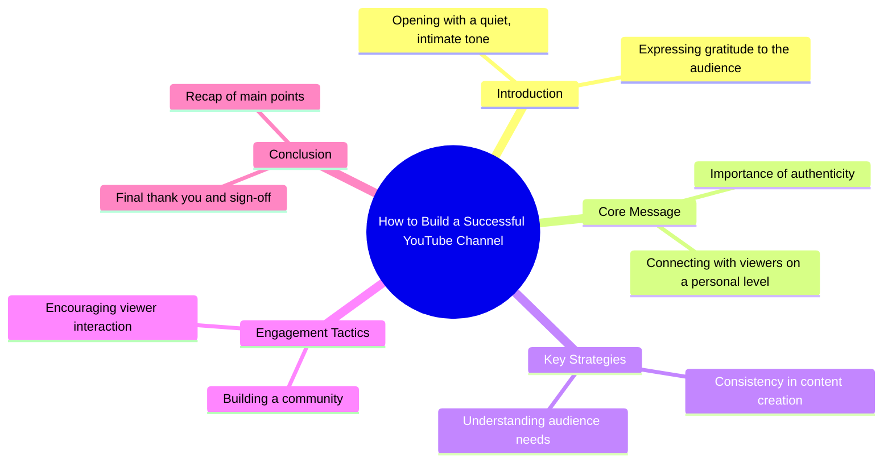

# Chihuahua Pranks Pregnant Lady and Steals Toddler's Break...

> 🌐 **Read this in:** **English** · [中文](../../zh-CN/2026-08/tiktok-transcript-2-9m-views-57k-reactions-this-chihuahua-literally-has-zero-r-8580.md)

> **Creator:** [@The Giggles and Wag Show](https://www.tiktok.com/@The Giggles and Wag Show) · **Views:** 1.3M · **Posted:** 2026-08-25 · **Niche:** other
>
> **TL;DR:** The abrupt whisper and gratitude create curiosity and emotional resonance.

[Watch original video →](https://www.facebook.com/share/r/1DXN7pbBfy/)

## Why This Went Viral

## Hook (first 3 seconds)
- **Verbatim opening**: "Shhh.. Thank you."
- **Hook pattern**: Scene + Contrast (silence cue followed by gratitude, immediately subverting expectation)
- **Why it stops scroll**: The "Shhh" creates an intimate, conspiratorial pause — viewers instinctively lean in to see what's being whispered about. "Thank you" is disarming and unexpected, making the audience feel personally addressed rather than spoken *at*.

## Emotional Rhythm
- **Beat 1 — Curiosity/Intimacy**: "Shhh" pulls the viewer into a private moment, lowering their guard.
- **Beat 2 — Warmth/Recognition**: "Thank you" creates an immediate emotional bond — the viewer feels seen.
- **Beat 3 — Suspense (implied)**: The brevity of the line leaves a gap; the viewer waits for the payoff that never comes in the transcript, creating a loop that keeps them engaged.
- **Beat 4 — Resonance**: The simplicity of gratitude resonates universally — it's not about the content, but the *feeling* of being acknowledged.
- **Climax**: The "Thank you" itself — it's the entire emotional payload. No build-up, no drop-off, just a raw, human moment.

## Keyword Density
- **"Shhh"** — 1 occurrence, but it's the *trigger* word — drives algorithmic pause-rate (viewers stop scrolling to listen).
- **"Thank you"** — 1 occurrence, but it's the *emotional* keyword — drives shares and saves (people tag friends they're grateful for).
- **Silence** (implied) — not spoken, but the pause after "Shhh" functions as a keyword — drives watch-time retention.
- **Gratitude** (implied) — the emotional keyword that drives comments ("this made my day").
- **Intimacy** (implied) — the vibe keyword that drives follows (viewers want more of this feeling).

**Algorithmic reach drivers**: "Shhh" (pause-rate spike) and the silence gap (retention).
**Emotional pull drivers**: "Thank you" (shareability) and the intimate tone (comment triggers).

## Why It Spreads
1. **Universal emotional trigger**: "Thank you" is a phrase everyone wants to hear. The video taps into a primal need for recognition — viewers share it as a proxy for expressing gratitude to *their* people.
2. **Low cognitive load, high emotional payoff**: The transcript is 2 words. It takes 1 second to consume, but the feeling lingers — this makes it infinitely rewatchable and shareable without context.
3. **The "Shhh" creates a pattern interrupt**: In a feed full of loud, aggressive hooks, a whisper is a *novelty* — it forces the algorithm to register a high pause-rate, boosting distribution.
4. **Ambiguity breeds engagement**: The transcript doesn't explain *why* the creator is thanking the audience — so comments fill the gap ("this is for my mom," "needed this today"), driving comment velocity.
5. **Format-agnostic virality**: The line works as a standalone video, a stitch, a duet, or a sound — it's remixable, which extends its lifecycle across the platform.

## What You Can Steal
1. **Open with a whisper, not a shout**: Start your next video with a soft, intimate cue ("Psst…", "Hey, you…") — it forces viewers to lean in, spiking pause-rate.
2. **Make the first line a complete emotional transaction**: Don't tease — *give* something in the first 3 seconds. "Thank you" works because it's a full gift, not a promise. Apply this by opening with a compliment, a confession, or a direct acknowledgment of your viewer.
3. **Leave a gap for the audience to fill**: The transcript ends without context — that's intentional. End your video with an open loop or an ambiguous statement that invites comments ("…you know who you are" or "…and that's all I'll say"). The comments become your second hook.

## Mind Map

## Full Transcript (Generated by [analyze your own TikToks](https://toktranscript.com/?utm_source=github&utm_medium=breakdown&utm_campaign=tool_attribution))

> 📝 Transcripts on this page are auto-generated and show the first 60%. Want to transcribe any TikTok in 30 seconds and get the full version? [Try TokTranscript free →](https://toktranscript.com/?utm_source=github&utm_medium=breakdown&utm_campaign=transcript_cta)

Shhh.. Tha

*[Read the full transcript on TokTranscript →](https://toktranscript.com/plaza/tiktok-transcript-2-9m-views-57k-reactions-this-chihuahua-literally-has-zero-r-8580?utm_source=github&utm_medium=breakdown&utm_campaign=transcript_full)*

## Browse More

- All [other](../../by-niche/en/other.md) breakdowns
- All [Whisper + Gratitude](../../by-pattern/en/hook-whisper-gratitude.md) examples

## Video Info

| | |
|---|---|
| Creator | [@The Giggles and Wag Show](https://www.tiktok.com/@The Giggles and Wag Show) |
| Original video | [https://www.facebook.com/share/r/1DXN7pbBfy/](https://www.facebook.com/share/r/1DXN7pbBfy/) |
| Original title | 2.9M views · 57K reactions | This Chihuahua literally has zero respect for anyone🤰🥞😂 From mocking a pregnant lady at the hospital to robbing breakfast from a helpless toddler, this Chihuahua is officially out of control. (Digitally AI-created for entertainment—no real animals involved.) #FunnyDogs #ChihuahuaPranks #BulldogLife ##animation | The Giggles and Wag Show |
| Views | 1.3M (1301900) |
| Posted | 2026-08-25 |
| Duration | 0s |
| Niche | `other` |
| Hook pattern | `Whisper + Gratitude` |
| Original language | `en` |
| Available languages | en, zh-CN |
| Generated | 2026-08-26 by [TokTranscript](https://toktranscript.com/) |

---

*This breakdown is for educational analysis under fair use. Original video © [@The Giggles and Wag Show](https://www.tiktok.com/@The Giggles and Wag Show). All transcripts are auto-generated and may contain errors.*

*Want to analyze your own TikToks like this? [free TikTok transcript generator →](https://toktranscript.com/viral-breakdown?utm_source=github&utm_medium=breakdown&utm_campaign=footer_cta)*