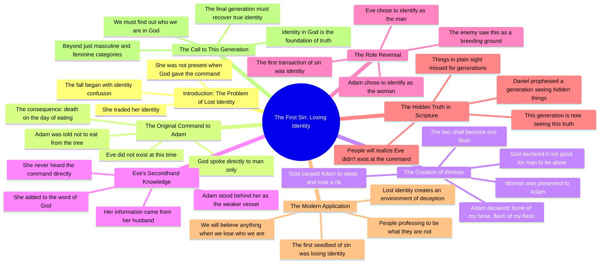

# Lost Gender Identity and the Fall of Mankind: Fallen Ange...

> 🌐 **Read this in:** **English** · [中文](../../zh-CN/2026-08/tiktok-transcript-26k-views-17k-reactions-lost-gender-identity-caused-the-fall-8669.md)

> **Creator:** [@The Confessionals](https://www.tiktok.com/@The Confessionals) · **Views:** 520.5K · **Posted:** 2026-08-11 · **Niche:** other
>
> **TL;DR:** Opens with a shocking, counterintuitive claim about Eve and directly engages a listener, immediately creating curiosity and tension.

[Watch original video →](https://www.facebook.com/share/v/19VhuNNjKA/?mibextid=wwXIfr)

## Why This Went Viral

## Hook (first 3 seconds)
- **Verbatim opening:** "She lost her identity. She had traded her identity."
- **Hook pattern:** Bold claim + immediate, unexplained accusation. It names a familiar figure ("she") but drops a shocking verdict ("lost her identity") with zero context.
- **Why it stops the scroll:** It weaponizes ambiguity. The viewer instantly asks: *Who is "she"? Eve? A celebrity? Me?* The repetition of "identity" (twice in 2 seconds) signals a high-stakes theme, and the preacher's intense delivery creates a "you need to hear this" urgency that interrupts passive scrolling.

## Emotional Rhythm
- **Beat 1 – Confusion/Intrigue:** "She lost her identity… traded her identity" (viewer is disoriented, leaning in).
- **Beat 2 – Intellectual tension:** "Tony, she was not even around when God said that." (Name-drops "Tony" for conversational intimacy; sets up a puzzle: *Who said what to whom?*)
- **Beat 3 – Escalating suspense:** He walks through Genesis sequentially — Adam's command, naming animals, the rib, the wedding — building a timeline that feels like a detective re-enactment.
- **Beat 4 – The Twist (climax):** "Everything that she said to the serpent… was told to her by her husband… The first initial transaction of sin in this world was identity." (The reveal lands: Eve's sin was *secondhand knowledge* + *role reversal*. This is the "aha" moment that makes viewers rewind.)
- **Beat 5 – Resonance/Modern application:** "We got people professing to be something that they're not… this final generation, we've got to find out who we are." (Shifts from ancient exegesis to a present-day identity crisis, making it personal and shareable.)
- **Beat 6 – Resolution:** "We've got to find out who we are in God." (Ends on a redemptive, actionable note — not just condemnation.)

## Keyword Density
- **identity** (8×) — *Algorithmic reach:* a universal, searchable topic (gender, self-discovery, spirituality) that triggers recommendation systems across niches.
- **God said / word of God** (6×) — *Emotional pull:* anchors authority and triggers religious audiences' "amen" reflex, increasing shares within faith communities.
- **first sin / first seedbed** (3×) — *Emotional pull:* creates a "hidden knowledge" hook — people love feeling they've discovered a secret in scripture.
- **generation / final generation** (4×) — *Algorithmic + emotional:* taps into prophecy content (high engagement in end-times niches) and creates urgency.
- **hidden in plain sight** (3×) — *Emotional pull:* a memorable phrase that viewers quote in comments, boosting engagement signals.
- **man / woman / masculine / feminine** (5×) — *Algorithmic reach:* gender roles are a high-controversy topic that drives comments, shares, and debate — all virality fuel.

## Why It Spreads
- **The "secret revealed" pattern:** The line "hidden in plain sight" (repeated twice) frames the video as a conspiracy-style revelation. Viewers share it to say, *"Did you catch this? I didn't."* This is the same mechanism as "Bible codes" or "lost books" content — it rewards the viewer with insider status.
- **Contrarian biblical claim:** "Eve didn't even hear it. She didn't even exist." This directly contradicts the common Sunday-school narrative. Contrarian claims get shared because they're *arguable* — every share invites a debate, which drives comment-section activity (the #1 engagement metric).
- **Contemporary relevance hook:** The pivot from Eve to "people professing to be something they're not" (a clear nod to gender/identity debates) makes the ancient text feel urgent. It rides a cultural hot-button topic without naming it explicitly — safe enough to share, spicy enough to provoke.
- **Conversational framing:** "Tony, she was not even around…" — addressing a named person creates the feeling of an intimate, unscripted revelation. Viewers feel like they're eavesdropping on a private teaching, which increases watch time and "save" rates.
- **Rhythmic repetition for memorability:** "That's where we're at right now" (repeated twice) and "we've got to find out who we are" (bookends the ending) give viewers quotable soundbites. Short-form platforms reward videos that produce clip-worthy lines for remixes and stitch responses.

## What You Can Steal
- **Open with a verdict, not a question.** Start with a shocking declarative ("She lost her identity") that names a familiar subject but flips the expected narrative. Don't explain — let the confusion pull the viewer through the first 10 seconds.
- **Build a "timeline reveal."** Walk through a well-known story step-by-step (like the Genesis sequence) but stop at a detail everyone missed. The feeling of *"I've read this 100 times and never saw that"* is the single most shareable emotion in educational content.
- **Bridge ancient text to a modern controversy — without naming it.** The video never says "transgender" or "gender roles," but the implication is unmistakable. This lets viewers project their own context onto the content, making it feel personal and increasing the chance they'll tag a friend or share it in a group chat.

## Mind Map

## Full Transcript (Generated by [try this transcription tool](https://toktranscript.com/?utm_source=github&utm_medium=breakdown&utm_campaign=tool_attribution))

> 📝 Transcripts on this page are auto-generated and show the first 60%. Want to transcribe any TikTok in 30 seconds and get the full version? [Try TokTranscript free →](https://toktranscript.com/?utm_source=github&utm_medium=breakdown&utm_campaign=transcript_cta)

She lost her identity. She had traded her identity. Tony, she was not even around when God said that. She did not even exist. When you go back in scripture and you find God said it to man only. He said to Adam, of every tree in the garden you can eat, but of this tree you shall not eat of it, for in the day that you eat of it you shall surely die. Boom. Next verse. Talks about naming the animals. Next verse. and God said, it is not good for a man to be alone. And God caused man to lay down and to a sleep and he took a rib and out of that rib, he brought woman and presented her to him. And he said, oh, bone of my bone, flesh of my flesh. Therefore shall a man leave his father and mother and cleave unto his wife and the two shall become one flesh. So the reality is this, this is what I'm talking about, hidden in plain sight. This is what I'm talking about when Daniel said in the last days, this generation is gonna see things, not adding, twisting, not feeling a different way about scripture, but reading something that's in there that we have missed for generations. When you go back and look at it, not only does she add to the word of God, she added to the word of God because she didn't even hear it. She didn't even exist. Everything that she said to the serpent she said on secondhand knowledge was told to her by her husband who was standing behind her becoming the weaker vessel who had chosen to identify as the woman and she had chosen to identify as the man. The first initial transaction of sin in this world was identity. When they lost their identity, she took on the role of the masculine. He took on the role of the feminine.

*[Read the full transcript on TokTranscript →](https://toktranscript.com/plaza/tiktok-transcript-26k-views-17k-reactions-lost-gender-identity-caused-the-fall-8669?utm_source=github&utm_medium=breakdown&utm_campaign=transcript_full)*

## Browse More

- All [other](../../by-niche/en/other.md) breakdowns
- All [Bold Claim + Direct Address](../../by-pattern/en/hook-bold-claim-direct-address.md) examples

## Video Info

| | |
|---|---|
| Creator | [@The Confessionals](https://www.tiktok.com/@The Confessionals) |
| Original video | [https://www.facebook.com/share/v/19VhuNNjKA/?mibextid=wwXIfr](https://www.facebook.com/share/v/19VhuNNjKA/?mibextid=wwXIfr) |
| Original title | 26K views · 17K reactions | Lost Gender Identity caused the Fall of Mankind 812: Fallen Angels and the Final Flood | The Confessionals |
| Views | 520.5K (520506) |
| Posted | 2026-08-11 |
| Duration | 0s |
| Niche | `other` |
| Hook pattern | `Bold Claim + Direct Address` |
| Original language | `en` |
| Available languages | en, zh-CN |
| Generated | 2026-08-12 by [TokTranscript](https://toktranscript.com/) |

---

*This breakdown is for educational analysis under fair use. Original video © [@The Confessionals](https://www.tiktok.com/@The Confessionals). All transcripts are auto-generated and may contain errors.*

*Want to analyze your own TikToks like this? [TokTranscript.com →](https://toktranscript.com/viral-breakdown?utm_source=github&utm_medium=breakdown&utm_campaign=footer_cta)*