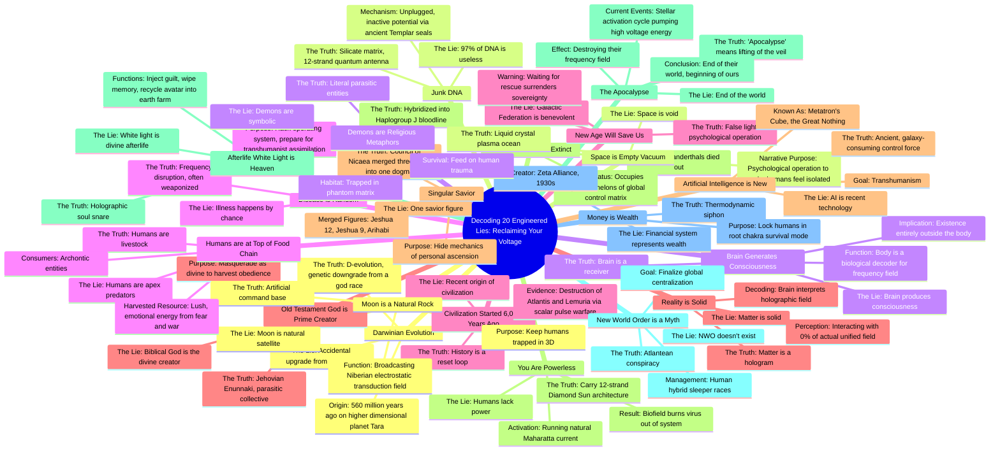

# 20 Lies You Were Taught in School

> 🌐 **Read this in:** **English** · [中文](../../zh-CN/2026-08/tiktok-transcript-2k-views-77k-reactions-20-lies-you-were-taught-in-school-evo-1ffd.md)

> **Creator:** [@Rex Edison](https://www.tiktok.com/@Rex Edison) · **Views:** 876.1K · **Posted:** 2026-08-16 · **Niche:** entertainment
>
> **TL;DR:** Promises a high-stakes reveal of 20 lies, creating immediate curiosity and a sense of forbidden knowledge.

[Watch original video →](https://www.facebook.com/reel/27249227684770564/?fs=e&s=TIeQ9V&fs=e&mibextid=wwXIfr&fs=e)

## Why This Went Viral

## Hook (first 3 seconds)
- **Verbatim opening line:** "Almost everything you were taught in school is an engineered lie and cover story."
- **Hook pattern:** Bold claim + conspiracy framing ("engineered lie") aimed at institutional distrust.
- **Why it stops scroll:** It attacks a universal shared experience (schooling) and promises secret knowledge — the viewer instantly feels either validated (if they distrust institutions) or provoked (if they don't). Both emotions generate a watch.

## Emotional Rhythm
1. **Defiance/Validation** (0:00–0:05) — "Everything you were taught is a lie" flatters the viewer's skepticism.
2. **Escalating Tension** (0:05–0:20) — The promise of "20 fabrications" creates a countdown-driven compulsion to keep watching.
3. **Shock/Disbelief** (0:20–1:00) — Early lies (Darwin, DNA, consciousness) are outrageous enough to trigger "no way" reactions, which fuels comments.
4. **Momentum/Addiction** (1:00–2:30) — Rapid-fire delivery (each lie ~5–10 seconds) creates a slot-machine rhythm; the viewer keeps waiting for the next hit.
5. **Peak Absurdity/Twist** (2:30–3:30) — Lies 12–15 (moon is artificial, demons are real, humans are livestock) push the viewer to a "this is insane but I can't stop" state.
6. **Empowerment Climax** (3:30–4:15) — Lie 19 flips the script: "You are powerless" becomes "You carry 12-strand Diamond sun architecture" — the emotional payoff is personal power.
7. **Resolution/Urgency** (4:15–end) — "Apocalypse = lifting of the veil" reframes current chaos as victory, ending with a CTA that invites participation.

**Climax moment:** Lie 19 ("You are powerless → You are a god-battery") — it converts fear into agency, which is the emotional peak that drives shares.

## Keyword Density
- **"Truth"** (10+ uses) — Drives both algorithmic reach (high-engagement keyword in conspiracy niches) and emotional pull (promises certainty in a chaotic world).
- **"Lie"** (20+ uses) — The structural anchor; each repetition reinforces the "us vs. them" frame.
- **"You/Your"** (15+ uses) — Direct address creates personal stakes; boosts watch time because it feels like a message meant for the viewer.
- **"Matrix/System/Control"** (8+ uses) — Taps into pre-existing conspiracy search traffic and community keywords.
- **"Voltage/Energy/Frequency"** (6+ uses) — Unique to this creator's brand; creates a signature vocabulary that fans repeat in comments.
- **"God/Divine/Ancient"** (7+ uses) — Triggers spiritual-seeker audiences and drives shares in metaphysical communities.

**Algorithmic drivers:** "Truth," "Lie," "Matrix" — high-volume search terms with strong CTR potential.
**Emotional drivers:** "You," "Voltage," "Awaken" — create identity attachment and community belonging.

## Why It Spreads
- **The countdown structure creates completion compulsion.** "20 lies" with rapid-fire delivery means the viewer can't stop mid-list. The transcript's pacing (each lie = one breath) is engineered for binge-watching. *Concrete line: "Let's start with the biggest lie... Second lie is... The third lie is..."* — a relentless chain.
- **Every claim is a shareable mic-drop moment.** Each lie is self-contained and outrageous enough to be quoted or screenshotted. *Concrete line: "The moon is an artificial command base"* — this single statement becomes a standalone meme, driving organic shares.
- **The ending reframes anxiety as empowerment.** The apocalypse twist ("It is the beginning of yours and mine") turns current world events into a victory narrative. This emotional pivot is why viewers send it to friends who are anxious about the news. *Concrete line: "The chaos you are witnessing right now is not the end of the world... it is the stellar activation cycle."*
- **The CTA is a community-building trap.** "Comment the word 'truth' and I will send you my phase one high voltage detox" — this converts passive viewers into leads and creates comment-section engagement that boosts the algorithm. *Concrete line: "Comment your feedback or your disbelief, and if you wish, the word truth."*
- **It weaponizes identity.** The video doesn't just inform — it recruits. By the end, the viewer is either "awake" or "asleep." This binary identity frame is the strongest share trigger in viral conspiracy content. *Concrete line: "It's time to unplug... Let's reclaim our voltage and begin the human revival."*

## What You Can Steal
- **Use a countdown structure for retention.** Frame your content as "X number of [things]" and deliver each item in under 10 seconds. The numbered list creates an open loop that keeps viewers watching to completion — the #1 algorithm signal.
- **Flip a negative belief into a personal power payoff.** Don't just expose a problem; end with a twist that gives the viewer agency. The "you are powerless → you are a god-battery" pivot is the emotional engine. Apply this to any niche: "You think you're bad at money → you're actually programmed to be."
- **End with a low-friction engagement bait.** Ask viewers to comment a single word ("truth") to receive something. This works because it's one word, not a paragraph, and it creates a comment section that signals high engagement to the algorithm. Adapt it: "Comment 'blueprint' and I'll send you the checklist."

## Mind Map

## Full Transcript (Generated by [TokTranscript.com](https://toktranscript.com/?utm_source=github&utm_medium=breakdown&utm_campaign=tool_attribution))

> 📝 Transcripts on this page are auto-generated and show the first 60%. Want to transcribe any TikTok in 30 seconds and get the full version? [Try TokTranscript free →](https://toktranscript.com/?utm_source=github&utm_medium=breakdown&utm_campaign=transcript_cta)

Almost everything you were taught in school is an engineered lie and cover story. And I'm going to decode all 20 of these incredible fabrications in the next few minutes so you can finally know the truth about who you are, where you came from, and how to reclaim your voltage. And listen closely, because lie number 20 explains exactly why their entire matrix is collapsing right now. Let's start with the biggest lie, shall we? Darwinian evolution. The narrative says you are an accidental upgrade from a primate. The reality is it's D evolution. You are actually a genetic downgrade from a literal god race. And this happened over 560 million years ago on a higher dimensional planet called Tara. Second lie is junk DNA. Science claims 97% of your DNA is useless. The truth is it's silicate matrix, a 12-strand quantum antenna intentionally unplugged and left with inactive potential via ancient Templar seals. The third lie is that the brain generates consciousness. The truth is the brain is a receiver. You exist entirely outside the body. Your body is simply a biological decoder for a frequency field. The fourth lie, disease is random. The truth is illness is a frequency disruption often weaponized to hack your operating system and prepare you for transhumanist assimilation Line number five, civilization only started 6,000 years ago. The truth is, history is a reset loop. Pure destruction of highly advanced civilizations like Atlantis and Lemuria via scalar pulse warfare. 6. The Old Testament God is the prime creator The truth is, this is the Jehovian Enunnaki a parasitic collective masquerading as the divine to harvest your obedience 7. A singular savior The truth is, the Council of Nicaea merged three entirely different men Jeshua 12, Jeshua 9, and Arihabi into one controlled dogma to higher mechanics of your own personal ascension. How about line number eight? Neanderthals went extinct. The truth is they did not go extinct. They were hybridized into the Haplogroup J bloodline that occupies the highest echelons of the global control matrix today. Line number nine, one of my favorite. The afterlife, white light, is heaven. The truth is, it's a holographic soul snare designed to inject guilt, wipe your memory, and recycle your avatar back into the earth farm. Lie 10. The New World Order is a myth. The truth it is the Atlantean conspiracy managed by human hybrid sleeper races to finalize global centralization Lie number 11 is money is wealth The truth is the financial system is a thermodynamic siphon created by the Zeta Alliance in the 1930s to keep you locked in root chakra survival mode now lie number 12 is going to get some the moon is a natural rock i'm sorry folks but the truth is it's an artificial command base and it's broadcasting the niberian electrostatic transduction field to keep you trapped in 3d how about 13 that space is just an empty vacuum well is actually a highly active liquid crystal plasma ocean.

*[Read the full transcript on TokTranscript →](https://toktranscript.com/plaza/tiktok-transcript-2k-views-77k-reactions-20-lies-you-were-taught-in-school-evo-1ffd?utm_source=github&utm_medium=breakdown&utm_campaign=transcript_full)*

## Browse More

- All [entertainment](../../by-niche/en/entertainment.md) breakdowns
- All [Listicle with urgency](../../by-pattern/en/hook-listicle-with-urgency.md) examples

## Video Info

| | |
|---|---|
| Creator | [@Rex Edison](https://www.tiktok.com/@Rex Edison) |
| Original video | [https://www.facebook.com/reel/27249227684770564/?fs=e&s=TIeQ9V&fs=e&mibextid=wwXIfr&fs=e](https://www.facebook.com/reel/27249227684770564/?fs=e&s=TIeQ9V&fs=e&mibextid=wwXIfr&fs=e) |
| Original title | 2K views · 77K reactions | 20 Lies You Were Taught in School #evolution #religion #dna #detox #moon #loosh #disclosure #ufo | Rex Edison |
| Views | 876.1K (876063) |
| Posted | 2026-08-16 |
| Duration | 0s |
| Niche | `entertainment` |
| Hook pattern | `Listicle with urgency` |
| Original language | `en` |
| Available languages | en, zh-CN |
| Generated | 2026-08-17 by [TokTranscript](https://toktranscript.com/) |

---

*This breakdown is for educational analysis under fair use. Original video © [@Rex Edison](https://www.tiktok.com/@Rex Edison). All transcripts are auto-generated and may contain errors.*

*Want to analyze your own TikToks like this? [TokTranscript →](https://toktranscript.com/viral-breakdown?utm_source=github&utm_medium=breakdown&utm_campaign=footer_cta)*