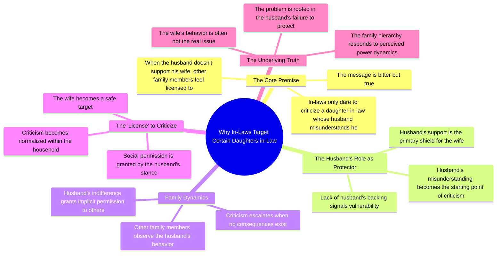

# In-Laws Only Mock a Wife Whose Husband Doesn’t Support Her

> 🌐 **Read this in:** **English** · [中文](../../zh-CN/2026-08/tiktok-transcript-3-4k-views-73k-reactions-instalike-instadaily-insta-instagra-898f.md)

> **Creator:** [@Kavya2000](https://www.tiktok.com/@Kavya2000) · **Views:** 1.6M · **Posted:** 2026-08-05 · **Niche:** other
>
> **TL;DR:** Starts with a provocative, universally relatable truth that immediately grabs attention.

[Watch original video →](https://www.facebook.com/share/r/1DzA7s9Jor/)

## Why This Went Viral

## Hook (first 3 seconds)
- **Verbatim opening:** "ससुराल वाले सिर्फ उसी बहू को गलत बोलने की हिम्मत रखते हैं, जिसका पती ही उसे गलत समझता हो."
- **Hook pattern:** Bold claim + cultural taboo. It's a blunt, universal truth about Indian family dynamics that almost no one says aloud.
- **Why it stops scroll:** It names a painful, unspoken power dynamic in one sentence. The viewer feels personally seen — either as the daughter-in-law, the husband, or the in-law — and must listen to confirm or challenge the claim.

## Emotional Rhythm
- **Beat 1 (Curiosity/Shock):** The opening claim is harsh and direct. Viewer is jolted.
- **Beat 2 (Tension):** "और जब उसका पती भी उसका साथ नहीं देता है न" — the tension escalates. The betrayal is now layered: not just in-laws, but the husband too.
- **Beat 3 (Resonance/Recognition):** "तो बाकी घरवालों को उसको गलत बोलने का लाइसेंस मिल जाता है" — the word "लाइसेंस" is the emotional pivot. It reframes abuse as a systemic permission slip, not isolated incidents.
- **Beat 4 (Climax):** "बात कडवी है, मगर सच है." — This is the twist. The speaker admits the pain of the truth, which disarms defensive listeners and forces agreement.
- **Overall arc:** Shock → tension → painful recognition → resigned acceptance.

## Keyword Density
- **"गलत" (wrong)** — appears 3 times. Drives the moral framing and emotional pull.
- **"पती" (husband)** — repeated. Core to the power dynamic being exposed.
- **"ससुराल वाले" (in-laws)** — anchors the cultural context, high search/reach potential in Indian family-content niche.
- **"साथ नहीं देता" (doesn't support)** — emotional trigger for anyone who's felt abandoned.
- **"लाइसेंस" (license)** — the single most viral-friendly word. It's metaphorical, memeable, and quotable.
- **"सच" (truth)** — repeated twice in the closing line. Drives shareability as a "truth bomb."

## Why It Spreads
- **It weaponizes a universal fear:** The video names the exact moment a woman loses all protection in a patriarchal household. Anyone who's witnessed or experienced this will share it as validation.
- **The "license" metaphor is giftable:** "लाइसेंस मिल जाता है" is a standalone quote. It can be screenshotted, captioned, and reshared without context — perfect for Instagram reels and WhatsApp forwards.
- **It creates an "us vs. them" clarity:** The script splits the world into victims (the bahu) and enablers (husband + in-laws). This binary drives comments, arguments, and engagement.
- **The closing line preempts backlash:** "बात कडवी है, मगर सच है" is a rhetorical shield. It disarms critics before they type "but not all families..." — which ironically fuels more comments.
- **It's gender-targeted but universally watchable:** Men watch to defend or reflect; women watch to relate; in-laws watch to argue. Three audience segments = three comment threads = higher algorithm boost.

## What You Can Steal
- **Open with a taboo truth, not a question.** Questions invite skipping. A bold claim forces the viewer to stay to verify. Use "सिर्फ... ही... की हिम्मत रखते हैं" — a structure that implies exclusivity and injustice.
- **Invent a visceral metaphor for a systemic issue.** "लाइसेंस" turns an abstract power dynamic into a tangible object. Find one word that encapsulates your entire argument and repeat it.
- **End with a concession that disarms critics.** "बात कडवी है, मगर सच है" — admit the pain of your own statement. This makes you seem fair, which increases trust and shareability. Try: "It's harsh to say, but it's the reality."

## Mind Map

## Full Transcript (Generated by [TokTranscript.com](https://toktranscript.com/?utm_source=github&utm_medium=breakdown&utm_campaign=tool_attribution))

> 📝 Transcripts on this page are auto-generated and show the first 60%. Want to transcribe any TikTok in 30 seconds and get the full version? [Try TokTranscript free →](https://toktranscript.com/?utm_source=github&utm_medium=breakdown&utm_campaign=transcript_cta)

ससुराल वाले सिर्फ उसी बहू को गलत बोलने की हिम्मत रखते हैं, जिसका पती ही उसे गलत समझता हो.

*[Read the full transcript on TokTranscript →](https://toktranscript.com/plaza/tiktok-transcript-3-4k-views-73k-reactions-instalike-instadaily-insta-instagra-898f?utm_source=github&utm_medium=breakdown&utm_campaign=transcript_full)*

## Browse More

- All [other](../../by-niche/en/other.md) breakdowns
- All [Bold Truth Statement](../../by-pattern/en/hook-bold-truth-statement.md) examples

## Video Info

| | |
|---|---|
| Creator | [@Kavya2000](https://www.tiktok.com/@Kavya2000) |
| Original video | [https://www.facebook.com/share/r/1DzA7s9Jor/](https://www.facebook.com/share/r/1DzA7s9Jor/) |
| Original title | 3.4K views · 73K reactions | ससुराल वालों को पत्नी को ग़लत बोलने का मौका मिल जाता है…………………… #instalike #instadaily #insta #instagram #youtube | Kavya2000 |
| Views | 1.6M (1571804) |
| Posted | 2026-08-05 |
| Duration | 0s |
| Niche | `other` |
| Hook pattern | `Bold Truth Statement` |
| Original language | `en` |
| Available languages | en, zh-CN |
| Generated | 2026-08-06 by [TokTranscript](https://toktranscript.com/) |

---

*This breakdown is for educational analysis under fair use. Original video © [@Kavya2000](https://www.tiktok.com/@Kavya2000). All transcripts are auto-generated and may contain errors.*

*Want to analyze your own TikToks like this? [TokTranscript.com →](https://toktranscript.com/viral-breakdown?utm_source=github&utm_medium=breakdown&utm_campaign=footer_cta)*