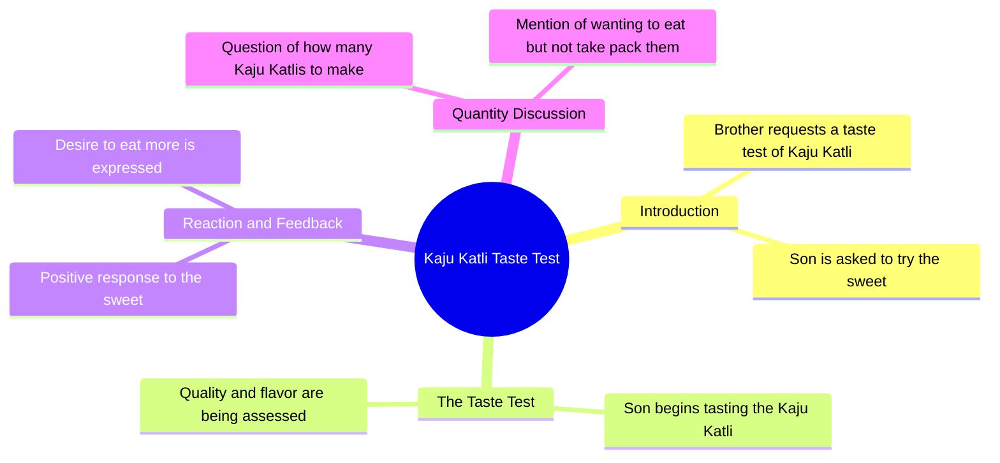

# Cute Baby Tries Sweets at Shop | Funny AI Video

> 🌐 **Read this in:** **English** · [中文](../../zh-CN/2026-08/tiktok-transcript-38m-views-659k-reactions-cute-baby-sweets-shop-ai-funny-vide-3b18.md)

> **Creator:** [@    Mini Masti AI](https://www.tiktok.com/@    Mini Masti AI) · **Views:** 14.0M · **Posted:** 2026-08-08 · **Niche:** other
>
> **TL;DR:** The hook immediately sets up a relatable snack-testing scenario with a humorous twist, drawing viewers in.

[Watch original video →](https://www.facebook.com/reel/4529745093933737/)

## Why This Went Viral

## Hook (first 3 seconds)
- **Verbatim opening line:** "भाईया एक काजु कतली टेस्ट करवादो ना" (Brother, please let me taste one kaju katli)
- **Hook pattern:** Scene + Direct Appeal (a child/young person asking a shopkeeper with a polite, endearing tone)
- **Why it stops scroll:** The innocent, slightly demanding yet sweet request creates instant intrigue — the viewer doesn't know if the shopkeeper will say yes, and the dynamic between the two is immediately relatable and heartwarming. The regional dialect ("करवादो ना") adds authenticity and cultural resonance.

## Emotional Rhythm
- **Beat 1 — Curiosity (0–3s):** The request is made; we want to see the response.
- **Beat 2 — Tension (3–5s):** The shopkeeper's reply "लो बेटा टेस्ट करो" (Here, child, taste it) — will he give it for free or charge?
- **Beat 3 — Playful Twist (5–8s):** The shopkeeper says "अच्छा अब कितनी काजु कतली कर दूँ" (Alright, how many kaju katlis should I make?) — implying he's willing to give more, shifting the tone from transaction to generosity.
- **Beat 4 — Comedic Punch (8–10s):** The punchline "खाने का मन्था लेने का नहीं" (Mood for eating, not for buying) — a witty, self-aware admission that flips the entire interaction into humor.
- **Climax:** The final line lands as the comedic reveal — the child admits they just want free samples, not to purchase.

## Keyword Density
- **"काजु कतली" (kaju katli)** — repeated 3x; drives the visual/sensory appeal and searchability of the sweet.
- **"टेस्ट कर" (taste/test)** — repeated 2x; creates a pattern of testing/sampling, which is a relatable consumer behavior.
- **"खाने का" (for eating)** — repeated 2x; emphasizes the desire vs. action contrast.
- **"मन्था" (mood/wish)** — used once but is the punchline anchor; high emotional pull.
- **"लो बेटा" (here, child)** — used once; establishes the warm shopkeeper persona, driving emotional resonance.

**Algorithmic reach:** "काजु कतली" is a high-volume search term during festive seasons (Diwali, sweets cravings).  
**Emotional pull:** "खाने का मन्था लेने का नहीं" is the viral-worthy phrase — it's memeable, quotable, and universally relatable.

## Why It Spreads
- **Relatable honesty:** The line "खाने का मन्था लेने का नहीं" captures a universal human impulse — wanting something without wanting to pay. Everyone has been in this position, and the candid admission makes viewers laugh and tag friends.
- **Cultural authenticity:** The Hindi/Hinglish dialect and the sweet-shop setting tap into a massive Indian audience that recognizes this exact interaction from their own lives — it's a shared cultural moment.
- **Short, punchy structure:** The video is under 15 seconds with a clear setup → payoff. The joke lands fast, making it easy to rewatch and share without losing impact.
- **Dual character dynamic:** The child (innocent, cheeky) vs. shopkeeper (warm, amused) creates a natural comedy duo. Viewers share it because the interaction feels scripted by life, not by a creator.
- **Memeable punchline:** The final phrase is a standalone quotable that can be repurposed into memes, captions, or reaction clips — extending the video's life beyond the original post.

## What You Can Steal
- **Lead with a direct, human request:** Start your video with someone asking for something simple and relatable — it instantly hooks because viewers want to see the outcome.
- **End on a self-aware punchline:** The twist "खाने का मन्था लेने का नहीं" works because it admits a flaw honestly. Craft a closing line that flips the expectation with humor or vulnerability — that's your shareable moment.
- **Use dialect and setting as a shortcut:** Don't sanitize your language or location. The regional flavor is what made this feel authentic and shareable. Lean into your local dialect, shop, or daily scene — specificity creates universality.

## Mind Map

## Full Transcript (Generated by [try this transcription tool](https://toktranscript.com/?utm_source=github&utm_medium=breakdown&utm_campaign=tool_attribution))

> 📝 Transcripts on this page are auto-generated and show the first 60%. Want to transcribe any TikTok in 30 seconds and get the full version? [Try TokTranscript free →](https://toktranscript.com/?utm_source=github&utm_medium=breakdown&utm_campaign=transcript_cta)

भाईया एक काजु कतली टेस्ट करवादो ना लो बेटा टेस्ट करो अच्छा अब कितन

*[Read the full transcript on TokTranscript →](https://toktranscript.com/plaza/tiktok-transcript-38m-views-659k-reactions-cute-baby-sweets-shop-ai-funny-vide-3b18?utm_source=github&utm_medium=breakdown&utm_campaign=transcript_full)*

## Browse More

- All [other](../../by-niche/en/other.md) breakdowns
- All [Direct request + playful refusal](../../by-pattern/en/hook-direct-request-playful-refusal.md) examples

## Video Info

| | |
|---|---|
| Creator | [@    Mini Masti AI](https://www.tiktok.com/@    Mini Masti AI) |
| Original video | [https://www.facebook.com/reel/4529745093933737/](https://www.facebook.com/reel/4529745093933737/) |
| Original title | 38M views · 659K reactions | Cute baby @Sweets shop🥮🎂🍩 AI funny video 🩵 #funnyreels #cutebaby #viralreelsシ #trendingreelsvideo #funnyreels | Mini Masti AI |
| Views | 14.0M (14028252) |
| Posted | 2026-08-08 |
| Duration | 0s |
| Niche | `other` |
| Hook pattern | `Direct request + playful refusal` |
| Original language | `en` |
| Available languages | en, zh-CN |
| Generated | 2026-08-09 by [TokTranscript](https://toktranscript.com/) |

---

*This breakdown is for educational analysis under fair use. Original video © [@    Mini Masti AI](https://www.tiktok.com/@    Mini Masti AI). All transcripts are auto-generated and may contain errors.*

*Want to analyze your own TikToks like this? [free TikTok transcript generator →](https://toktranscript.com/viral-breakdown?utm_source=github&utm_medium=breakdown&utm_campaign=footer_cta)*