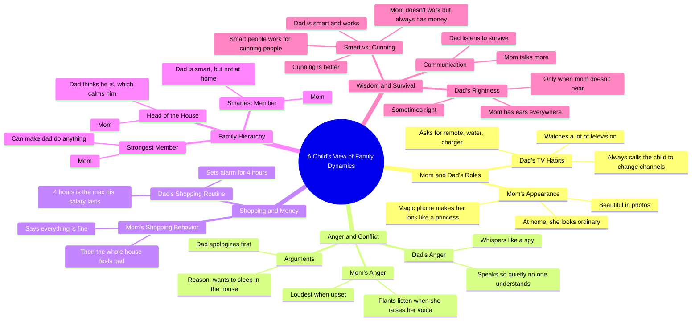

# Dad Only Calls Me to Change the TV Channel

> 🌐 **Read this in:** **English** · [中文](../../zh-CN/2026-08/tiktok-transcript-3m-views-94k-reactions-giorgi-bartia-on-reels-578f.md)

> **Creator:** [@Giorgi Bartia](https://www.tiktok.com/@Giorgi Bartia) · **Views:** 2.1M · **Posted:** 2026-08-25 · **Niche:** entertainment
>
> **TL;DR:** The hook immediately sets up a relatable family dynamic with a child's candid perspective, drawing viewers in with the promise of humorous revelations.

[Watch original video →](https://www.facebook.com/share/v/1DC9DAQxis/?mibextid=wwXIfr)

## Why This Went Viral

## Hook (first 3 seconds)
- **Verbatim opening:** "Папа много смотрит телевизор?" (Dad watches a lot of TV?) — a question directed at a child, answered with "Угу" (Uh-huh).
- **Hook pattern:** Question + Child's perspective (curiosity gap + innocence).
- **Why it stops the scroll:** The viewer instantly sees a child being interviewed about family dynamics. The combination of a soft, curious child voice and a taboo-ish topic (parents' quirks) creates immediate "What will they say next?" tension. The viewer must watch to hear the unfiltered truth.

## Emotional Rhythm
1. **Warm curiosity** — Child answers simple questions about Dad's TV habits.
2. **Relatable humor** — "Переключи, принеси пульт, принеси воду, принеси зарядку" (Switch it, bring the remote, bring water, bring charger) — a universal dad stereotype.
3. **Playful contrast** — Mom is a "princess" in the phone but a "potato" at home — absurd, visual comedy.
4. **Rising tension** — "Who yells loudest?" → Mom. The child escalates to conflict territory.
5. **Surprise twist** — "Dad whispers like a spy so he won't be understood" — unexpected, clever framing.
6. **Comic relief** — "Dad apologizes first because he wants to sleep in the house" — punchline logic.
7. **Escalating absurdity** — The 4-hour alarm clock joke ties to salary survival — dark humor delivered innocently.
8. **Peak resonance** — "Mom says she's fine, and then the whole house is not fine" — universally true, emotionally resonant.
9. **Climax** — "Dad is smart, but not at home" + "Smart people work for cunning ones" — the kid delivers a philosophical mic-drop.
10. **Closing warmth** — "Dad listens to survive" — a final, memorable punchline that wraps the family portrait.

**Climax moment:** The "умный vs. хитрый" (smart vs. cunning) exchange — the child's worldview crystallizes into a viral quote.

## Keyword Density
- **Мама (Mom)** — appears ~10 times; drives emotional pull (relatable matriarch archetype).
- **Папа (Dad)** — appears ~12 times; the core subject, drives search/algorithmic reach (family niche).
- **Умный/Хитрый (Smart/Cunning)** — repeated in climax; high emotional pull, quote-worthy.
- **Дома (At home)** — repeated contrast; drives the "public vs. private" narrative.
- **Телефон (Phone)** — repeated; ties to modern parenting, algorithmic relevance.
- **Работает/Работа (Works/Work)** — repeated; economic tension, relatable stress.
- **Правда (Truth/Really)** — repeated as a child's verification; builds authenticity.
- **Слушает (Listens)** — closing word; emotional pull, memorable ending.

**Algorithmic reach drivers:** "Мама," "Папа," "Телефон" — high-volume family/lifestyle keywords.
**Emotional pull drivers:** "Умный/Хитрый," "Слушает," "Дома" — create the shareable, quote-able core.

## Why It Spreads
- **Unfiltered child honesty:** The child's deadpan delivery ("Папа шепчет, как шпион") feels like a secret confession. Viewers share it because it validates their own family observations — the transcript's "Мама у тебя на фото красивая, да? Да. Но у него телефон волшебный" is a perfect loopable clip.
- **Universal archetypes, specific details:** Every line maps to a recognizable family role (lazy dad, dominant mom, clever kid). The specificity ("4-hour alarm clock") makes it feel real, while the archetypes make it universally relatable — a viral combination.
- **Quote-worthy punchlines:** "Умный работает на хитрых" and "Папа слушает, чтобы выжить" are standalone memes. Viewers screenshot and repost these lines, extending the video's life beyond the platform.
- **Emotional whiplash in 60 seconds:** The video cycles through humor, tension, and wisdom so fast that viewers rewatch to catch the layers. The "Mom says she's fine" line hits a deep emotional chord right after a joke, triggering the "tag someone" impulse.
- **Safe controversy:** It gently mocks both parents but ends with affection ("папа тоже умный"). This "roast with love" format is shareable without guilt — viewers can send it to family members without offense.

## What You Can Steal
- **Use a child (or child-like) interviewer to deliver adult truths:** The innocence disarms the audience and makes harsh observations feel charming. If you can't use a child, adopt a naive "outsider" persona asking simple questions.
- **Structure as Q&A with escalating stakes:** Start with mundane questions, then gradually move toward conflict, money, and power dynamics. Each answer should raise the bar — end on the most philosophical or absurd note.
- **End with a mic-drop line that works as a standalone quote:** The final line ("Папа слушает, чтобы выжить") is what gets the video clipped and shared. Write your script backwards — craft the last line first, then build questions that lead to it.

## Mind Map

## Full Transcript (Generated by [TokTranscript](https://toktranscript.com/?utm_source=github&utm_medium=breakdown&utm_campaign=tool_attribution))

> 📝 Transcripts on this page are auto-generated and show the first 60%. Want to transcribe any TikTok in 30 seconds and get the full version? [Try TokTranscript free →](https://toktranscript.com/?utm_source=github&utm_medium=breakdown&utm_campaign=transcript_cta)

Папа много смотрит телевизор? Угу. А что он делает, когда хочет переключить канал? Зовет меня, всегда меня. Переключи, принеси пульт, принеси воду, принеси зарядку. Мама у тебя на фото красивая, да? Да. Но у него телефон волшебный. В телефоне она принцесса, а дома она картошка. Кто громче всех, когда злится? Мама. Когда он повышает голос, даже растения слушают. А папа? Папа шепчет. Как шпион, чтобы его не понимали. Когда мама и папа ссорятся, кто первый извиняется? Папа. Почему? Потому что хочет спать в доме. Ну да, логично. Что делает твой папа, когда мама идет за покупками? Ставит будильник на 4 часа. Почему именно на 4? Это максимум, сколько живет его зарплата. Мама у тебя на фото красивая, да? Да. У него телефон волшебный. В телефоне она принцесса, а дома она картошка. Мама. Правда? Почему?

*[Read the full transcript on TokTranscript →](https://toktranscript.com/plaza/tiktok-transcript-3m-views-94k-reactions-giorgi-bartia-on-reels-578f?utm_source=github&utm_medium=breakdown&utm_campaign=transcript_full)*

## Browse More

- All [entertainment](../../by-niche/en/entertainment.md) breakdowns
- All [Question-Answer Interview](../../by-pattern/en/hook-question-answer-interview.md) examples

## Video Info

| | |
|---|---|
| Creator | [@Giorgi Bartia](https://www.tiktok.com/@Giorgi Bartia) |
| Original video | [https://www.facebook.com/share/v/1DC9DAQxis/?mibextid=wwXIfr](https://www.facebook.com/share/v/1DC9DAQxis/?mibextid=wwXIfr) |
| Original title | 3M views · 94K reactions | Giorgi Bartia on Reels |
| Views | 2.1M (2077583) |
| Posted | 2026-08-25 |
| Duration | 0s |
| Niche | `entertainment` |
| Hook pattern | `Question-Answer Interview` |
| Original language | `en` |
| Available languages | en, zh-CN |
| Generated | 2026-08-26 by [TokTranscript](https://toktranscript.com/) |

---

*This breakdown is for educational analysis under fair use. Original video © [@Giorgi Bartia](https://www.tiktok.com/@Giorgi Bartia). All transcripts are auto-generated and may contain errors.*

*Want to analyze your own TikToks like this? [try this transcription tool →](https://toktranscript.com/viral-breakdown?utm_source=github&utm_medium=breakdown&utm_campaign=footer_cta)*