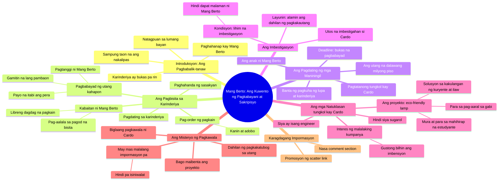

# The Sukli of Kindness - Part 2: A Heartwarming Reunion

> 🌐 **Read this in:** **English** · [中文](../../zh-CN/2026-08/tiktok-transcript-405k-views-27k-reactions-ang-sukli-ng-kabutihan-part-2-aral-2dd5.md)

> **Creator:** [@Talking Ai ᴾᴴ](https://www.tiktok.com/@Talking Ai ᴾᴴ) · **Views:** 239.1K · **Posted:** 2026-08-17 · **Niche:** entertainment
>
> **TL;DR:** The time jump immediately creates curiosity and emotional weight.

[Watch original video →](https://www.facebook.com/share/v/1B4t38j7wB/)

## Why This Went Viral

## Hook (first 3 seconds)
- **Verbatim opening line:** "Mang Berto, sampung taon na ang nakalipas. Kumusta na kaya kayo?" (Mang Berto, it's been ten years. How are you all doing?)
- **Hook pattern:** Time-jump + emotional question (nostalgia/curiosity hybrid)
- **Why it stops scroll:** The phrase "sampung taon" (ten years) creates instant narrative weight — viewers assume a reunion, a reckoning, or a reveal. The direct address to a named character (Mang Berto) implies an ongoing story, triggering the "I need context" reflex that halts thumb-scrolling.

## Emotional Rhythm
1. **Nostalgia/Curiosity** — "Sampung taon na ang nakalipas" sets a sentimental, unresolved tone.
2. **Hope/Relief** — "Nahanap na po namin siya" (We found him) — a resolution is coming.
3. **Warmth/Comfort** — The karinderiya scene: free adobo, "Libre ko na yan" — builds a safe, kind world.
4. **Tension Spike** — "Dalawang milyong piso" (Two million pesos) + threat to take the land — sudden stakes.
5. **Mystery/Intrigue** — "Imbestigahan ninyo ang anak ni Mang Berto" — a secret investigation begins.
6. **Empathy/Resonance** — Twist reveal: Cardo is an engineer, not a gambler; he spent everything on an eco-friendly lamp for poor students.
7. **Climax/Injustice** — "Bigla na lang siyang nawala" (He suddenly disappeared) — the victim is also a hero, deepening the tragedy.
8. **Frustration Cut** — The scatter ad break interrupts at peak emotional investment, forcing a "what happens next" loop.

## Keyword Density
- **"Mang Berto"** (5×) — character anchor; drives emotional pull and narrative continuity.
- **"Utang" (debt)** (3×) — core conflict; algorithmic reach via high-arousal finance topic.
- **"Anak" (child)** (4×) — family resonance; emotional pull.
- **"Milyong piso"** (2×) — number specificity; triggers shock and shareability.
- **"Eco-friendly lamp"** (2×) — unique object; drives curiosity and social-good angle.
- **"Nawala" (disappeared)** (2×) — mystery keyword; boosts watch time.
- **"Scatter"** (1×) — direct algorithmic bait for gambling-related traffic (high-volume search).

## Why It Spreads
- **Moral whiplash:** The video sets up a kind, poor vendor (Mang Berto) then hits him with a 2-million-peso debt threat — viewers share out of outrage and sympathy.
- **Hidden hero twist:** Cardo isn't a deadbeat; he's a selfless inventor. This subverts the "sugarol" (gambler) stereotype, making the story feel fresh and share-worthy ("You won't believe who he really is").
- **Serialized structure:** The "ten years later" opening and the unresolved disappearance at the end create a cliffhanger — viewers comment "part 2" and tag friends, boosting engagement signals.
- **Cultural specificity + universal stakes:** Filipino karinderiya, family sacrifice, and education poverty resonate locally, while the "good person wronged" arc is globally relatable — dual-audience reach.
- **Deliberate ad placement:** The scatter link is inserted at the emotional peak (after the disappearance reveal), maximizing click-through by exploiting heightened arousal — a viral monetization tactic.

## What You Can Steal
- **Open with a time-jump question:** "Five years ago, [name]. What happened to you?" — instantly creates narrative debt that forces viewers to stay for the payoff.
- **Subvert the villain reveal:** Set up a character as a failure (debtor, gambler) then reveal they're a secret hero with a noble cause — this twist is shareable because it flips expectations.
- **Place your CTA at the emotional cliffhanger:** Don't put your link or product at the start. Build tension, drop the twist, then insert your call-to-action right as the viewer is desperate for resolution — that's when clicks spike.

## Mind Map

## Full Transcript (Generated by [TokTranscript.com](https://toktranscript.com/?utm_source=github&utm_medium=breakdown&utm_campaign=tool_attribution))

> 📝 Transcripts on this page are auto-generated and show the first 60%. Want to transcribe any TikTok in 30 seconds and get the full version? [Try TokTranscript free →](https://toktranscript.com/?utm_source=github&utm_medium=breakdown&utm_campaign=transcript_cta)

Mang Berto, sampung taon na ang nakalipas. Kumusta na kaya kayo? Ma'am Jessa, nahanap na po namin siya. Bukas pa rin po ang karinderiya niya sa lumang bayan. Ihanda ang sasakyan. Aalis tayo ngayon. Anak, anong oorderin mo? Isang kanin at adobo po. Mukhang pagod ka. O, dagdagan natin. Libre ko na yan. Hindi talaga kayo nagbago. May sinabi ka, anak? Wala po. Mang Berto, bayad ko po sa kinain ko kahapon. Hindi ka nga makabayad ng matrikula. Tapos ibabayad mo pa sa akin yan? Itabi mo yan. Pambaon mo na lang. Salamat po. Sampung taon na Mang Berto. Pero hanggang ngayon, inuunan nyo pa rin ang ibang tao. Nasan si Cardo? Anong kailangan nyo sa anak ko? May utang sa amin ang anak mo. Magkano? Dalawang milyong piso. Kapag hindi siya nakapagbayad bukas, kukunin namin ang lupa at karinderiyang ito. Imbestigahan ninyo ang anak ni Mang Berto. Gusto kong malaman kung bakit siya nalubog sa utang. Opo, ma'am.

*[Read the full transcript on TokTranscript →](https://toktranscript.com/plaza/tiktok-transcript-405k-views-27k-reactions-ang-sukli-ng-kabutihan-part-2-aral-2dd5?utm_source=github&utm_medium=breakdown&utm_campaign=transcript_full)*

## Browse More

- All [entertainment](../../by-niche/en/entertainment.md) breakdowns
- All [Time-jump nostalgia](../../by-pattern/en/hook-time-jump-nostalgia.md) examples

## Video Info

| | |
|---|---|
| Creator | [@Talking Ai ᴾᴴ](https://www.tiktok.com/@Talking Ai ᴾᴴ) |
| Original video | [https://www.facebook.com/share/v/1B4t38j7wB/](https://www.facebook.com/share/v/1B4t38j7wB/) |
| Original title | 405K views · 27K reactions | Ang Sukli ng Kabutihan - Part 2 Aral sa Part 2: Ang kabutihang tunay ay hindi kumukupas sa paglipas ng panahon. Minsan, ang taong minsan mong tinulungan nang walang hinihinging kapalit ang siyang babalik kapag ikaw naman ang nangangailangan. #ViralStory #storytelling #PinoyDrama #MoralStory #DramaSeries | Talking Ai ᴾᴴ |
| Views | 239.1K (239103) |
| Posted | 2026-08-17 |
| Duration | 0s |
| Niche | `entertainment` |
| Hook pattern | `Time-jump nostalgia` |
| Original language | `en` |
| Available languages | en, zh-CN |
| Generated | 2026-08-18 by [TokTranscript](https://toktranscript.com/) |

---

*This breakdown is for educational analysis under fair use. Original video © [@Talking Ai ᴾᴴ](https://www.tiktok.com/@Talking Ai ᴾᴴ). All transcripts are auto-generated and may contain errors.*

*Want to analyze your own TikToks like this? [try this transcription tool →](https://toktranscript.com/viral-breakdown?utm_source=github&utm_medium=breakdown&utm_campaign=footer_cta)*