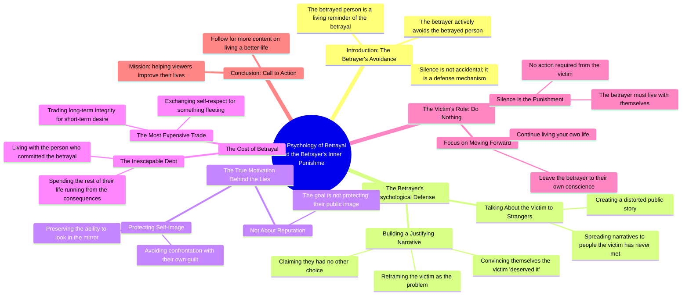

# Why a Betrayer Avoids You: The Silent Punishment

> 🌐 **Read this in:** **English** · [中文](../../zh-CN/2026-08/tiktok-transcript-408k-views-10k-reactions-una-persona-che-ti-ha-tradito-far-d-ad89.md)

> **Creator:** [@Spiritualità Moderna](https://www.tiktok.com/@Spiritualità Moderna) · **Views:** 150.7K · **Posted:** 2026-08-27 · **Niche:** other
>
> **TL;DR:** It immediately reframes the betrayer's behavior, making the viewer feel seen and understood.

[Watch original video →](https://www.facebook.com/share/r/1BcXRXdKAz/)

## Why This Went Viral

## Hook (first 3 seconds)
- **Verbatim opening:** *"Una persona che ti ha tradito farà di tutto per evitarti, perché tu sei il promemoria vivente di ciò che ha fatto."*
- **Hook pattern:** Bold psychological claim + direct address ("tu").
- **Why it stops the scroll:** It reframes betrayal from a story about the victim to a story about the betrayer's guilt. It promises the viewer that *they* hold the power, which is a deeply satisfying and unexpected pivot.

## Emotional Rhythm
1. **Recognition (0–3s):** The viewer instantly identifies with the scenario — "this happened to me."
2. **Validation (3–10s):** The claim that the betrayer avoids you because you're a "living reminder" validates the viewer's pain and confusion.
3. **Tension (10–18s):** The narrative shifts to the betrayer's internal struggle — their self-deception and rationalization. This builds a quiet, almost cinematic suspense.
4. **Climax (18–24s):** *"Ha barattato il rispetto per se stesso con qualcosa di effimero."* This is the gut-punch line. It reframes the betrayal as a self-inflicted wound, not a loss for the viewer.
5. **Catharsis/Resolution (24–35s):** The final twist — *"il suo silenzio è già la sua punizione"* — delivers relief and empowerment. The viewer is absolved from needing to act or seek revenge.

## Keyword Density
- **Tradito / tradimento** (betrayal) — drives the core emotional topic and search relevance.
- **Promemoria vivente** (living reminder) — a unique, memorable phrase that anchors the hook.
- **Punizione** (punishment) — high emotional pull, frames the ending.
- **Scambio / barattato** (trade/bargain) — reinforces the transactional metaphor of betrayal.
- **Specchio** (mirror) — visual, self-reflective keyword that deepens psychological resonance.
- **Sé / se stesso** (self) — algorithmic reach via self-improvement niche; emotional pull via identity.

## Why It Spreads
- **It flips the victim narrative.** Most betrayal content focuses on "how to heal." This video says, *"You don't need to do anything — they're already broken."* That's a shareable mic-drop moment.
- **It's a monologue, not advice.** The script reads like a spoken-word poem or a cinematic voiceover. Viewers share it as a "status" or "caption" because it feels like a quote, not a tutorial.
- **The climax line is designed for clipping.** *"Ha barattato il rispetto per se stesso con qualcosa di effimero"* is a standalone, quotable sentence. It compels viewers to save or repost it.
- **It universalizes a specific pain.** Even if the viewer hasn't been betrayed, the theme of "the guilty avoid the innocent" applies to breakups, friendships, and workplace conflicts — expanding the viral audience.
- **The ending is a call to action disguised as closure.** *"Tu devi solo continuare a vivere"* + *"seguimi per una vita migliore"* converts emotional relief into a follow, without feeling salesy.

## What You Can Steal
- **Open with a reframe, not a problem.** Start with a claim that reverses the viewer's expected power dynamic. E.g., "The person who ignored you is actually terrified of you."
- **Write for the clip, not the video.** Ensure one line in the middle can stand alone as a quote. That's your shareable fragment.
- **End with permission, not prescription.** Instead of telling viewers what to do, tell them what they *don't* need to do. Then pivot to a soft follow invitation ("if you're new here..."). This lowers resistance and boosts completion rate.

## Mind Map

## Full Transcript (Generated by [free TikTok transcript generator](https://toktranscript.com/?utm_source=github&utm_medium=breakdown&utm_campaign=tool_attribution))

> 📝 Transcripts on this page are auto-generated and show the first 60%. Want to transcribe any TikTok in 30 seconds and get the full version? [Try TokTranscript free →](https://toktranscript.com/?utm_source=github&utm_medium=breakdown&utm_campaign=transcript_cta)

Una persona che ti ha tradito farà di tutto per evitarti, perché tu sei il promemoria vivente di ciò che ha fatto. Ecco perché non ti cerca. Ecco perché parla di te con persone che non hai mai conosciuto. Deve farlo, perché l'alternativa sarebbe restare da sola con la versione di sé che ha compiuto quel gesto. Così si costruisce una storia in cui il problema eri tu, in cui te lo meritavi, in cui non aveva altra scelta, non sta proteggendo la propria reputazione, sta proteggendo la propria capacità di guardarsi allo specchio.

*[Read the full transcript on TokTranscript →](https://toktranscript.com/plaza/tiktok-transcript-408k-views-10k-reactions-una-persona-che-ti-ha-tradito-far-d-ad89?utm_source=github&utm_medium=breakdown&utm_campaign=transcript_full)*

## Browse More

- All [other](../../by-niche/en/other.md) breakdowns
- All [Psychological insight](../../by-pattern/en/hook-psychological-insight.md) examples

## Video Info

| | |
|---|---|
| Creator | [@Spiritualità Moderna](https://www.tiktok.com/@Spiritualità Moderna) |
| Original video | [https://www.facebook.com/share/r/1BcXRXdKAz/](https://www.facebook.com/share/r/1BcXRXdKAz/) |
| Original title | 408K views · 10K reactions | Una persona che ti ha tradito farà di tutto per evitarti, perché tu sei il promemoria vivente di ciò che ha fatto. Ecco perché non ti cerca. Ecco perché parla di te con persone che non hai mai conosciuto. Deve farlo. Perché l'alternativa sarebbe restare da sola con la versione di sé che ha compiuto quel gesto. Così si costruisce una storia in cui il problema eri tu. In cui te lo meritavi. In cui non aveva altra scelta. Non sta proteggendo la propria reputazione. Sta proteggendo la propria capacità di guardarsi allo specchio. Perché il giorno in cui ti ha tradito ha fatto lo scambio più costoso della sua vita. Ha barattato il rispetto per sé stesso con qualcosa di effimero che desiderava in quel momento. E adesso dovrà passare il resto della sua vita cercando di sfuggire al conto di quella scelta. Tu non devi fare nulla. Il suo silenzio è già la sua punizione. Lei dovrà convivere con la persona che ha fatto tutto questo. Tu devi solo continuare a vivere. Se queste parole ti hanno fatto riflettere, scrivi “Vivere” nei commenti, e ti manderò gratis la raccolta delle 10 riflessioni più importanti del mio libro "Come vivere una vita migliore", da cui è stato ispirato questo reel. Leggile, e capirai come questo libro abbia già aiutato più di 3000 italiani a vivere meglio le proprie relazioni, il proprio lavoro e la propria vita.🙌🏻🍃 Sei d’accordo con ciò che ho detto?🔥 Doppiaggio a cura di: @ivanouli #spiritualità #vita #filosofia #gratitudine #crescitapersonale | Spiritualità Moderna |
| Views | 150.7K (150721) |
| Posted | 2026-08-27 |
| Duration | 0s |
| Niche | `other` |
| Hook pattern | `Psychological insight` |
| Original language | `en` |
| Available languages | en, zh-CN |
| Generated | 2026-08-28 by [TokTranscript](https://toktranscript.com/) |

---

*This breakdown is for educational analysis under fair use. Original video © [@Spiritualità Moderna](https://www.tiktok.com/@Spiritualità Moderna). All transcripts are auto-generated and may contain errors.*

*Want to analyze your own TikToks like this? [try this transcription tool →](https://toktranscript.com/viral-breakdown?utm_source=github&utm_medium=breakdown&utm_campaign=footer_cta)*