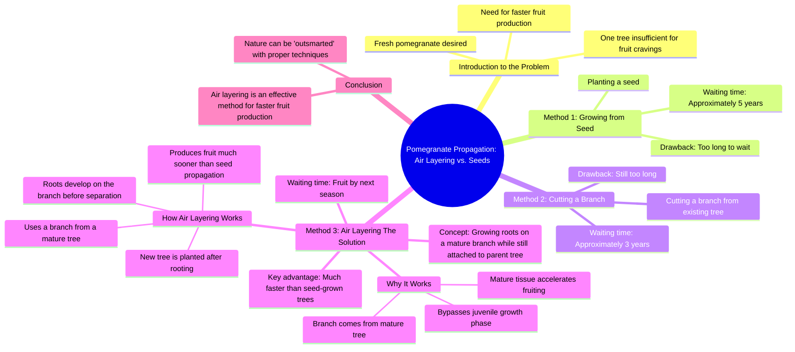

# Grow a New Fruit Tree Faster: Branch Cutting Trick

> 🌐 **Read this in:** **English** · [中文](../../zh-CN/2026-08/tiktok-transcript-458k-views-14k-reactions-how-to-grow-a-new-fruit-tree-withou-60c0.md)

> **Creator:** [@Dr.Bota](https://www.tiktok.com/@Dr.Bota) · **Views:** 294.9K · **Posted:** 2026-08-12 · **Niche:** other
>
> **TL;DR:** The hook presents a relatable desire and a problem, instantly engaging viewers with a promise of a clever solution.

[Watch original video →](https://www.facebook.com/reel/1020260861011786)

## Why This Went Viral

## Hook (first 3 seconds)
- **Verbatim opening line:** "Mmm, this pomegranate looks so fresh and juicy, but one tree won't be enough to satisfy my fruit cravings."
- **Hook pattern:** Scene + desire gap (a character with a visible craving, immediately blocked by a limitation).
- **Why it stops the scroll:** It opens mid-action with a sensory word ("Mmm") and a relatable problem (wanting more of something delicious). The viewer instantly understands the stakes — no context needed. The personified tree responding ("That's easy. Just plant one of my seeds") adds a surreal, comedic twist that breaks expectation.

## Emotional Rhythm
- **Curiosity (0–5s):** "Mmm, this pomegranate looks so fresh" — sensory pleasure + setup.
- **Tension (5–15s):** "Five years? No way" — frustration introduced; the tree counters with "three years" — still not enough. Escalating impatience.
- **Comic relief (15–20s):** "Hey, what are you doing? You think you can outsmart nature?" — the tree's indignation adds humor and a false conflict.
- **Suspense (20–25s):** "With my method, this little branch could be fruiting by next season. Now, we wait." — a promise + a time jump creates anticipation.
- **Payoff (25–35s):** "Wow, this little fellow really is an early bloomer." — visual proof of the branch fruiting. Satisfaction.
- **Climax + resolution (35–40s):** "That's called air layering." — the twist reveal. The expert explains the method, converting wonder into a teachable moment.

## Keyword Density
- **"Fruit" / "fruiting"** — repeated 5+ times; drives the core promise (fast results), algorithmic reach via searchability.
- **"Branch"** — repeated 4 times; anchors the physical action and visual.
- **"Tree"** — repeated 4 times; establishes the character and context.
- **"Years"** — repeated 4 times; creates the contrast (5 years vs. 3 years vs. next year) that fuels the emotional arc.
- **"Air layering"** — said once but as the payoff; high-value keyword for search and educational virality.
- **"Early bloomer"** — memorable phrase; emotionally resonant, shareable as a standalone quote.

**Algorithmic drivers:** "fruit," "air layering," "grow" — searchable, evergreen gardening topics.  
**Emotional pull:** "early bloomer," "outsmart nature," "little fellow" — humanizes the content, boosts saves and shares.

## Why It Spreads
- **The "impossible promise" structure:** The viewer hears "5 years" → "3 years" → "next year?" — each beat raises the stakes. The final reveal (air layering) delivers a legitimate, surprising solution. This pattern (problem → escalation → twist → proof) is inherently rewatchable and shareable. *Concrete line: "You think you can outsmart nature?"*
- **Personification creates a character arc:** The tree isn't a prop — it has attitude ("Hey, what are you doing?"). This turns an educational gardening tip into a mini-drama. Viewers share it because it's entertaining, not just informative. *Concrete line: "Then just cut one of my branches."*
- **Visual proof in the payoff:** The time-lapse of the branch fruiting ("Wow, this little fellow really is an early bloomer") is the "aha" moment. Visual transformation clips have high completion rates and drive comments like "Wait, that actually works?"
- **Relatable impatience:** The human character's "I want pomegranates by next year" mirrors the average viewer's desire for quick results. This emotional hook makes the content feel personal, increasing saves (people want to try it).
- **Educational twist at the end:** The expert line "That's called air layering" gives the video a "now I know something" feeling. Viewers share it to look smart or helpful to friends who garden.

## What You Can Steal
- **Use a "desire → obstacle → impossible deadline" setup in the first 5 seconds.** Don't start with the solution. Start with a craving (food, money, skill) and a frustrating constraint. The gap creates the hook.
- **Personify the "expert" or the "method" as a character.** Give the solution a voice and attitude (like the talking tree). It adds humor and makes the educational content feel like a story, not a lecture.
- **End with a named technique, not just a result.** After the visual payoff, drop the term ("air layering"). This gives viewers a takeaway they can search, save, or share — turning a fun video into a useful one.

## Mind Map

## Full Transcript (Generated by [TokTranscript.com](https://toktranscript.com/?utm_source=github&utm_medium=breakdown&utm_campaign=tool_attribution))

> 📝 Transcripts on this page are auto-generated and show the first 60%. Want to transcribe any TikTok in 30 seconds and get the full version? [Try TokTranscript free →](https://toktranscript.com/?utm_source=github&utm_medium=breakdown&utm_campaign=transcript_cta)

Mmm, this pomegranate looks so fresh and juicy, but one tree won't be enough to satisfy my fruit cravings. That's easy. Just plant one of my seeds and wait about five years. Five years? No way, I can't wait that long. Then just cut one of my branches. It'll still take about three years to produce fruit. Three years? That's still too long. I want pomegranates by next year. Next year? That's impossible. Hey, what are you doing? You think you can outsmart nature? Don't worry. With my method, this little branch could be fruiting by next season. Now, we wait. Later.

*[Read the full transcript on TokTranscript →](https://toktranscript.com/plaza/tiktok-transcript-458k-views-14k-reactions-how-to-grow-a-new-fruit-tree-withou-60c0?utm_source=github&utm_medium=breakdown&utm_campaign=transcript_full)*

## Browse More

- All [other](../../by-niche/en/other.md) breakdowns
- All [Problem-Solution Tease](../../by-pattern/en/hook-problem-solution-tease.md) examples

## Video Info

| | |
|---|---|
| Creator | [@Dr.Bota](https://www.tiktok.com/@Dr.Bota) |
| Original video | [https://www.facebook.com/reel/1020260861011786](https://www.facebook.com/reel/1020260861011786) |
| Original title | 458K views · 14K reactions | How to Grow a New Fruit Tree Without Waiting Years | Dr.Bota |
| Views | 294.9K (294858) |
| Posted | 2026-08-12 |
| Duration | 0s |
| Niche | `other` |
| Hook pattern | `Problem-Solution Tease` |
| Original language | `en` |
| Available languages | en, zh-CN |
| Generated | 2026-08-13 by [TokTranscript](https://toktranscript.com/) |

---

*This breakdown is for educational analysis under fair use. Original video © [@Dr.Bota](https://www.tiktok.com/@Dr.Bota). All transcripts are auto-generated and may contain errors.*

*Want to analyze your own TikToks like this? [try this transcription tool →](https://toktranscript.com/viral-breakdown?utm_source=github&utm_medium=breakdown&utm_campaign=footer_cta)*