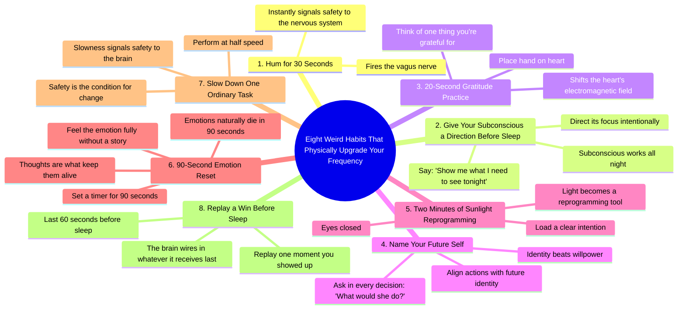

# Eight Weird Habits That Physically Upgrade Your Frequency

> 🌐 **Read this in:** **English** · [中文](../../zh-CN/2026-08/tiktok-transcript-48k-views-22k-reactions-i-used-to-think-changing-your-state-e932.md)

> **Creator:** [@MindsetVibrations](https://www.tiktok.com/@MindsetVibrations) · **Views:** 271.5K · **Posted:** 2026-08-09 · **Niche:** entertainment
>
> **TL;DR:** The word 'weird' and 'physically upgrade your frequency' create curiosity and promise tangible benefits.

[Watch original video →](https://www.facebook.com/reel/1059071623321069)

## Why This Went Viral

## Hook (first 3 seconds)
- **Verbatim opening line:** "Eight weird habits that physically upgrade your frequency."
- **Hook pattern:** **Bold claim + list format + curiosity gap** ("weird" + "physically upgrade" + "frequency").
- **Why it stops the scroll:** It promises a concrete, almost conspiratorial transformation ("physically upgrade") using a word ("frequency") that signals spiritual-scientific crossover. The word "weird" lowers skepticism — it feels like insider knowledge, not generic advice. The number "Eight" sets a clear, bingeable structure.

---

## Emotional Rhythm
1. **Curiosity** ("Eight weird habits…") — the brain wants the list completed.
2. **Safety/Relief** (Habit 1: "Instant safety") — first payoff is immediate and calming.
3. **Mystery/Intrigue** (Habit 2: "Show me what I need to see tonight") — introduces a quasi-magical instruction.
4. **Warmth/Resonance** (Habit 3: "Hand on your heart… grateful") — emotional softness, creates a pause.
5. **Empowerment** (Habit 4: "Identity beats willpower") — a sharp, quotable line that flips a common belief.
6. **Awe/Expansion** (Habit 5: "Light becomes a reprogramming tool") — elevates the mundane to mystical.
7. **Tension + Release** (Habit 6: "Emotions die in 90 seconds") — gives a concrete escape hatch from pain.
8. **Calm/Trust** (Habit 7: "Slow signals safe") — slows the viewer's own pace.
9. **Climax/Identity Reinforcement** (Habit 8: "Replay one moment you showed up… your brain wires in whatever you give it last") — this is the peak: it ties the whole video back to self-worth and agency.
10. **Call-to-action urgency** ("Save this, and comment yes…") — converts emotional peak into engagement.

---

## Keyword Density
- **"Frequency"** (3x) — drives algorithmic reach (spiritual/wellness niche keyword) + emotional pull (aspiration).
- **"Brain" / "subconscious" / "nervous"** (3x) — anchors the content in neuroscience, boosting credibility and shareability.
- **"Safe" / "safety"** (3x) — emotional pull; triggers a deep physiological need, making the advice feel essential.
- **"Reprogram" / "rewire" / "wire"** (3x) — action-oriented, suggests transformation; highly searchable in self-improvement circles.
- **"Identity"** (1x, but powerful) — a single high-impact word that drives the "future self" narrative, a proven viral psychology trigger.
- **"90 seconds"** (1x) — specific number = memorability + shareability (people quote this).
- **"Show me" / "Save this" / "comment yes"** — direct commands that drive engagement metrics.

---

## Why It Spreads
1. **Actionable in under 2 minutes** — Every habit is instantly testable (hum, hand on heart, set a timer). Viewers try one immediately, which creates a "this works" feeling they want to share.
2. **"Weird" lowers the barrier** — The word "weird" disarms skeptics. It's not preachy self-help; it's a secret menu of hacks. This makes it feel exclusive, driving saves and forwards.
3. **The 90-second emotion claim is a quotable science nugget** — "Emotions die in 90 seconds" is a standalone, meme-able line. It gets screenshotted and reposted, which extends reach beyond the original video.
4. **Identity-based framing creates ownership** — "Name your future self" and "what would she do?" makes the viewer project a version of themselves. This personalization increases emotional investment and likelihood to comment.
5. **The final line is a memory hack** — "Replay one moment you showed up" gives the viewer a homework assignment that feels noble. It ends on a high, so the CTA ("Save this, comment yes") feels like a natural next step, not a sales pitch.

---

## What You Can Steal
1. **Open with a "weird" + "physical" contrast.** Frame ordinary advice as secret, bodily upgrades. "Weird" kills the "I've heard this before" reflex; "physical" makes it feel more real than motivational fluff.
2. **Use a numbered list with a built-in emotional arc.** Don't just list tips — order them so the viewer moves from relief → empowerment → calm → identity. End on the most emotionally resonant item, not the most practical one.
3. **Plant a quotable micro-fact.** Find one line in your content that can stand alone as a screenshot ("Emotions die in 90 seconds"). Repeat it, simplify it, and make it the hinge of your video. That's what gets clipped and shared.

## Mind Map

## Full Transcript (Generated by [TokTranscript](https://toktranscript.com/?utm_source=github&utm_medium=breakdown&utm_campaign=tool_attribution))

> 📝 Transcripts on this page are auto-generated and show the first 60%. Want to transcribe any TikTok in 30 seconds and get the full version? [Try TokTranscript free →](https://toktranscript.com/?utm_source=github&utm_medium=breakdown&utm_campaign=transcript_cta)

Eight weird habits that physically upgrade your frequency. 1. Hum for 30 seconds. It fires your vagus nerve. Instant safety. 2. Before sleep, say, Show me what I need to see tonight. Your subconscious works all night. Give it a direction. 3. Hand on your heart. Think of one thing you're grateful for. For 20 seconds, it shifts your heart's electromagnetic field. 4. Name your future self. In every decision, think, what would she do? Identity beats willpower. 5. Two minutes in sunlight, eyes closed, intention loaded, light becomes a reprogramming tool. 6.

*[Read the full transcript on TokTranscript →](https://toktranscript.com/plaza/tiktok-transcript-48k-views-22k-reactions-i-used-to-think-changing-your-state-e932?utm_source=github&utm_medium=breakdown&utm_campaign=transcript_full)*

## Browse More

- All [entertainment](../../by-niche/en/entertainment.md) breakdowns
- All [Curiosity gap with a numbered list](../../by-pattern/en/hook-curiosity-gap-with-a-numbered-list.md) examples

## Video Info

| | |
|---|---|
| Creator | [@MindsetVibrations](https://www.tiktok.com/@MindsetVibrations) |
| Original video | [https://www.facebook.com/reel/1059071623321069](https://www.facebook.com/reel/1059071623321069) |
| Original title | 48K views · 22K reactions | I used to think changing your state took something huge. A retreat. A breakthrough. Some version of me that had it all figured out. Then I started humming for thirty seconds before hard conversations. Putting a hand on my heart before I got out of bed. Naming what I’d do as the version of me I’m becoming, instead of the one who was tired. None of it looked like anything. All of it changed the signal I was running on. Your nervous system does not care how impressive the habit is. It cares how often you send it the message that you are safe. Eight of them are in this video. Pick one. Not all eight. Comment YES and I’ll send you the tool I use to raise my frequency and reprogram my mind daily. #manifestation #frequency | MindsetVibrations |
| Views | 271.5K (271521) |
| Posted | 2026-08-09 |
| Duration | 0s |
| Niche | `entertainment` |
| Hook pattern | `Curiosity gap with a numbered list` |
| Original language | `en` |
| Available languages | en, zh-CN |
| Generated | 2026-08-12 by [TokTranscript](https://toktranscript.com/) |

---

*This breakdown is for educational analysis under fair use. Original video © [@MindsetVibrations](https://www.tiktok.com/@MindsetVibrations). All transcripts are auto-generated and may contain errors.*

*Want to analyze your own TikToks like this? [TokTranscript.com →](https://toktranscript.com/viral-breakdown?utm_source=github&utm_medium=breakdown&utm_campaign=footer_cta)*