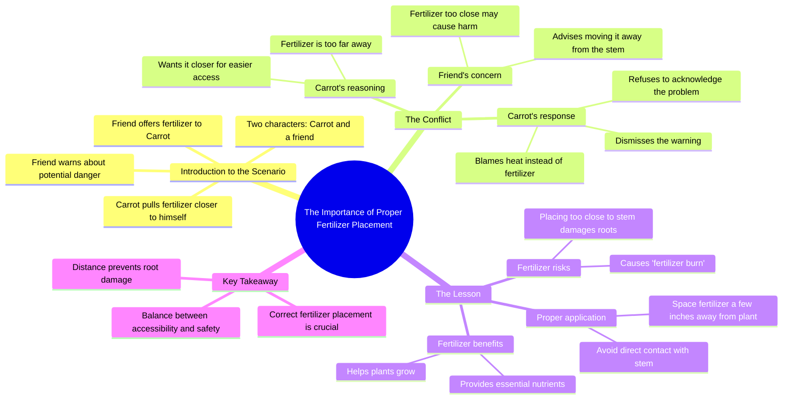

# Why You Should Never Put Fertilizer Too Close To Plants

> 🌐 **Read this in:** **English** · [中文](../../zh-CN/2026-08/tiktok-transcript-5-3m-views-63k-reactions-why-you-should-never-put-fertilizer-137d.md)

> **Creator:** [@Dr.Bota](https://www.tiktok.com/@Dr.Bota) · **Views:** 2.6M · **Posted:** 2026-08-03 · **Niche:** other
>
> **TL;DR:** The hook instantly creates a comedic scenario by treating a carrot as a sentient being, sparking curiosity and amusement.

[Watch original video →](https://www.facebook.com/reel/1161139290411642)

## Why This Went Viral

## Hook (first 3 seconds)
- **Verbatim opening:** "Hey, Carrot! Want some fertilizer?" followed by "Yeah, of course!"
- **Hook pattern:** Scene + Personification (anthropomorphic dialogue between a carrot and an unseen narrator)
- **Why it stops scroll:** It instantly creates absurdity — a talking carrot with attitude. The viewer's brain pauses because it's not a human talking head or a standard "plant tip" video; it's a dramatic argument with a vegetable. The conflict is immediate and the tone is comedic, which signals "entertainment, not lecture."

## Emotional Rhythm
1. **Curiosity (0–2s):** Who is talking to a carrot? Why does it want fertilizer?
2. **Amusement/Tension (2–6s):** The carrot *pulls the fertilizer closer* — a ridiculous, defiant action. The narrator's confusion ("Dude, why are you pulling it closer?") adds playful friction.
3. **Escalation (6–12s):** The carrot gets defensive and aggressive — "Stop sticking your nose where it doesn't belong!" and "It's so hot over here!" The conflict feels personal and silly, keeping the viewer hooked on the argument.
4. **Twist (12–14s):** "I don't feel anything." — The carrot's denial creates a moment of dramatic irony. The viewer knows more than the character.
5. **Climax (14–18s):** "Shut up. That's not the problem." — The carrot's stubbornness peaks. This is the emotional high point: comedy through willful ignorance.
6. **Resolution (18–20s):** The narrator drops the mic with a clear, didactic explanation: "Fertilizer helps plants grow, but placing it too close to the stem can damage the roots... fertilizer burn." The relief comes from a clean, satisfying payoff that turns the joke into a lesson.

## Keyword Density
- **Fertilizer** (5x) — Drives algorithmic reach (gardening/plant-care niche) and anchors the educational core.
- **Closer** (3x) — Emotional pull; signals conflict and proximity/danger.
- **Hurt / Damage / Burn** (3x) — Emotional pull; creates stakes and fear of harm.
- **Stem / Roots** (2x) — Algorithmic reach; precise plant anatomy terms that match search intent.
- **"That's not the problem"** (1x, but pivotal) — Emotional pull; captures the stubborn character's denial, making the lesson memorable.

## Why It Spreads
- **Absurdity + Utility combo:** The video disguises a practical gardening tip (fertilizer burn) as a dramatic soap opera. Viewers share it because it's both funny and useful — the "edutainment" sweet spot. The line "Shut up. That's not the problem." is clip-worthy and quotable.
- **Personification creates relatability:** The carrot acts like a stubborn friend who refuses advice. The narrator's exasperation ("Dude, why are you pulling the fertilizer closer?") mirrors how people talk to loved ones who won't listen. This emotional familiarity drives comments like "this is my dog" or "this is my husband."
- **The twist forces a rewatch:** The narrator's final explanation ("spaced a few inches away to avoid fertilizer burn") reframes the entire argument. Viewers rewatch to catch the clues — the carrot's "It's so hot over here" was a symptom of the burn. This "aha" moment boosts watch time and shares.
- **Clear, specific value:** The tip is not generic ("water your plants") but niche and actionable ("space fertilizer a few inches away"). This makes it save-worthy for gardeners and plant owners, triggering the save algorithm.
- **Short, punchy dialogue with zero dead air:** Every line advances the conflict or the lesson. The 20-second runtime is ideal for completion rate, which signals the algorithm to push it to more viewers.

## What You Can Steal
- **Pair a "dumb character" with a "smart narrator":** Create a two-voice dynamic where one side is stubbornly wrong and the other is calmly right. The conflict drives retention; the payoff delivers the lesson. Apply this to any niche (fitness, cooking, coding) by personifying a common mistake.
- **Hide the educational payload until the last 2 seconds:** Tease the problem through dialogue, then drop the factual explanation as a rapid-fire reveal. This creates a "wait, what?" moment that makes viewers rewatch and share.
- **Use dramatic irony to build tension:** Let the audience know the truth before the character does (e.g., the carrot doesn't feel the heat, but the viewer suspects why). This keeps viewers engaged because they're waiting for the character to "get it" — and the payoff lands harder when they don't.

## Mind Map

## Full Transcript (Generated by [free TikTok transcript generator](https://toktranscript.com/?utm_source=github&utm_medium=breakdown&utm_campaign=tool_attribution))

> 📝 Transcripts on this page are auto-generated and show the first 60%. Want to transcribe any TikTok in 30 seconds and get the full version? [Try TokTranscript free →](https://toktranscript.com/?utm_source=github&utm_medium=breakdown&utm_campaign=transcript_cta)

Hey, Carrot! Want some fertilizer? Yeah, of course! Dude, why are you pulling the fertilizer closer? Aren't you supposed to leave it where it is? Can't you see how far away it is? I'm bringing it closer to me! But if it's that close to you, it might hurt! Stop sticking your nose where it doesn't belong! It's so hot over here, dude! Ain't you feeling this? I don't feel anything.

*[Read the full transcript on TokTranscript →](https://toktranscript.com/plaza/tiktok-transcript-5-3m-views-63k-reactions-why-you-should-never-put-fertilizer-137d?utm_source=github&utm_medium=breakdown&utm_campaign=transcript_full)*

## Browse More

- All [other](../../by-niche/en/other.md) breakdowns
- All [Unexpected personification + immediate conflict](../../by-pattern/en/hook-unexpected-personification-immediate-conflict.md) examples

## Video Info

| | |
|---|---|
| Creator | [@Dr.Bota](https://www.tiktok.com/@Dr.Bota) |
| Original video | [https://www.facebook.com/reel/1161139290411642](https://www.facebook.com/reel/1161139290411642) |
| Original title | 5.3M views · 63K reactions | Why You Should Never Put Fertilizer Too Close To Plants | Dr.Bota |
| Views | 2.6M (2622400) |
| Posted | 2026-08-03 |
| Duration | 0s |
| Niche | `other` |
| Hook pattern | `Unexpected personification + immediate conflict` |
| Original language | `en` |
| Available languages | en, zh-CN |
| Generated | 2026-08-04 by [TokTranscript](https://toktranscript.com/) |

---

*This breakdown is for educational analysis under fair use. Original video © [@Dr.Bota](https://www.tiktok.com/@Dr.Bota). All transcripts are auto-generated and may contain errors.*

*Want to analyze your own TikToks like this? [analyze your own TikToks →](https://toktranscript.com/viral-breakdown?utm_source=github&utm_medium=breakdown&utm_campaign=footer_cta)*