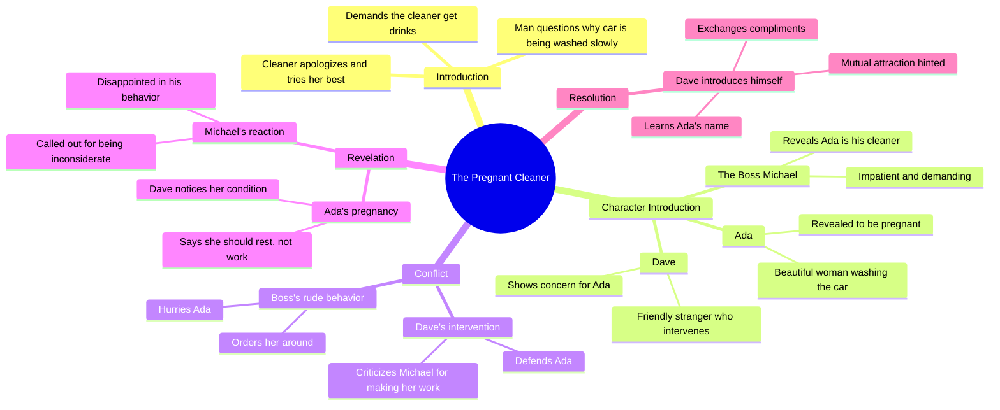

# He Called His Pregnant Wife a Cleaner, Then His Best Frie...

> 🌐 **Read this in:** **English** · [中文](../../zh-CN/2026-08/tiktok-transcript-5-5m-views-223k-reactions-he-called-his-pregnant-wife-a-clea-3d4a.md)

> **Creator:** [@Real Story with Ife](https://www.tiktok.com/@Real Story with Ife) · **Views:** 2.7M · **Posted:** 2026-08-07 · **Niche:** entertainment
>
> **TL;DR:** Opens with immediate tension and a rude demand, instantly grabbing attention and setting up a confrontation.

[Watch original video →](https://www.facebook.com/share/r/14sGBQ373F7/?mibextid=wwXIfr)

## Why This Went Viral

## Hook (first 3 seconds)
- **Verbatim opening:** "Hey, why are you washing the car so slowly? Hurry up and go get us drinks."
- **Hook pattern:** Scene + tension (conflict-driven dialogue, no context).
- **Why it stops scroll:** It drops you mid-argument. The viewer doesn't know who's talking, why the tone is aggressive, or who's being bossed around. The immediate imbalance of power creates an itch — you need to see who these people are and what happens next.

## Emotional Rhythm
- **Beat 1 — Tension (0–3s):** Aggressive command. Viewer feels discomfort; someone is being demeaned.
- **Beat 2 — Submission (4–7s):** "I'm sorry, sir. I'm trying my best." Adds empathy for the victim, raises stakes.
- **Beat 3 — Curiosity (8–12s):** "Is she your wife?" — The question reframes the dynamic. Viewer leans in.
- **Beat 4 — Shock (13–16s):** "She's just my cleaner." — A status reveal that feels callous. Moral outrage builds.
- **Beat 5 — Justice/Shift (17–22s):** "Can't you see she's pregnant?" — The stranger (Dave) steps in. Power flips. This is the **climax** — the moment of moral vindication.
- **Beat 6 — Warmth/Resolution (23–30s):** Dave introduces himself, compliments Ada, and she compliments him. Relief and satisfaction. The "good guy" wins, and the viewer gets a feel-good ending.

## Keyword Density
- **"Cleaner"** — repeated twice; drives the class/status contrast, the core emotional trigger.
- **"Beautiful"** — repeated twice (once by Dave, once by Ada); drives romance/validation angle.
- **"Pregnant"** — mentioned once but is the pivot word; algorithmic reach via social justice/empathy topics.
- **"Sorry"** — submission marker; reinforces power imbalance.
- **"Wife"** — triggers assumptions; creates the twist.
- **"Condition"** — euphemism for pregnancy; adds dignity to the reveal.

**Algorithmic drivers:** "Pregnant," "cleaner," "wife" — high-search, emotionally charged terms that fit trending topics (social class, pregnancy, workplace dignity).
**Emotional pull:** "Beautiful," "sorry," "condition" — humanize the characters and make viewers feel protective.

## Why It Spreads
- **1. The "Karen gets karma" formula, inverted.** The aggressive man is publicly corrected by a stranger. Viewers share it to say, "This is how you treat people." The line "Can't you see she's pregnant?" is the shareable mic-drop moment.
- **2. A complete story arc in 30 seconds.** Setup (abuse), conflict (status reveal), climax (intervention), payoff (romantic spark). No loose ends — makes it easy to watch, rewatch, and send to friends.
- **3. Relatability + aspiration.** Everyone has seen a boss/rich person mistreat staff. Dave's intervention is what viewers *wish* they'd do. Ada's beauty + Dave's charm adds a romantic fantasy layer that boosts comments ("They should date!") and engagement.
- **4. Open loop at the end.** "You're very handsome, too" implies a future connection. The viewer wants a Part 2 — driving comments, shares, and follow requests.
- **5. Low production value = high authenticity.** The raw, single-take feel (no cuts, natural lighting) makes it seem real, which increases trust and sharing likelihood.

## What You Can Steal
- **1. Start mid-conflict, not with context.** Open with a line that implies injustice or tension. Let the viewer piece together the situation — it forces them to stay.
- **2. Use a "power flip" at 60% of the video.** Introduce a third character who corrects the aggressor. This creates a satisfying moral payoff and a clip-worthy moment.
- **3. End with a romantic or open hook.** A compliment, a smile, or a "maybe we'll meet again" line. It gives the audience a reason to imagine a sequel — and to comment their hopes, which boosts the algorithm.

## Mind Map

## Full Transcript (Generated by [TokTranscript.com](https://toktranscript.com/?utm_source=github&utm_medium=breakdown&utm_campaign=tool_attribution))

> 📝 Transcripts on this page are auto-generated and show the first 60%. Want to transcribe any TikTok in 30 seconds and get the full version? [Try TokTranscript free →](https://toktranscript.com/?utm_source=github&utm_medium=breakdown&utm_campaign=transcript_cta)

Hey, why are you washing the car so slowly? Hurry up and go get us drinks. I'm sorry, sir. I'm trying my best. Easy, my guy. Is she your wife? My wife? No, not at all. She's just my cleaner. Really? I'm surprised. She's too beautiful to be a cleaner. You shouldn't be doing this in your condition.

*[Read the full transcript on TokTranscript →](https://toktranscript.com/plaza/tiktok-transcript-5-5m-views-223k-reactions-he-called-his-pregnant-wife-a-clea-3d4a?utm_source=github&utm_medium=breakdown&utm_campaign=transcript_full)*

## Browse More

- All [entertainment](../../by-niche/en/entertainment.md) breakdowns
- All [Conflict Hook](../../by-pattern/en/hook-conflict-hook.md) examples

## Video Info

| | |
|---|---|
| Creator | [@Real Story with Ife](https://www.tiktok.com/@Real Story with Ife) |
| Original video | [https://www.facebook.com/share/r/14sGBQ373F7/?mibextid=wwXIfr](https://www.facebook.com/share/r/14sGBQ373F7/?mibextid=wwXIfr) |
| Original title | 5.5M views · 223K reactions | He called his pregnant wife a cleaner... Then his best friend fell in love with her😳💔 #shortdrama #marriagedrama #shortstory | Real Story with Ife |
| Views | 2.7M (2732460) |
| Posted | 2026-08-07 |
| Duration | 0s |
| Niche | `entertainment` |
| Hook pattern | `Conflict Hook` |
| Original language | `en` |
| Available languages | en, zh-CN |
| Generated | 2026-08-08 by [TokTranscript](https://toktranscript.com/) |

---

*This breakdown is for educational analysis under fair use. Original video © [@Real Story with Ife](https://www.tiktok.com/@Real Story with Ife). All transcripts are auto-generated and may contain errors.*

*Want to analyze your own TikToks like this? [TokTranscript.com →](https://toktranscript.com/viral-breakdown?utm_source=github&utm_medium=breakdown&utm_campaign=footer_cta)*