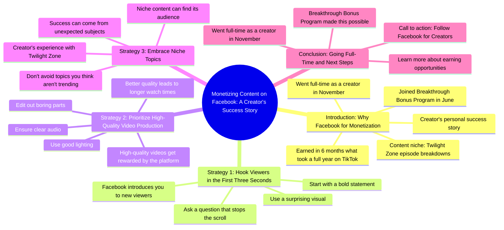

# Creator Earns Yearly TikTok Income in 6 Months on Facebook

> 🌐 **Read this in:** **English** · [中文](../../zh-CN/2026-08/tiktok-transcript-513k-views-12k-reactions-heard-creators-are-making-more-on-f-7b74.md)

> **Creator:** [@Facebook for Creators](https://www.tiktok.com/@Facebook for Creators) · **Views:** 140.7K · **Posted:** 2026-08-15 · **Niche:** marketing
>
> **TL;DR:** Immediately calls out the audience's inaction and promises a solution, creating urgency.

[Watch original video →](https://www.facebook.com/reel/2049729592479327)

## Why This Went Viral

## Hook (first 3 seconds)
- **Verbatim opening:** "Let me tell y'all something. If you create content and you are still sleeping on Facebook as a way to monetize, wake it up."
- **Hook pattern:** Bold claim + direct address ("y'all") + challenge ("sleeping on") + command ("wake it up")
- **Why it stops the scroll:** It calls out a specific audience (content creators) with a provocative accusation ("you're missing money") and uses a conversational, almost confrontational tone that feels like a friend grabbing your arm. The word "sleeping" implies negligence, which triggers a fear-of-missing-out response instantly.

## Emotional Rhythm
1. **Provocation** (0–3s) — "You're sleeping on Facebook" creates mild shame/urgency.
2. **Shock/Disbelief** (3–8s) — "I earned what I made in an entire year on TikTok" lands as an absurd, almost unbelievable comparison.
3. **Relatability/Identity** (8–12s) — "You may know me as the girl who breaks down Twilight Zone" grounds the speaker as a peer, not a guru.
4. **Humor/Relief** (12–15s) — "This didn't happen because a small child sent me into a cornfield with the phone" — a Twilight Zone inside joke that rewards loyal fans and lightens the tension.
5. **Authority/Structure** (15–30s) — Transitions into "here are a few pointers," shifting from story to actionable value.
6. **Aspiration/Validation** (30–40s) — "I went full time as a creator in November" is the climax — proof that the strategy works.
7. **Call to Action** (40s–end) — Clean, low-pressure CTA to follow the brand account.

**Climax:** The "full time creator" reveal — it converts the entire video from "tips" into a proof-of-life success story.

## Keyword Density
- **"Facebook"** (4x) — Drives algorithmic reach for the platform's own promotion system; also signals topical relevance to creators searching for platform-specific advice.
- **"Monetize / earning / earned"** (3x) — Emotional pull: money is the universal trigger for this audience.
- **"Breakthrough Bonus Program"** (2x) — Branded keyword that ties the video to a specific program, boosting discoverability for people searching that term.
- **"First three seconds"** (1x, but thematically repeated) — Mirrors the video's own structure, reinforcing the advice through demonstration.
- **"Twilight Zone"** (2x) — Niche identity keyword that builds community and signals the creator's unique angle.
- **"Full time"** (1x) — High-emotion phrase that represents the dream outcome; low density but high impact.

## Why It Spreads
- **Proof over theory:** "I earned what I made in an entire year on TikTok" is a concrete, quantifiable claim. It's shareable because it's arguable — people will comment "no way" or "how?" which boosts engagement.
- **Niche + mainstream bridge:** The Twilight Zone reference is niche enough to build a dedicated fanbase, but the money story is universal. This hybrid lets it travel across both creator circles and Twilight Zone fan groups.
- **Self-demonstrating advice:** The video *shows* the "bold statement in first three seconds" tactic while *telling* viewers to do it. This meta-layer makes it feel smart and worth sharing with other creators.
- **Authentic voice, not corporate:** "Child, I joined..." and "wake it up" feel like a real person, not a sponsored ad. This lowers skepticism and increases trust, making viewers more likely to tag friends.
- **Clear, low-friction CTA:** "Follow Facebook for creators" is a soft ask that doesn't feel salesy — but it's specific enough that the platform's algorithm rewards the video as a successful promo piece.

## What You Can Steal
1. **Open with a "you're wrong" accusation.** Directly challenge your audience's current behavior ("You're sleeping on X") — it creates instant cognitive dissonance that forces a stop.
2. **Use a specific, unbelievable number in the first 10 seconds.** "Earned my entire year's salary in six months" beats "I made a lot of money." Specificity is shareability.
3. **Demonstrate your advice while giving it.** If you tell viewers to "start with a bold statement," make sure your own opening is a bold statement. This meta-proof makes your content feel authoritative and worth saving.

## Mind Map

## Full Transcript (Generated by [free TikTok transcript generator](https://toktranscript.com/?utm_source=github&utm_medium=breakdown&utm_campaign=tool_attribution))

> 📝 Transcripts on this page are auto-generated and show the first 60%. Want to transcribe any TikTok in 30 seconds and get the full version? [Try TokTranscript free →](https://toktranscript.com/?utm_source=github&utm_medium=breakdown&utm_campaign=transcript_cta)

Let me tell y'all something. If you create content and you are still sleeping on Facebook as a way to monetize, wake it up. Child, I joined the Breakthrough Bonus Program in June and in just six months, I earned what I made in an entire year on TikTok. Crazy. You may know me as the girl who breaks down your favorite Twilight Zone episodes, but I wasn't always tearing apart beloved characters on Facebook. Now listen, this didn't happen because a small child sent me into a cornfield with the phone. There has to be a strategy. So here are a few pointers. Facebook introduces you to new viewers. So make your first three seconds count. Start with a bold statement, a surprising visual, or a question that makes people stop scrolling. High quality videos get rewarded.

*[Read the full transcript on TokTranscript →](https://toktranscript.com/plaza/tiktok-transcript-513k-views-12k-reactions-heard-creators-are-making-more-on-f-7b74?utm_source=github&utm_medium=breakdown&utm_campaign=transcript_full)*

## Browse More

- All [marketing](../../by-niche/en/marketing.md) breakdowns
- All [Direct address + wake-up call](../../by-pattern/en/hook-direct-address-wake-up-call.md) examples

## Video Info

| | |
|---|---|
| Creator | [@Facebook for Creators](https://www.tiktok.com/@Facebook for Creators) |
| Original video | [https://www.facebook.com/reel/2049729592479327](https://www.facebook.com/reel/2049729592479327) |
| Original title | 513K views · 12K reactions | Heard creators are making more on Facebook? Make That Magic shares her Bonus Program journey and how you can get in on it too. 🔥 | Facebook for Creators |
| Views | 140.7K (140725) |
| Posted | 2026-08-15 |
| Duration | 0s |
| Niche | `marketing` |
| Hook pattern | `Direct address + wake-up call` |
| Original language | `en` |
| Available languages | en, zh-CN |
| Generated | 2026-08-16 by [TokTranscript](https://toktranscript.com/) |

---

*This breakdown is for educational analysis under fair use. Original video © [@Facebook for Creators](https://www.tiktok.com/@Facebook for Creators). All transcripts are auto-generated and may contain errors.*

*Want to analyze your own TikToks like this? [TokTranscript →](https://toktranscript.com/viral-breakdown?utm_source=github&utm_medium=breakdown&utm_campaign=footer_cta)*