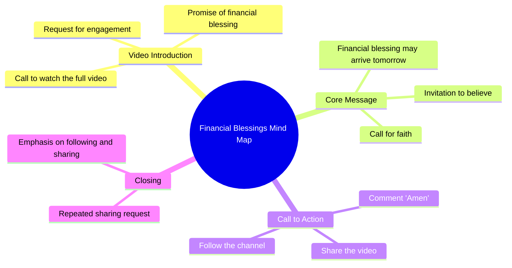

# Comment Your Luck Next: Financial Blessing Coming Tomorrow

> 🌐 **Read this in:** **English** · [中文](../../zh-CN/2026-08/tiktok-transcript-536k-views-28k-reactions-comment-nyo-na-mga-boss-baka-sa-iny-504e.md)

> **Creator:** [@𝐼𝐼𝒱.𝒜](https://www.tiktok.com/@𝐼𝐼𝒱.𝒜) · **Views:** 212.8K · **Posted:** 2026-08-29 · **Niche:** other
>
> **TL;DR:** The hook creates immediate curiosity and a sense of urgency by challenging the viewer not to skip, while promising a financial blessing.

[Watch original video →](https://www.facebook.com/share/r/1Ebc11Cey4/)

## Why This Went Viral

## Hook (first 3 seconds)
- **Verbatim opening line:** "Tinatanong kita huwag lagpasa ng video ito." (I'm asking you, don't skip this video.)
- **Hook pattern:** Direct command + implied consequence (fear of missing out on a blessing).
- **Why it stops scroll:** It creates immediate personal stakes. The viewer is singled out ("kita" = you), and the phrase "don't skip" triggers a psychological reactance—you either obey or feel you might miss a financial miracle. It's a low-effort, high-anxiety invitation.

## Emotional Rhythm
- **Beat 1 – Tension (0–2s):** "Don't skip" creates urgency and mild fear of loss.
- **Beat 2 – Hope (3–5s):** "A financial blessing may come tomorrow" plants a specific, desirable outcome.
- **Beat 3 – Belief test (6–8s):** "Do you believe?" forces a quick internal decision—yes or no—which builds engagement.
- **Beat 4 – Action/Relief (9–12s):** "Comment 'amen', share, follow" provides a simple ritual to "lock in" the blessing, releasing tension.
- **Beat 5 – Reinforcement (13s+):** "Amen. Let's share. Follow and share." Repeats the command, creating a loop of compliance and community validation.
- **Climax:** The moment "Amen" is typed—the viewer has publicly committed, making the belief feel more real.

## Keyword Density
- **"I-share" (share):** Repeated 3× — drives algorithmic reach (shares are the highest-weighted engagement signal).
- **"I-follow" (follow):** Repeated 2× — drives retention and channel growth.
- **"Biyaya" (blessing):** 1× but emotionally loaded — triggers hope and religious resonance.
- **"Pananalapi" (financial):** 1× — targets a universal pain point.
- **"Amen":** 2× — serves as a verbal anchor for the community ritual.
- **"Naniniwala ka ba?" (Do you believe?):** 1× — a direct question that forces a mental response, boosting comment intent.

*Algorithmic reach:* "share" and "follow" are explicit calls-to-action that the platform's algorithm rewards. *Emotional pull:* "blessing," "financial," and "Amen" tap into faith-based hope and scarcity.

## Why It Spreads
- **Ritualized reciprocity:** The video frames sharing as a *condition* for receiving a blessing ("I-share natin"). Viewers share not because they love the content, but because they fear losing a potential windfall—this is a classic "viral contract."
- **Low-friction, high-stakes ask:** The action (comment "amen," share, follow) takes 5 seconds, but the perceived reward (financial blessing) is massive. The effort-to-reward ratio is absurdly skewed, making compliance almost automatic.
- **Scarcity + specificity:** "Tomorrow" gives a concrete deadline, turning a vague hope into an urgent appointment. This timestamp makes viewers feel they must act *now* or miss the window.
- **Community echo:** The repeated "Amen" and "share" creates a virtual chorus. Viewers see others doing it in comments, which validates participation and triggers social proof.
- **Algorithmic symbiosis:** The video explicitly asks for shares and follows, which directly feeds the platform's distribution loop. Every share exposes it to a new network, where the same fear-of-missing-out hook repeats.

## What You Can Steal
- **Open with a direct, personal command:** Start with "Don't skip this" or "Watch until the end" to instantly create stakes. Make the viewer feel individually addressed, not part of a crowd.
- **Pair a specific reward with a deadline:** Instead of "good things will happen," say "something specific will happen *tomorrow*." Specificity + time pressure multiplies engagement.
- **Turn engagement into a ritual:** Don't just ask for likes—ask for a *word* ("comment 'amen'") and a *share*. Create a mini-ceremony that feels like a transaction. The more the action feels like a pact, the more likely it is to be performed and repeated.

## Mind Map

## Full Transcript (Generated by [free TikTok transcript generator](https://toktranscript.com/?utm_source=github&utm_medium=breakdown&utm_campaign=tool_attribution))

> 📝 Transcripts on this page are auto-generated and show the first 60%. Want to transcribe any TikTok in 30 seconds and get the full version? [Try TokTranscript free →](https://toktranscript.com/?utm_source=github&utm_medium=breakdown&utm_campaign=transcript_cta)

Tinatanong kita huwag lagpasa ng video ito. Maaring dumating ang isang biyaya sa pananalapi bukas. Niniwala ka ba?

*[Read the full transcript on TokTranscript →](https://toktranscript.com/plaza/tiktok-transcript-536k-views-28k-reactions-comment-nyo-na-mga-boss-baka-sa-iny-504e?utm_source=github&utm_medium=breakdown&utm_campaign=transcript_full)*

## Browse More

- All [other](../../by-niche/en/other.md) breakdowns
- All [Direct challenge with conditional promise](../../by-pattern/en/hook-direct-challenge-with-conditional-promise.md) examples

## Video Info

| | |
|---|---|
| Creator | [@𝐼𝐼𝒱.𝒜](https://www.tiktok.com/@𝐼𝐼𝒱.𝒜) |
| Original video | [https://www.facebook.com/share/r/1Ebc11Cey4/](https://www.facebook.com/share/r/1Ebc11Cey4/) |
| Original title | 536K views · 28K reactions | Comment nyo na mga boss baka sa inyo na sunod! 😱🥳 #ivanaalawi #laptopwarehouse #lapag #dailyvlog #laptop #bossa #BossA #Pamorma #CrisHippers #Kuyamoboss | 𝐼𝐼𝒱.𝒜 |
| Views | 212.8K (212793) |
| Posted | 2026-08-29 |
| Duration | 0s |
| Niche | `other` |
| Hook pattern | `Direct challenge with conditional promise` |
| Original language | `en` |
| Available languages | en, zh-CN |
| Generated | 2026-08-30 by [TokTranscript](https://toktranscript.com/) |

---

*This breakdown is for educational analysis under fair use. Original video © [@𝐼𝐼𝒱.𝒜](https://www.tiktok.com/@𝐼𝐼𝒱.𝒜). All transcripts are auto-generated and may contain errors.*

*Want to analyze your own TikToks like this? [the tool we used to generate this →](https://toktranscript.com/viral-breakdown?utm_source=github&utm_medium=breakdown&utm_campaign=footer_cta)*