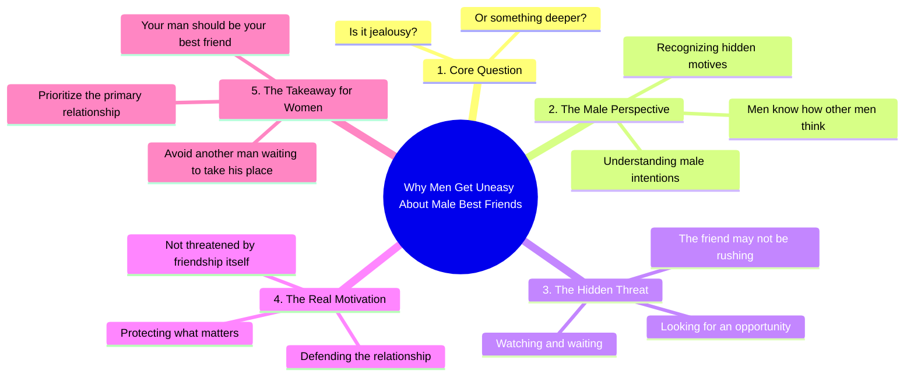

# Why Men Dislike Their Girlfriend’s Male Best Friend

> 🌐 **Read this in:** **English** · [中文](../../zh-CN/2026-08/tiktok-transcript-580k-views-8k-reactions-women-can-t-have-male-best-friend-on-8962.md)

> **Creator:** [@ONLY 4 MEN](https://www.tiktok.com/@ONLY 4 MEN) · **Views:** 339.7K · **Posted:** 2026-08-17 · **Niche:** other
>
> **TL;DR:** The hook immediately poses a relatable question and hints at a deeper answer, creating a curiosity gap.

[Watch original video →](https://www.facebook.com/reel/27846143808341228)

## Why This Went Viral

## Hook (first 3 seconds)
- **Verbatim opening line:** "Why do men get uneasy when their woman has a male best friend?"
- **Hook pattern:** Question + bold claim (loaded with gender tension)
- **Why it stops the scroll:** It asks a universally relatable, emotionally charged question that immediately triggers a "I need to hear this answer" response. The phrasing "their woman" creates an ownership dynamic that sparks debate before the video even progresses.

## Emotional Rhythm
1. **Curiosity** – The opening question primes the viewer for an explanation.
2. **Tension** – "Is it jealousy or something deeper?" introduces stakes and a binary choice.
3. **Validation** – "Men know how other men think" gives male viewers a sense of insider knowledge.
4. **Suspense** – "He's watching, waiting for an opportunity" paints a predatory picture, raising the emotional temperature.
5. **Climax** – "They're protecting what matters" reframes jealousy as loyalty, delivering the core emotional payoff.
6. **Resolution/Challenge** – "Girls, your man should be your best friend, not another man waiting to take his place" ends with a direct call-to-action that invites agreement or outrage.

## Keyword Density
- **Men** (4x) – Drives algorithmic reach via gender-tagged content; high search volume.
- **Best friend** (2x) – Emotional pull; taps into relationship advice niche.
- **Waiting** (2x) – Suspense-building; creates a villain narrative.
- **Watching** (1x) – Threat imagery; amplifies tension.
- **Protecting** (1x) – Emotional pull; reframes the narrative from insecurity to strength.
- **Jealousy** (1x) – Algorithmic reach; high-volume relationship keyword.
- **Opportunity** (1x) – Threat framing; strengthens the "other man" narrative.

## Why It Spreads
- **Trigger word "uneasy"** – It's a soft, relatable emotion that doesn't sound aggressive, making it safe to share without seeming toxic. The transcript's first line is shareable because it names a feeling many have but few articulate.
- **Gender polarization** – "Men know how other men think" creates an in-group/out-group dynamic. Men share it as validation; women share it as a warning. Both sides fuel comments and debate.
- **The villain reveal** – "He's watching, waiting for an opportunity" turns a vague concept into a concrete threat. This is the line that gets quoted in comments because it's visceral and memeable.
- **Reframe as protection, not jealousy** – "They're protecting what matters" flips a negative trait into a positive one. This moral high ground makes it shareable without guilt.
- **Direct call-to-action in the final line** – "Your man should be your best friend" gives viewers a clear takeaway they can screenshot, repost, or argue against. It's a complete thought that works as a standalone caption.

## What You Can Steal
1. **Open with a loaded question, not a statement** – Questions force the viewer to mentally answer before they decide to scroll. Phrase it with a word like "uneasy" that's specific but not inflammatory, so it pulls in both sides of the debate.
2. **Use the "reframe" pivot** – Take a negative emotion (jealousy) and rebrand it as a positive trait (protection). This creates a shareable moral position that viewers can adopt as their own identity.
3. **End with a binary command** – "Your man should be X, not Y" gives the viewer a clean, quotable takeaway. If the last line can be screenshotted and stand alone, it'll spread as an image macro or caption beyond the video itself.

## Mind Map

## Full Transcript (Generated by [TokTranscript](https://toktranscript.com/?utm_source=github&utm_medium=breakdown&utm_campaign=tool_attribution))

> 📝 Transcripts on this page are auto-generated and show the first 60%. Want to transcribe any TikTok in 30 seconds and get the full version? [Try TokTranscript free →](https://toktranscript.com/?utm_source=github&utm_medium=breakdown&utm_campaign=transcript_cta)

Why do men get uneasy when their woman has a male best friend? Is it jealousy or something deeper? Men know how other men think. That friend may not be rushing. He's watching, waiting for an opportunity.

*[Read the full transcript on TokTranscript →](https://toktranscript.com/plaza/tiktok-transcript-580k-views-8k-reactions-women-can-t-have-male-best-friend-on-8962?utm_source=github&utm_medium=breakdown&utm_campaign=transcript_full)*

## Browse More

- All [other](../../by-niche/en/other.md) breakdowns
- All [Rhetorical question + curiosity gap](../../by-pattern/en/hook-rhetorical-question-curiosity-gap.md) examples

## Video Info

| | |
|---|---|
| Creator | [@ONLY 4 MEN](https://www.tiktok.com/@ONLY 4 MEN) |
| Original video | [https://www.facebook.com/reel/27846143808341228](https://www.facebook.com/reel/27846143808341228) |
| Original title | 580K views · 8K reactions | WOMEN CAN'T HAVE MALE BEST FRIEND ! #only4men #adviceformen #relationshipmatters #ModernLove #malebestfriend #womensbestfriend | ONLY 4 MEN |
| Views | 339.7K (339726) |
| Posted | 2026-08-17 |
| Duration | 0s |
| Niche | `other` |
| Hook pattern | `Rhetorical question + curiosity gap` |
| Original language | `en` |
| Available languages | en, zh-CN |
| Generated | 2026-08-18 by [TokTranscript](https://toktranscript.com/) |

---

*This breakdown is for educational analysis under fair use. Original video © [@ONLY 4 MEN](https://www.tiktok.com/@ONLY 4 MEN). All transcripts are auto-generated and may contain errors.*

*Want to analyze your own TikToks like this? [analyze your own TikToks →](https://toktranscript.com/viral-breakdown?utm_source=github&utm_medium=breakdown&utm_campaign=footer_cta)*