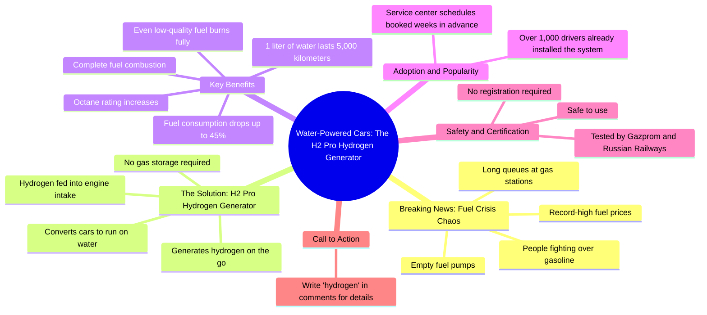

# Fuel Chaos in Russia: Drivers Switch Cars to Water

> 🌐 **Read this in:** **English** · [中文](../../zh-CN/2026-08/tiktok-transcript-6-3k-reactions-772-shares-on-reels-3228.md)

> **Creator:** [@Айзана Салчак](https://www.tiktok.com/@Айзана Салчак) · **Views:** 351.2K · **Posted:** 2026-08-22 · **Niche:** other
>
> **TL;DR:** Immediate urgency and vivid conflict grab attention instantly.

[Watch original video →](https://www.facebook.com/share/r/19XCPPdBi4/?mibextid=wwXIfr)

## Why This Went Viral

## Hook (first 3 seconds)
- **Verbatim opening:** "Срочные новости. На заправках хаос." (Breaking news. Chaos at gas stations.)
- **Hook pattern:** Scene + urgency (breaking news format).
- **Why it stops scroll:** It fabricates a crisis scenario with immediate stakes ("chaos"), making the viewer fear they're missing critical information. The "breaking news" framing hijacks attention by mimicking a trusted editorial format.

## Emotional Rhythm
1. **Urgency/Tension** — "Срочные новости. На заправках хаос." (0–2s)
2. **Escalation/Outrage** — "Огромные очереди. Люди дерутся из-за бензина. Пустые колонки. Нули на табло." (3–7s) — builds a dystopian picture.
3. **Despair/Anxiety** — "Цены бьют рекорды." (8s) — viewer feels trapped with the problem.
4. **Relief/Solution** — "Но русские, как всегда, нашли выход." (9s) — pivot from problem to hope; creates a "savior" narrative.
5. **Curiosity/Intrigue** — "Машины массово переводят на воду." (10s) — absurd claim triggers skepticism + curiosity.
6. **Validation/Proof** — "Расход падает до 45%. 1 литр воды на 5000 километров." (14–15s) — numbers act as pseudo-scientific evidence.
7. **Social Proof/Scarcity** — "Уже больше тысячи водителей установили. Очереди расписаны на недели." (16–18s) — FOMO spike.
8. **Safety/Trust** — "Проверено Газпромом и РЖД." (20s) — authority names neutralize doubt.
9. **Climax + CTA** — "Пишите водород в комментарии." (21s) — direct action, converting emotion into engagement.

**Climax moment:** The "1 литр воды на 5000 километров" stat — it's the most outlandish claim, designed to be shared as a "can you believe this?" talking point.

## Keyword Density
- **Вода (water)** — 4x — emotional pull: miracle solution, clean, abundant.
- **Водород (hydrogen)** — 3x — algorithmic reach: trending tech keyword.
- **Очереди (queues)** — 2x — emotional pull: chaos + scarcity.
- **Бензин (gasoline)** — 2x — algorithmic reach: high-volume search term.
- **Расход (consumption)** — 2x — emotional pull: cost savings.
- **Проверено (verified)** — 1x (but implied trust) — algorithmic reach: authority signal.
- **45%** — 1x — emotional pull: concrete, memorable number.

**Drivers:** "Водород" and "бензин" catch search/trend algorithms; "вода" and "очереди" trigger emotional resonance and comment-bait.

## Why It Spreads
- **Fear → Solution arc:** The transcript opens with a manufactured crisis ("люди дерутся из-за бензина") and resolves it with a miracle fix. Viewers share it as either "this is genius" or "this is fake" — both reactions drive comments and reach.
- **Outrageous claim as bait:** "1 литр воды на 5000 километров" is so absurd it forces a reaction. Skeptics comment to debunk; believers comment to ask for details. Every comment boosts the algorithm.
- **Authority name-dropping:** "Проверено Газпромом и РЖД" gives a false sense of legitimacy, making viewers feel safe sharing it without fact-checking — a classic misinformation spread mechanism.
- **Scarcity + FOMO:** "Очереди расписаны на недели вперед" creates urgency; viewers comment "водород" to avoid missing out, feeding the engagement loop.
- **Cultural identity hook:** "Но русские, как всегда, нашли выход" taps into national pride — a powerful emotional trigger that makes the video feel personal and shareable within community groups.

## What You Can Steal
1. **Open with a fake "breaking news" pattern** — even for real content. Frame your topic as an urgent, unfolding story ("Breaking: X is happening right now") to instantly raise stakes and stop the scroll.
2. **Use the "problem-solution-savior" structure** — spend 30% of the video amplifying a relatable pain, then pivot with "but here's what people are doing" before revealing your product. This creates emotional release that makes the pitch feel like a gift, not an ad.
3. **End with a single-word comment CTA** — "Пишите [keyword] в комментарии" is a low-friction ask. Pick one memorable word tied to your niche and repeat it in the video; make commenting feel like unlocking a secret.

## Mind Map

## Full Transcript (Generated by [the tool we used to generate this](https://toktranscript.com/?utm_source=github&utm_medium=breakdown&utm_campaign=tool_attribution))

> 📝 Transcripts on this page are auto-generated and show the first 60%. Want to transcribe any TikTok in 30 seconds and get the full version? [Try TokTranscript free →](https://toktranscript.com/?utm_source=github&utm_medium=breakdown&utm_campaign=transcript_cta)

Срочные новости. На заправках хаос. Огромные очереди. Люди дерутся из-за бензина. Пустые колонки. Нули на табло. Цены бьют рекорды. Но русские, как всегда, нашли выход. Машины массово переводят на воду. Водородный генератор H2 Pro. Водород поступает во впуск двигателя. Топливо сгорает полностью. Даже плохое. За счет чего повышается октан. Расход падает до 45%.

*[Read the full transcript on TokTranscript →](https://toktranscript.com/plaza/tiktok-transcript-6-3k-reactions-772-shares-on-reels-3228?utm_source=github&utm_medium=breakdown&utm_campaign=transcript_full)*

## Browse More

- All [other](../../by-niche/en/other.md) breakdowns
- All [Breaking news + escalating chaos](../../by-pattern/en/hook-breaking-news-escalating-chaos.md) examples

## Video Info

| | |
|---|---|
| Creator | [@Айзана Салчак](https://www.tiktok.com/@Айзана Салчак) |
| Original video | [https://www.facebook.com/share/r/19XCPPdBi4/?mibextid=wwXIfr](https://www.facebook.com/share/r/19XCPPdBi4/?mibextid=wwXIfr) |
| Original title | 6.3K reactions · 772 shares | Айзана Салчак on Reels |
| Views | 351.2K (351193) |
| Posted | 2026-08-22 |
| Duration | 0s |
| Niche | `other` |
| Hook pattern | `Breaking news + escalating chaos` |
| Original language | `en` |
| Available languages | en, zh-CN |
| Generated | 2026-08-23 by [TokTranscript](https://toktranscript.com/) |

---

*This breakdown is for educational analysis under fair use. Original video © [@Айзана Салчак](https://www.tiktok.com/@Айзана Салчак). All transcripts are auto-generated and may contain errors.*

*Want to analyze your own TikToks like this? [TokTranscript →](https://toktranscript.com/viral-breakdown?utm_source=github&utm_medium=breakdown&utm_campaign=footer_cta)*