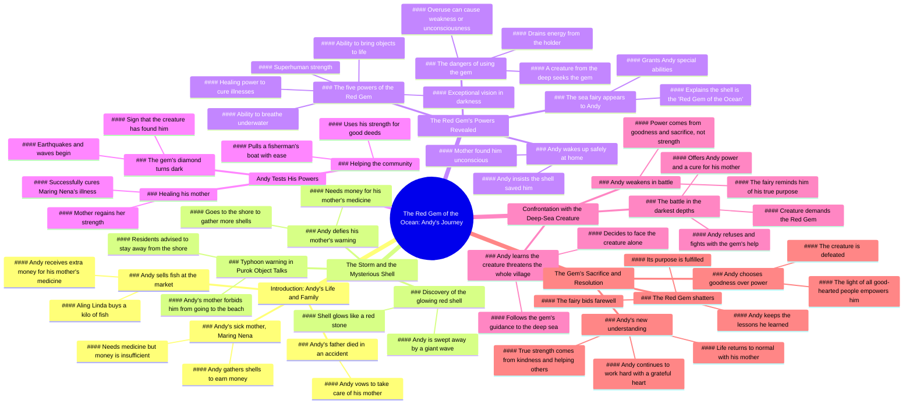

# Kabibe sa Dalampasigan: A Short Magical Story

> 🌐 **Read this in:** **English** · [中文](../../zh-CN/2026-08/tiktok-transcript-670k-views-19k-reactions-kabibe-sa-dalampasigan-short-magica-1d05.md)

> **Creator:** [@ObjectTalks AI](https://www.tiktok.com/@ObjectTalks AI) · **Views:** 342.8K · **Posted:** 2026-08-27 · **Niche:** other
>
> **TL;DR:** The hook immediately draws viewers into a lively market scene with a relatable and energetic vendor, creating instant engagement.

[Watch original video →](https://www.facebook.com/share/v/1Gzq3LgbXN/)

## Why This Went Viral

## Hook (first 3 seconds)
- **Verbatim opening:** "Bili na po kayo! Mura na lang po! One hundred na lang po! Isang kilo! Fresh na fresh pa po! Galing dagat!"
- **Hook pattern:** Scene + Sensory overload (marketplace vendor shouting, price anchoring, freshness claim)
- **Why it stops scroll:** It drops the viewer into a vivid, noisy, authentic Filipino market scene with rapid-fire dialogue. The cadence is rhythmic and almost musical, and the "fresh from the sea" detail plants a seed that pays off later. It feels like a TV drama, not a random clip.

## Emotional Rhythm
- **Beats (sequential):** Warmth (market banter) → Sympathy (sick mother revealed) → Determination (Andy's mission) → Tension (storm warning) → Dread (Andy defies mother) → Panic (wave hits) → Mystery (magic shell) → Wonder (powers revealed) → Hope (mother healed) → Rising Threat (dark entity) → Action/Climax (underwater battle) → Catharsis (shell breaks, sacrifice) → Resolution (lesson learned)
- **Suspense lands:** The storm warning and Andy's secret return to the sea. The audience knows the danger before he acts.
- **Twist:** The shell isn't just a lucky find; it's a sentient artifact with a destiny. The "diwata" (fairy) reveal shifts the story from realism to fantasy.
- **Climax:** The underwater confrontation where Andy rejects the entity's offer and the shell shatters, releasing a light powered by collective goodness.

## Keyword Density
- **"Kabibe" (shell)** — Drives the plot and the magical artifact; high search relevance for fantasy/magic content.
- **"Nanay" (mother)** — Emotional anchor; drives relatability and compassion.
- **"Pulang hiyas" (red gem)** — Unique, branded term; creates a memorable concept.
- **"Lakas" (strength)** — Dual meaning (physical vs. moral); reinforces the theme.
- **"Dagat" (sea)** — Setting and source of both danger and magic.
- **"Gamot" (medicine)** — Motivates the protagonist's actions; creates urgency.
- **"Ligtas" (safe)** — Ties to the core emotional need (family safety).
- **"Kabutihan" (goodness)** — The moral payoff; drives the viral "feel-good" shareability.

**Algorithmic reach:** "Kabibe," "dagat," "mahika" (magic) are searchable, evergreen fantasy keywords. **Emotional pull:** "Nanay," "gamot," "sakripisyo" (sacrifice) trigger empathy and family-centric values.

## Why It Spreads
- **Universal underdog story:** A poor boy's love for his sick mother is a trope that transcends culture. The line "Kulang pa po ang pera natin para sa gamot ninyo" is a gut punch that makes viewers root for him.
- **High-stakes moral dilemma:** The entity's offer — "Bibigyan kita ng walang hanggang kapangyarihan" — is a classic temptation. Andy's refusal ("Hindi ko ito ibibigay sa'yo") creates a shareable moment of integrity.
- **Visual spectacle with low production cost:** The "magic" is conveyed through simple color grading (red glow, dark water) and sound effects. It proves you don't need CGI to create wonder, which inspires other creators.
- **Serialized cliffhanger structure:** The video ends with a clear moral ("Hindi pala ang mahika ang tunay na nagbibigay ng lakas, kundi ang kabutihan") but also leaves room for a sequel. This drives comments like "Part 2 please!" which boosts engagement.
- **Cultural specificity + universal theme:** The Filipino market, the "po/opo" respect, and the family devotion are deeply local, yet the theme of sacrifice for loved ones is globally understood. This dual appeal widens the share pool.

## What You Can Steal
- **Open with an active, noisy scene.** Don't start with a talking head. Drop the viewer into a moment of high sensory detail (a market, a kitchen, a street) and let the dialogue carry the energy.
- **Use a "sacred object" to externalize internal conflict.** Give your protagonist a physical token (a shell, a letter, a key) that represents their struggle. It makes abstract emotions tangible and gives the audience something to track visually.
- **End with a spoken moral, not just a visual.** The final line ("kundi ang kabutihang handa mong ibigay sa iba") is a clean, quotable takeaway. It gives viewers a reason to comment, caption, or repost with their own interpretation.

## Mind Map

## Full Transcript (Generated by [the tool we used to generate this](https://toktranscript.com/?utm_source=github&utm_medium=breakdown&utm_campaign=tool_attribution))

> 📝 Transcripts on this page are auto-generated and show the first 60%. Want to transcribe any TikTok in 30 seconds and get the full version? [Try TokTranscript free →](https://toktranscript.com/?utm_source=github&utm_medium=breakdown&utm_campaign=transcript_cta)

Bili na po kayo! Mura na lang po! One hundred na lang po! Isang kilo! Fresh na fresh pa po! Galing dagat! Andy, pabili nga ng isang kilo. Sige po aling Linda, dahil malakas po kayo sa akin, siyam na pong piso na lang isang kilo. Napakabait na bata mo talaga, Andy. Kamusta pala si Maring Nena ang nanay mo? Nagpapagaling pa po si nanay at kailangan pa po ng gamot. Ganun, pasabi kay Kumare, magpalakas siya dahil namimiss na namin mamili ng isda sa kanya. Opo, makakarating kay nanay. Aling Linda, sobra po ang ibinigay ninyo. Sa iyo na ang sukli. Idagdag mo sa pambili ng gamot para kay Maring Nena. Pero po, huwag ka nang tumanggi. Matagal ko ng kaibigan ang nanay mo. Maraming salamat po, Aling Linda. Sana sapat na ito para sa gamot ni nanay. Kuya, pabili po ng gamot. Ito po ang reseta. Sige, akin na. Apat na raan lang po ang pera ko. Kulang pa ito, iyo. Babalikan ko na lang po. Kulang pa rin. Saan kaya kukuha ng natitirang pera? Kumakako pa ako ng maraming kabibe. Baka makabili na ako ng gamot. Andy, nakauwi ka na pala. Opo, Nay. Kamusta po ang pakiramdam ninyo? Kaunting ubo lang ito. Hindi na po kaunti ang ubo ninyo. Kailangan na po ninyo ng gamot. Huwag mong ubusin ang lakas mo para sa akin. Tayong dalawa na lang po ang magkasama. Hindi ko kayo pababayaan. Kung hindi lang sana na aksidente si tatay. Huwag mo nang sisihin ang nangyari anak. Ginawa ng tatay mo ang lahat para sa atin. Gagawin ko rin po ang lahat para gumaling kayo. Bata ka pa, Andy. Pero kaya ko na pong tumulong, Nay. Isang malakas na bagyo ang inaasahang tatama sa puro object talks. Pinapayuhan ang lahat na umiwas sa baybain. Pusibling magkaroon ng malalakas na ulan, hangin at malalaking alon. Narinig mo yun, Andy? Bawal kang pumunta sa dalampasigan. Opo, Nay. Hindi po ako pupunta. Nay, inumpo muna kayo ng tubig. Ubus na talaga ang gamot. At kaunti na lang ang kulang. Kailangan kong gumawa ng paraan. Kukuha lang ako ng kaunti. Babalik ako bago tuluyang lumakas ang ulan. Ang dilim ng mga ulap. Pero wala pang malakas na ulan. Konting kabibilang. Pagkatapos, uuwi na agad ako Kailangan ko itong gawin Para kay nanay Kailangan niya ng gamot Maraming inanod na kabibe Kapag napuno ito, sapat na ang pambili ng gamot Kailangan kong bilisan Mukhang paparating na ang bagyo Wow! Ang lamig! Hindi pa puno ang lalagyan Hindi pa ako pwedeng umuwi Wow! Ang lamig! Ngayon lang ako nakakita ng ganito. Ang ganda ng kabibe parang pulang bato. Umilaw ba yun? Baka tinamaan lang ng ilaw mula sa kidlat. Isasama ko na lang ito. Baka may bumili nito ng mahal Andy anak nasaan ka Huwag mong sabihin, pumunta ka sa dagat! Andy, Diyos ko, iligtas ninyo ang anak ko. Mari, bakit ka nasa labas? Hindi ko makita si Andy. Sa tingin ko, pumunta siya sa dalampasigan. Ano? May paparating na napakalaking alon. Manghihingi ako ng tulong sa mga tanod. Bilisan natin, Linda. Anak ko ang naroon. Puno na. Makakabili na ako ng gamot. Bakit ang init? Bakit ka umiilaw? Umiilaw! Hindi maari... ang mga kabibig ko! Hindi pa dito nagtapos ang iyong paglalakbay, Andy. Nasaan ako? Nay, paano po ako nakauwi? Hindi ko rin alam anak, nang mag-ising ako kaninang umaga nakahiga ka na rito. Pero, nay sigurado po akong tinangay ako ng malaking alon. Pero ligtas ka ng nakauwi anak. Hindi ko po alam kung paano ako nakabalik dito. Ang huli kong naalala, nasa ilalim ako ng dagat. Baka panaginip mo lang yun anak, dahil nung nagising ako kaninang umaga, nakahiga ka na dito. Pero nay, alam kong tangay na ako ng malaking alon. Nay, ito po ang napulot ko, bago ako tangayin ng alon. Kabibilang naman yan anak. May pulang bato po ito sa gitna, at umilaw po ito, bago ako mawala ng malay. Baka epekto lang iyon ng pagod at takot mo. Hindi po ako nagkakamalinay. Pero nagsalita rin po ito sa akin. Nagsalita? Opo, alam ko yung kabibe, yun. Baka nanaginip ka lang habang wala kang malay. Pero sigurado po akong totoo ang nangyari. Anak, tama na yan. Mas mahalagang sabihin mo sa akin kung bakit ka pumunta sa dagat. Nay, sorry po. Kulang pa po kasi ang pera natin para sa gamot ninyo. Anak, hindi ko kailangan ng gamot kung buhay mo naman ang kapalit. Magpahinga ka muna. Marami kang pinagdaanan. Kailangan mo ng pahinga, anak. Opo, Nay, salamat. Pero aalamin ko pa rin kung paano ako nakaligtas. Basta huwag ka nang babalik sa dagat ng mag-isa. Kung ikaw talaga ang nagligtas sa akin, ipakita mo kung ano ka. Baka tama nga si nanay. Nandito na naman ako. Ito ang nangyari bago ako malunod. Umalis ka riyan! May malaking alon sa likuran mo! Nay! Hindi! Hindi ako makahinga. Ang kabibe. Nakakahinga ako. Napakalinaw nakikita ko ang lahat. Sino ka? Ikaw ba ang nagligtas sa akin? Bakit ninyo ako tinulungan? Dahil nakita namin ang kabutihan ng iyong puso. Ang kabibeng ito ay tinatawag na pulang hiyas ng karagatan. Habang nasa iyo ito, may kakayahan kang huminga at mabuhay sa ilalim ng dagat. Yun pala. Ang siyang malinaw na dahilan. Kung bakit, hindi ako nalunod. Bibigyan ka rin nito ng pambihirang talas ng paningin. Makakakita ka kahit sa pinakamadilim na bahagi ng karagatan Kahit sa kailaliman po Kahit saan ka mandalhin ng dagat Andy Bibiyayaan ka rin nito ng pambihirang lakas ng katawan. Hua, napakalakas ko! Ngunit huwag mong gamitin ang iyong lakas para manakit ng walang dahilan. May kakayahan din ang kabibe na magbigay buhay sa mga bagay. Nasaan ako? Nagsasalita ang laruan! Ngunit pag-isipan mong mabuti ang bawat bagay na bibigyan mo ng buhay. Ang pinakamahalagang kakayahan nito ay ang pagpapagaling. Kaya nitong magpagaling ng may sakit? Siya ang tunay, Andy. Ang ibig sabihin po ba niyan? Magagamot ko na si nanay! Ngunit may kalakip na panganib ang paggamit ng kakayahan nito, Andy. Anong panganib po? Kumukuha ang kabibay ng lakas mula sa may hawak nito. Kapag nasobrahan ang paggamit mo, maaari kang manghina o mawala ng malay. May panganib na nagising nang napasa kamay mo ang pulang hiyas. Anong panganib? Isang nilalang. mula sa pinakamalalim na bahaki ng dagat. Matagal na nitong hinahanap ang pulang hiyas at alam na nitong nasa iyo ang kabibe.

*[Read the full transcript on TokTranscript →](https://toktranscript.com/plaza/tiktok-transcript-670k-views-19k-reactions-kabibe-sa-dalampasigan-short-magica-1d05?utm_source=github&utm_medium=breakdown&utm_campaign=transcript_full)*

## Browse More

- All [other](../../by-niche/en/other.md) breakdowns
- All [Direct address with urgency and sensory appeal](../../by-pattern/en/hook-direct-address-with-urgency-and-sensory-appeal.md) examples

## Video Info

| | |
|---|---|
| Creator | [@ObjectTalks AI](https://www.tiktok.com/@ObjectTalks AI) |
| Original video | [https://www.facebook.com/share/v/1Gzq3LgbXN/](https://www.facebook.com/share/v/1Gzq3LgbXN/) |
| Original title | 670K views · 19K reactions | Kabibe sa Dalampasigan (Short Magical Story) #magical #fantasy #lesson #animation #ObjectTalks | ObjectTalks AI |
| Views | 342.8K (342781) |
| Posted | 2026-08-27 |
| Duration | 0s |
| Niche | `other` |
| Hook pattern | `Direct address with urgency and sensory appeal` |
| Original language | `en` |
| Available languages | en, zh-CN |
| Generated | 2026-08-28 by [TokTranscript](https://toktranscript.com/) |

---

*This breakdown is for educational analysis under fair use. Original video © [@ObjectTalks AI](https://www.tiktok.com/@ObjectTalks AI). All transcripts are auto-generated and may contain errors.*

*Want to analyze your own TikToks like this? [TokTranscript →](https://toktranscript.com/viral-breakdown?utm_source=github&utm_medium=breakdown&utm_campaign=footer_cta)*