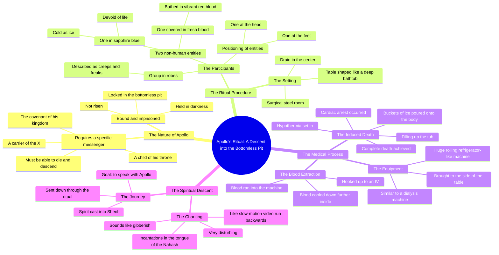

# Speaking With Apollo Using Tech to Reach the Underworld

> 🌐 **Read this in:** **English** · [中文](../../zh-CN/2026-08/tiktok-transcript-7-2k-views-32k-reactions-speaking-with-the-god-apollo-using-f166.md)

> **Creator:** [@The Confessionals](https://www.tiktok.com/@The Confessionals) · **Views:** 993.3K · **Posted:** 2026-08-11 · **Niche:** entertainment
>
> **TL;DR:** Immediately subverts a familiar myth, creating intrigue and a promise of hidden knowledge.

[Watch original video →](https://www.facebook.com/share/r/1c47Dkcydz/?mibextid=wwXIfr)

## Why This Went Viral

## Hook (first 3 seconds)
- **Verbatim opening line:** "Apollo has a very different approach because he is still bound. He is not risen."
- **Hook pattern:** Bold claim + mythic contrast ("still bound" vs. implied "risen" — a direct jab at Christian resurrection imagery).
- **Why it stops the scroll:** It drops a specific, obscure name (Apollo) with a theological twist in the first breath. The viewer instantly thinks, "Wait, what did he just say?" — that cognitive friction triggers the replay and the need to hear the full context.

## Emotional Rhythm
- **Beats:** Confusion (mythic claim) → Intrigue (the "carrier of the X" condition) → Unease (surgical steel, robes, "creeps, freaks") → Dread (the blood-covered figure) → Shock (the sapphire-blue "cold as ice" figure) → Tension spike (dialysis machine + ice buckets) → Horror (hypothermia → cardiac arrest → "they pulled the blood out") → Climax: "They were casting my spirit down with this ritual to go and speak to Apollo."
- **Suspense point:** The description of the blood-covered entity — "he was not human, not like the others" — breaks the mundane ritual and signals something supernatural.
- **Climax:** The moment of death and being "cast into Sheol" — the entire story is a slow build to a literal near-death experience with a pagan god.
- **Resonance:** The final line ties the horror to a purpose — "to go and talk to him" — making the ordeal feel like a mission, not just torture.

## Keyword Density
1. **Blood** (6+ times) — drives visceral, algorithmic "shock value" and high engagement (comments, shares).
2. **Apollo** (3 times) — niche mythic keyword that attracts occult/religious-curiosity searches.
3. **Bottomless pit / Sheol** (3 times) — biblical + underworld language, triggers religious debate in comments.
4. **Died / death / cardiac arrest** (3 times) — high-emotion words that push the "is this real?" discussion.
5. **Ritual / incantations** (2 times) — occult keyword density for dark-content algorithms.
6. **Covered in blood / bathed in blood** (2 times) — graphic imagery that increases watch time (people rewind to visualize).
7. **Not human** (2 times) — supernatural hook that drives curiosity gaps.

**Algorithmic drivers:** Blood, death, ritual — these are high-retention horror keywords.
**Emotional pull:** Apollo, Sheol, "carrier of the X" — these create a secret-knowledge vibe that makes viewers feel like they're being let in on a hidden truth.

## Why It Spreads
- **The "secret knowledge" frame:** The speaker frames the story as insider information ("you have to be a carrier of the X") — this makes viewers feel privileged and likely to share to show they're "in the know."
- **Escalating visual specificity:** From "surgical steel room" to "five gallons of blood" to "rolling refrigerator" — each concrete detail makes the story feel eyewitness-real, which fuels the "is this true?" debate in comments (the #1 engagement driver).
- **The twist ending:** The entire story seems like a horror tale, but the final line reveals it was a *mission* — "to go and speak to Apollo." This recontextualizes everything and forces a rewatch.
- **Religious friction:** The opening contrast ("still bound, not risen") directly challenges Christian resurrection — this guarantees split comments between believers, skeptics, and occult-curious viewers.
- **Pacing control:** The speaker drags out the details (the blood-covered figure, the blue figure, the machine) — this maximizes watch time because the viewer is waiting for the payoff, which only comes at the very end.

## What You Can Steal
- **Open with a contradiction of a familiar belief:** Start with a bold claim that flips a common assumption (e.g., "Most people think X, but actually Y") — it forces a mental double-take in the first 2 seconds.
- **Use "you have to" to create insider access:** Phrase your content as a requirement for entry ("if you want to know, you have to...") — this makes the viewer feel like they're being recruited, not just entertained.
- **End with a recontextualizing twist:** Build a long, detailed setup, then in the last line flip the meaning of everything the viewer just heard. This guarantees rewinds, shares, and comment debates — the three pillars of short-form virality.

## Mind Map

## Full Transcript (Generated by [the tool we used to generate this](https://toktranscript.com/?utm_source=github&utm_medium=breakdown&utm_campaign=tool_attribution))

> 📝 Transcripts on this page are auto-generated and show the first 60%. Want to transcribe any TikTok in 30 seconds and get the full version? [Try TokTranscript free →](https://toktranscript.com/?utm_source=github&utm_medium=breakdown&utm_campaign=transcript_cta)

Apollo has a very different approach because he is still bound. He is not risen. He is in darkness in the bottomless pit and locked up. And if you want to go talk to him, you have to be a carrier of the X, which is the covenant of his kingdom, a child of his throne, and be able to die, go down into the bottomless pit and talk to him. So they literally performed a medical procedure, like a table like this, all surgical steel room and it was deep like a bathtub with a drain in the center. And they laid me inside there and they brought in a group of people dressed in robes, but nothing special like dudes, creeps, freaks. But then they brought in a different thing who was completely covered in blood. Like it wasn't huge quantities of blood, like five gallons of five gallon buckets worth of I know how much blood it takes to cover a person. And he was covered in blood. Like he had stood under a shower and bathed in blood, red vibrant fresh blood And he was not human not like the others And then another one of those came in all in blue like sapphire blue cold as ice devoid of life not charged up whatsoever And one stood at my feet and the other stood at my head.

*[Read the full transcript on TokTranscript →](https://toktranscript.com/plaza/tiktok-transcript-7-2k-views-32k-reactions-speaking-with-the-god-apollo-using-f166?utm_source=github&utm_medium=breakdown&utm_campaign=transcript_full)*

## Browse More

- All [entertainment](../../by-niche/en/entertainment.md) breakdowns
- All [Mythological twist](../../by-pattern/en/hook-mythological-twist.md) examples

## Video Info

| | |
|---|---|
| Creator | [@The Confessionals](https://www.tiktok.com/@The Confessionals) |
| Original video | [https://www.facebook.com/share/r/1c47Dkcydz/?mibextid=wwXIfr](https://www.facebook.com/share/r/1c47Dkcydz/?mibextid=wwXIfr) |
| Original title | 7.2K views · 32K reactions | Speaking with the god Apollo using technology to reach the Underworld 770: The Devil Runs The Finders Club #apollo #fallenangel #occult | The Confessionals |
| Views | 993.3K (993252) |
| Posted | 2026-08-11 |
| Duration | 0s |
| Niche | `entertainment` |
| Hook pattern | `Mythological twist` |
| Original language | `en` |
| Available languages | en, zh-CN |
| Generated | 2026-08-12 by [TokTranscript](https://toktranscript.com/) |

---

*This breakdown is for educational analysis under fair use. Original video © [@The Confessionals](https://www.tiktok.com/@The Confessionals). All transcripts are auto-generated and may contain errors.*

*Want to analyze your own TikToks like this? [TokTranscript.com →](https://toktranscript.com/viral-breakdown?utm_source=github&utm_medium=breakdown&utm_campaign=footer_cta)*