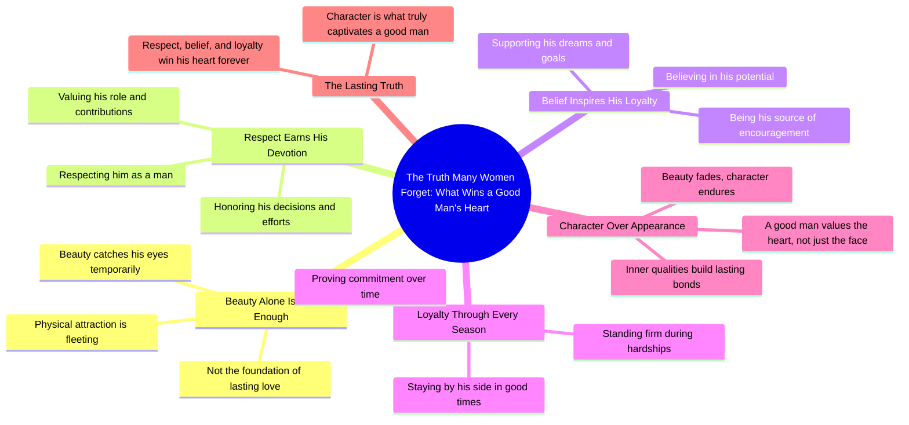

# Why Good Men Value Character Over Beauty

> 🌐 **Read this in:** **English** · [中文](../../zh-CN/2026-08/tiktok-transcript-720k-views-27k-reactions-the-truth-many-women-forget-a-goodm-9834.md)

> **Creator:** [@Stella Rain Talks](https://www.tiktok.com/@Stella Rain Talks) · **Views:** 315.7K · **Posted:** 2026-08-30 · **Niche:** other
>
> **TL;DR:** Starts with a bold, contrarian statement that challenges common assumptions and immediately grabs attention.

[Watch original video →](https://www.facebook.com/share/r/1Bn5PdxWeS/)

## Why This Went Viral

## Hook (first 3 seconds)
- **Verbatim opening line:** "The truth many women forget."
- **Hook pattern:** Bold claim + curiosity gap (a "secret truth" framed as something the audience is missing).
- **Why it stops the scroll:** It directly challenges the viewer's current mindset with an authoritative, almost corrective tone. The word "forget" implies the viewer already knows this deep down, creating instant cognitive dissonance — they must watch to confirm or refute.

## Emotional Rhythm
1. **Challenge/Intrigue** ("The truth many women forget") — creates a slight ego sting, pulls attention.
2. **Tension/Rebuke** ("A good man is not impressed by beauty alone") — dismantles a common assumption, raises stakes.
3. **Validation/Resonance** ("He remembers the woman who respected him, believed in him, and stayed loyal") — shifts from negative to positive, offering a clear, desirable alternative.
4. **Climax/Resolution** ("Beauty may catch his eyes, but character wins his heart forever") — delivers the payoff in a clean, quotable contrast that feels like a life lesson.
- **Climax moment:** The final line, where the contrast ("eyes" vs. "heart") lands as an emotional mic-drop.

## Keyword Density
- **"woman/women"** — 3x (targets the audience directly)
- **"beauty"** — 2x (drives the initial contrast, high search/emotional pull)
- **"character"** — 1x (the moral counterweight, highly shareable)
- **"respected / believed / stayed loyal"** — 3 action verbs (emotional pull, paints a behavioral checklist)
- **"heart / eyes"** — 2x (metaphorical anchors, easy to visualize)
- **"truth / forget"** — 2x (algorithmic reach: "truth" is a high-engagement keyword; "forget" triggers curiosity)

## Why It Spreads
- **Universal relationship tension:** The transcript speaks to a fear many women hold (that beauty isn't enough) and a frustration many men feel (that they're not valued for character). It validates both sides, making it shareable across genders.
- **Quotable final line:** "Beauty may catch his eyes, but character wins his heart forever" is a standalone aphorism — viewers screenshot it, repost it, or use it as a caption. It's designed to be extracted.
- **Moral high ground framing:** The video positions the viewer as "in on the truth" vs. "the world that forgets." This us-vs-them framing drives comments (agreement, debate, personal stories), which boosts algorithmic distribution.
- **Low-friction, high-resonance format:** No visuals, no story, just a direct address. It works as a text-overlay video, a voiceover, or a slideshow — easy to remix, which extends its lifespan.
- **Emotional closure in 15 seconds:** The arc is complete (challenge → validation → resolution). Viewers feel a sense of "that was satisfying" and share to give that feeling to someone else.

## What You Can Steal
- **Open with a corrective claim, not a question.** "The truth many women forget" outperforms "Do you know what men want?" because it implies the audience is already missing something — that's a stronger curiosity trigger.
- **Use a two-part contrast as your closing line.** Structure your payoff as "X may [do Y], but Z [does W]." This makes the takeaway instantly memorable and copy-paste shareable.
- **Anchor on behavioral verbs, not adjectives.** Instead of "be kind and loyal," say "respected him, believed in him, stayed loyal." Specific actions create a mental checklist, which drives comments like "this is exactly what I do" or "this is what I'm looking for."

## Mind Map

## Full Transcript (Generated by [TokTranscript](https://toktranscript.com/?utm_source=github&utm_medium=breakdown&utm_campaign=tool_attribution))

> 📝 Transcripts on this page are auto-generated and show the first 60%. Want to transcribe any TikTok in 30 seconds and get the full version? [Try TokTranscript free →](https://toktranscript.com/?utm_source=github&utm_medium=breakdown&utm_campaign=transcript_cta)

The truth many women forget. A good man is not impressed by beauty alone. He remembers the woman who respected him, believed in him, and stayed lo

*[Read the full transcript on TokTranscript →](https://toktranscript.com/plaza/tiktok-transcript-720k-views-27k-reactions-the-truth-many-women-forget-a-goodm-9834?utm_source=github&utm_medium=breakdown&utm_campaign=transcript_full)*

## Browse More

- All [other](../../by-niche/en/other.md) breakdowns
- All [Contrarian truth](../../by-pattern/en/hook-contrarian-truth.md) examples

## Video Info

| | |
|---|---|
| Creator | [@Stella Rain Talks](https://www.tiktok.com/@Stella Rain Talks) |
| Original video | [https://www.facebook.com/share/r/1Bn5PdxWeS/](https://www.facebook.com/share/r/1Bn5PdxWeS/) |
| Original title | 720K views · 27K reactions | the truth many women forget a Goodman is not impressed by beauty alone. #relatable #relationships #podcast | Stella Rain Talks |
| Views | 315.7K (315744) |
| Posted | 2026-08-30 |
| Duration | 0s |
| Niche | `other` |
| Hook pattern | `Contrarian truth` |
| Original language | `en` |
| Available languages | en, zh-CN |
| Generated | 2026-08-31 by [TokTranscript](https://toktranscript.com/) |

---

*This breakdown is for educational analysis under fair use. Original video © [@Stella Rain Talks](https://www.tiktok.com/@Stella Rain Talks). All transcripts are auto-generated and may contain errors.*

*Want to analyze your own TikToks like this? [free TikTok transcript generator →](https://toktranscript.com/viral-breakdown?utm_source=github&utm_medium=breakdown&utm_campaign=footer_cta)*