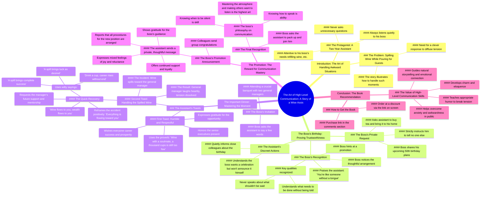

# What High EQ People Say When They Spill Wine

> 🌐 **Read this in:** **English** · [中文](../../zh-CN/2026-08/tiktok-transcript-778k-views-8-5k-reactions-l-l-m-ly-r-u-khi-m-i-kh-ch-ng-i-eq-51c5.md)

> **Creator:** [@Người Có EQ](https://www.tiktok.com/@Người Có EQ) · **Views:** 364.3K · **Posted:** 2026-08-15 · **Niche:** entertainment
>
> **TL;DR:** Poses a relatable social dilemma and promises a story that will reveal the answer, immediately engaging viewers.

[Watch original video →](https://www.facebook.com/reel/27835576512738112)

## Why This Went Viral

## Hook (first 3 seconds)
- **Verbatim opening:** "Nếu đang rót rượu mời khách mà lỡ tay làm rượu đổ ra bàn, bạn nên nói gì để hóa giải tình huống ngượng ngùng?" (If you're pouring wine for a guest and accidentally spill it on the table, what should you say to defuse the awkwardness?)
- **Hook pattern:** Question + scenario (a specific, relatable social dilemma)
- **Why it stops the scroll:** It poses a universal, high-stakes social problem that everyone fears. The viewer immediately thinks, "I've been there" or "I need to know this" — creating an instant information gap that demands closure.

## Emotional Rhythm
1. **Curiosity/Intrigue** — The opening question creates an unsolved social puzzle.
2. **Tension** — The assistant's silence and the boss's test create a quiet, suspenseful build ("anh đều im lặng lắng nghe, không bao giờ tùy tiện hỏi lại").
3. **Recognition/Resonance** — The birthday setup feels familiar; viewers recognize the "quiet competence" archetype.
4. **Relief + Laughter** — The wine-spill moment: "Rượu đổ về phía ngài, tài lộc cũng đổ về phía ngài" — a clever twist that resolves the tension with humor.
5. **Validation/Pride** — The boss's promotion and the assistant's reward ("biết nói chuyện là năng lực, biết im lặng là bản lĩnh") delivers a satisfying moral payoff.
6. **Climax:** The wine-spill toast — it's the literal embodiment of the hook, delivering the promised solution in a high-stakes setting.
7. **Call-to-action shift** — The emotional high is immediately leveraged into a book pitch.

## Keyword Density
- **"Sếp" (boss)** — appears ~15 times; drives the hierarchical power dynamic, a core theme in Vietnamese workplace culture.
- **"Im lặng lắng nghe" (silent listening)** — repeated 3+ times; the core virtue being rewarded.
- **"Hiểu" (understand)** — repeated frequently; emotional pull — the value of emotional intelligence.
- **"Rượu" (wine)** — repeated in hook and climax; ties the narrative together and is the literal trigger of the key scene.
- **"Năng lực" / "bản lĩnh" (competence / courage)** — used in the moral summary; algorithmic reach via motivational keywords.
- **"Nghệ thuật giao tiếp" (art of communication)** — direct bridge to the book product; SEO for self-help audience.

## Why It Spreads
1. **The hook is a "social emergency" every adult fears.** Spilling wine at a business dinner is a universal cringe moment. The transcript's opening line ("bạn nên nói gì để hóa giải...") promises a life-raft — viewers share it with friends who "need this."
2. **It's a parable with a clear moral reward.** The story of the silent assistant who gets promoted ("Cậu nên tiến thêm một bước nữa đi") validates the viewer's belief that patience and quiet competence win. This "justice arc" triggers a share impulse — people share content that makes them feel wise.
3. **The wine-spill line is a quotable "power phrase."** "Rượu đổ về phía ngài, tài lộc cũng đổ về phía ngài" is a ready-made toast people want to reuse. It's a verbal hack — viewers screenshot it, memorize it, and share it as a "life hack."
4. **The twist lands exactly when tension peaks.** The boss's test ("Cậu hãy nói vài câu đi") sets up a do-or-die moment. The assistant's recovery is so smooth it feels like a magic trick — the "how did he do that?" reaction drives comments and saves.
5. **The CTA is seamlessly woven into the moral takeaway.** The book pitch ("Cuốn sách Nghệ thuật giao tiếp đỉnh cao") isn't an interruption — it's the natural "lesson learned" from the story. This makes the ad feel like a gift, not an ad, which boosts completion rates and shares.

## What You Can Steal
1. **Open with a "social emergency" question.** Don't start with your product or your story. Start with a specific, high-anxiety scenario your audience fears — then promise the solution is in the story. (e.g., "What do you say when your boss asks a question you don't know the answer to?")
2. **Build a "quiet competence" character arc.** Show a protagonist who wins by doing less, not more. The contrast between the loud, nervous world and the calm, observant hero creates narrative tension that keeps viewers watching to the end.
3. **Create a quotable "power phrase" as the climax.** Design one line that is so clever and reusable that viewers feel compelled to screenshot or share it. (e.g., "Rượu đổ về phía ngài, tài lộc cũng đổ về phía ngài") — then attach your product as the "source" of that wisdom.

## Mind Map

## Full Transcript (Generated by [TokTranscript](https://toktranscript.com/?utm_source=github&utm_medium=breakdown&utm_campaign=tool_attribution))

> 📝 Transcripts on this page are auto-generated and show the first 60%. Want to transcribe any TikTok in 30 seconds and get the full version? [Try TokTranscript free →](https://toktranscript.com/?utm_source=github&utm_medium=breakdown&utm_campaign=transcript_cta)

Nếu đang rót rượu mời khách mà lỡ tay làm rượu đổ ra bàn, bạn nên nói gì để hóa giải tình hữu ngược ngủ? Nghe xong câu chuyện sau, bạn sẽ hiểu. Một chàng trai đã làm trợ lý cho sếp được 2 năm. Bất kể sếp nói gì, anh đều im lặng lắng nghe, không bao giờ tùy tiện hỏi lại. Cha của sếp hết, anh rót đầy. Rượu của sếp cả, anh châm thêm. Một hôm, sếp nói, ngày kia tôi có việc nên không đến công ty. Công việc tôi đã sắp sếp cả rồi, cậu cứ theo đó mà làm. Lúc này, người trợ lý mới lên tiếng, Bè nói, ngày kia cậu đến tiệm trà, mua ít trà rồi mang đến nhà tôi. Mấy ông bạn học cũ cứ nằng nặc đòi tổ chức sinh nhật 50 tuổi cho tôi, nên đành phải tiếp đãi một bữa. Nhưng chuyện này cậu biết là được rồi, tuyệt đối không được nói cho ai khác. Người trợ lý gật đầu rồi đi. Anh hiểu sếp không muốn tự mình thông báo sinh nhật, nhưng cũng không muốn ngày vui của mình trôi qua quá nhạt léo. Vì vậy, hãy anh âm thầm báo cho một số đồng nghiệp thân thiết trong công ty. h t s s nh s c m nh nghi th thi N n sau ng tr l th ch M h s nhi h M n tr t h ch tr l nh m n nay ch d m m c C bi v sao kh Người trợ lý mỉm cười, lắc đầu. Sếp nói, vì cậu giống như không có lưỡi. Chuyện không nên nói, cậu tuyệt đối không nói. Chuyện cần làm, cậu lại hiểu rất rõ. Cậu nên tiến thêm một bước nữa đi. Người trợ lý vẫn im lặng lắng nghe, sau đó gật đầu nói.

*[Read the full transcript on TokTranscript →](https://toktranscript.com/plaza/tiktok-transcript-778k-views-8-5k-reactions-l-l-m-ly-r-u-khi-m-i-kh-ch-ng-i-eq-51c5?utm_source=github&utm_medium=breakdown&utm_campaign=transcript_full)*

## Browse More

- All [entertainment](../../by-niche/en/entertainment.md) breakdowns
- All [Scenario question + promise of story](../../by-pattern/en/hook-scenario-question-promise-of-story.md) examples

## Video Info

| | |
|---|---|
| Creator | [@Người Có EQ](https://www.tiktok.com/@Người Có EQ) |
| Original video | [https://www.facebook.com/reel/27835576512738112](https://www.facebook.com/reel/27835576512738112) |
| Original title | 778K views · 8.5K reactions | Lỡ làm đổ ly rượu khi mời khách, người EQ cao sẽ nói gì? #baihoccuocsong #congso #SEP #giaotiep #sachhay #nguoicoeq | Người Có EQ |
| Views | 364.3K (364301) |
| Posted | 2026-08-15 |
| Duration | 0s |
| Niche | `entertainment` |
| Hook pattern | `Scenario question + promise of story` |
| Original language | `en` |
| Available languages | en, zh-CN |
| Generated | 2026-08-16 by [TokTranscript](https://toktranscript.com/) |

---

*This breakdown is for educational analysis under fair use. Original video © [@Người Có EQ](https://www.tiktok.com/@Người Có EQ). All transcripts are auto-generated and may contain errors.*

*Want to analyze your own TikToks like this? [TokTranscript.com →](https://toktranscript.com/viral-breakdown?utm_source=github&utm_medium=breakdown&utm_campaign=footer_cta)*