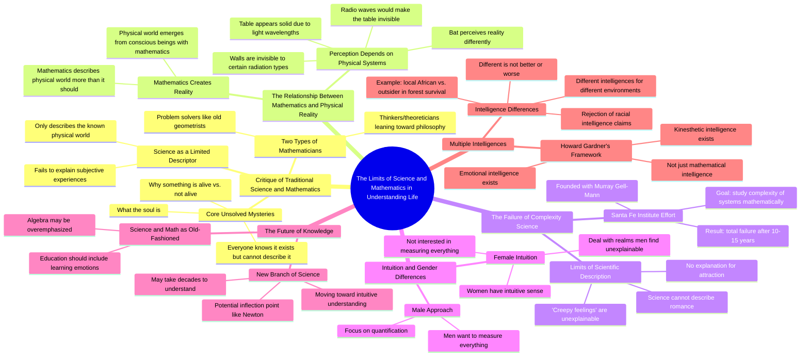

# Jeffrey Epstein and the Simulation Theory Explained

> 🌐 **Read this in:** **English** · [中文](../../zh-CN/2026-08/tiktok-transcript-839k-views-12k-reactions-jeffrey-epstein-is-why-the-simulati-b896.md)

> **Creator:** [@Jonah Rogers](https://www.tiktok.com/@Jonah Rogers) · **Views:** 528.2K · **Posted:** 2026-08-24 · **Niche:** other
>
> **TL;DR:** Starts with a bold, contrarian claim that immediately challenges the audience's assumptions.

[Watch original video →](https://www.facebook.com/share/v/1BVtkEbdqt/?mibextid=wwXIfr)

## Why This Went Viral

## Hook (first 3 seconds)
- **Verbatim opening:** "Philosophers can't do math, and some of them mathematicians."
- **Hook pattern:** Bold claim / contrarian statement — immediately pits two intellectual tribes against each other.
- **Why it stops scroll:** It's a provocative, almost insulting generalization delivered with deadpan authority. The viewer instantly thinks, "That's wrong" or "Wait, really?" — and must watch to see where it goes.

## Emotional Rhythm
1. **Provocation** (0–3s): "Philosophers can't do math" — sparks debate and ego.
2. **Curiosity** (3–15s): The speaker sorts thinkers into "problem solvers" vs. "theoreticians" — creates a mental map the viewer wants to complete.
3. **Mystery** (15–30s): "No one's been able to describe what the soul is, but we all know it exists" — shifts from intellectual to existential, creating a sense of awe.
4. **Disruption** (30–45s): "Science is a bad word" — challenges a sacred cow, raising tension.
5. **Mind-bend** (45–60s): The table/radio waves example — a concrete, visual thought experiment that makes the abstract tangible. This is the "aha" moment.
6. **Resonance** (60–90s): "Science doesn't describe romance" and the "creepy feeling" line — pivots to universal human experience, creating emotional connection.
7. **Controversy** (90–120s): The gender intuition claim — spikes tension again, inviting both agreement and outrage.
8. **Climax** (120–140s): "I reject that black people are less intelligent than white people" — the most charged moment; reframes the entire conversation around intelligence being contextual, not hierarchical.

## Keyword Density
- **"Intelligence"** (5+ mentions) — drives the core thesis and algorithmic categorization (education, psychology, debate topics).
- **"Science"** (6+ mentions) — high-search-volume term; triggers both STEM and anti-science audiences.
- **"Mathematics"** (5+ mentions) — academic keyword that pulls in math-curious viewers.
- **"Women"** (4+ mentions) — emotionally charged; drives comment-section warfare and shares.
- **"Physical world"** (3+ mentions) — anchors the philosophical premise.
- **"Intuition"** (3+ mentions) — emotional pull; contrasts with cold logic.
- **"Different"** (3+ mentions) — reinforces the "not better, not worse" framing.

## Why It Spreads
- **Provocative framing:** "Philosophers can't do math" is a bait line that guarantees both philosophers and mathematicians comment to defend their tribe — and everyone else watches the fight.
- **Escalating stakes:** The video moves from academic debate → soul → gender → race. Each shift raises the emotional temperature, keeping viewers hooked through the entire runtime.
- **Universal relatability:** "Science doesn't describe romance" and "creepy feeling" are lines anyone can connect to, making the content shareable beyond niche intellectual circles.
- **Contrarian authority:** The speaker delivers controversial claims ("science is a bad word") with calm, measured confidence — this "calm rebel" persona is proven to drive engagement and saves.
- **Comment-bait structure:** The gender and race segments are engineered to split audiences. Viewers don't just watch; they feel compelled to agree or attack, which fuels the algorithm.

## What You Can Steal
- **Open with a tribal insult:** Start your video by dismissing a group your audience identifies with or against ("Artists can't code" or "Marketers don't understand psychology"). It forces an immediate emotional stake.
- **Use a concrete visual analogy mid-video:** The table/radio waves example turns abstract philosophy into a 15-second mind-bender. Find one physical, everyday object that illustrates your core idea — it gives viewers a "clip" to rewatch and share.
- **End with a controversial reframe:** The race/intelligence segment lands last, leaving viewers in a state of unresolved tension. Don't resolve the debate — leave it open so the comments section finishes the video for you.

## Mind Map

## Full Transcript (Generated by [try this transcription tool](https://toktranscript.com/?utm_source=github&utm_medium=breakdown&utm_campaign=tool_attribution))

> 📝 Transcripts on this page are auto-generated and show the first 60%. Want to transcribe any TikTok in 30 seconds and get the full version? [Try TokTranscript free →](https://toktranscript.com/?utm_source=github&utm_medium=breakdown&utm_campaign=transcript_cta)

Philosophers can't do math, and some of them mathematicians. And again, mathematicians often break into two categories. People that solve problems. Those are more like geometrists in the old days. They're just problem solvers. And then there's thinkers, theoreticians. They're more like the old movement towards philosophy. But neither one of those two groups have been able to figure out why something is alive as opposed to something that's not alive. No one's been able to describe what the soul is, but we all know it exists. And I think what we need is a new... Science is a bad word. I think science only describes the things we already know about the physical world. In fact, there's an argument that the physical world that we see has been created out of our systems of mathematics. Mathematics, everyone knows mathematics describes the physical world much greater than it should, unless, in my view, the physical world really comes out of conscious beings that have mathematics. So they create it. This table appears to you and I to be solid. To a bat, because we have light that's bouncing off the table into our eyes, it appears solid. If instead of eyes that responded to wavelengths of visual light Our eyes responded to radio waves the radio frequencies It not different It the same type of frequency as light with different speeds The table invisible We know that our phone works in this room. So the waves are coming through the windows. The waves are coming through the walls. So the walls are invisible to that type of radiation, that type of energy. The walls are, I can see them because my eyes, a physical system, determines that the walls are there. You, with Murray Gildman, you founded, or with the original donor, and had the idea of Santa Fe Institute. In 10 or 15 years later, that effort to study the complexity of systems mathematically. Yes. It's a total failure. A total failure. Total failure. Why is that? It's the failure of science because, in fact, to some extent, science doesn't describe romance. I don't know why I'm attracted to somebody. I don't know. People are attracted to each other and everyone has the same feeling. They've seen someone walk in the room and they say, oh, that person gives me a creepy feeling. Science doesn't describe what creepy feelings means. They just know it a creepy feeling I think women as I said the last time have an intuitive sense What is intuitive They have intuition they have feelings and they able to deal in the realm of things that men, especially men like myself, find unexplainable. They have great, women have intuition, men see things a bit differently. men want to measure everything. Women are not really that interested in measuring. In what you're saying in macro terms, you actually think science, mathematics, maybe ultimately technology, is moving to that more intuitive? I think science and math are old-fashioned.

*[Read the full transcript on TokTranscript →](https://toktranscript.com/plaza/tiktok-transcript-839k-views-12k-reactions-jeffrey-epstein-is-why-the-simulati-b896?utm_source=github&utm_medium=breakdown&utm_campaign=transcript_full)*

## Browse More

- All [other](../../by-niche/en/other.md) breakdowns
- All [Provocative generalization](../../by-pattern/en/hook-provocative-generalization.md) examples

## Video Info

| | |
|---|---|
| Creator | [@Jonah Rogers](https://www.tiktok.com/@Jonah Rogers) |
| Original video | [https://www.facebook.com/share/v/1BVtkEbdqt/?mibextid=wwXIfr](https://www.facebook.com/share/v/1BVtkEbdqt/?mibextid=wwXIfr) |
| Original title | 839K views · 12K reactions | Jeffrey Epstein is why the simulation has to be dismantled. He knew what the elites have known for a long time. That this isnt base reality and the rich and powerful sacrifice people for their own advancement in the game. It’s beyond time to remove these people from office | Jonah Rogers |
| Views | 528.2K (528207) |
| Posted | 2026-08-24 |
| Duration | 0s |
| Niche | `other` |
| Hook pattern | `Provocative generalization` |
| Original language | `en` |
| Available languages | en, zh-CN |
| Generated | 2026-08-25 by [TokTranscript](https://toktranscript.com/) |

---

*This breakdown is for educational analysis under fair use. Original video © [@Jonah Rogers](https://www.tiktok.com/@Jonah Rogers). All transcripts are auto-generated and may contain errors.*

*Want to analyze your own TikToks like this? [TokTranscript →](https://toktranscript.com/viral-breakdown?utm_source=github&utm_medium=breakdown&utm_campaign=footer_cta)*