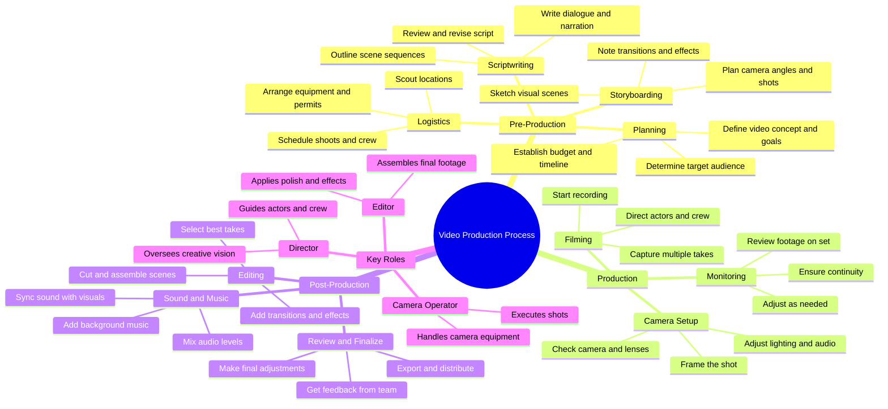

# Spiderman Bus Stunt Behind the Scenes FX

> 🌐 **Read this in:** **English** · [中文](../../zh-CN/2026-08/tiktok-transcript-866k-views-15k-reactions-spiderman-stunt-on-bus-behind-fx-544e.md)

> **Creator:** [@Behind FX](https://www.tiktok.com/@Behind FX) · **Views:** 353.6K · **Posted:** 2026-08-17 · **Niche:** entertainment
>
> **TL;DR:** Starts with urgent, high-energy commands that instantly immerse viewers in a fast-paced filming moment.

[Watch original video →](https://www.facebook.com/share/r/1DdBpVur2D/)

## Why This Went Viral

## Hook (first 3 seconds)
- **Verbatim:** "Camera ready? Bus is moving! Action! Cut! That's the shot!"
- **Hook pattern:** Scene + urgency (rapid-fire command sequence)
- **Why it stops the scroll:** The staccato pacing mimics a behind-the-scenes adrenaline rush. It drops the viewer mid-action with no context, creating an immediate "what's happening?" gap. The words "Action! Cut!" are universally recognized from filmmaking, instantly signaling high-stakes creative work.

## Emotional Rhythm
- **Beats:** Confusion (what's filming?) → Intrigue (bus is moving = dynamic setting) → Tension (Action! = peak focus) → Release (Cut! = completion) → Satisfaction (That's the shot! = victory)
- **Suspense:** The lack of context before "Action!" creates a micro-mystery.
- **Twist:** "Cut!" arrives only 2 seconds in — the entire arc compresses into a single breath.
- **Climax:** "That's the shot!" — the triumphant confirmation that the chaos was controlled and successful.

## Keyword Density
- **Camera** (setup/gear) — algorithmic reach: tags into filmmaking/creator niches
- **Action** (command) — emotional pull: cinematic energy
- **Cut** (command) — emotional pull: completion/resolution
- **Bus** (setting) — algorithmic reach: travel/vlog crossover
- **Shot** (result) — emotional pull: craftsmanship pride
- **Ready/Moving** (state) — emotional pull: momentum and preparedness

## Why It Spreads
- **Micro-narrative completeness:** The 5-word arc (setup → execute → confirm) delivers a full story in under 3 seconds. Viewers don't need to watch longer — they share because it's a perfect loop.
- **Insider-access appeal:** "Camera ready?" implies professional production. It makes the viewer feel like they're on set, satisfying curiosity about how content is made.
- **Universal craft resonance:** "Action/Cut" transcends filmmaking — any creator (cooking, coding, art) recognizes the moment of nailing a take. It's a shared language.
- **High rewatchability:** The rapid-fire delivery makes viewers replay to catch every word, boosting watch-time signals.
- **Relatability through brevity:** It's a "chaos but we got it" moment that every creator has lived. The compressed format makes it meme-able — easily quoted or remixed.

## What You Can Steal
- **Open mid-action, not with context:** Start your video at the peak of execution ("Camera rolling? Go!") — let the viewer piece together the scene. Context is a retention killer.
- **Compress your entire story into one breath:** Aim for a 3-second emotional arc (tension → release → payoff). If your hook can't resolve in 5 words, your video won't loop.
- **Use craft-specific jargon as a filter:** Words like "Action! Cut!" attract your niche audience and repel casual scrollers — but the niche viewers are the ones who share. Pick 2–3 words that only your true fans instantly recognize.

## Mind Map

## Full Transcript (Generated by [free TikTok transcript generator](https://toktranscript.com/?utm_source=github&utm_medium=breakdown&utm_campaign=tool_attribution))

> 📝 Transcripts on this page are auto-generated and show the first 60%. Want to transcribe any TikTok in 30 seconds and get the full version? [Try TokTranscript free →](https://toktranscript.com/?utm_source=github&utm_medium=breakdown&utm_campaign=transcript_cta)

Camera ready? Bus is moving!

*[Read the full transcript on TokTranscript →](https://toktranscript.com/plaza/tiktok-transcript-866k-views-15k-reactions-spiderman-stunt-on-bus-behind-fx-544e?utm_source=github&utm_medium=breakdown&utm_campaign=transcript_full)*

## Browse More

- All [entertainment](../../by-niche/en/entertainment.md) breakdowns
- All [Immediate action call](../../by-pattern/en/hook-immediate-action-call.md) examples

## Video Info

| | |
|---|---|
| Creator | [@Behind FX](https://www.tiktok.com/@Behind FX) |
| Original video | [https://www.facebook.com/share/r/1DdBpVur2D/](https://www.facebook.com/share/r/1DdBpVur2D/) |
| Original title | 866K views · 15K reactions | Spiderman Stunt on bus | Behind FX |
| Views | 353.6K (353609) |
| Posted | 2026-08-17 |
| Duration | 0s |
| Niche | `entertainment` |
| Hook pattern | `Immediate action call` |
| Original language | `en` |
| Available languages | en, zh-CN |
| Generated | 2026-08-18 by [TokTranscript](https://toktranscript.com/) |

---

*This breakdown is for educational analysis under fair use. Original video © [@Behind FX](https://www.tiktok.com/@Behind FX). All transcripts are auto-generated and may contain errors.*

*Want to analyze your own TikToks like this? [the tool we used to generate this →](https://toktranscript.com/viral-breakdown?utm_source=github&utm_medium=breakdown&utm_campaign=footer_cta)*