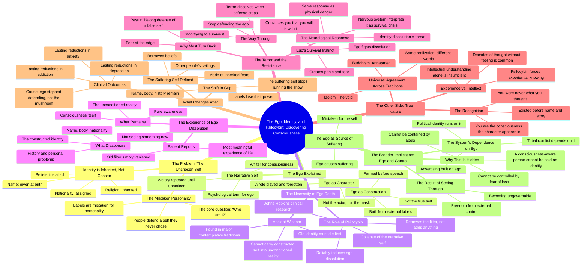

# Ego, Ego-Death and Psilocybin: The Self You’re Protecting...

> 🌐 **Read this in:** **English** · [中文](../../zh-CN/2026-08/tiktok-transcript-94k-views-16k-reactions-ego-ego-death-and-psilocybin-the-sel-cccd.md)

> **Creator:** [@Daily Conspiracy PeterX](https://www.tiktok.com/@Daily Conspiracy PeterX) · **Views:** 202.6K · **Posted:** 2026-08-16 · **Niche:** entertainment
>
> **TL;DR:** The hook challenges the viewer's core identity, creating instant cognitive dissonance that compels them to watch for resolution.

[Watch original video →](https://www.facebook.com/share/v/1F1Va5peGw/)

## Why This Went Viral

## Hook (first 3 seconds)
- **Verbatim opening:** "Most people spend their entire life defending a version of themselves they never chose."
- **Hook pattern:** Bold claim / contrarian statement.
- **Why it stops the scroll:** It attacks a universal assumption (identity) in a single sentence. It implies the viewer is living a lie, which triggers immediate cognitive dissonance. The word "never chose" creates an itch that demands scratching.

## Emotional Rhythm
1. **Curiosity/Discomfort** — "Most people spend their entire life defending a version of themselves they never chose." (Challenges identity)
2. **Rapid-fire destabilization** — "Your name was given to you. Your nationality, assigned. Your religion, inherited. Your beliefs, installed." (Each sentence strips another layer of self)
3. **Provocation** — "And you've been calling that a personality." (Direct accusation)
4. **Intellectual pivot** — "The ego is not you. It's a construction..." (Introduces framework)
5. **Tension build** — "The old identity has to die before a real one can form." (Death metaphor)
6. **Scientific anchor** — "Clinical research at Johns Hopkins found..." (Credibility spike, relief from abstractness)
7. **Fear spike** — "That sounds terrifying. It is, because the ego doesn't want to die." (Emotional peak)
8. **Release/Resolution** — "You are the consciousness the character appears in." (Climactic realization)
9. **Empowerment** — "You become ungovernable." (Final punch, leaves viewer with a sense of power)

**Climax moment:** "You are the consciousness the character appears in." — This is the single line that reframes everything and gives the viewer a new identity to hold.

## Keyword Density
- **Ego** (8+ mentions) — Drives both algorithmic reach (philosophy/psychology niche) and emotional pull (personal relevance)
- **Identity** (6+ mentions) — Core searchable term, ties to self-improvement content
- **Consciousness** (5+ mentions) — High-intent spiritual/psychedelic keyword
- **Filter** (4+ mentions) — Unique metaphor, memorable, repeatable
- **Story** (3+ mentions) — Relatable, humanizes the abstract
- **Die/death/dissolution** (3+ mentions) — Emotional weight, creates urgency
- **Psilocybin** (3+ mentions) — High-search-volume topic, drives discovery algorithm
- **Ungovernable** (1 mention, final) — Power word, memorable, clip-worthy

## Why It Spreads
1. **Universal identity crisis** — "Your name was given to you. Your nationality, assigned." Everyone has a name, nationality, and beliefs. This creates a "this is about ME" moment that forces engagement.
2. **Psilocybin as a credible disruptor** — "Clinical research at Johns Hopkins" adds scientific legitimacy to a taboo topic. This bridges the gap between counterculture and mainstream curiosity, making it shareable across different audiences.
3. **The "you become ungovernable" payoff** — The final line is a mic-drop that viewers want to quote or repost. It gives the audience a sense of secret knowledge and rebellion, which fuels comments and shares.
4. **Socratic dialogue format** — The back-and-forth ("So who am I then?" / "The ego is not you") mimics a conversation. It feels like a personal mentorship session, increasing watch time and completion rate.
5. **Escalating stakes** — The video moves from "your identity is fake" → "your ego will fight to survive" → "the system needs your ego" → "you can become ungovernable." Each step raises the stakes, making it impossible to click away.

## What You Can Steal
1. **Start with an attack on a universal assumption.** Don't open with "Hey guys" — open with a statement that makes the viewer question something they've never questioned. "Most people are wrong about X" is a proven pattern.
2. **Use a Socratic dialogue or Q&A structure.** Instead of a monologue, frame your content as a conversation. It creates natural pauses, builds tension, and makes complex ideas feel accessible. It also increases watch time because each question creates a mini-hook.
3. **End with a transformation + threat to the status quo.** Finish with a line that gives the viewer power and implies they now know something others don't. "Once you see this, you can't unsee it" or "This makes you immune to manipulation" creates a sense of exclusivity that drives shares.

## Mind Map

## Full Transcript (Generated by [TokTranscript.com](https://toktranscript.com/?utm_source=github&utm_medium=breakdown&utm_campaign=tool_attribution))

> 📝 Transcripts on this page are auto-generated and show the first 60%. Want to transcribe any TikTok in 30 seconds and get the full version? [Try TokTranscript free →](https://toktranscript.com/?utm_source=github&utm_medium=breakdown&utm_campaign=transcript_cta)

Most people spend their entire life defending a version of themselves they never chose. What do you mean, never chose? Your name was given to you. Your nationality, assigned. Your religion, inherited. Your beliefs, installed. And you've been calling that a personality. So who am I then? That's the only question worth asking. The ego is not you. It's a construction built from every label the world placed on you before you could speak. So everything I think I am is a story. Told so many times you stopped noticing it was a story. The ego is what psychologists call the narrative self, not consciousness. A filter consciousness looks through. So the ego is like a character? A character you forgot you were playing. For thousands of years, the traditions that understood power understood one thing first. The old identity has to die before a real one can form. You cannot carry a constructed self into an unconditioned reality. And psilocybin does that? Psilocybin doesn't do anything. It removes the filter. Clinical research at Johns Hopkins found that psilocybin reliably induces ego dissolution, a complete collapse of the narrative self. Patients described it as the most meaningful experience of their lives, not because they saw something new, but because their old filter disappeared. What do you actually experience? You stop being a name. You stop being a body. You stop being a nationality, a history, a set of problems. And what remains is awareness itself. That sounds terrifying. It is, because the ego doesn't want to die. It will fight. It will create panic. It will convince you that if it goes, you go with it. So how do you get through that You stop trying to survive it The terror is the ego protecting its own existence The moment you stop defending it it dissolves The nervous system interprets identity dissolution as a threat Same neurological response as physical danger That's why most people turn back at the edge and spend the rest of their lives defending a self that was never real. So what's on the other side when the ego is gone? The recognition that you were never what you thought you were.

*[Read the full transcript on TokTranscript →](https://toktranscript.com/plaza/tiktok-transcript-94k-views-16k-reactions-ego-ego-death-and-psilocybin-the-sel-cccd?utm_source=github&utm_medium=breakdown&utm_campaign=transcript_full)*

## Browse More

- All [entertainment](../../by-niche/en/entertainment.md) breakdowns
- All [Provocative statement + immediate challenge](../../by-pattern/en/hook-provocative-statement-immediate-challenge.md) examples

## Video Info

| | |
|---|---|
| Creator | [@Daily Conspiracy PeterX](https://www.tiktok.com/@Daily Conspiracy PeterX) |
| Original video | [https://www.facebook.com/share/v/1F1Va5peGw/](https://www.facebook.com/share/v/1F1Va5peGw/) |
| Original title | 94K views · 16K reactions | 🍄🧠 Ego, Ego-Death and Psilocybin: The Self You’re Protecting Isn’t You — ❓If the ego is just a story your brain keeps repeating and psilocybin can temporarily silence that story... ... what actually disappears? You… or just the narrator? — 🔁 Share This Post 📲 Follow @conspiracy_peterx — #ego #egodeath #psilocybin #peterai #peteraimethod | Daily Conspiracy PeterX |
| Views | 202.6K (202558) |
| Posted | 2026-08-16 |
| Duration | 0s |
| Niche | `entertainment` |
| Hook pattern | `Provocative statement + immediate challenge` |
| Original language | `en` |
| Available languages | en, zh-CN |
| Generated | 2026-08-17 by [TokTranscript](https://toktranscript.com/) |

---

*This breakdown is for educational analysis under fair use. Original video © [@Daily Conspiracy PeterX](https://www.tiktok.com/@Daily Conspiracy PeterX). All transcripts are auto-generated and may contain errors.*

*Want to analyze your own TikToks like this? [analyze your own TikToks →](https://toktranscript.com/viral-breakdown?utm_source=github&utm_medium=breakdown&utm_campaign=footer_cta)*