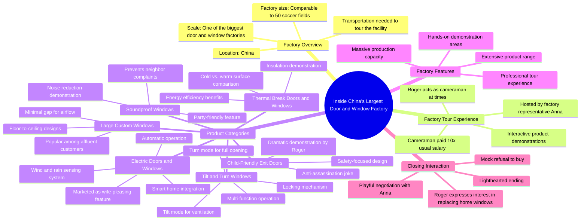

# Rare Window & Door Designs From China’s Biggest Factory

> 🌐 **Read this in:** **English** · [中文](../../zh-CN/2026-08/tiktok-transcript-99-of-people-have-never-seen-these-window-door-designs-take-e7df.md)

> **Creator:** [@rogerwu_georgedeco](https://www.tiktok.com/@rogerwu_georgedeco) · **Views:** 2.5M · **Posted:** 2026-08-05 · **Niche:** other
>
> **TL;DR:** Opens with an extreme scale claim that immediately sets up a grand tour and curiosity.

[Watch original video →](https://www.tiktok.com/@rogerwu_georgedeco/video/7604874884023405846)

## Why This Went Viral

## Hook (first 3 seconds)
- **Verbatim opening line:** "This is one of the biggest doors and window factory in China. You really need some kind of transportation here or you won't be able to walk through entire factory in a day."
- **Hook pattern:** Bold claim + scale-based scene-setting (numbers/scale pattern).
- **Why it stops scroll:** The claim is hyperbolic ("biggest in China") and immediately creates a mental image of absurd scale ("need transportation to walk through"). It primes the viewer for a grand tour, promising something visually massive and rare — a classic "you won't believe this exists" opener.

## Emotional Rhythm
- **Curiosity (0–5s):** The scale claim makes you wonder, "How big could a factory actually be?"
- **Tension/Intrigue (5–15s):** The mention of paying the cameraman 10x salary and doing it himself adds stakes — "This must be important or dangerous."
- **Playful Relief (15–30s):** The "this is not the AI" bit breaks the fourth wall, creating a comedic pause that humanizes the creator and disarms skepticism.
- **Escalating Wonder (30–60s):** The "50 soccer fields" comparison, thermal break demo, and soundproof window demo build a rhythm of "show, then explain" — each demo is a mini-reveal.
- **Comic Twist (60–75s):** "Smart men choose this kind of electric doors and windows because it makes their wives very happy. I don't have any wife." — a self-deprecating joke that lands as a punchline.
- **Climax (75–95s):** The "assassinate me" moment — the creator puts his hands on the electric door, it moves toward him, and he panics. This is the peak: real emotion, fake danger, and the payoff of the earlier "electric" demo.
- **Resolution (95–end):** The fake purchase promise ("I would like to replace all my windows") followed by the reveal ("Just a joke") closes the loop with a final laugh, leaving the viewer satisfied.

## Keyword Density
- **"Factory"** — repeated ~5 times; drives search/algorithmic reach for industrial/B2B content.
- **"Windows and doors"** — repeated ~6 times; core product keyword, boosts discoverability for product-related searches.
- **"Show"** — repeated ~4 times; action-oriented, keeps the narrative moving.
- **"AI"** — repeated ~3 times; triggers engagement (comments about AI-generated content), a viral buzzword.
- **"Joke"** — repeated ~2 times; signals comedic intent, increases shareability.
- **"Wife"** — repeated ~2 times; emotional pull, relatable humor.
- **"Big/biggest"** — repeated ~3 times; reinforces the scale hook, drives curiosity.
- **"Electric"** — repeated ~3 times; highlights the product's novelty, a differentiator.

**Algorithmic reach drivers:** "Factory," "windows and doors," "electric" — these are searchable, niche terms that rank well.
**Emotional pull drivers:** "AI," "joke," "wife" — these generate comments, shares, and saves because they're relatable or controversial.

## Why It Spreads
- **The "Is this AI?" tension:** The creator repeatedly references AI ("This is not the AI," "You wanna show this is not the AI again?"). This directly taps into the current cultural anxiety/fascination with AI-generated content — viewers watch closely to verify, comment, and argue, boosting engagement.
- **The "assassination" scare moment:** The electric door closing on him (even if staged) is a visceral, shareable clip. It's a 3-second loop-worthy moment that people send to friends with "watch this."
- **The self-deprecating humor:** "I don't have any wife" and "Just a joke, you know" make the creator likable and relatable. People share content that makes them feel good, and this humor is the emotional glue.
- **The B2B + entertainment hybrid:** It's a factory tour (niche, educational) wrapped in a comedy sketch (broad, shareable). This dual appeal lets it cross-pollinate between industrial audiences and general viewers.
- **The scale-brag payoff:** The "50 soccer fields" and "biggest in China" claims are verified visually throughout (wide shots, walking, demos), so the video delivers on its hook — viewers trust it and share it as "proof" of something extraordinary.

## What You Can Steal
- **Use the "biggest/scale" hook to open:** Start with a bold, verifiable claim about size, scale, or uniqueness. It instantly frames your video as a "must-see" and gives viewers a reason to stay.
- **Break the fourth wall to build trust:** Reference your own process ("I paid my cameraman 10x," "This is not the AI"). It makes you human, disarms skepticism, and sparks comments — a cheap engagement hack.
- **End with a fake-out promise:** Tease a big commitment ("I'll buy everything") and then reveal it's a joke. This creates a satisfying narrative arc that rewards viewers for watching to the end, increasing completion rate and watch time — the strongest viral signals.

## Mind Map

## Full Transcript (Generated by [TokTranscript](https://toktranscript.com/?utm_source=github&utm_medium=breakdown&utm_campaign=tool_attribution))

> 📝 Transcripts on this page are auto-generated and show the first 60%. Want to transcribe any TikTok in 30 seconds and get the full version? [Try TokTranscript free →](https://toktranscript.com/?utm_source=github&utm_medium=breakdown&utm_campaign=transcript_cta)

This is one of the biggest doors and window factory in China. You really need some kind of transportation here or you won't be able to walk through entire factory in a day. For this video, I paid my cameraman 10 times his usual salary. Sometimes I even have to be the cameraman myself. Hi EDA. Hi Roger. Nice to meet you. Welcome to our factory. Okay, show me your factory. Okay, haha, what are you doing? Just want to show everyone. This is not the air. We air will never do this. Okay, okay. Okay, Roger. Our factory covers an area about the size of 50 soccer fields. Have you ever seen a door and window factory bigger than ours? No. This is the Thermal break doors and windows and you can feel the sense here. This is the cold one actually. It's like you're playing with it now. Yes, I like ice. Yes. And this is the soundproof window. Let's close. Close it. Okay, so you can feel it. So when you're throwing the party at home, you don't have to worry your neighbors gonna complain you. Yes, yes. Rich people always lie their windows to be as big as possible, only leaving a gap for air flowing as you can see here. And this is the tilt and turn window. Let me show you.

*[Read the full transcript on TokTranscript →](https://toktranscript.com/plaza/tiktok-transcript-99-of-people-have-never-seen-these-window-door-designs-take-e7df?utm_source=github&utm_medium=breakdown&utm_campaign=transcript_full)*

## Browse More

- All [other](../../by-niche/en/other.md) breakdowns
- All [Scale shock](../../by-pattern/en/hook-scale-shock.md) examples

## Video Info

| | |
|---|---|
| Creator | [@rogerwu_georgedeco](https://www.tiktok.com/@rogerwu_georgedeco) |
| Original video | [https://www.tiktok.com/@rogerwu_georgedeco/video/7604874884023405846](https://www.tiktok.com/@rogerwu_georgedeco/video/7604874884023405846) |
| Original title | 99% of People Have Never Seen These Window & Door Designs! Take a Loo... |
| Views | 2.5M (2500000) |
| Posted | 2026-08-05 |
| Duration | 0s |
| Niche | `other` |
| Hook pattern | `Scale shock` |
| Original language | `en` |
| Available languages | en, zh-CN |
| Generated | 2026-08-06 by [TokTranscript](https://toktranscript.com/) |

---

*This breakdown is for educational analysis under fair use. Original video © [@rogerwu_georgedeco](https://www.tiktok.com/@rogerwu_georgedeco). All transcripts are auto-generated and may contain errors.*

*Want to analyze your own TikToks like this? [TokTranscript.com →](https://toktranscript.com/viral-breakdown?utm_source=github&utm_medium=breakdown&utm_campaign=footer_cta)*