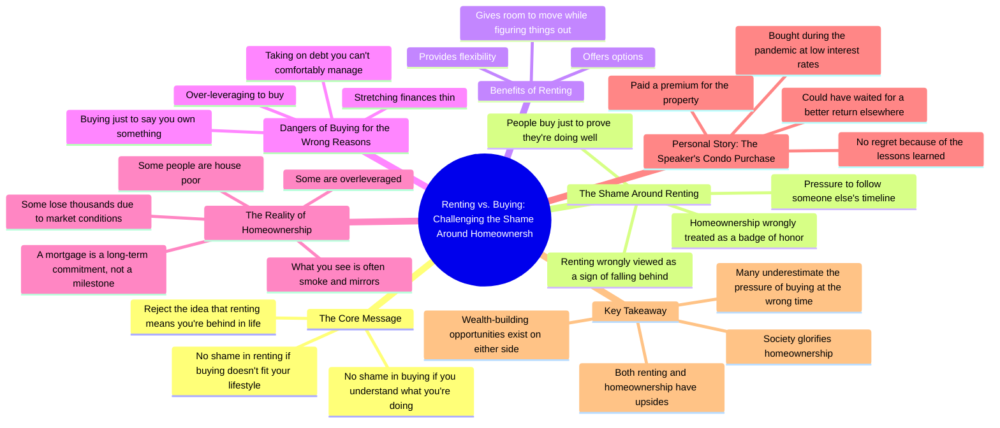

# Renting Isn't a Failure: Why Buying a House Isn't for Eve...

> 🌐 **Read this in:** **English** · [中文](../../zh-CN/2026-08/tiktok-transcript-a-mortgage-is-not-a-milestone-for-most-people-it-s-a-financi-0ecf.md)

> **Creator:** [@taraocansey](https://www.tiktok.com/@taraocansey) · **Views:** 429.0K · **Posted:** 2026-08-01 · **Niche:** finance
>
> **TL;DR:** Directly challenges a common societal pressure, immediately grabbing attention.

[Watch original video →](https://vt.tiktok.com/ZS4hcf62r/)

## Why This Went Viral

## Hook (first 3 seconds)
- **Verbatim opening:** "Stop rushing to buy a house just to say you own something."
- **Hook pattern:** Bold claim + direct command ("Stop...") — a contrarian stance that challenges a deeply held societal norm.
- **Why it stops scroll:** It instantly attacks a sacred cow (homeownership as the ultimate goal) and frames the viewer's potential behavior as foolish. It creates immediate cognitive dissonance — the viewer either agrees strongly (validation) or disagrees strongly (outrage). Both reactions generate a watch-through.

## Emotional Rhythm
1. **Challenge/Provocation** (0–3s): "Stop rushing to buy a house" — directly confronts the viewer's possible life choices.
2. **Validation/Relief** (3–8s): "There's nothing wrong with renting" — releases tension for renters who feel societal pressure.
3. **Empathy/Connection** (8–15s): "Shame around renting... so far from the truth" — names a shared pain point, building trust.
4. **Warning/Tension** (15–25s): "Over leverage, stretch thin, debt they can't manage" — paints a grim picture of the alternative path, creating fear.
5. **Vulnerability/Resonance** (25–35s): Personal story about buying during the pandemic — "I'm not gonna lie, I paid a premium" — creates authenticity and relatability.
6. **Twist/Reframe** (35–40s): "I do not regret my decision" — subverts expectations; the speaker isn't anti-buying, just anti-pressure.
7. **Resolution/Empowerment** (40–50s): "Do not fall into someone else's timeline... both are powerful" — leaves the viewer with agency and a positive takeaway.

**Climax moment:** The personal confession — "I paid a premium for my property" — because it's the first time the creator admits a mistake, shifting from preacher to peer.

## Keyword Density
1. **"Renting"** — repeated 5+ times; the emotional anchor and the contrarian position.
2. **"Buying/homeownership"** — repeated 5+ times; the opposing force creating the tension.
3. **"Nothing wrong"** — repeated 2x; a simple, memorable mantra that drives the core message.
4. **"Pressure/shame"** — repeated 3x; taps into the emotional pain point that fuels engagement.
5. **"Options/flexibility"** — repeated 2x; the positive reframe that gives renters permission to feel good.
6. **"Timeline"** — repeated 2x; the key phrase that drives the final call-to-action ("someone else's timeline").

**Algorithmic reach drivers:** "Renting" and "buying" are high-volume search terms in personal finance — they trigger the topic-matching algorithm. "Shame" and "pressure" are emotionally charged words that boost watch time and shares.

**Emotional pull drivers:** "Nothing wrong" and "timeline" are the phrases viewers screenshot, quote, and repeat in comments — they become the video's shareable soundbite.

## Why It Spreads
- **It picks a side without alienating the other.** The creator explicitly validates both renters and buyers ("there are upsides with both"), so both camps can share it without feeling attacked — doubling the potential share audience.
- **It weaponizes personal vulnerability.** The pandemic condo confession ("I paid a premium") is a rare moment of honesty in a genre full of bragging. This builds trust, making the entire argument more credible and share-worthy.
- **It gives renters a permission slip.** The line "do not fall into someone else's timeline" is a quotable, screenshot-able mantra that renters will send to friends or post in their stories — it's a social currency statement.
- **It reframes a "failure" as a lesson.** By saying "I do not regret my decision because I learned so much," the creator models a healthy mindset, making the video feel like free life coaching — high perceived value drives saves and shares.
- **The structure is a complete argument.** It states a controversial claim → validates both sides → shares personal evidence → delivers a universal takeaway. It doesn't leave loose ends, so viewers feel satisfied and compelled to comment their own stance.

## What You Can Steal
1. **Open with a command that challenges a norm.** Start with "Stop [doing X] just to [achieve Y]" — it's confrontational enough to stop the scroll but broad enough to apply to your niche (fitness, career, relationships).
2. **Insert a personal mistake mid-video.** Don't just preach — admit a specific, slightly embarrassing financial or life error. This vulnerability spike is what converts viewers into followers and commenters.
3. **End with a "both sides are valid" reframe.** Instead of a hard sell, close with "There are upsides with both" — this makes your content feel fair and non-pushy, which increases trust and the likelihood of being shared to people on the fence.

## Mind Map

## Full Transcript (Generated by [analyze your own TikToks](https://toktranscript.com/?utm_source=github&utm_medium=breakdown&utm_campaign=tool_attribution))

> 📝 Transcripts on this page are auto-generated and show the first 60%. Want to transcribe any TikTok in 30 seconds and get the full version? [Try TokTranscript free →](https://toktranscript.com/?utm_source=github&utm_medium=breakdown&utm_campaign=transcript_cta)

Stop rushing to buy a house just to say you own something. Guys, there's nothing wrong with renting if the opportunity to buy does not fit your lifestyle right now. And there's nothing wrong with buying if you actually understand what you're doing. What I don't agree with is the shame around renting. Like if you're renting, you're all of a sudden behind in life. That is so far from the truth. Renting gives you flexibility. It gives you options. It gives you room to move while you're still trying to figure things out. People treat homeownership like it's a badge of honour, like it's something that you're just supposed to collect to prove that all of a sudden you're doing well in life. So they over leverage, they stretch themselves thin, they take on debt they can't comfortably manage just to say they own something. Guys, a mortgage isn't a milestone. It's a long term commitment. A lot of what you see is smoke and mirrors. Some people are house poor, some are over leveraged, and some people have lost thousands of dollars because of market conditions. I'm gonna tell you guys a story. I bought my condo during the pandemic when interest rates were really, really low.

*[Read the full transcript on TokTranscript →](https://toktranscript.com/plaza/tiktok-transcript-a-mortgage-is-not-a-milestone-for-most-people-it-s-a-financi-0ecf?utm_source=github&utm_medium=breakdown&utm_campaign=transcript_full)*

## Browse More

- All [finance](../../by-niche/en/finance.md) breakdowns
- All [Contrarian command](../../by-pattern/en/hook-contrarian-command.md) examples

## Video Info

| | |
|---|---|
| Creator | [@taraocansey](https://www.tiktok.com/@taraocansey) |
| Original video | [https://vt.tiktok.com/ZS4hcf62r/](https://vt.tiktok.com/ZS4hcf62r/) |
| Original title | A mortgage is not a milestone. For most people, it’s a financial burd... |
| Views | 429.0K (429000) |
| Posted | 2026-08-01 |
| Duration | 0s |
| Niche | `finance` |
| Hook pattern | `Contrarian command` |
| Original language | `en` |
| Available languages | en, zh-CN |
| Generated | 2026-08-02 by [TokTranscript](https://toktranscript.com/) |

---

*This breakdown is for educational analysis under fair use. Original video © [@taraocansey](https://www.tiktok.com/@taraocansey). All transcripts are auto-generated and may contain errors.*

*Want to analyze your own TikToks like this? [TokTranscript →](https://toktranscript.com/viral-breakdown?utm_source=github&utm_medium=breakdown&utm_campaign=footer_cta)*