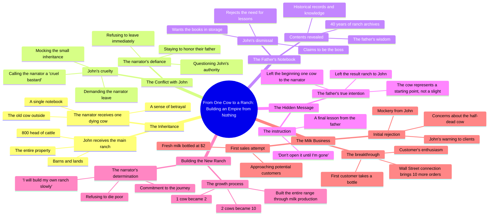

# John's Ranch Inheritance: 800 Cattle and One Old Cow

> 🌐 **Read this in:** **English** · [中文](../../zh-CN/2026-08/tiktok-transcript-aistory-fruits-fruitstory-france-storytime-8d93.md)

> **Creator:** [@unehistoiredefruits](https://www.tiktok.com/@unehistoiredefruits) · **Views:** 1.2M · **Posted:** 2026-08-01 · **Niche:** other
>
> **TL;DR:** The dying father's shocking unequal inheritance immediately creates conflict and curiosity.

[Watch original video →](https://vt.tiktok.com/ZS4kYsrDy/)

## Why This Went Viral

## Hook (first 3 seconds)
- **Verbatim opening line:** "listen carefully I have enough strength to say it only once Johns the house of the truck lands barns and the entire herd of 800 head of cattle Tony all I leave you is the old cow that is outside"
- **Hook pattern:** **Contrast + Inheritance Drama** (800 cattle vs. 1 dying cow)
- **Why it stops scroll:** The father's dying words create instant inequity — one son gets a fortune, the other gets a worthless cow. The viewer's brain immediately asks "Why?" and must watch to resolve the injustice.

## Emotional Rhythm
1. **Grief + Tension** (0–5s): Father's deathbed confession — heavy, somber, stakes set.
2. **Injustice / Rage** (5–15s): John inherits everything; Tony gets one dying cow. Brotherly cruelty ("you've always been a cruel bastard") spikes anger.
3. **Mystery** (15–25s): The notebook — "don't open it until I'm gone" — creates a locked-box curiosity.
4. **Humiliation** (25–40s): John mocks Tony's cow, his milk, his poverty. Emotional low point — viewer feels Tony's shame.
5. **Defiance / Hope** (40–50s): "Then I will build my own ranch slowly" — the pivot. Underdog energy ignites.
6. **Vindication** (50–60s): First customer buys the milk. The twist lands — the "dying cow" was the seed of a fortune.
7. **Climax:** "Call Wall Street brings in 10 more tomorrow" — sudden wealth trajectory. The injustice flips into triumph.

## Keyword Density
- **"cow"** (9×) — drives the core metaphor; algorithmic relevance for rural/ranching audiences.
- **"ranch"** (6×) — anchors the setting and stakes; searchable niche term.
- **"milk"** (4×) — the product pivot; connects to commerce and daily-life relatability.
- **"father/dad"** (5×) — emotional trigger word; family drama resonates universally.
- **"1" / "one"** (6×) — reinforces scarcity vs. abundance contrast; simple, memorable.
- **"build"** (3×) — aspirational keyword; aligns with self-improvement content verticals.
- **"800"** (2×) — concrete number that quantifies the injustice; drives shareability ("can you believe this?").

**Algorithmic drivers:** "cow," "ranch," "milk" — niche-specific, high-intent search terms.
**Emotional pull:** "father," "build," "one" — trigger legacy, ambition, and underdog narratives.

## Why It Spreads
- **Injustice → Vindication arc in 60 seconds:** The father's "cruel" will is revealed as a genius test. Viewers who felt anger at the start feel rewarded at the end — a complete emotional loop that begs to be shared ("you have to see this").
- **"The beginning vs. the result" twist:** The father's note ("I left the result to John, I left you the beginning") reframes the entire story. This single line is the shareable insight — it's a life lesson, not just a story.
- **Relatable sibling rivalry:** "You've always been a cruel bastard" taps into universal family friction. Viewers project their own sibling dynamics onto the narrative.
- **Concrete numbers create stakes:** "800 head of cattle" vs. "1 cow" is instantly graspable. No ambiguity — the unfairness is measurable, making it easy to explain when sharing.
- **Underdog entrepreneurship angle:** Tony's "I will build my own ranch slowly" resonates with the creator/gig-economy audience. It's a bootstrap story disguised as a family drama.

## What You Can Steal
1. **Open with the biggest inequity, not the setup.** Start your video at the moment of maximum unfairness — the audience will stay to see if justice is served. (Steal: "800 cows vs. 1 dying cow" framing.)
2. **Plant a sealed-object mystery early.** The "don't open it until I'm gone" notebook creates a ticking curiosity bomb. Introduce an unopened letter, a locked door, a hidden file — then don't reveal it until the last third.
3. **End with a numbers-based escalation.** "1 cow → 2 cows → 10 cows → Wall Street" is a compounding payoff that feels inevitable and satisfying. Map your story's growth in visible, countable steps — it makes the triumph tangible and shareable.

## Mind Map

## Full Transcript (Generated by [TokTranscript](https://toktranscript.com/?utm_source=github&utm_medium=breakdown&utm_campaign=tool_attribution))

> 📝 Transcripts on this page are auto-generated and show the first 60%. Want to transcribe any TikTok in 30 seconds and get the full version? [Try TokTranscript free →](https://toktranscript.com/?utm_source=github&utm_medium=breakdown&utm_campaign=transcript_cta)

listen carefully I have enough strength to say it only once Johns the house of the truck lands barns and the entire herd of 800 head of cattle Tony all I leave you is the old cow that is outside this thing could die before dad shut up John I have 1 ranch you have dinner you've always been a cruel bastard take this don't open it until I'm gone it's supposed to make me think that giving me only one cow it's just him every page before judging me I hope there is 1 damn good reason what did daddy give you it's none of your business 1 notebook and 1 dying cow will not make you my equal keeps the ranch but don't destroy what dad spent his life building your caravan is behind the old shelter your father is hardly cold the property is mine now go away I'm staying with dad these books contain 40 years of the ranch's archive these 40 years of boring books can go to storage you should learn before you want to change things I'm the boss here I 

*[Read the full transcript on TokTranscript →](https://toktranscript.com/plaza/tiktok-transcript-aistory-fruits-fruitstory-france-storytime-8d93?utm_source=github&utm_medium=breakdown&utm_campaign=transcript_full)*

## Browse More

- All [other](../../by-niche/en/other.md) breakdowns
- All [Mysterious Inheritance](../../by-pattern/en/hook-mysterious-inheritance.md) examples

## Video Info

| | |
|---|---|
| Creator | [@unehistoiredefruits](https://www.tiktok.com/@unehistoiredefruits) |
| Original video | [https://vt.tiktok.com/ZS4kYsrDy/](https://vt.tiktok.com/ZS4kYsrDy/) |
| Original title | #aistory #fruits #fruitstory #france #storytime |
| Views | 1.2M (1200000) |
| Posted | 2026-08-01 |
| Duration | 0s |
| Niche | `other` |
| Hook pattern | `Mysterious Inheritance` |
| Original language | `en` |
| Available languages | en, zh-CN |
| Generated | 2026-08-02 by [TokTranscript](https://toktranscript.com/) |

---

*This breakdown is for educational analysis under fair use. Original video © [@unehistoiredefruits](https://www.tiktok.com/@unehistoiredefruits). All transcripts are auto-generated and may contain errors.*

*Want to analyze your own TikToks like this? [TokTranscript.com →](https://toktranscript.com/viral-breakdown?utm_source=github&utm_medium=breakdown&utm_campaign=footer_cta)*