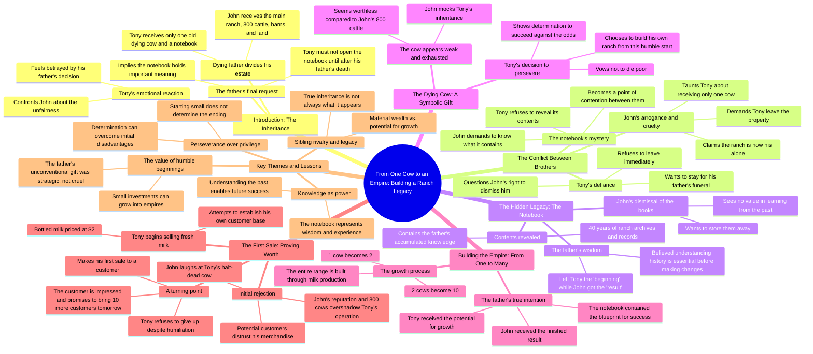

# Old Cow Inheritance: A Father's Final Words

> 🌐 **Read this in:** **English** · [中文](../../zh-CN/2026-08/tiktok-transcript-aistory-fruits-fruitstory-france-storytime-da2f.md)

> **Creator:** [@unehistoiredefruits](https://www.tiktok.com/@unehistoiredefruits) · **Views:** 1.2M · **Posted:** 2026-08-01 · **Niche:** other
>
> **TL;DR:** The father's dying words immediately create a stark contrast between a massive inheritance and a single dying cow, hooking viewers with the unfairness and mystery.

[Watch original video →](https://vt.tiktok.com/ZS4kNy83y/)

## Why This Went Viral

## Hook (first 3 seconds)
- **Verbatim opening line:** "Listen carefully, I have enough strength to say it only once. John's the house, the truck, the lands, barns, and the entire herd of 800 head of cattle. Tony, all I leave you is the old cow that is outside."
- **Hook pattern:** Contrast / Inheritance twist
- **Why it stops the scroll:** The dying father's final words deliver a brutal, unfair split — 800 cattle vs. one dying cow. The asymmetry is instantly gripping; viewers are wired to detect injustice, and the stakes (a ranch, a legacy, a favorite vs. an outcast son) are established in under 5 seconds. The "listen carefully… only once" framing adds a sense of finality and dramatic weight.

## Emotional Rhythm
- **Beat 1 — Shock/Injustice (0–5s):** The unfair inheritance split lands. Viewer feels immediate sympathy for Tony.
- **Beat 2 — Tension/Confrontation (5–15s):** John taunts Tony ("1 notebook and 1 dying cow will not make you my equal"). Sibling rivalry escalates; the villain is clear.
- **Beat 3 — Grief/Resolve (15–25s):** Tony refuses to leave, stays with his father's body, then discovers the notebook — a shift from victimhood to quiet determination.
- **Beat 4 — Curiosity/Discovery (25–35s):** The reveal: "These books contain 40 years of the ranch's archive." Tony realizes the cow is not a slight but a seed.
- **Beat 5 — Hope/Transformation (35–50s):** "1 cow became 2, 2 cows became 10… I left you the beginning." The emotional payoff: the father's true intention is revealed. Viewers feel vindication.
- **Beat 6 — Pride/Defiance (50s–end):** Tony refuses to sell to John's buyer, insists on his own path ("I will not put my clients at risk with your merchandise"). Final twist: "This incredible bottle calls Wall Street, brings in 10 more tomorrow." Underdog wins.
- **Climax:** The father's voiceover — "I left the result to John, I left you the beginning" — is the emotional peak. It reframes the entire conflict and delivers catharsis.

## Keyword Density
- **"Cow"** (8+ mentions) — The central symbol. Drives both search relevance (ranch/cattle niche) and emotional pull (the underdog asset).
- **"Ranch"** (6+ mentions) — Core keyword for the niche audience; anchors the setting and stakes.
- **"Father/Dad"** (5+ mentions) — Emotional trigger; drives relatability and family-drama resonance.
- **"John"** (4+ mentions) — The antagonist; creates clear conflict and villain identification.
- **"Milk"** (3+ mentions) — The product pivot; signals the business/entrepreneurship subplot.
- **"Beginning"** (2 mentions) — Thematic keyword; encapsulates the moral and drives shareability.
- **"800"** (2 mentions) — Specific number that makes the contrast visceral and memorable.

## Why It Spreads
- **Injustice → Vindication arc:** The unfair split (800 vs. 1) hooks viewers; the reveal that the "useless" gift was actually the key to success triggers a satisfying justice payoff. Viewers share it to say, "The underdog wins."
- **The father's wisdom twist:** "I left you the beginning" is a quotable, philosophy-laden line. It's the kind of phrase people screenshot, quote, and repost — a built-in meme.
- **Relatable sibling rivalry:** The John vs. Tony dynamic is universal. Anyone with a sibling, a family business, or a feeling of being underestimated sees themselves in Tony.
- **Concrete, visual transformation:** "1 cow became 2, 2 cows became 10" is a simple, visual progression. It's easy to follow, easy to retell, and easy to imagine — making it highly shareable in text form.
- **The "Wall Street" punchline:** The final twist — a single bottle of milk attracting a major investor — is aspirational and unexpected. It flips the entire story from "sad farm drama" to "entrepreneurial triumph," giving viewers a reason to comment and tag friends.

## What You Can Steal
- **Lead with unfair asymmetry:** Open with a stark, quantifiable contrast (800 vs. 1, $1M vs. $10) to instantly create emotional stakes. Viewers don't need context to feel injustice.
- **Use a delayed reveal to reframe the conflict:** Plant a mystery object (the notebook) early, then let it reframe the entire story at the climax. This creates a "re-watch" incentive and deepens the emotional payoff.
- **End with a concrete, surprising outcome:** Don't just show the underdog winning — show a specific, unexpected result (a Wall Street call, a viral sale, a new contract). Specificity makes the ending feel earned and shareable, and it gives viewers a clear "hook" to tell others about.

## Mind Map

## Full Transcript (Generated by [TokTranscript.com](https://toktranscript.com/?utm_source=github&utm_medium=breakdown&utm_campaign=tool_attribution))

> 📝 Transcripts on this page are auto-generated and show the first 60%. Want to transcribe any TikTok in 30 seconds and get the full version? [Try TokTranscript free →](https://toktranscript.com/?utm_source=github&utm_medium=breakdown&utm_campaign=transcript_cta)

listen carefully I have enough strength to say it only once Johns the house of the truck lands barns and the entire herd of 800 head of cattle Tony all I leave you is the old cow that is outside this thing could die before dad shut up John I have 1 ranch you have dinner you've always been a cruel bastard take this don't open it until I'm gone it's supposed to make me think that giving me only one cow it's just him every page before judging me I hope there is 1 damn good reason what did daddy give you it's none of your business 1 notebook and 1 dying cow will not make you my equal keeps the ranch but don't destroy what dad spent his life building your caravan is behind the old shelter your father is hardly cold the property is mine now go away I'm staying with dad these books contain 40 years of the ranch's archive these 40 years of boring books can go to storage you should learn before you want to change things I'm the boss here I 

*[Read the full transcript on TokTranscript →](https://toktranscript.com/plaza/tiktok-transcript-aistory-fruits-fruitstory-france-storytime-da2f?utm_source=github&utm_medium=breakdown&utm_campaign=transcript_full)*

## Browse More

- All [other](../../by-niche/en/other.md) breakdowns
- All [The Inheritance Twist](../../by-pattern/en/hook-the-inheritance-twist.md) examples

## Video Info

| | |
|---|---|
| Creator | [@unehistoiredefruits](https://www.tiktok.com/@unehistoiredefruits) |
| Original video | [https://vt.tiktok.com/ZS4kNy83y/](https://vt.tiktok.com/ZS4kNy83y/) |
| Original title | #aistory #fruits #fruitstory #france #storytime |
| Views | 1.2M (1200000) |
| Posted | 2026-08-01 |
| Duration | 0s |
| Niche | `other` |
| Hook pattern | `The Inheritance Twist` |
| Original language | `en` |
| Available languages | en, zh-CN |
| Generated | 2026-08-02 by [TokTranscript](https://toktranscript.com/) |

---

*This breakdown is for educational analysis under fair use. Original video © [@unehistoiredefruits](https://www.tiktok.com/@unehistoiredefruits). All transcripts are auto-generated and may contain errors.*

*Want to analyze your own TikToks like this? [the tool we used to generate this →](https://toktranscript.com/viral-breakdown?utm_source=github&utm_medium=breakdown&utm_campaign=footer_cta)*