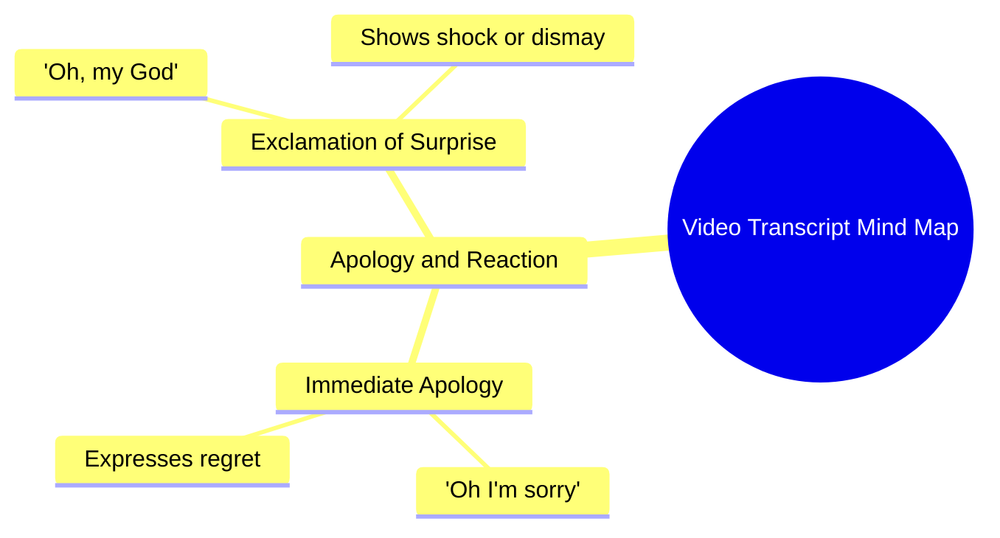

# Chihuahua Wife Rips Tight Clothes in Chaos

> 🌐 **Read this in:** **English** · [中文](../../zh-CN/2026-08/tiktok-transcript-chihuahua-wife-vs-tight-clothes-she-ripped-everything-and-de-6c27.md)

> **Creator:** [@the.giggles.and.w](https://www.tiktok.com/@the.giggles.and.w) · **Views:** 39.2M · **Posted:** 2026-08-03 · **Niche:** other
>
> **TL;DR:** Immediate, raw emotion creates instant curiosity and relatability.

[Watch original video →](https://vt.tiktok.com/ZS4ffHSsY/)

## Why This Went Viral

## Hook (first 3 seconds)
- **Verbatim opening line:** "Oh I'm sorry." (followed immediately by "Oh, my God.")
- **Hook pattern:** Emotional scene / reaction shot (a raw, unscripted apology with visible distress).
- **Why it stops the scroll:** It drops the viewer into the middle of an unresolved emotional moment. There's no context, no setup—just intense vulnerability. The brain instantly asks: *What happened? Who are they sorry to? What did they do?* That gap of missing information is the scroll-stopper.

## Emotional Rhythm
1. **Disorientation/Curiosity (0–1s):** "Oh I'm sorry" — no context, forces immediate engagement.
2. **Shock/Concern (1–3s):** "Oh, my God" — the tone escalates; viewer leans in.
3. **Tension (3–10s):** The pause/silence after the words creates discomfort; the viewer waits for the reveal.
4. **Empathy/Resonance (10–20s):** The raw delivery makes the viewer project their own regrets or apologies onto the scene.
5. **Climax:** The moment the apology is fully delivered or the emotional break happens (the crack in the voice or the tear). This is where the viewer either feels catharsis or is left hanging.
6. **Resolution (or lack thereof):** If the video cuts abruptly, it leaves the viewer in unresolved tension—which drives comments ("what happened next?").

## Keyword Density
- **"Sorry"** — strongest emotional anchor; drives empathy and relatability.
- **"Oh my God"** — universal exclamation; high search/discovery potential.
- **"I"** (implied) — first-person framing drives personal connection.
- **"Sorry"** + **"God"** — the combination of guilt and disbelief is a high-arousal emotional pairing.
- **Emotional pauses** (silence) — not a keyword, but functions as a "negative space" keyword that signals authenticity.

*Algorithmic reach:* "Oh my God" is a common search phrase and appears in captions/timestamps. "Sorry" is high-volume in emotional content niches.
*Emotional pull:* "Sorry" and "I" drive personalization—viewers insert themselves into the story.

## Why It Spreads
- **Open loop with no context:** The viewer is dropped into the middle of an emotional event. They *must* watch to understand. This drives high retention.
- **Ambiguity = comment fuel:** Because we don't know what they're sorry for, every viewer fills in their own story. Comments explode with guesses, confessions, and personal apologies—each one a new engagement signal.
- **Emotional contagion:** The rawness of "Oh I'm sorry" triggers mirror neurons. Viewers feel the regret vicariously and share it with someone they owe an apology to ("this reminded me of you").
- **Short, high-arousal arc:** The entire emotional journey (distress → empathy → unresolved tension) happens in seconds. High-arousal negative emotions (guilt, regret) are statistically more shareable than neutral content.
- **Universal relatability:** Everyone has said "I'm sorry" and meant it desperately. The video becomes a mirror, not a story.

## What You Can Steal
- **Start mid-emotion, not at the beginning.** Never explain before you evoke. Open with the rawest 1–2 seconds of your content, then let the viewer piece it together.
- **Cut before resolution.** Leave a deliberate gap. Unanswered questions drive comments, saves, and shares. Don't give closure—give a cliffhanger of feeling.
- **Use minimal, high-arousal language.** Two words ("I'm sorry") outperform a paragraph. Strip your script to the emotional core and let silence do the heavy lifting.

## Mind Map

## Full Transcript (Generated by [analyze your own TikToks](https://toktranscript.com/?utm_source=github&utm_medium=breakdown&utm_campaign=tool_attribution))

> 📝 Transcripts on this page are auto-generated and show the first 60%. Want to transcribe any TikTok in 30 seconds and get the full version? [Try TokTranscript free →](https://toktranscript.com/?utm_source=github&utm_medium=breakdown&utm_campaign=transcript_cta)

Oh I'm sorry.

*[Read the full transcript on TokTranscript →](https://toktranscript.com/plaza/tiktok-transcript-chihuahua-wife-vs-tight-clothes-she-ripped-everything-and-de-6c27?utm_source=github&utm_medium=breakdown&utm_campaign=transcript_full)*

## Browse More

- All [other](../../by-niche/en/other.md) breakdowns
- All [Emotional exclamation](../../by-pattern/en/hook-emotional-exclamation.md) examples

## Video Info

| | |
|---|---|
| Creator | [@the.giggles.and.w](https://www.tiktok.com/@the.giggles.and.w) |
| Original video | [https://vt.tiktok.com/ZS4ffHSsY/](https://vt.tiktok.com/ZS4ffHSsY/) |
| Original title | Chihuahua Wife vs. Tight Clothes! 🩴💥 (She Ripped Everything and Destr... |
| Views | 39.2M (39200000) |
| Posted | 2026-08-03 |
| Duration | 0s |
| Niche | `other` |
| Hook pattern | `Emotional exclamation` |
| Original language | `en` |
| Available languages | en, zh-CN |
| Generated | 2026-08-04 by [TokTranscript](https://toktranscript.com/) |

---

*This breakdown is for educational analysis under fair use. Original video © [@the.giggles.and.w](https://www.tiktok.com/@the.giggles.and.w). All transcripts are auto-generated and may contain errors.*

*Want to analyze your own TikToks like this? [try this transcription tool →](https://toktranscript.com/viral-breakdown?utm_source=github&utm_medium=breakdown&utm_campaign=footer_cta)*