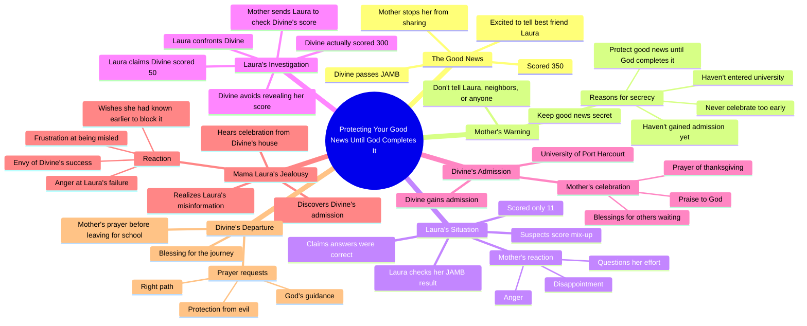

# True Life Story: I Passed My JAMB Exam

> 🌐 **Read this in:** **English** · [中文](../../zh-CN/2026-08/tiktok-transcript-full-story-based-on-true-life-experience-aigenerated-fyp-vir-4d18.md)

> **Creator:** [@omoai7](https://www.tiktok.com/@omoai7) · **Views:** 1.8M · **Posted:** 2026-08-09 · **Niche:** entertainment
>
> **TL;DR:** The immediate shushing creates suspense and curiosity about the hidden good news.

[Watch original video →](https://vm.tiktok.com/ZN8Rfowqq/)

## Why This Went Viral

## Hook (first 3 seconds)
- **Verbatim opening:** "Mama! Mama, I have good news. Shh! Lower your voice. Let's go inside."
- **Hook pattern:** Scene + contrast (excitement vs. secrecy)
- **Why it stops scroll:** The daughter's explosive excitement is immediately suppressed by the mother's whispered urgency. The tension between "good news" and "keep it quiet" creates an instant mystery — viewers need to know why the mother is afraid of celebration.

## Emotional Rhythm
- **Curiosity** — "Mama, I have good news" → "Shh! Lower your voice"
- **Tension** — Mother's refusal to let her daughter share the news with anyone
- **Wisdom/Resonance** — "Never celebrate too early. Protect your good news until God completes it." (This is the thematic core)
- **Contrast/Sympathy** — Laura's 11-score humiliation; the mother's harsh "Always one disappointment after another"
- **Suspense** — Laura's investigation of Divine's score; the deliberate lie about "50"
- **Twist** — Mama Laura's monologue reveals her true envy: "No Celebration should happen in this compound unless it's coming from my family"
- **Climax** — "If only I had known. Now it's too late. Everything is ruined."
- **Resolution/Relief** — Mama Divine's prayer for her daughter's departure; spiritual closure

## Keyword Density
- **"Good news"** — repeated 5+ times; drives the central conflict and emotional pull
- **"Celebrated/Celebration"** — repeated 4+ times; marks the envy-driven antagonist's obsession
- **"Admission"** — repeated 5+ times; the concrete goal that anchors the plot
- **"JAMB"** — repeated 4+ times; culturally specific, boosts niche algorithmic reach in Nigerian viewership
- **"Mama"** — repeated 15+ times; emotional anchor, familial resonance
- **"Protect"** — repeated 2 times; the wisdom theme, drives shareability
- **"Only my family"** — repeated 2 times; villain's mantra, high emotional charge

**Algorithmic drivers:** JAMB, admission, University of Port Harcourt (searchable, location-tagged)
**Emotional pull:** good news, protect, celebrated, Mama (relatable, shareable)

## Why It Spreads
- **Universal fear of envy disguised as a story.** The mother's warning — "Protect your good news until God completes it" — is a widely held cultural belief (especially in African communities). Viewers share it as a lesson, not just entertainment.
- **The villain monologue is uncomfortably real.** Mama Laura's "No Celebration should happen in this compound unless it's coming from my family" is a raw, unvarnished confession of jealousy. It triggers strong reactions — anger, recognition, or self-reflection — which drives comments.
- **The "11 vs 300" score contrast creates instant schadenfreude.** The daughter who lied and schemed gets humiliated; the humble one succeeds. This moral payoff is deeply satisfying and rewatchable.
- **The prayer ending provides spiritual resonance.** The final prayer ("May every parent waiting for good news receive their own testimony") directly addresses the audience, making them feel included in the blessing. This is a proven engagement hook for faith-based audiences.
- **The "if only I had known" twist.** The antagonist's downfall is her own information failure — a poetic justice moment that viewers screenshot and quote in comments.

## What You Can Steal
- **Open with a suppressed emotion.** Start your video at the moment excitement meets restraint ("Shh! Lower your voice"). This creates immediate tension without needing any backstory.
- **Give the villain a solo monologue.** Let the antagonist reveal their true motives aloud. Raw, unhinged self-talk is highly clip-able and comment-baiting.
- **End with a direct audience blessing.** Close with a prayer or well-wish that includes the viewer ("May every parent waiting for good news receive their own testimony"). This transforms passive viewers into participants and boosts shares.

## Mind Map

## Full Transcript (Generated by [TokTranscript](https://toktranscript.com/?utm_source=github&utm_medium=breakdown&utm_campaign=tool_attribution))

> 📝 Transcripts on this page are auto-generated and show the first 60%. Want to transcribe any TikTok in 30 seconds and get the full version? [Try TokTranscript free →](https://toktranscript.com/?utm_source=github&utm_medium=breakdown&utm_campaign=transcript_cta)

Mama! Mama, I have good news. Shh! Lower your voice. Let's go inside. Mama, what's wrong? Is everything okay? Everything is fine. Just follow me. Mama, why did you stop me? I was so excited. I couldn't wait to tell you the good news. I know. So what's the good news? Mama, I passed my JAMB. I scored 3:50. Oh, my daughter, I'm so proud of you. You've made me very happy. Mama, I can't wait to tell Laura. She'll be so happy for me. Listen to me carefully. I don't want you telling this to anyone. Not Laura, not the neighbors, nobody. Do you understand? Mama, Laura is my best friend. Why should I hide something so good from her? Because some things are best kept secret. And this is only the beginning. You passed JMB. You haven't gained admission, and you haven't entered the university. Never celebrate too early. Protect your good news until God completes it. Oh, okay, Mom. Laura, let me see your result. Mama, give it to me. 11. You scored 11, Laura. Mama, I don't understand. I answered the questions. I think they mixed up my score. Enough! Always one disappointment after another. How does someone score 11? What were you doing in that exam hall? I'm sorry, Mama. I'll do better next time. What about divine? Has she checked his? I don't know. I haven't asked. Go find out today. I want to know exactly what she scored. Okay, Mama. Divine. Divine! Hi, Laura, how are you? I'm fine. Have you checked your JMB results yet? Um. Um. Not yet. What about you? Have you checked yours? Yes. Oh really? How is it? Fine. I scored 300. Wow, 300! That's big. Thank you. When are you checking yours? Soon. Okay. Mama! Mama! What is it? My daughter? Mama, I've gained admission. I've been admitted to the university of Port Harcourt. Oh, my father, king of kings, receive all the honour. You have remembered the labour of this child. Thank you. May every parent waiting for good news receive their own testimony. May every child trusting you for open doors be remembered by your mercy. The same god who has done this for us will do it for them. Amen. What is this sound of joy and happiness I'm hearing from Mama Divine's house? What are they celebrating? Laura told me divine scored 50 in JAMB. There's no way she would gain admission with such low score. So what could they possibly be celebrating? No, something isn't right. I must find out.

*[Read the full transcript on TokTranscript →](https://toktranscript.com/plaza/tiktok-transcript-full-story-based-on-true-life-experience-aigenerated-fyp-vir-4d18?utm_source=github&utm_medium=breakdown&utm_campaign=transcript_full)*

## Browse More

- All [entertainment](../../by-niche/en/entertainment.md) breakdowns
- All [Mystery/Secret Hook](../../by-pattern/en/hook-mystery-secret-hook.md) examples

## Video Info

| | |
|---|---|
| Creator | [@omoai7](https://www.tiktok.com/@omoai7) |
| Original video | [https://vm.tiktok.com/ZN8Rfowqq/](https://vm.tiktok.com/ZN8Rfowqq/) |
| Original title | Full story based on true life experience.#aigenerated #fyp #viralvideos  |
| Views | 1.8M (1800000) |
| Posted | 2026-08-09 |
| Duration | 0s |
| Niche | `entertainment` |
| Hook pattern | `Mystery/Secret Hook` |
| Original language | `en` |
| Available languages | en, zh-CN |
| Generated | 2026-08-11 by [TokTranscript](https://toktranscript.com/) |

---

*This breakdown is for educational analysis under fair use. Original video © [@omoai7](https://www.tiktok.com/@omoai7). All transcripts are auto-generated and may contain errors.*

*Want to analyze your own TikToks like this? [free TikTok transcript generator →](https://toktranscript.com/viral-breakdown?utm_source=github&utm_medium=breakdown&utm_campaign=footer_cta)*