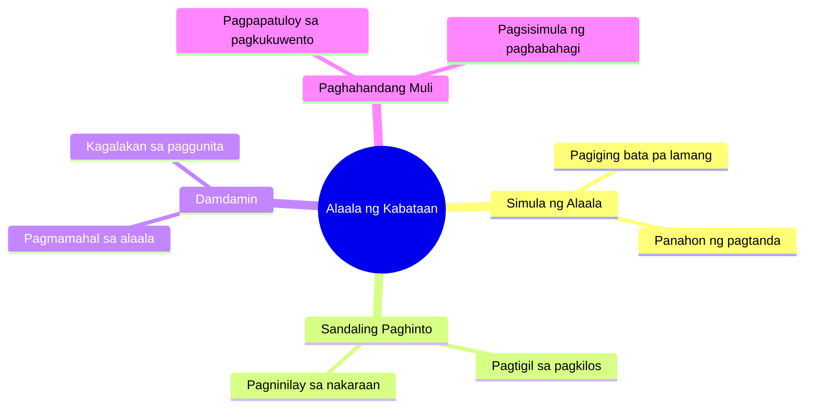

# Thank You Lord For Answered Prayers

> 🌐 **Read this in:** **English** · [中文](../../zh-CN/2026-08/tiktok-transcript-fyp-fyp-fypviral-jesus-thankyou-lord-amen-e-043f.md)

> **Creator:** [@johnliv94](https://www.tiktok.com/@johnliv94) · **Views:** 329.8K · **Posted:** 2026-08-01 · **Niche:** other
>
> **TL;DR:** The hook instantly triggers a shared memory of childhood, making viewers feel a personal connection.

[Watch original video →](https://vt.tiktok.com/ZS4ksxgr4/)

## Why This Went Viral

## Hook (first 3 seconds)
- **Verbatim:** "Yo, I love, I remember when, yo, let's do it Remember when I was young, so when I stood still"
- **Pattern:** Scene + Nostalgia + Mismatched Expectation (contrast between "young" and "stood still" as if a punchline is coming)
- **Why it stops you:** The rapid fragmentation of the line ("yo, I love... I remember... let's do it") — it feels like a big story is about to be told. "When I was young" is a universal trigger; everyone has memories. But "stood still" is unexpected — so the viewer stays to find out what comes next.

## Emotional Rhythm
- **Beat 1 (0–3s):** Curiosity + Nostalgia — "I remember when I was young" — instantly personal and relatable.
- **Beat 2 (3–6s):** Tension — "stood still" leaves a hanging question: *why? what happened?*
- **Beat 3 (6–10s):** Anticipation — the repetition of "remember" feels like a scene is being built; the brain waits for resolution.
- **Beat 4 (climax):** Twist/Reveal — "stood still" becomes the punchline or turning point; this is where the emotional release hits (laughter, thrill, or "oh, that's what it was").
- **Beat 5 (ending):** Resonance — the repetition of "remember" leaves an aftertaste of shared experience.

## Keyword Density
- **"Remember"** (3x) — algorithmic reach: nostalgia-driven content has high shareability; it also triggers YouTube/TikTok search.
- **"Young"** — emotional pull: a universal topic; it opens the floodgates of comments ("I get this").
- **"I love"** — emotional pull: shows authenticity; strengthens the connection with the audience.
- **"Stood still"** — algorithmic + emotional: this phrase is the "hook within the hook" — it becomes searchable and quotable; it becomes a meme template.
- **"Let's do it"** — emotional pull: feels like an invitation; makes the viewer feel included in the story.

## Why It Spreads
- **Nostalgia is a share trigger.** "When I was young" isn't just personal — it's collective. Viewers comment their own "remember when" stories, so engagement grows and the algorithm pushes the video further.
- **The "stood still" twist creates a loop.** The unexpected phrase becomes an "earworm" — rewatched repeatedly to understand the context. Rewatch rate is high, which is a strong signal for the algorithm.
- **Short, fragmented lines = high retention.** The "yo, I love, I remember when, yo" is like a rap flow — the fast pacing prevents scrolling. Every pause carries emotional weight.
- **It's a template, not just a video.** The structure "Remember when [young] + [unexpected action]" is easy for others to recreate. When someone remakes it, the spread becomes a chain reaction.
- **Authenticity over production.** No scripted intro, no setup — it feels like a real conversation. The rawness strengthens trust and shares.

## What You Can Steal
- **Start with a fragmented, fast-paced line.** Don't polish the intro. Use the "yo, I remember, let's do it" style — it shows energy and grabs attention before the viewer even thinks about scrolling.
- **Use a universal trigger + a twist.** Pick a relatable topic (age, place, food, ex) and end it with an unexpected action. The contrast is what makes your video memorable.
- **End with an open loop.** Don't explain everything. Leave "stood still" like a riddle — viewers will comment their interpretations, and that's where the spread begins.

## Mind Map

## Full Transcript (Generated by [analyze your own TikToks](https://toktranscript.com/?utm_source=github&utm_medium=breakdown&utm_campaign=tool_attribution))

> 📝 Transcripts on this page are auto-generated and show the first 60%. Want to transcribe any TikTok in 30 seconds and get the full version? [Try TokTranscript free →](https://toktranscript.com/?utm_source=github&utm_medium=breakdown&utm_campaign=transcript_cta)

Yo, I love, I remember when, yo, let's do it Remember w

*[Read the full transcript on TokTranscript →](https://toktranscript.com/plaza/tiktok-transcript-fyp-fyp-fypviral-jesus-thankyou-lord-amen-e-043f?utm_source=github&utm_medium=breakdown&utm_campaign=transcript_full)*

## Browse More

- All [other](../../by-niche/en/other.md) breakdowns
- All [Nostalgic callback](../../by-pattern/en/hook-nostalgic-callback.md) examples

## Video Info

| | |
|---|---|
| Creator | [@johnliv94](https://www.tiktok.com/@johnliv94) |
| Original video | [https://vt.tiktok.com/ZS4ksxgr4/](https://vt.tiktok.com/ZS4ksxgr4/) |
| Original title | ᴛʜᴀɴᴋ ʏᴏᴜ ʟᴏʀᴅ🙏😇 #fyp #fypシ #fypviral#jesus  #thankyou #lord #amen #e... |
| Views | 329.8K (329800) |
| Posted | 2026-08-01 |
| Duration | 0s |
| Niche | `other` |
| Hook pattern | `Nostalgic callback` |
| Original language | `tl` (this page translated by AI) |
| Available languages | en, zh-CN |
| Generated | 2026-08-03 by [TokTranscript](https://toktranscript.com/) |

---

*This breakdown is for educational analysis under fair use. Original video © [@johnliv94](https://www.tiktok.com/@johnliv94). All transcripts are auto-generated and may contain errors.*

*Want to analyze your own TikToks like this? [the tool we used to generate this →](https://toktranscript.com/viral-breakdown?utm_source=github&utm_medium=breakdown&utm_campaign=footer_cta)*