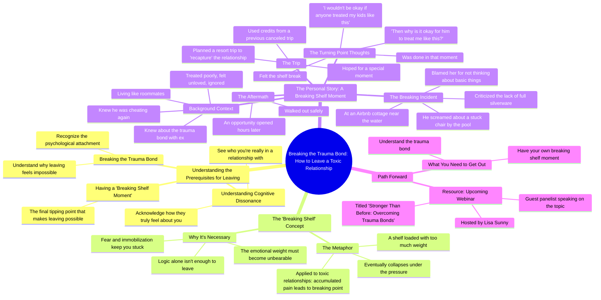

# Why You Can't Leave a Toxic Partner: Break the Trauma Bond

> 🌐 **Read this in:** **English** · [中文](../../zh-CN/2026-08/tiktok-transcript-here-s-why-you-re-struggling-to-leave-a-toxic-partner-you-ha-459b.md)

> **Creator:** [@kerrymcavoyphd](https://www.tiktok.com/@kerrymcavoyphd) · **Views:** 913.9K · **Posted:** 2026-08-02 · **Niche:** entertainment
>
> **TL;DR:** Immediately speaks to the viewer's pain and offers a clear path, creating urgency and relevance.

[Watch original video →](https://www.tiktok.com/@kerrymcavoyphd/video/7322565320030424362?is_from_webapp=1&sender_device=pc)

## Why This Went Viral

## Hook (first 3 seconds)
- **Verbatim opening line:** "You're not gonna leave that toxic relationship until a few things happen…"
- **Hook pattern:** Bold claim + direct address ("you're not gonna leave").
- **Why it stops the scroll:** It issues a challenge to the viewer's current reality, implying they are stuck and the speaker has the missing answer. It creates immediate cognitive dissonance—viewers either relate ("I'm stuck") or are intrigued by the certainty of the claim.

## Emotional Rhythm
- **Beat 1 — Curiosity/Tension:** The bold claim sets up a problem (can't leave) and promises a solution (a few things must happen).
- **Beat 2 — Identification/Validation:** The speaker names the internal chaos ("mixed messages," "terrified," "immobilized")—this is a mirror for the target audience.
- **Beat 3 — Metaphor/Clarity:** The "shelf breaking" analogy provides a visual, tangible explanation for an abstract emotional state, creating an "aha" moment.
- **Beat 4 — Story/Relatability (Rising tension):** The resort trip narrative builds mundane but painful details (roommates, ignored, sick), making the situation feel real and suffocating.
- **Beat 5 — Twist/Climax:** The absurd trigger (a stuck chair, missing silverware) becomes the breaking point. The pivotal line: *"I wouldn't be okay if anyone treated one of my kids like this… then why is it okay for him to treat me like this?"* — this is the emotional peak and the moment of self-realization.
- **Beat 6 — Resolution/Relief:** "I felt the shelf break. I was done." Followed by a safe exit and a soft CTA (webinar).

## Keyword Density
- **Toxic relationship** (algorithmic: high-search, high-empathy topic)
- **Trauma bond** (algorithmic + emotional: niche psychological term that signals expertise)
- **Breaking shelf moment** (emotional: coined phrase, memorable, creates a new mental model)
- **Leave / leaving** (emotional: core desire of the audience)
- **Treated me / treating me** (emotional: centers on injustice and self-worth)
- **Confused / confusing** (emotional: validates the audience's mental fog)
- **Shelf** (emotional: anchor metaphor, repeated for reinforcement)

## Why It Spreads
1. **The "Name It to Tame It" Effect:** The speaker gives a new vocabulary ("breaking shelf moment") to a widely felt but poorly understood experience. People share content that helps them articulate their own pain.
2. **The "I'm Not Crazy" Validation:** Lines like "I couldn't even tell you why I couldn't leave" and "confusing the hell out of me" validate the audience's shame and confusion, making them feel seen and prompting shares to friends who "need to hear this."
3. **The Specific, Absurd Anecdote:** The stuck chair + missing silverware story is so mundane yet so infuriating that it becomes highly shareable. It proves the point better than any abstract advice—people will share it as "this is what emotional abuse looks like."
4. **The Parental Reframe:** The line "I wouldn't be okay if anyone treated one of my kids like this" is a universal, visceral standard that instantly recontextualizes self-worth. This is the "aha" moment viewers will quote and repost.
5. **Clear, Actionable Structure:** The video isn't just a rant; it's a 3-step formula (trauma bond → understand → shelf break). This makes it feel like a mini-lesson, increasing perceived value and saving/forwarding behavior.

## What You Can Steal
1. **Invent a sticky metaphor:** Create a "branded" concept for a common problem (like "breaking shelf moment"). It makes your advice memorable and gives viewers a phrase to use and share.
2. **Use the "self-standards" pivot:** In your story, include a moment where you apply a standard to yourself that you would naturally give to a loved one (child, friend, parent). This is a powerful rhetorical device that triggers self-reflection in the viewer.
3. **Structure as a mini-course:** Open with a bold claim ("You won't X until Y happens"), list the steps, then illustrate with one vivid, specific story. This "formula + proof" structure builds authority and keeps retention high.

## Mind Map

## Full Transcript (Generated by [free TikTok transcript generator](https://toktranscript.com/?utm_source=github&utm_medium=breakdown&utm_campaign=tool_attribution))

> 📝 Transcripts on this page are auto-generated and show the first 60%. Want to transcribe any TikTok in 30 seconds and get the full version? [Try TokTranscript free →](https://toktranscript.com/?utm_source=github&utm_medium=breakdown&utm_campaign=transcript_cta)

you're not gonna leave that toxic relationship until a few things happen one you have to break the trauma bond two you have to understand what actually has happened who you're really in a relationship with and how they truly feel about you in other words understand the cognitive dissonance but you also need to have what's called breaking shelf moment here's my breaking shelf moment I knew I had a trauma bond with my ex I knew that he was giving me mixed messages that were confusing the hell out of me but I still couldn't leave and I couldn't even tell you why I couldn't leave I just knew that leaving felt not possible I was terrified I felt immobilized you know how you have a shelf in your house and you keep loading it up and you put more and more on the shelf and finally you put too much and that moment you put too much whatever it is the shelf comes down that's what has to happen in order for us to leave these toxic relationships we need to have a moment when too much gets loaded on that shelf it breaks and when we're ready to leave here's my moment I knew he was back to cheating he's treating me awful I was feeling really confused about everything I wasn't feeling loved he was ignoring me basically where we're practically living like roommates so we take a trip a resort to use up some credit that we had from another trip that we didn't take and I wanted to be like this extra special moment like a recapture moment for us why I thought that would work I I don't know we're on this trip and he's treating me horribly worse than ever and we are ending the trip with a couple days stay at an Airbnb in order to coordinate the end of our resort trip and the getting a flight cause we're on an island that doesn't have flights every day I know complicated so we're at this really cool cottage near the water and we're at

*[Read the full transcript on TokTranscript →](https://toktranscript.com/plaza/tiktok-transcript-here-s-why-you-re-struggling-to-leave-a-toxic-partner-you-ha-459b?utm_source=github&utm_medium=breakdown&utm_campaign=transcript_full)*

## Browse More

- All [entertainment](../../by-niche/en/entertainment.md) breakdowns
- All [Direct address with a promise of a solution](../../by-pattern/en/hook-direct-address-with-a-promise-of-a-solution.md) examples

## Video Info

| | |
|---|---|
| Creator | [@kerrymcavoyphd](https://www.tiktok.com/@kerrymcavoyphd) |
| Original video | [https://www.tiktok.com/@kerrymcavoyphd/video/7322565320030424362?is_from_webapp=1&sender_device=pc](https://www.tiktok.com/@kerrymcavoyphd/video/7322565320030424362?is_from_webapp=1&sender_device=pc) |
| Original title | Here’s why you’re struggling to leave a toxic partner. You haven’t ha... |
| Views | 913.9K (913900) |
| Posted | 2026-08-02 |
| Duration | 0s |
| Niche | `entertainment` |
| Hook pattern | `Direct address with a promise of a solution` |
| Original language | `en` |
| Available languages | en, zh-CN |
| Generated | 2026-08-03 by [TokTranscript](https://toktranscript.com/) |

---

*This breakdown is for educational analysis under fair use. Original video © [@kerrymcavoyphd](https://www.tiktok.com/@kerrymcavoyphd). All transcripts are auto-generated and may contain errors.*

*Want to analyze your own TikToks like this? [TokTranscript.com →](https://toktranscript.com/viral-breakdown?utm_source=github&utm_medium=breakdown&utm_campaign=footer_cta)*