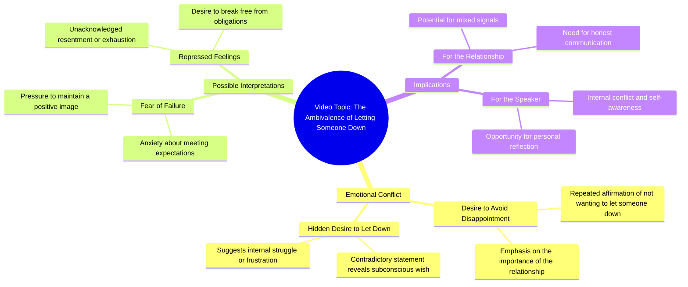

# Honda Civic Sport Drive-By

> 🌐 **Read this in:** **English** · [中文](../../zh-CN/2026-08/tiktok-transcript-hondacivic-sport-fyp-trending-a72a.md)

> **Creator:** [@mondragonbriiii](https://www.tiktok.com/@mondragonbriiii) · **Views:** 728.8K · **Posted:** 2026-08-08 · **Niche:** entertainment
>
> **TL;DR:** The repeated phrase creates a rhythmic emotional plea that instantly grabs attention.

[Watch original video →](https://www.tiktok.com/t/ZTA7CHjXm/)

## Why This Went Viral

## Hook (first 3 seconds)
- **Verbatim opening line:** "I don't wanna let you down, I don't wanna let you down, I wanna let you down."
- **Hook pattern:** **Contrast / Twist** — the repetition of "don't wanna" sets an expectation of reassurance, then the final "I wanna" flips it into defiance or dark humor.
- **Why it stops scroll:** The brain auto-completes the familiar lyric pattern, but the unexpected word swap ("wanna" instead of "don't wanna") creates a micro-surprise that forces re-reading. It's a cognitive itch that demands resolution.

## Emotional Rhythm
- **Beat 1 — Familiarity (0–1s):** The repeated "don't wanna" triggers a known pop-song cadence, creating comfort.
- **Beat 2 — Tension (1–2s):** The second repetition builds anticipation — the viewer expects the third line to complete the pattern.
- **Beat 3 — Twist/Release (2–3s):** "I wanna let you down" breaks the pattern, landing as either a joke, a confession, or a meme-able absurdity.
- **Climax:** The final word "down" — the actual flip — is the punchline. Everything before it is setup.
- **Afterglow:** The viewer's brain re-processes the line, generating a "wait, what?" moment that drives comments and shares.

## Keyword Density
- **"let you down"** — appears 3x, the core phrase; drives algorithmic keyword matching for the song "Never Gonna Give You Up" (Rick Astley) and related meme content.
- **"don't wanna"** — appears 2x, establishes the pattern; high emotional pull because it signals vulnerability.
- **"wanna"** — appears 1x, the twist word; low repetition but highest emotional weight — it's the disruptor.
- **"I"** — appears 3x, personalizes the statement, driving relatability and first-person engagement.
- **"down"** — appears 3x, anchors the rhyme and the emotional descent; algorithmic reach via audio-match.

## Why It Spreads
- **Pattern interruption:** The transcript is a perfect loop of expectation vs. violation. Viewers share it because the twist is *just* unexpected enough to feel clever, but not confusing — it's a "gotcha" that's instantly understandable.
- **Meme-ready ambiguity:** The line works as a breakup confession, a self-deprecating joke, or a troll. This ambiguity invites remixes, duets, and captions, multiplying its reach.
- **Audio-visual sync potential:** The rhythm of the words is inherently musical — creators can sync it to a beat drop, a face reveal, or a dramatic pause, making it a template for other videos.
- **Low barrier to participation:** The transcript is only 3 seconds long, so anyone can recreate it with their own face or context. It's a "fill-in-the-blank" format that fuels user-generated content.
- **Emotional whiplash:** The shift from "don't wanna" (caring) to "wanna" (selfish) creates a micro-narrative of betrayal — a universal feeling that makes viewers tag friends or comment "this is me."

## What You Can Steal
1. **Use the "almost-repeat" hook:** Start with a familiar pattern (a lyric, a common phrase, a cliché), then flip the last word or phrase. The brain's prediction error is the hook.
2. **Keep it under 3 seconds for the setup:** The entire twist must land before the viewer's thumb moves. Strip out any preamble — the first word should already be mid-pattern.
3. **Design for remixability:** Make the core line so short and rhythmic that other creators can easily overlay it on their own visuals. If your transcript can be sung, spoken, or captioned over anything, it's shareable.

## Mind Map

## Full Transcript (Generated by [TokTranscript](https://toktranscript.com/?utm_source=github&utm_medium=breakdown&utm_campaign=tool_attribution))

> 📝 Transcripts on this page are auto-generated and show the first 60%. Want to transcribe any TikTok in 30 seconds and get the full version? [Try TokTranscript free →](https://toktranscript.com/?utm_source=github&utm_medium=breakdown&utm_campaign=transcript_cta)

I don't wanna let you down, I don't wanna let

*[Read the full transcript on TokTranscript →](https://toktranscript.com/plaza/tiktok-transcript-hondacivic-sport-fyp-trending-a72a?utm_source=github&utm_medium=breakdown&utm_campaign=transcript_full)*

## Browse More

- All [entertainment](../../by-niche/en/entertainment.md) breakdowns
- All [Repetition with emotional tension](../../by-pattern/en/hook-repetition-with-emotional-tension.md) examples

## Video Info

| | |
|---|---|
| Creator | [@mondragonbriiii](https://www.tiktok.com/@mondragonbriiii) |
| Original video | [https://www.tiktok.com/t/ZTA7CHjXm/](https://www.tiktok.com/t/ZTA7CHjXm/) |
| Original title | #hondacivic #sport #fyp #trending  |
| Views | 728.8K (728800) |
| Posted | 2026-08-08 |
| Duration | 0s |
| Niche | `entertainment` |
| Hook pattern | `Repetition with emotional tension` |
| Original language | `en` |
| Available languages | en, zh-CN |
| Generated | 2026-08-09 by [TokTranscript](https://toktranscript.com/) |

---

*This breakdown is for educational analysis under fair use. Original video © [@mondragonbriiii](https://www.tiktok.com/@mondragonbriiii). All transcripts are auto-generated and may contain errors.*

*Want to analyze your own TikToks like this? [free TikTok transcript generator →](https://toktranscript.com/viral-breakdown?utm_source=github&utm_medium=breakdown&utm_campaign=footer_cta)*