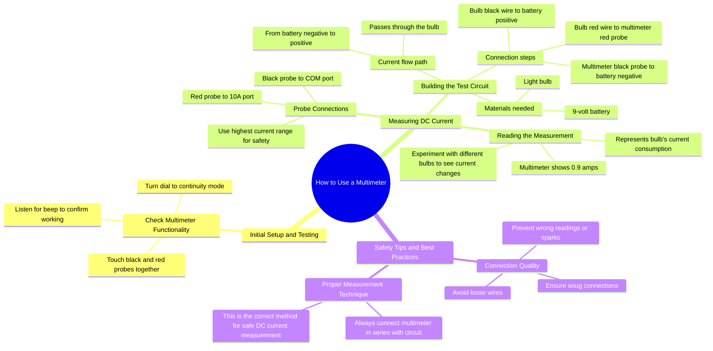

# How to Use a Multimeter: Check Continuity and Measure DC...

> 🌐 **Read this in:** **English** · [中文](../../zh-CN/2026-08/tiktok-transcript-how-to-use-a-multimeter-tik-knowledge-science-multimeter-aab0.md)

> **Creator:** [@knowledgesnap0](https://www.tiktok.com/@knowledgesnap0) · **Views:** 1.2M · **Posted:** 2026-08-07 · **Niche:** tech
>
> **TL;DR:** The hook immediately engages the viewer with a common question and promises a learning experience.

[Watch original video →](https://vt.tiktok.com/ZS4X9EaX2/)

## Why This Went Viral

## Hook (first 3 seconds)
- **Verbatim opening:** "Do you know how to use a multimeter? Let's learn."
- **Hook pattern:** Question + direct invitation (a "curiosity gap" with a promise of competence).
- **Why it stops scroll:** It targets a massive latent pain point — most people own or see a multimeter but feel intimidated. The question triggers a "No, but I should" self-identification, and "Let's learn" removes the barrier of shame, making it feel like a low-stakes, friendly tutorial.

## Emotional Rhythm
- **Curiosity (0–3s):** The question opens a gap — "Do I actually know this?"
- **Reassurance (3–10s):** The continuity test is simple and satisfying (the beep = instant reward). Viewer feels "I can do this."
- **Tension (10–20s):** "Always use the highest current range to be safe" introduces a hint of danger (electricity, damage) — raises stakes.
- **Clarity (20–35s):** Step-by-step wiring is methodical; the visual of the 0.9 amp reading provides a concrete "aha" moment.
- **Twist/Pro-tip (35–42s):** "Loose wires can give wrong readings or sparks" — a small spike of caution that feels like insider knowledge.
- **Climax (42–48s):** The final rule — "always connect in series" — lands as the key takeaway, neatly closing the loop with a sense of mastery.
- **Resolution:** The viewer feels they've learned a genuine skill in under a minute.

## Keyword Density
1. **Multimeter** — repeated 5x; core search term, drives algorithmic discovery.
2. **Probe** — repeated 4x; technical but concrete, aids visual search.
3. **Current** — repeated 4x; physics keyword, signals educational value.
4. **Measure / measuring** — implied and repeated; action verb, boosts "how-to" SEO.
5. **Battery** — repeated 3x; familiar object, lowers intimidation.
6. **Bulb** — repeated 3x; visual anchor, makes the concept tangible.
7. **Safe / safely** — repeated 2x; triggers emotional pull (fear reduction).
8. **Series** — repeated 1x but is the "secret" keyword; creates a memory hook.

- **Algorithmic reach:** "multimeter," "current," "measure" — high-volume search terms that categorize the video as educational.
- **Emotional pull:** "safe," "sparks," "wrong readings" — build trust and urgency.

## Why It Spreads
1. **Universal skill gap:** The opening question is a Trojan horse — it works for both beginners (who learn) and hobbyists (who verify their knowledge). The transcript's "Do you know…?" is a low-friction entry point for anyone who's ever seen a multimeter.
2. **Micro-reward loop:** The continuity beep at 5 seconds is an instant dopamine hit. The transcript sets up a "test → success" pattern that primes the brain for the rest of the tutorial.
3. **Safety as a hook:** "Always use the highest current range to be safe" and "sparks" add a whisper of danger. This raises emotional stakes without being scary — viewers share it as a "life-safety tip," not just a DIY hack.
4. **Concrete visual proof:** The 0.9 amp reading on the multimeter is a tangible result. It's the kind of "watch it work" moment that makes viewers feel they've achieved something, prompting them to comment "that was easy" or tag a friend who needs it.
5. **Memorable final rule:** "Always connect in series" is a simple, repeatable takeaway. It's the kind of phrase viewers quote in comments or save for later, driving engagement signals.

## What You Can Steal
1. **Open with a question that exposes ignorance without shame:** "Do you know how to…?" works because it implies most people don't, but the follow-up "Let's learn" makes it a shared journey, not a lecture.
2. **Build a micro-reward in the first 10 seconds:** Give the viewer a quick win (the beep test) before the real lesson. This creates a "I'm succeeding" feeling that keeps them watching.
3. **End with a single, repeatable rule:** Distill your entire tutorial into one sentence ("Always connect in series"). This gives viewers a takeaway they can repeat, comment, or save — which fuels algorithmic engagement.

## Mind Map

## Full Transcript (Generated by [TokTranscript](https://toktranscript.com/?utm_source=github&utm_medium=breakdown&utm_campaign=tool_attribution))

> 📝 Transcripts on this page are auto-generated and show the first 60%. Want to transcribe any TikTok in 30 seconds and get the full version? [Try TokTranscript free →](https://toktranscript.com/?utm_source=github&utm_medium=breakdown&utm_campaign=transcript_cta)

Do you know how to use a multimeter? Let's learn. First, check if your multimeter works. Turn the dial to continuity mode. Touch the black and red probes together. If it beeps, it's working perfectly. Now let's measure d C current. Connect the black probe to the C O m port and the red probe to the 10 a port. Always use the highest current range to be safe and avoid damaging the meter. Take a 9 volt battery and a light bulb. Connect the bulbs black wire to the batteries positive. The multimeter's black probe to the batteries negative. And the bulbs red wire to the multimeter's red probe.

*[Read the full transcript on TokTranscript →](https://toktranscript.com/plaza/tiktok-transcript-how-to-use-a-multimeter-tik-knowledge-science-multimeter-aab0?utm_source=github&utm_medium=breakdown&utm_campaign=transcript_full)*

## Browse More

- All [tech](../../by-niche/en/tech.md) breakdowns
- All [Direct question + invitation](../../by-pattern/en/hook-direct-question-invitation.md) examples

## Video Info

| | |
|---|---|
| Creator | [@knowledgesnap0](https://www.tiktok.com/@knowledgesnap0) |
| Original video | [https://vt.tiktok.com/ZS4X9EaX2/](https://vt.tiktok.com/ZS4X9EaX2/) |
| Original title | How to use a multimeter!#tik #knowledge #science #multimeter  |
| Views | 1.2M (1200000) |
| Posted | 2026-08-07 |
| Duration | 0s |
| Niche | `tech` |
| Hook pattern | `Direct question + invitation` |
| Original language | `en` |
| Available languages | en, zh-CN |
| Generated | 2026-08-08 by [TokTranscript](https://toktranscript.com/) |

---

*This breakdown is for educational analysis under fair use. Original video © [@knowledgesnap0](https://www.tiktok.com/@knowledgesnap0). All transcripts are auto-generated and may contain errors.*

*Want to analyze your own TikToks like this? [free TikTok transcript generator →](https://toktranscript.com/viral-breakdown?utm_source=github&utm_medium=breakdown&utm_campaign=footer_cta)*