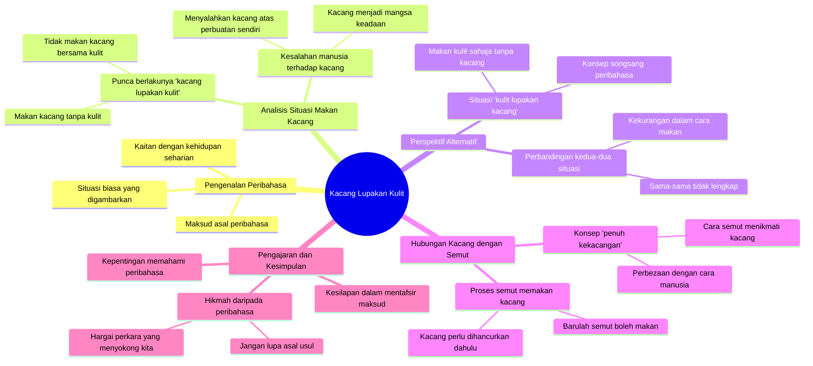

# Forget the Peanut Shells Blame Game

> 🌐 **Read this in:** **English** · [中文](../../zh-CN/2026-08/tiktok-transcript-kacang-lupakan-kulit-panglipurlara-hezrie-blissful-kacang-750f.md)

> **Creator:** [@tiktokhezrie](https://www.tiktok.com/@tiktokhezrie) · **Views:** 364.1K · **Posted:** 2026-08-10 · **Niche:** other
>
> **TL;DR:** Takes a well-known Malay idiom and immediately challenges it with a literal twist, creating curiosity.

[Watch original video →](https://vt.tiktok.com/ZS4na5sVu/)

## Why This Went Viral

## Hook (first 3 seconds)
- Verbatim opening line: *"The peanut forgets its shell happens because you only eat the peanut."*
- Hook pattern type: **Contrast / proverb subversion** — a highly recognizable phrase ("the peanut forgets its shell") is logically flipped.
- Why it makes viewers stop scrolling: This Malay proverb is synonymous with the meaning "forgetting one's roots," but the speaker attacks its literal meaning seriously. Viewers are surprised and wonder — "What does he mean?" — and immediately keep watching.

## Emotional Rhythm
- **Confusion / curiosity** → *"Try eating it once with the shell. Then it won't be a peanut forgetting its shell."* — viewers start to sense there's a logical game at play.
- **Comedic tension** → *"The person eating is the one who forgot to eat it with the shell. Then goes and blames the peanut."* — twist: the one at fault is the human, not the peanut.
- **Absurdity escalation** → *"Or try eating the shell, don't eat the peanut. There's no reason for that anymore. Then it becomes the shell forgetting the peanut."* — the logic is twisted to a nonsensical level.
- **Punchline / climax** → *"An ant eats the peanut... Now THAT ant can eat the peanut With full peanut-ness."* — climax on the wordplay "peanut-ness" that closes the loop with humor.
- **Resonance** → Viewers who understand the original proverb feel "hit" — this video plays with culture but doesn't disrespect it.

## Keyword Density
- **"Peanut"** (≈ 10 times) — main keyword; drives the algorithm toward food/proverb topics, and becomes the recurring punchline.
- **"Shell"** (≈ 6 times) — contrasting pair with "peanut"; creates an easy-to-remember dichotomy.
- **"Forget"** (≈ 5 times) — emotional word; touches on themes of betrayal/forgetting one's roots, psychological appeal.
- **"Eat"** (≈ 5 times) — literal action; makes abstract concepts physical and funny.
- **"Ant"** (≈ 3 times) — surprise element; introduces a new character at the end for the twist.
- **"Peanut-ness"** — invented word; functions as an "earworm" — viewers will repeat it.

## Why It Goes Viral
- **Proverb subversion** — *"The peanut forgets its shell"* is a proverb everyone knows. This video attacks its literal meaning, producing a strong "pattern interrupt."
- **Tight comedic loop** — Each sentence builds a new, more absurd logic, from humans blaming the peanut → the shell forgetting the peanut → an ant eating the peanut. Viewers stay to see "how far he'll go."
- **Shareable wordplay** — The phrase *"With full peanut-ness"* is a punchline easily spread as a short clip or caption. It's "quote-worthy."
- **Serious delivery style with nonsensical content** — The contrast between the serious tone and absurd content creates deadpan humor perfectly suited for platforms like TikTok/Reels.
- **Compact duration with no pauses** — The transcript has no introduction, no "hey guys" — it goes straight into the hook and stays fast until the end. This maximizes retention rate.

## What You Can Steal
- **Pick a famous proverb/expression and attack its literal meaning** — Find a phrase everyone knows, then logically "what if" it. Example: "Better a child die than custom perish" — what happens if child and custom swap places?
- **Use the "absurdity escalation" structure** — Start with reasonable logic, then twist each sentence further. Viewers will stay to see the peak of madness.
- **Close with an "invented word" that rhymes with the keyword** — *"Peanut-ness"* works as a unique, memorable punchline. Create one new word that wraps up the entire video in a single phrase.

## Mind Map

## Full Transcript (Generated by [try this transcription tool](https://toktranscript.com/?utm_source=github&utm_medium=breakdown&utm_campaign=tool_attribution))

> 📝 Transcripts on this page are auto-generated and show the first 60%. Want to transcribe any TikTok in 30 seconds and get the full version? [Try TokTranscript free →](https://toktranscript.com/?utm_source=github&utm_medium=breakdown&utm_campaign=transcript_cta)

Kacang lupakan kulit berlaku sebab makan kacang saja. Cuba makan sekali dengan kulit. Tak jadi kacang lupa kulit. Orang yang makan tu yang lupa nak makan sekali dengan kulit. Lepas tu pergi salah ke kacang. Kacang-kacang je pergi salah ke kacang. Ataupun cuba makan kulit, kacang jangan makan. Tak ada sebab lagi tu. Maka akan jadi kulit lupakan 

*[Read the full transcript on TokTranscript →](https://toktranscript.com/plaza/tiktok-transcript-kacang-lupakan-kulit-panglipurlara-hezrie-blissful-kacang-750f?utm_source=github&utm_medium=breakdown&utm_campaign=transcript_full)*

## Browse More

- All [other](../../by-niche/en/other.md) breakdowns
- All [Reframe the familiar proverb](../../by-pattern/en/hook-reframe-the-familiar-proverb.md) examples

## Video Info

| | |
|---|---|
| Creator | [@tiktokhezrie](https://www.tiktok.com/@tiktokhezrie) |
| Original video | [https://vt.tiktok.com/ZS4na5sVu/](https://vt.tiktok.com/ZS4na5sVu/) |
| Original title | Kacang lupakan kulit #panglipurlara #hezrie #blissful #kacang |
| Views | 364.1K (364100) |
| Posted | 2026-08-10 |
| Duration | 0s |
| Niche | `other` |
| Hook pattern | `Reframe the familiar proverb` |
| Original language | `ms` (this page translated by AI) |
| Available languages | en, zh-CN |
| Generated | 2026-08-12 by [TokTranscript](https://toktranscript.com/) |

---

*This breakdown is for educational analysis under fair use. Original video © [@tiktokhezrie](https://www.tiktok.com/@tiktokhezrie). All transcripts are auto-generated and may contain errors.*

*Want to analyze your own TikToks like this? [the tool we used to generate this →](https://toktranscript.com/viral-breakdown?utm_source=github&utm_medium=breakdown&utm_campaign=footer_cta)*