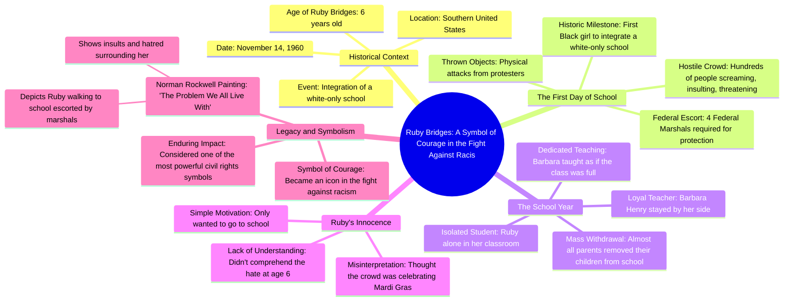

# 6-Year-Old Defies Segregation at School

> 🌐 **Read this in:** **English** · [中文](../../zh-CN/2026-08/tiktok-transcript-le-jour-o-une-enfant-de-6-ans-a-d-fi-la-s-gr-gation-amazing-3955.md)

> **Creator:** [@darkearth](https://www.tiktok.com/@darkearth) · **Views:** 1.6M · **Posted:** 2026-08-10 · **Niche:** entertainment
>
> **TL;DR:** Introduces a young protagonist and a historic milestone, immediately creating empathy and curiosity.

[Watch original video →](https://www.tiktok.com/@darkearth/video/7665408093441821984?is_from_webapp=1&sender_device=pc&web_id=7625772072178075154)

## Why This Went Viral

## Hook (first 3 seconds)
- **Verbatim opening:** "Ruby bridge was only 6 years old when on November 14, it has become the 1st little black girl in integrate a white-only school in the southern United States."
- **Hook pattern:** Bold claim + historical shock (a specific, extreme fact delivered fast).
- **Why it stops the scroll:** The opening weaponizes innocence ("only 6 years old") against a heavy historical taboo ("white-only school"), creating immediate cognitive dissonance. The viewer's brain flags: *this is a story I need to finish.*

## Emotional Rhythm
- **Beat 1 — Innocence (0–3s):** "Only 6 years old" — viewer softens, protective instinct triggers.
- **Beat 2 — Tension (3–10s):** "Hundreds of people screaming, insulting, threatening, throwing objects" — anger and anxiety build; stakes escalate.
- **Beat 3 — Isolation (10–15s):** "Ruby finds herself alone in her classroom" — heartbreak peaks; the image of a single child in an empty room is visceral.
- **Beat 4 — Devotion (15–20s):** "One teacher agrees to stay by his side, Barbara Henry" — relief, hope, emotional rescue.
- **Beat 5 — Twist (20–25s):** "She thought the crowd had come to a party like Mardi Gras" — gut-punch. The cruelty of the scene is reframed through a child's blissful ignorance. This is the climax.
- **Beat 6 — Legacy (25–30s):** "Norman Rockwell immortalized her story" — elevation, catharsis, meaning-making.

## Keyword Density
- **"Only 6 years old"** (twice) — emotional pull; evokes fragility and injustice.
- **"Alone"** (twice) — emotional pull; isolation is the core wound.
- **"First"** (once) — algorithmic reach; "first" is a high-click, high-share keyword.
- **"Symbol" / "legendary"** (twice) — algorithmic + emotional; taps into cultural memory and shareability.
- **"Hate" / "hatred"** (twice) — emotional pull; names the villain clearly.
- **"Courage"** (once) — emotional pull; gives the viewer a moral takeaway.

## Why It Spreads
1. **Innocence vs. evil contrast:** "Only 6 years old" vs. "hundreds of people screaming" — the stark binary makes the story instantly shareable; viewers share to express moral outrage.
2. **The Mardi Gras twist:** "She thought the crowd had come to a party" — this line is the viral core. It converts anger into heartbreak and makes the viewer *feel* rather than just *know*. People share moments that make them feel something deeply.
3. **Universal emotional arc:** The story moves from tension → isolation → rescue → legacy. This is a complete narrative in 30 seconds, making it easy to watch, easy to remember, easy to forward.
4. **Concrete historical anchor:** "Norman Rockwell" and "The Problem We All Live With" give the video cultural weight. Viewers share to appear informed and socially conscious.
5. **Call to reflection:** The final line ("one of the most powerful symbols of the struggle for civil rights") invites the viewer to participate in honoring history — a low-effort, high-identity share.

## What You Can Steal
1. **Lead with the most extreme fact, not the setup.** Start with "only 6 years old" + "white-only school" — not "In 1960, a historic event occurred." The hook is the shock, not the context.
2. **Use a child's misunderstanding as the emotional pivot.** The Mardi Gras line is the moment that turns a history lesson into a heartbreak. Find the detail in your story where the protagonist *doesn't understand* the gravity — that's your twist.
3. **End with a legacy anchor.** Don't end on the sad moment. End on the painting, the symbol, the "legendary" outcome. This gives the viewer a satisfying emotional payoff and a reason to share ("this is important history").

## Mind Map

## Full Transcript (Generated by [TokTranscript](https://toktranscript.com/?utm_source=github&utm_medium=breakdown&utm_campaign=tool_attribution))

> 📝 Transcripts on this page are auto-generated and show the first 60%. Want to transcribe any TikTok in 30 seconds and get the full version? [Try TokTranscript free →](https://toktranscript.com/?utm_source=github&utm_medium=breakdown&utm_campaign=transcript_cta)

Ruby bridge was only 6 years old when on November 14, it has become the 1st little black girl in integrate a white-only school in the southern United States. But in front of the school, A crowd is waiting for him hundreds of people are screaming, insulting, threatening and throwing objects. So she can just walk into the classroom, 4 Federal Marshalls have to escort him every morning. The most shocking, almost all parents withdraw their children from school. Ruby finds herself alone in her classroom. Only one teacher agrees to stay by his side, Barbara Henry. Throughout the school year, Barbara Henry teaches alone, as if the class was full of students. The most overwhelming, is that Ruby didn't even understand what was happening at only 6 years old.

*[Read the full transcript on TokTranscript →](https://toktranscript.com/plaza/tiktok-transcript-le-jour-o-une-enfant-de-6-ans-a-d-fi-la-s-gr-gation-amazing-3955?utm_source=github&utm_medium=breakdown&utm_campaign=transcript_full)*

## Browse More

- All [entertainment](../../by-niche/en/entertainment.md) breakdowns
- All [Historical revelation with emotional contrast](../../by-pattern/en/hook-historical-revelation-with-emotional-contrast.md) examples

## Video Info

| | |
|---|---|
| Creator | [@darkearth](https://www.tiktok.com/@darkearth) |
| Original video | [https://www.tiktok.com/@darkearth/video/7665408093441821984?is_from_webapp=1&sender_device=pc&web_id=7625772072178075154](https://www.tiktok.com/@darkearth/video/7665408093441821984?is_from_webapp=1&sender_device=pc&web_id=7625772072178075154) |
| Original title | Le jour où une enfant de 6 ans a défié la ségrégation 😳  #amazing #in... |
| Views | 1.6M (1600000) |
| Posted | 2026-08-10 |
| Duration | 0s |
| Niche | `entertainment` |
| Hook pattern | `Historical revelation with emotional contrast` |
| Original language | `en` |
| Available languages | en, zh-CN |
| Generated | 2026-08-11 by [TokTranscript](https://toktranscript.com/) |

---

*This breakdown is for educational analysis under fair use. Original video © [@darkearth](https://www.tiktok.com/@darkearth). All transcripts are auto-generated and may contain errors.*

*Want to analyze your own TikToks like this? [TokTranscript.com →](https://toktranscript.com/viral-breakdown?utm_source=github&utm_medium=breakdown&utm_campaign=footer_cta)*