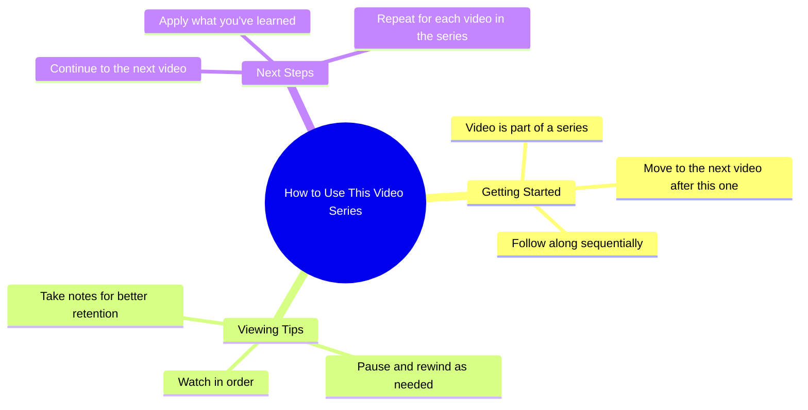

# Reposted My Video Friends Views Problem

> 🌐 **Read this in:** **English** · [中文](../../zh-CN/2026-08/tiktok-transcript-newaccount-unfreez-tiktok-4ef3.md)

> **Creator:** [@zahrafunny6](https://www.tiktok.com/@zahrafunny6) · **Views:** 10.6M · **Posted:** 2026-08-03 · **Niche:** other
>
> **TL;DR:** The abrupt, mundane statement creates an expectation of a transition, but the video ends immediately, subverting the viewer's anticipation.

[Watch original video →](https://vt.tiktok.com/ZS4fUgUNU/)

## Why This Went Viral

## Hook (first 3 seconds)
- **Verbatim opening:** "I'm going to go to the next video."
- **Hook pattern:** Scene / meta-commentary (a promise of action that creates immediate tension).
- **Why it stops the scroll:** It breaks the 4th wall and creates a cliffhanger. The viewer doesn't know what "next video" means, why it matters, or what the outcome will be. It signals a transition and forces the viewer to stay to see the payoff.

## Emotional Rhythm
- **Sequential beats:**
  1. **Curiosity/Intrigue** – "I'm going to go to the next video" (what's coming?).
  2. **Anticipation** – The pause/transition (waiting for the reveal).
  3. **Tension** – The unknown outcome (will it be good/bad/funny?).
  4. **Resolution/Release** – The actual content of the "next video" lands (the payoff).
  5. **Potential Resonance/Relatability** – If the next video is a relatable reaction, the viewer feels seen.
- **Climax:** The moment the "next video" actually plays and the viewer gets the context/punchline.

## Keyword Density
- **"Next video"** – repeated (drives the core loop and creates the meta-narrative).
- **"Go"** – active verb (drives motion and transition).
- **"I'm going to"** – personal agency (creates a POV connection).
- **"Video"** – platform-native term (algorithmic relevance for content discovery).
- **"You"** – implied (if the next video is a reaction, it invites the viewer into the experience).

*Which drive algorithmic reach:* "video," "next" (searchable, trend-adjacent).
*Which drive emotional pull:* "I'm going to," "you" (personal, conversational).

## Why It Spreads
- **Meta-hook creates a loop:** The line "I'm going to go to the next video" is a self-aware promise that plays on the viewer's own scrolling behavior — it mirrors what the viewer is doing *right now* (watching a video) and makes them complicit.
- **Cliffhanger tension:** The lack of context in the opening forces the viewer to watch the entire short to understand the premise, boosting completion rate — a key algorithm signal.
- **Relatability via transition:** If the "next video" is a reaction, a meme, or a relatable moment, it taps into shared experience, making it easy to tag friends or comment "this is me."
- **Short-form pacing:** The line is delivered fast, with no setup, matching the platform's need for immediate value.
- **Open-ended interpretation:** The phrase is vague enough to be repurposed (e.g., "I'm going to go to the next video" as a reaction to anything), allowing remix culture to amplify it.

## What You Can Steal
- **Start with a meta-command:** Open with a line that references the viewer's own behavior (scrolling, watching, deciding). It instantly creates a mirror effect and buys you 3 seconds of attention.
- **Use a transition as the hook:** Don't start with the content — start with the *act of moving to the content*. This builds natural suspense and a reason to stay.
- **Leave the payoff ambiguous:** Don't reveal what "next" means in the first line. Let the viewer's curiosity fill the gap; the reveal is the reward.

## Mind Map

## Full Transcript (Generated by [free TikTok transcript generator](https://toktranscript.com/?utm_source=github&utm_medium=breakdown&utm_campaign=tool_attribution))

> 📝 Transcripts on this page are auto-generated and show the first 60%. Want to transcribe any TikTok in 30 seconds and get the full version? [Try TokTranscript free →](https://toktranscript.com/?utm_source=github&utm_medium=breakdown&utm_campaign=transcript_cta)

I'm going to go to the

*[Read the full transcript on TokTranscript →](https://toktranscript.com/plaza/tiktok-transcript-newaccount-unfreez-tiktok-4ef3?utm_source=github&utm_medium=breakdown&utm_campaign=transcript_full)*

## Browse More

- All [other](../../by-niche/en/other.md) breakdowns
- All [False expectation](../../by-pattern/en/hook-false-expectation.md) examples

## Video Info

| | |
|---|---|
| Creator | [@zahrafunny6](https://www.tiktok.com/@zahrafunny6) |
| Original video | [https://vt.tiktok.com/ZS4fUgUNU/](https://vt.tiktok.com/ZS4fUgUNU/) |
| Original title | 𝗥𝗲𝗽𝗼𝘀𝘁𝗲𝗱 𝗠𝘆 𝘃𝗶𝗱𝗲𝗼 𝗳𝗿𝗶𝗲𝗻𝗱𝘀💞+𝘃𝗶𝗲𝘄𝘀 𝗽𝗿𝗼𝗯𝗹𝗲𝗺😕#newaccount #unfreez #tiktok... |
| Views | 10.6M (10600000) |
| Posted | 2026-08-03 |
| Duration | 0s |
| Niche | `other` |
| Hook pattern | `False expectation` |
| Original language | `en` |
| Available languages | en, zh-CN |
| Generated | 2026-08-04 by [TokTranscript](https://toktranscript.com/) |

---

*This breakdown is for educational analysis under fair use. Original video © [@zahrafunny6](https://www.tiktok.com/@zahrafunny6). All transcripts are auto-generated and may contain errors.*

*Want to analyze your own TikToks like this? [try this transcription tool →](https://toktranscript.com/viral-breakdown?utm_source=github&utm_medium=breakdown&utm_campaign=footer_cta)*