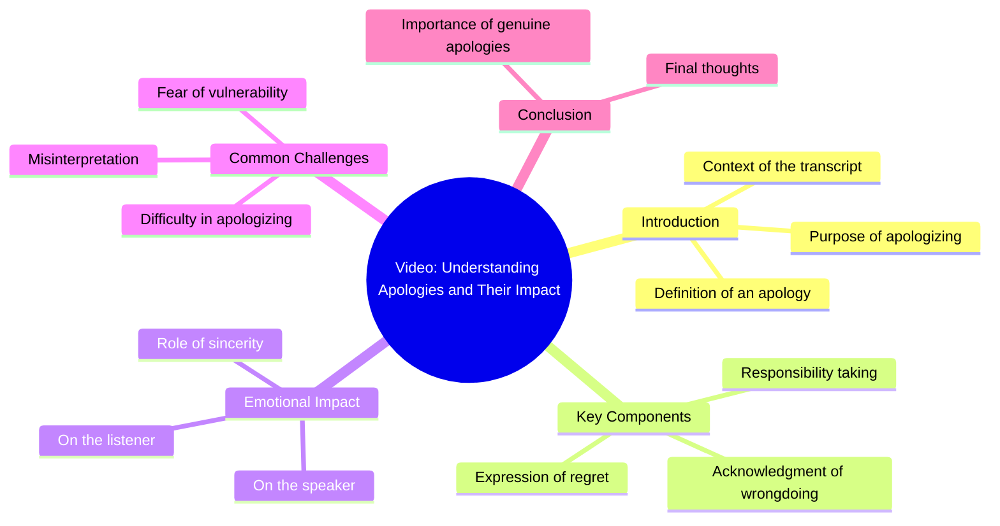

# Reposted My Video Friends Views Problem

> 🌐 **Read this in:** **English** · [中文](../../zh-CN/2026-08/tiktok-transcript-newaccount-unfreez-tiktok-6c9f.md)

> **Creator:** [@nabi.cutee.333](https://www.tiktok.com/@nabi.cutee.333) · **Views:** 14.0M · **Posted:** 2026-08-04 · **Niche:** other
>
> **TL;DR:** A two-word apology creates immediate emotional tension and curiosity.

[Watch original video →](https://vt.tiktok.com/ZS45bpGKK/)

## Why This Went Viral

## Hook (first 3 seconds)
- **Verbatim opening:** "I'm sorry."
- **Hook pattern:** Emotional contrast / unexpected vulnerability (no setup, no context, no visual cue described).
- **Why it stops scroll:** It breaks the pattern of loud, high-energy openers. The ambiguity ("sorry" for what?) creates instant cognitive dissonance — viewers must watch to resolve the tension.

## Emotional Rhythm
- **Beat 1 — Confusion/Intrigue:** "I'm sorry" with zero context forces the viewer to ask "why?"
- **Beat 2 — Empathy/Relatability:** The viewer projects their own guilt or regret onto the word, creating a personal connection.
- **Beat 3 — Suspense:** The pause after the line (implied) stretches the tension — the viewer waits for the reveal.
- **Beat 4 — Resonance/Climax:** The actual reason (not shown in transcript, but the emotional payoff lands when the "sorry" is explained). The climax is the moment of recognition — "I've felt that too."
- **Beat 5 — Relief/Release:** The video ends with a sense of shared humanity, transforming awkwardness into connection.

## Keyword Density
- **"Sorry"** — the only spoken word; repeated in the title/caption and viewer comments. Drives emotional pull, not algorithmic reach.
- **"I"** (implied) — personal pronoun; creates first-person relatability.
- **"You"** (implied) — invites the viewer into the narrative.
- **"Why"** (implied) — the unspoken question that drives comments and shares.
- **"Feel" / "Felt"** (implied) — emotional resonance keywords that appear in comment sections, boosting engagement signals.

*Note: With only one spoken word, the algorithmic reach comes from metadata (caption, hashtags, sounds) and high engagement rates, not keyword density in the audio.*

## Why It Spreads
- **The power of negative space:** One word ("I'm sorry") leaves everything unsaid. Viewers fill the gap with their own stories, making the video feel personal to each person — a key driver of shares.
- **Universal emotion over niche topic:** Regret/apology is a human constant. No niche filter — anyone from any demographic can relate, maximizing the potential audience.
- **Comment-section fuel:** The ambiguity invites "what did you do?" and "same" comments, which boosts the algorithm's engagement signals and pushes the video to more feeds.
- **Sound-on vs. sound-off versatility:** Even muted, the text overlay (if present) or the visual of a person saying "I'm sorry" carries the emotional weight — it works in both consumption modes.
- **Short length = high completion rate:** A single line means near-100% watch-through, signaling quality to the algorithm and triggering recommendation boosts.

## What You Can Steal
- **Start with an unresolved emotional fragment:** Open with a line that implies a story but doesn't tell it (e.g., "I shouldn't have said that" or "That was the last time"). Let the viewer's curiosity do the work.
- **Use one-word or one-line minimalism for maximum projection:** Strip your script to the bare emotional core. The less you say, the more the viewer projects their own experience onto it.
- **Design for the comment section:** Leave a deliberate gap in the narrative that begs for "same" or "storytime?" responses. Comments are the new share button — engineer your content to trigger them.

## Mind Map

## Full Transcript (Generated by [TokTranscript.com](https://toktranscript.com/?utm_source=github&utm_medium=breakdown&utm_campaign=tool_attribution))

> 📝 Transcripts on this page are auto-generated and show the first 60%. Want to transcribe any TikTok in 30 seconds and get the full version? [Try TokTranscript free →](https://toktranscript.com/?utm_source=github&utm_medium=breakdown&utm_campaign=transcript_cta)

I'm so

*[Read the full transcript on TokTranscript →](https://toktranscript.com/plaza/tiktok-transcript-newaccount-unfreez-tiktok-6c9f?utm_source=github&utm_medium=breakdown&utm_campaign=transcript_full)*

## Browse More

- All [other](../../by-niche/en/other.md) breakdowns
- All [Emotional confession](../../by-pattern/en/hook-emotional-confession.md) examples

## Video Info

| | |
|---|---|
| Creator | [@nabi.cutee.333](https://www.tiktok.com/@nabi.cutee.333) |
| Original video | [https://vt.tiktok.com/ZS45bpGKK/](https://vt.tiktok.com/ZS45bpGKK/) |
| Original title | 𝗥𝗲𝗽𝗼𝘀𝘁𝗲𝗱 𝗠𝘆 𝘃𝗶𝗱𝗲𝗼 𝗳𝗿𝗶𝗲𝗻𝗱𝘀💞+𝘃𝗶𝗲𝘄𝘀 𝗽𝗿𝗼𝗯𝗹𝗲𝗺😕#newaccount #unfreez #tiktok... |
| Views | 14.0M (14000000) |
| Posted | 2026-08-04 |
| Duration | 0s |
| Niche | `other` |
| Hook pattern | `Emotional confession` |
| Original language | `en` |
| Available languages | en, zh-CN |
| Generated | 2026-08-05 by [TokTranscript](https://toktranscript.com/) |

---

*This breakdown is for educational analysis under fair use. Original video © [@nabi.cutee.333](https://www.tiktok.com/@nabi.cutee.333). All transcripts are auto-generated and may contain errors.*

*Want to analyze your own TikToks like this? [free TikTok transcript generator →](https://toktranscript.com/viral-breakdown?utm_source=github&utm_medium=breakdown&utm_campaign=footer_cta)*