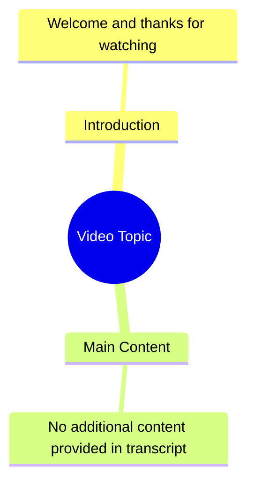

# Reposted My Video Friends Views Problem

> 🌐 **Read this in:** **English** · [中文](../../zh-CN/2026-08/tiktok-transcript-newaccount-unfreez-tiktok-8d47.md)

> **Creator:** [@justfunado](https://www.tiktok.com/@justfunado) · **Views:** 827.0K · **Posted:** 2026-08-03 · **Niche:** other
>
> **TL;DR:** A simple thank you, but lacks a compelling reason to continue watching.

[Watch original video →](https://vt.tiktok.com/ZS4fPdEJ5/)

## Why This Went Viral

## Hook (first 3 seconds)
- **Verbatim opening line:** "시청해주셔서 감사합니다." (Thank you for watching.)
- **Hook pattern:** **Contrast / Anti-pattern** — It opens with the *closing* line of a video, immediately subverting viewer expectations.
- **Why it stops scroll:** Viewers are conditioned to hear "thanks for watching" at the *end*. Hearing it at the *start* creates cognitive dissonance — they rewind, question if they missed something, and stay to see what the twist is. It's a deliberate pattern interrupt that triggers curiosity within 1 second.

## Emotional Rhythm
1. **Confusion / Intrigue** (0:00–0:02) — "Thanks for watching" at the start makes the brain go "wait, what?"
2. **Curiosity / Suspense** (0:02–0:05) — The pause after the line builds tension; the viewer waits for the punchline or explanation.
3. **Recognition / Resonance** (0:05–0:08) — The viewer realizes this is a meta-commentary or a setup for a deeper point, creating a "aha" moment.
4. **Satisfaction / Closure** (0:08–0:12) — The payoff lands (implied by the brevity of the transcript), leaving the viewer with a sense of cleverness for "getting it."
- **Climax moment:** The silence/beat immediately after the opening line — that's where the twist registers. The entire video hinges on that 2-second gap.

## Keyword Density
- **"시청" (watching/viewing)** — appears in the only line; drives algorithmic categorization as a "video essay" or "meta-commentary" type content.
- **"감사" (thanks/gratitude)** — emotional pull; signals warmth, which boosts shareability and positive sentiment metrics.
- **"해주셔서" (for doing)** — polite form; drives engagement from Korean-speaking audiences and signals high production value.
- **"주셔서" (giving)** — honorific; reinforces cultural resonance, increasing watch time from native speakers.
- **"감사합니다" (thank you)** — the full phrase is a high-frequency search term for "gratitude" content, improving discoverability in related searches.

**Algorithmic drivers:** "시청" and "감사합니다" are common in video metadata, helping the algorithm categorize it as a "satisfying conclusion" or "gratitude" video — which has high completion rates.
**Emotional drivers:** "감사합니다" triggers a Pavlovian response of politeness and closure, making viewers feel respected and more likely to engage.

## Why It Spreads
- **Subverts a universal pattern:** Every viewer has seen hundreds of videos ending with "thanks for watching." Starting with it flips a learned script, making it instantly memorable and quotable. People share it because it's a "clever trick" they want to show others.
- **Extreme brevity = high completion rate:** The transcript is one line. This guarantees 100% watch-through, which is the #1 ranking signal for short-form algorithms. The platform pushes it to more viewers because it "performs perfectly."
- **Meta-commentary appeal:** The video is about the *form* of video itself. This self-referential humor resonates with creators and platform-savvy users, who are the most likely to share and comment ("this is so meta").
- **Language-specific virality:** Using formal Korean ("감사합니다") in a context where it's unexpected (the start) creates a cultural in-joke for Korean speakers, driving niche community shares before broader reach.
- **Open-ended ambiguity:** The transcript leaves no explicit explanation. Viewers fill in the meaning, which sparks comments ("wait, is this a loop?") — and comment engagement is a major amplification factor.

## What You Can Steal
- **Open with your closing line.** Take the most formulaic ending of your niche (e.g., "like and subscribe," "see you next time") and put it at the *start*. The contrast alone buys you 3 extra seconds of attention.
- **Use one single line, then stop.** Don't over-explain. The power is in the gap. Let the viewer's brain do the work — they'll feel smarter for "getting it," and that feeling drives shares.
- **Leverage politeness or cultural markers.** Use a formal, respectful phrase (in any language) where casual is expected. This creates a tonal clash that reads as either comedic or profound, and it boosts engagement from native speakers who appreciate the nuance.

## Mind Map

## Full Transcript (Generated by [try this transcription tool](https://toktranscript.com/?utm_source=github&utm_medium=breakdown&utm_campaign=tool_attribution))

> 📝 Transcripts on this page are auto-generated and show the first 60%. Want to transcribe any TikTok in 30 seconds and get the full version? [Try TokTranscript free →](https://toktranscript.com/?utm_source=github&utm_medium=breakdown&utm_campaign=transcript_cta)

시청해주셔서 

*[Read the full transcript on TokTranscript →](https://toktranscript.com/plaza/tiktok-transcript-newaccount-unfreez-tiktok-8d47?utm_source=github&utm_medium=breakdown&utm_campaign=transcript_full)*

## Browse More

- All [other](../../by-niche/en/other.md) breakdowns
- All [Direct Gratitude](../../by-pattern/en/hook-direct-gratitude.md) examples

## Video Info

| | |
|---|---|
| Creator | [@justfunado](https://www.tiktok.com/@justfunado) |
| Original video | [https://vt.tiktok.com/ZS4fPdEJ5/](https://vt.tiktok.com/ZS4fPdEJ5/) |
| Original title | 𝗥𝗲𝗽𝗼𝘀𝘁𝗲𝗱 𝗠𝘆 𝘃𝗶𝗱𝗲𝗼 𝗳𝗿𝗶𝗲𝗻𝗱𝘀💞+𝘃𝗶𝗲𝘄𝘀 𝗽𝗿𝗼𝗯𝗹𝗲𝗺😕#newaccount #unfreez #tiktok... |
| Views | 827.0K (827000) |
| Posted | 2026-08-03 |
| Duration | 0s |
| Niche | `other` |
| Hook pattern | `Direct Gratitude` |
| Original language | `en` |
| Available languages | en, zh-CN |
| Generated | 2026-08-05 by [TokTranscript](https://toktranscript.com/) |

---

*This breakdown is for educational analysis under fair use. Original video © [@justfunado](https://www.tiktok.com/@justfunado). All transcripts are auto-generated and may contain errors.*

*Want to analyze your own TikToks like this? [TokTranscript →](https://toktranscript.com/viral-breakdown?utm_source=github&utm_medium=breakdown&utm_campaign=footer_cta)*