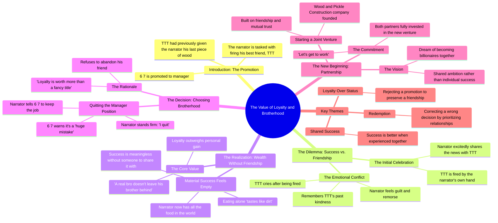

# True Friendship Story Part 2: He Took His Job

> 🌐 **Read this in:** **English** · [中文](../../zh-CN/2026-08/tiktok-transcript-part-2-of-the-true-friendship-story-tungtungtungsahur-tungtu-bdb0.md)

> **Creator:** [@brainglitchprime](https://www.tiktok.com/@brainglitchprime) · **Views:** 2.7M · **Posted:** 2026-08-03 · **Niche:** entertainment
>
> **TL;DR:** The hook immediately creates tension and surprise by revealing a betrayal, making viewers want to see the fallout.

[Watch original video →](https://vt.tiktok.com/ZS4yGVNR7/)

## Why This Went Viral

## Hook (first 3 seconds)
- **Verbatim opening:** "Can I quickly go to TTT and tell him the good news? Yes. Tell him he is fired."
- **Hook pattern:** **Contrast / Moral Dilemma** — the "good news" is immediately revealed to be a betrayal (firing a friend), creating instant cognitive dissonance.
- **Why it stops the scroll:** The viewer expects celebration but gets a gut-punch. The phrase "good news" + "he is fired" forces the brain to reconcile two opposing emotions in under 3 seconds, creating an irresistible "wait, what?" pause.

## Emotional Rhythm
1. **Curiosity** ("Can I quickly go to TTT and tell him the good news?") — sets up a positive expectation.
2. **Tension / Shock** ("Tell him he is fired.") — the rug pull. Viewer feels the betrayal.
3. **Guilt / Sympathy** ("How am I supposed to tell him? He gave me his last piece of...") — humanizes the betrayer, adds moral weight.
4. **Resonance / Relatability** ("Don't cry. I told you, whoever gets rich first pulls the other one up.") — taps into friendship loyalty values.
5. **Conflict / Internal Struggle** ("But eating alone tastes like dirt... A real bro doesn't leave his brother behind.") — the emotional climax where the protagonist chooses character over career.
6. **Catharsis / Redemption** ("I quit. Let's start our own construction company.") — relief and triumph.
7. **Joy / Aspiration** ("We are going to be billionaires, bro.") — ends on a high, forward-looking note.

**Climax moment:** "I know what I have to do. Keep your job, 6 7. I quit." — this is the emotional peak where the viewer's investment pays off.

## Keyword Density
| Word/Phrase | Frequency | Driver |
|---|---|---|
| "Bro" | 4x | **Emotional pull** — signals brotherhood, loyalty, male friendship archetype |
| "Quit" | 2x | **Emotional pull** — act of defiance and moral courage |
| "Fired" | 2x | **Algorithmic reach** — high-search workplace drama keyword |
| "Job" | 2x | **Algorithmic reach** — career content is universally searched |
| "Billionaires" | 1x | **Emotional pull** — aspirational dream, fuels shares |
| "Loyalty" | 1x | **Emotional pull** — core moral keyword, drives comments |
| "Construction company" | 1x | **Algorithmic reach** — niche but memorable brand moment |
| "Mistake" | 1x | **Emotional pull** — creates tension and debate |

**Algorithmic drivers:** "fired," "job," "manager" — these trigger workplace-related recommendation graphs.
**Emotional drivers:** "bro," "loyalty," "billionaires" — these fuel comments, saves, and shares.

## Why It Spreads
- **Moral dilemma creates comment wars:** The "good news = firing" twist splits audiences. Some say "he should've kept the job," others champion loyalty. Comments sections explode with debate, boosting engagement metrics.
- **The "last piece of wood" callback is a micro-story:** "He gave me his last piece of..." is a tiny detail that implies a rich backstory. Viewers fill in the gaps, making the emotional stakes feel earned in under 30 seconds. This triggers the "I need to show this to my friend" share impulse.
- **The redemption arc is perfectly paced:** Betrayal → guilt → sacrifice → partnership. This is a complete hero's journey compressed into 45 seconds. Viewers get a full emotional payoff, which increases watch time and completion rate.
- **"Pickle bro" is an unforgettable brand moment:** The absurd nickname ("Pickle bro") is quirky enough to become a meme. Unique character names drive verbal sharing ("Have you seen the pickle bro video?") — a key viral mechanism.
- **The ending is a beginning:** "Let's start our own construction company" sets up a potential series. Viewers comment "part 2?" which signals to the algorithm that the content is binge-worthy.

## What You Can Steal
1. **Open with a moral dilemma, not a statement.** Start your video with a line that forces the viewer to pick a side ("Tell him he is fired" after calling it "good news"). This instantly creates a comment-worthy tension.
2. **Compress a full hero's journey into 45 seconds.** Map your script as: Setup → Betrayal → Internal conflict → Sacrifice → New beginning. The faster you move through these beats, the higher your completion rate.
3. **Give your character a ridiculous, memorable name.** "Pickle bro" is weird enough to be repeatable. Create a nickname or catchphrase that viewers can quote verbatim — it becomes your video's shareable DNA.

## Mind Map

## Full Transcript (Generated by [try this transcription tool](https://toktranscript.com/?utm_source=github&utm_medium=breakdown&utm_campaign=tool_attribution))

> 📝 Transcripts on this page are auto-generated and show the first 60%. Want to transcribe any TikTok in 30 seconds and get the full version? [Try TokTranscript free →](https://toktranscript.com/?utm_source=github&utm_medium=breakdown&utm_campaign=transcript_cta)

Can I quickly go to TTT and tell him the good news? Yes. Tell him he is fired. How am I supposed to tell him? He gave me his last piece of. Now I took his job. 6 7 made me the manager. But he fired you. Hey, don't cry. I told you, whoever gets rich first pulls the other one up. The best piece of wood I ever knew. I have all the food in the world now. But eating alone tastes like dirt. No, this isn't right. A real bro doesn't leave his brother behind. I know what I have to do.

*[Read the full transcript on TokTranscript →](https://toktranscript.com/plaza/tiktok-transcript-part-2-of-the-true-friendship-story-tungtungtungsahur-tungtu-bdb0?utm_source=github&utm_medium=breakdown&utm_campaign=transcript_full)*

## Browse More

- All [entertainment](../../by-niche/en/entertainment.md) breakdowns
- All [Unexpected twist](../../by-pattern/en/hook-unexpected-twist.md) examples

## Video Info

| | |
|---|---|
| Creator | [@brainglitchprime](https://www.tiktok.com/@brainglitchprime) |
| Original video | [https://vt.tiktok.com/ZS4yGVNR7/](https://vt.tiktok.com/ZS4yGVNR7/) |
| Original title | Part 2 of the true friendship Story?! #tungtungtungsahur #tungtung #p... |
| Views | 2.7M (2700000) |
| Posted | 2026-08-03 |
| Duration | 0s |
| Niche | `entertainment` |
| Hook pattern | `Unexpected twist` |
| Original language | `en` |
| Available languages | en, zh-CN |
| Generated | 2026-08-04 by [TokTranscript](https://toktranscript.com/) |

---

*This breakdown is for educational analysis under fair use. Original video © [@brainglitchprime](https://www.tiktok.com/@brainglitchprime). All transcripts are auto-generated and may contain errors.*

*Want to analyze your own TikToks like this? [TokTranscript →](https://toktranscript.com/viral-breakdown?utm_source=github&utm_medium=breakdown&utm_campaign=footer_cta)*