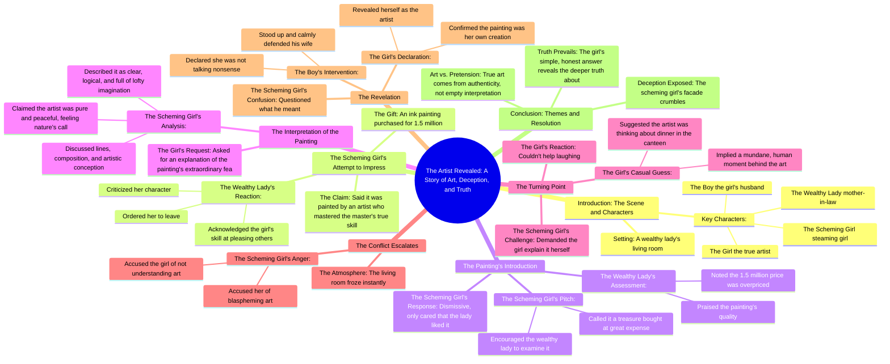

# Married to a Comatose Tycoon: My Daily Routine of Annoyin...

> 🌐 **Read this in:** **English** · [中文](../../zh-CN/2026-08/tiktok-transcript-part23-married-to-a-comatose-tycoon-my-daily-routine-annoy-h-b421.md)

> **Creator:** [@vfmiylaabrie11](https://www.tiktok.com/@vfmiylaabrie11) · **Views:** 164.8K · **Posted:** 2026-08-01 · **Niche:** entertainment
>
> **TL;DR:** Immediately introduces a high-stakes social conflict with a clear antagonist and a mysterious painting.

[Watch original video →](https://vm.tiktok.com/ZS4rcjMoJ/ This post is shared via TikTok Lite. Download TikTok Lite to enjoy more posts: https://www.tiktok.com/tiktoklite)

## Why This Went Viral

## Hook (first 3 seconds)
- **Verbatim opening:** "Steaming girl took the ink painting she bought for 1.5 million to curry favor with the wealthy lady in front of her, said it was painted by an artist who had mastered the master's true skills."
- **Hook pattern:** Scene-setting with a **numbers + status contrast** (1.5 million price tag vs. "curry favor" motive).
- **Why it stops the scroll:** It instantly frames a high-stakes social power play — money, flattery, and class hierarchy — all in one sentence. The viewer immediately senses a setup for humiliation and wants to see who wins.

## Emotional Rhythm
- **Beat 1 — Curiosity/Intrigue:** The expensive painting and the "curry favor" motive set up a scheme.
- **Beat 2 — Tension (social friction):** The wealthy lady calls out the scheming girl's character — a public rebuke.
- **Beat 3 — False calm/Relief:** The scheming girl pivots to praising the painting, seemingly recovering.
- **Beat 4 — Rising suspense:** The girl (protagonist) baits the scheming girl into a deep artistic analysis — the scheming girl over-explains with grandiosity.
- **Beat 5 — Comedic release:** The girl's deadpan guess: "Maybe the artist was just thinking what to eat in the canteen at night." This is the **twist** — humor deflates the pretension.
- **Beat 6 — Climax/Reveal:** The scheming girl explodes in anger; the husband stands up; the girl drops the bomb: "Because I am the artist."
- **Beat 7 — Catharsis:** The scheming girl is stunned; the viewer feels vindication for the protagonist.

## Keyword Density
- **"Artist"** (5+ times) — Drives the central identity reveal; algorithmic reach via "art" niche.
- **"Painting"** (4+ times) — Anchor object for the plot; visual/searchable term.
- **"Scheming girl"** (5+ times) — Villain label; emotional pull (creates clear antagonist).
- **"Wealthy lady"** (3 times) — Class marker; drives status-tension emotional pull.
- **"1.5 million"** (2 times) — Specific number; boosts credibility and curiosity.
- **"Master" / "true skills"** (2 times) — Authority framing; algorithmic reach in art/craft niches.
- **"Canteen"** (1 time) — The comedic pivot word; high emotional pull despite low frequency.

## Why It Spreads
- **The "humiliation reversal" arc is universal.** The scheming girl's overconfidence is dismantled by the quiet protagonist. The line *"Because I am the artist"* is the exact moment viewers screenshot and share — it's a mic-drop that satisfies a deep desire for justice.
- **The deadpan humor is highly quotable.** *"Maybe the artist was just thinking what to eat in the canteen at night"* is a standalone meme-able line. It contrasts the pretentious art-speak with mundane reality, making it shareable beyond the story's context.
- **Clear villain vs. underdog structure.** The "scheming girl" is named repeatedly, making the conflict instantly legible. Viewers root against her, and the reveal makes them feel like they were "in on it" — driving comments like "I knew it!"
- **The twist is telegraphed but still lands.** The girl's calm demeanor and the husband's support subtly hint at the reveal, but the timing (after the scheming girl's long, pompous analysis) maximizes the impact. This creates a "re-watch" effect — viewers rewatch to catch the clues.
- **It triggers a "share to prove I'm smart" impulse.** The video makes the viewer feel clever for recognizing the setup, so they share it to friends with a caption like "watch till the end."

## What You Can Steal
- **Use the "quiet reveal" structure.** Build tension with a pompous character over-explaining something, then have the protagonist undercut it with a simple, mundane observation. The contrast creates comedy and a memorable payoff.
- **Name your antagonist explicitly.** Calling the character "the scheming girl" (rather than "she") makes the conflict instantly clear and emotionally charged. Do this in your own storytelling — label roles to sharpen the drama.
- **Anchor your story with a specific, high-stakes number.** "1.5 million" makes the opening concrete and raises the stakes. Even in non-financial stories, a precise, impressive detail at the start hooks viewers more than vague claims.

## Mind Map

## Full Transcript (Generated by [TokTranscript.com](https://toktranscript.com/?utm_source=github&utm_medium=breakdown&utm_campaign=tool_attribution))

> 📝 Transcripts on this page are auto-generated and show the first 60%. Want to transcribe any TikTok in 30 seconds and get the full version? [Try TokTranscript free →](https://toktranscript.com/?utm_source=github&utm_medium=breakdown&utm_campaign=transcript_cta)

Steaming girl took the ink painting she bought for 1 5 million to curry favor with the wealthy lady in front of her, said it was painted by an artist who had mastered the master's true skills. The wealthy lady said she was really good at pleasing others, but her character was not good, then told her to leave. At this time, the girl said to her mother in law, this is a treasure the steaming girl spent a lot of money on, why don't we take a look? Then the wealthy lady looked at the painting, praised that the painting was really good, but the transaction price of 1 5 million was really overpriced. But the scheming girl didn't care at all and praised as long as you like it. At this time, the girl praised the scheming girl for her good taste, then asked to interpret the extraordinary features of the painting in the name of asking for advice. So the scheming girl began to analyze the lines of the picture composition and artistic conception.

*[Read the full transcript on TokTranscript →](https://toktranscript.com/plaza/tiktok-transcript-part23-married-to-a-comatose-tycoon-my-daily-routine-annoy-h-b421?utm_source=github&utm_medium=breakdown&utm_campaign=transcript_full)*

## Browse More

- All [entertainment](../../by-niche/en/entertainment.md) breakdowns
- All [Conflict setup with high stakes](../../by-pattern/en/hook-conflict-setup-with-high-stakes.md) examples

## Video Info

| | |
|---|---|
| Creator | [@vfmiylaabrie11](https://www.tiktok.com/@vfmiylaabrie11) |
| Original video | [https://vm.tiktok.com/ZS4rcjMoJ/ This post is shared via TikTok Lite. Download TikTok Lite to enjoy more posts: https://www.tiktok.com/tiktoklite](https://vm.tiktok.com/ZS4rcjMoJ/ This post is shared via TikTok Lite. Download TikTok Lite to enjoy more posts: https://www.tiktok.com/tiktoklite) |
| Original title | Part23|Married to a comatose tycoon. My daily routine: annoy him = cu... |
| Views | 164.8K (164800) |
| Posted | 2026-08-01 |
| Duration | 0s |
| Niche | `entertainment` |
| Hook pattern | `Conflict setup with high stakes` |
| Original language | `en` |
| Available languages | en, zh-CN |
| Generated | 2026-08-03 by [TokTranscript](https://toktranscript.com/) |

---

*This breakdown is for educational analysis under fair use. Original video © [@vfmiylaabrie11](https://www.tiktok.com/@vfmiylaabrie11). All transcripts are auto-generated and may contain errors.*

*Want to analyze your own TikToks like this? [analyze your own TikToks →](https://toktranscript.com/viral-breakdown?utm_source=github&utm_medium=breakdown&utm_campaign=footer_cta)*