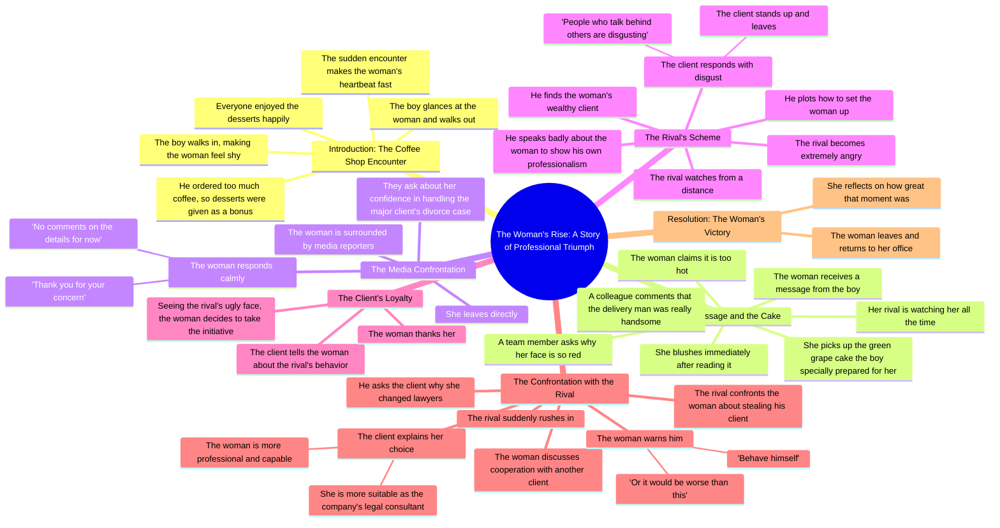

# Neighbor’s Guitar and Cake Spark a Sudden Heartbeat

> 🌐 **Read this in:** **English** · [中文](../../zh-CN/2026-08/tiktok-transcript-part7-the-neighbor-s-guitar-and-cake-a-sudden-heartbeat-next-ed75.md)

> **Creator:** [@vjbrisaidajayvonn](https://www.tiktok.com/@vjbrisaidajayvonn) · **Views:** 189.2K · **Posted:** 2026-08-01 · **Niche:** entertainment
>
> **TL;DR:** A sudden, unexplained character entrance instantly creates curiosity and romantic tension.

[Watch original video →](https://vm.tiktok.com/ZS4r37pog/)

## Why This Went Viral

## Hook (first 3 seconds)
- **Verbatim opening:** "The boy walked in. It made the woman even more shy."
- **Hook pattern:** Scene / open-loop (mid-action, no context)
- **Why it stops scroll:** It drops you into an unresolved social moment with zero setup. The ambiguity ("why is she shy?") creates immediate narrative tension. It feels like the middle of a story, and the brain is wired to resolve incomplete patterns — you keep watching to complete the loop.

## Emotional Rhythm
- **Beat 1 — Curiosity/Soft tension:** "The boy walked in... made the woman even more shy." (Who are they? What's the dynamic?)
- **Beat 2 — Warmth/Comfort:** Coffee, free desserts, "everyone enjoyed them happily." (Safe, cozy micro-scene)
- **Beat 3 — Romantic flutter:** "Heartbeat fast" + colleague calls him handsome. (Slight escalation, sweet)
- **Beat 4 — Intrigue/Blush:** The text message → she blushes. (Open loop: what did it say?)
- **Beat 5 — Anticipation/Threat:** "Her rival was watching her all the time." (Tension spike; stakes introduced)
- **Beat 6 — Status shift/Climax:** Media reporters surround her — she's a high-profile lawyer. Calm, dismissive answer. (Power move; the "quiet flex" climax)
- **Beat 7 — Villainy/Revenge setup:** Rival tries to sabotage her with a client; client shuts him down ("people who talk behind others are disgusting"). (Satisfying justice beat)
- **Beat 8 — Final triumph/Resolution:** She steals his client, tells him to "behave," walks out. (Cathartic victory — the emotional payoff)

**Climax moment:** The media press conference line — "No comments on the details for now." This is the pivot from romance to power fantasy, and it's where the viewer's perception of the woman flips from shy girl to dominant professional.

## Keyword Density
1. **"Woman"** (repeated ~10x) — drives the protagonist identification; algorithmic anchor for "female empowerment" content.
2. **"Rival"** (repeated 4x) — clear antagonist label; triggers conflict-related watch time.
3. **"Client"** (repeated 4x) — professional stakes; signals "career drama" niche.
4. **"Boy"** (repeated 3x) — romantic subplot keyword; broadens appeal to romance audience.
5. **"Shy / blushed / heartbeat"** — emotional pull words; humanize the character, make her relatable.
6. **"Talk behind / bad things"** — villainy markers; drive moral outrage and rooting interest.

**Algorithmic drivers:** "Woman," "client," "rival" — these are high-search-volume terms in the revenge/drama niche. **Emotional pull:** "shy," "blushed," "heartbeat" — they create intimacy and softness that contrasts with the later power fantasy.

## Why It Spreads
- **The "quiet power" fantasy:** The shy woman who gets revenge without raising her voice is a massively shareable archetype. The line "The woman told him to behave himself or it would be worse than this" is a cold, memorable mic-drop — viewers screenshot and repost lines like this.
- **Dual narrative hook (romance + career):** The video starts as a meet-cute and pivots to a professional power struggle. This dual-thread structure keeps two different audience segments (romance fans, career-drama fans) watching to the end.
- **Rapid scene churn:** Every 2–3 sentences introduces a new character or conflict (boy → rival → media → client → rival again). This mimics the fast-cut pacing of short-form video, holding attention through constant novelty.
- **The "villain gets humiliated" payoff:** The rival's plan backfires twice (client rejects him, then loses another client). The line "people who talk behind others are disgusting" is a universal moral lesson — viewers share it as a "truth" statement.
- **Open loops everywhere:** The text message content is never revealed; the romance is never resolved. This leaves viewers unsatisfied and prompts comments like "part 2?" — which spikes engagement metrics.

## What You Can Steal
1. **Start mid-scene, not at the beginning.** Open with a moment of tension ("The boy walked in. It made her shy.") — never with "this is a story about..." Drop viewers into the deep end and let context unfold.
2. **Use the "soft → hard" character pivot.** Introduce your protagonist as vulnerable (shy, blushing) and then reveal their power (calm under media pressure). This contrast creates a memorable identity shift that viewers want to share.
3. **End with a cold, quotable line.** "Behave yourself or it would be worse than this" is the kind of line viewers screenshot, caption, and repost. Write one definitive power line for your video's climax and place it as the final spoken beat before the resolution.

## Mind Map

## Full Transcript (Generated by [TokTranscript](https://toktranscript.com/?utm_source=github&utm_medium=breakdown&utm_campaign=tool_attribution))

> 📝 Transcripts on this page are auto-generated and show the first 60%. Want to transcribe any TikTok in 30 seconds and get the full version? [Try TokTranscript free →](https://toktranscript.com/?utm_source=github&utm_medium=breakdown&utm_campaign=transcript_cta)

The boy walked in. It made the woman even more shy. The boy said he ordered too much coffee, so desserts were given as a bonus. Everyone enjoyed them happily. Then he took a glance at the woman and walked out. The sudden encounter made the woman's heartbeat fast. A colleague said the delivery man was really handsome. Just then, the woman received a message from the boy. She blushed immediately after reading it. A team member asked why her face was so red. The woman said it was too hot. she picked up the green grape cake the boy specially prepared for her. But her rival was watching her all the time. Not long after, the woman was surrounded by media reporters. They asked if she was confident to handle the major client's divorce case. Facing all the questions, the woman calmly said, thank you for your concern. No comments on the details for now. Then she left directly. The rival watched this from a distance, thinking about how to set the woman up. Later, he found the woman's wealthy client said bad things about the woman to show his own professionalism.

*[Read the full transcript on TokTranscript →](https://toktranscript.com/plaza/tiktok-transcript-part7-the-neighbor-s-guitar-and-cake-a-sudden-heartbeat-next-ed75?utm_source=github&utm_medium=breakdown&utm_campaign=transcript_full)*

## Browse More

- All [entertainment](../../by-niche/en/entertainment.md) breakdowns
- All [Mysterious Intrusion](../../by-pattern/en/hook-mysterious-intrusion.md) examples

## Video Info

| | |
|---|---|
| Creator | [@vjbrisaidajayvonn](https://www.tiktok.com/@vjbrisaidajayvonn) |
| Original video | [https://vm.tiktok.com/ZS4r37pog/](https://vm.tiktok.com/ZS4r37pog/) |
| Original title | Part7|The Neighbor’s Guitar and Cake A Sudden Heartbeat Next Door#fyp... |
| Views | 189.2K (189200) |
| Posted | 2026-08-01 |
| Duration | 0s |
| Niche | `entertainment` |
| Hook pattern | `Mysterious Intrusion` |
| Original language | `en` |
| Available languages | en, zh-CN |
| Generated | 2026-08-03 by [TokTranscript](https://toktranscript.com/) |

---

*This breakdown is for educational analysis under fair use. Original video © [@vjbrisaidajayvonn](https://www.tiktok.com/@vjbrisaidajayvonn). All transcripts are auto-generated and may contain errors.*

*Want to analyze your own TikToks like this? [analyze your own TikToks →](https://toktranscript.com/viral-breakdown?utm_source=github&utm_medium=breakdown&utm_campaign=footer_cta)*