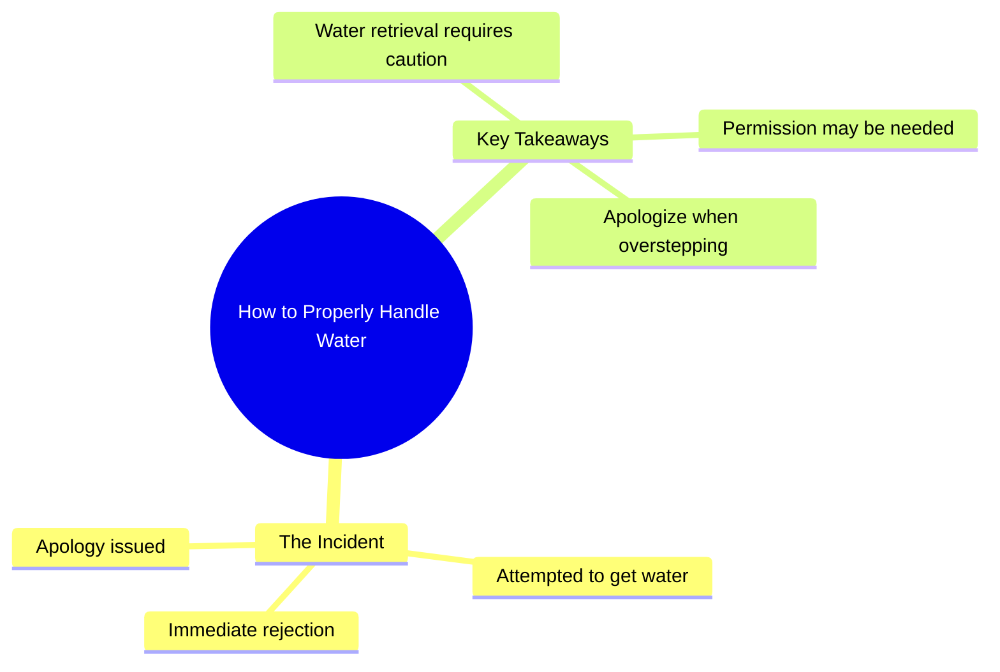

# Poor Chihuahua’s Marriage Life in a Nutshell

> 🌐 **Read this in:** **English** · [中文](../../zh-CN/2026-08/tiktok-transcript-poor-chihuahua-s-marriage-life-summarized-in-this-video-just-6d77.md)

> **Creator:** [@the.giggles.and.w](https://www.tiktok.com/@the.giggles.and.w) · **Views:** 43.6M · **Posted:** 2026-08-03 · **Niche:** other
>
> **TL;DR:** The mundane setup is instantly subverted by a frantic, comedic denial, creating a jarring and memorable hook.

[Watch original video →](https://vt.tiktok.com/ZS4fgAwBP/)

## Why This Went Viral

## Hook (first 3 seconds)
- **Verbatim opening line:** "I'm going to get a little bit of water."
- **Hook pattern:** Scene/action with implied threat—a calm statement that immediately triggers dread.
- **Why it stops scroll:** The mundane action ("get water") is instantly contradicted by the frantic "No! No! No!"—creating cognitive dissonance. Viewers stop to see what catastrophic thing is about to happen from something as innocuous as getting a drink.

## Emotional Rhythm
- **Beat 1 — False calm (0–1s):** "I'm going to get a little bit of water" feels mundane, even boring.
- **Beat 2 — Sudden panic (1–2s):** "No! No! No!" shatters the calm—viewers feel a jolt of alarm.
- **Beat 3 — Guilt/apology (2–3s):** "I'm sorry" lands as a comedic undercut, releasing tension with absurdity.
- **Climax:** The "No! No! No!" is the peak—it's where the emotional whiplash happens.
- **Resolution:** "I'm sorry" delivers the punchline, turning a potential crisis into a joke.

## Keyword Density
- **"No"** (×3) — Drives emotional pull; creates the panic and repetition that makes the clip memorable.
- **"Water"** — Drives algorithmic reach; a generic, high-search-volume word that makes the video discoverable in "water" related feeds.
- **"Sorry"** — Emotional pull; signals vulnerability and comedic self-awareness.
- **"Little bit"** — Emotional pull; the understatement amplifies the absurdity of the reaction.
- **"I'm going to"** — Emotional pull; sets up the false premise that makes the twist work.

## Why It Spreads
- **Relatability via absurd overreaction:** Everyone has overreacted to something trivial—this video exaggerates that universal feeling. The "No! No! No!" is a meme-able reaction that viewers tag friends with.
- **Short, punchy, repeatable:** At 3 seconds, it's perfectly loopable. The "No! No! No!" becomes a sound bite people quote in comments and remix.
- **The twist is instant:** No setup required. The video doesn't build—it hits. This makes it ideal for autoplay and mute-on viewing, where the visual panic carries the joke.
- **Emotional whiplash = share impulse:** The sudden shift from calm to panic to apology creates a "what just happened?" reaction, prompting viewers to send it to someone to see *their* reaction.
- **Open-ended ambiguity:** We never see what "it" is—the water, the situation, the context. This gap invites speculation and comments ("what did you do??"), boosting engagement signals.

## What You Can Steal
- **Start with a false premise:** Open with something mundane or routine, then shatter it within 2 seconds. The contrast is the hook.
- **Use repetition for impact:** A triple repetition ("No! No! No!") is more memorable than a single word. It creates rhythm and meme-ability.
- **End with a comedic undercut:** Apologize or add a self-aware line after the chaos. It releases tension and makes the video feel human, not performative—which drives shares.

## Mind Map

## Full Transcript (Generated by [free TikTok transcript generator](https://toktranscript.com/?utm_source=github&utm_medium=breakdown&utm_campaign=tool_attribution))

> 📝 Transcripts on this page are auto-generated and show the first 60%. Want to transcribe any TikTok in 30 seconds and get the full version? [Try TokTranscript free →](https://toktranscript.com/?utm_source=github&utm_medium=breakdown&utm_campaign=transcript_cta)

I'm going to get a little bit of wate

*[Read the full transcript on TokTranscript →](https://toktranscript.com/plaza/tiktok-transcript-poor-chihuahua-s-marriage-life-summarized-in-this-video-just-6d77?utm_source=github&utm_medium=breakdown&utm_campaign=transcript_full)*

## Browse More

- All [other](../../by-niche/en/other.md) breakdowns
- All [Unexpected interruption](../../by-pattern/en/hook-unexpected-interruption.md) examples

## Video Info

| | |
|---|---|
| Creator | [@the.giggles.and.w](https://www.tiktok.com/@the.giggles.and.w) |
| Original video | [https://vt.tiktok.com/ZS4fgAwBP/](https://vt.tiktok.com/ZS4fgAwBP/) |
| Original title | Poor Chihuahua's marriage life summarized in this video 😭🤫😂 Just a no... |
| Views | 43.6M (43600000) |
| Posted | 2026-08-03 |
| Duration | 0s |
| Niche | `other` |
| Hook pattern | `Unexpected interruption` |
| Original language | `en` |
| Available languages | en, zh-CN |
| Generated | 2026-08-04 by [TokTranscript](https://toktranscript.com/) |

---

*This breakdown is for educational analysis under fair use. Original video © [@the.giggles.and.w](https://www.tiktok.com/@the.giggles.and.w). All transcripts are auto-generated and may contain errors.*

*Want to analyze your own TikToks like this? [analyze your own TikToks →](https://toktranscript.com/viral-breakdown?utm_source=github&utm_medium=breakdown&utm_campaign=footer_cta)*