# Trump's 1933 Gold Playbook for Bitcoin Seizure

> 🌐 **Read this in:** **English** · [中文](../../zh-CN/2026-08/tiktok-transcript-the-1933-gold-playbook-how-trump-may-take-your-bitcoin-4b06.md)

> **Creator:** [@Default Finance](https://www.tiktok.com/@Default Finance) · **Views:** 183.6K · **Posted:** 2026-08-12 · **Niche:** finance
>
> **TL;DR:** Opens with a shocking, direct threat that immediately grabs attention and creates urgency.

[Watch original video →](https://www.facebook.com/share/v/17qUJu3f2g/)

## Why This Went Viral

## Hook (first 3 seconds)
- **Verbatim opening line:** "They are going to confiscate your Bitcoin."
- **Hook pattern:** Bold claim + direct threat (audience-targeted fear)
- **Why it stops the scroll:** It's a declarative, high-stakes statement aimed directly at the viewer's primary asset. It creates immediate cognitive dissonance ("I thought Bitcoin was safe") and triggers a loss-aversion reflex. The use of "They" (a faceless enemy) vs. "your" (personal ownership) establishes an instant us-vs-them conflict.

## Emotional Rhythm
1. **Fear/Alert:** "They are going to confiscate your Bitcoin." (0:00–0:05)
2. **Confusion/Paranoia:** "Silent clause... bailout fund." (0:05–0:10)
3. **False Hope/Validation:** "The price candles turned green... we had won." (0:15–0:25) — This is a deliberate lull to build trust.
4. **Betrayal/Tension:** "A very different story was being written in the legal footnotes." (0:30–0:35)
5. **Discovery/Insight:** "I looked at Section 4, Subsection C." (0:40–0:45) — The "I did the research" pivot.
6. **Historical Parallel (Dread):** The 1933 gold seizure narrative. (1:00–2:00)
7. **Escalation (Terror):** The 1934 silver playbook and the 90% tax scenario. (2:30–3:30)
8. **Legal Cynicism (Rage):** The *Perry v. United States* "right without a remedy" twist. (3:30–4:15)
9. **Climax (Resignation/Urgency):** "They are dusting off the getaway car... They are thinking like accountants." (4:15–4:30)
10. **Call to Action (Implicit):** The final "This is how they kill the private market" leaves the viewer in a state of paranoid urgency.

**Climax:** The *Perry v. United States* precedent breakdown. It is the "gotcha" moment where the viewer realizes the legal system is rigged against them, shifting the emotion from fear to cynical rage.

## Keyword Density
1. **"Acquire"** — The legal loophole word. Drives algorithmic reach via search (legal/bitcoin news) and emotional pull (betrayal).
2. **"Confiscate/Seizure"** — The core threat. High emotional pull; triggers fear and urgency.
3. **"1933/1934"** — Historical anchors. Drives algorithmic reach (history buffs, gold bugs) and lends credibility.
4. **"Tax"** — The mechanism of theft. Drives reach (financial anxiety) and emotional pull (anger at government).
5. **"Treasury"** — The antagonist. Drives reach (political/news) and emotional pull (distrust of institutions).
6. **"Strategic Reserve"** — The bait-and-switch term. Drives reach (crypto news) and emotional pull (irony).
7. **"Private"** — The thing being destroyed. Emotional pull (individual liberty).
8. **"Legal"** — The weapon. Drives reach (law/current events) and emotional pull (futility of resistance).

## Why It Spreads
- **Pattern Interrupt:** The opening line ("They are going to confiscate your Bitcoin") directly contradicts the mainstream narrative of Bitcoin adoption. It forces a share to debate or warn others.
- **Historical Blueprint:** By comparing to 1933/1934, it moves from "conspiracy theory" to "documented precedent." The specific mention of Executive Order 6102 and the Silver Purchase Act gives it a factual backbone that viewers share as "proof."
- **The "I Did the Research" Trope:** The line "I didn't look at the headlines. I looked at the text" positions the creator as a truth-teller. Viewers share this to signal they are "in the know" and not sheep.
- **Actionable Fear:** It doesn't just say "you'll lose money." It provides a specific mechanism (the windfall profits tax). This gives the viewer a tangible threat to discuss, making it easier to share in group chats and forums.
- **Legal Precedent Shock:** The *Perry v. United States* story is a "holy shit" fact that most people have never heard. It provides a high-novelty "did you know?" element that is highly shareable.

## What You Can Steal
1. **Start with the Inversion:** Do not start with a compliment or a fact. Start with the worst-case scenario that your audience fears most, stated as a certainty. ("They are going to take your X.")
2. **Use the "Hidden Text" Pivot:** Create a moment where you say "I looked at the text, not the headlines." This establishes authority and creates a "secret knowledge" vibe that keeps retention high.
3. **Borrow a Historical Precedent:** Anchor your "future warning" to a real, documented historical event (e.g., 1933 gold seizure). This transforms your video from "opinion" to "analysis," making it more credible and shareable.

## Mind Map

```mermaid
mindmap
  root((The U.S. Government's Plan to Confiscate Your Bitcoin))
    The January 23rd, 2025 Executive Order
      The Digital Financial Leadership Act Signed
        Established the first U.S. Strategic Bitcoin Reserve
        Market reacted positively; influencers declared victory
        Media focused on the word 'reserve'
      The Hidden Language in Section 4, Subsection C
        Treasury granted authority to 'manage, secure, and acquire' digital assets
        'Acquire' is a broad legal umbrella term
        Does not specify purchase or mining
        Creates legal container for government absorption of Bitcoin
      The Reclassification of Bitcoin
        Defined as a 'strategic national asset'
        Placed under national security purview
        Individual property rights evaporate under national security law
    The Historical Blueprint: Executive Order 6102 1933
      The Gold Seizure Under FDR
        Framed as a battle against 'hoarding'
        Invoked the Trading with the Enemy Act of 1917
        Applied wartime powers to peaceful citizens
        Citizens given less than a month to turn in gold
      The Terms of Confiscation
        Price set at $20.67 per ounce
        Penalties: $10,000 fine or 10 years in federal prison
        Weaponized fear to compel compliance
      The Parallel to Today
        1933: Gold vital to national emergency
        2025: Bitcoin vital to national economic security
        Identical legal mechanism: state of exception
    The Silver Precedent: Executive Order 6814 1934
      The Nationalization of Silver
        Occurred 16 months after gold seizure
        Phase one of a consolidation strategy
        Government targeted the 'lifeboats' after securing gold
      The Weaponized Tax Clause
        Silver Purchase Act of 1934 imposed 50% tax on profits
        Made private trading mathematically stupid
        Rigged market incentives to funnel metal to government vaults
      The Application to Crypto
        Section 4 defines 'strategic digital assets' in plural
        Framework designed to capture the entire ecosystem
        Stablecoins and altcoins are future targets
        Punitive transfer taxes likely on private transactions
    The Legal Trap: Perry v. United States 1934
      The Case Details
        John Perry sued over broken gold clause contract
        Supreme Court ruled government violated the Constitution
        Court admitted Congress had no power to break contracts
      The Kill Shot: Right Without Remedy
        Perry awarded zero dollars in damages
        Logic: gold ownership was illegal, so no recognizable loss
        Created precedent of legal theft with no compensation
      The Modern Application
        Treasury sets official Bitcoin price below market value
        DOJ cites Perry v. United States in defense
        Argument: restricted use means no damages from forced sale
    The Confiscation Mechanism: Windfall Profits Tax
      The Trap Design
        Treasury establishes official 'strategic redemption price'
        Free market trades at significantly higher price
        90% windfall profits tax on private sales
        Tax exemption for selling to the Treasury
      The Math of Coercion
        Open market sale at $200,000: IRS takes $180,000
        Government sale at $80,000: full amount received
        Free market price becomes an illusion
        Selling to government becomes the only rational choice
      The Historical Precedent
        Same playbook used for silver in 1934
        Market dried up; holders forced to sell to the mint
        Voluntary surrender through financial coercion
    The Destination: Exchange Stabilization Fund ESF
      Origins of the ESF
        Born from the Gold Reserve Act of 1934
        Funded by $2.8 billion profit from gold revaluation
        Operates outside legislative oversight
      The ESF's Powers
        Under exclusive control of Treasury Secretary and President
        No congressional appropriation required
        Not subject to normal federal budget checks
        Effectively a secret credit card for geopolitical maneuvers
      The Plan for Confiscated Bitcoin
        Acquired at official price, revalued at market price
        Multi-trillion dollar windfall credited to ESF
        Could buy every bad debt in the banking system
        Could manipulate bond markets indefinitely
        Could bail out Western financial system without printing dollars
    The Endgame
      The True Motivation
        Not paying off national debt
        Not enriching citizens
        Gaining absolute unchecked financial power
        Building a war chest no voter can touch
      The Historical Cycle
        End of the standard of living built on reserve currency privilege
        Paper wealth evaporates during 80-year cycle resets
        Real wealth is the only thing left standing
      The Warning
        The celebration was not a victory parade
        It was the closing of the trapdoor
        A seizure warrant with the date left blank
```

## Full Transcript (Generated by [free TikTok transcript generator](https://toktranscript.com/?utm_source=github&utm_medium=breakdown&utm_campaign=tool_attribution))

> 📝 Transcripts on this page are auto-generated and show the first 60%. Want to transcribe any TikTok in 30 seconds and get the full version? [Try TokTranscript free →](https://toktranscript.com/?utm_source=github&utm_medium=breakdown&utm_campaign=transcript_cta)

They are going to confiscate your Bitcoin. It is the silent clause in the Freedom Bill you just celebrated, designed by the Treasury to turn your greatest asset into their bailout fund. And in this video, I will show you the exact line in the executive order that legally reclassifies your private wallet as potential government property. On January 23rd, 2025, the impossible happened. Or at least, that is what you were told. President Trump sat at the Resolute desk and signed the Digital Financial Leadership Act, establishing the first ever United States Strategic Bitcoin Reserve. The price candles turned green instantly. Influencers screamed that we had won. Finally, the American government wasn't fighting crypto. It was embracing it. It felt like the ultimate validation of everything you have held through the bear markets. But whilst the cameras were flashing and the champagne corks were popping, a very different story was being written in the legal footnotes that nobody bothered to read. You see, I didn't look at the headlines. I looked at the text. Specifically, I looked at Section 4, Subsection C of the Order. While the media focused on the word reserve, they completely ignored the operational language defining how that reserve is built. The order explicitly grants the Treasury the authority to manage, secure, and acquire digital assets deemed vital to national economic stability. Read that again. Acquire. It does not say purchase on the open market. It does not say mine. It uses the broad legal umbrella term acquire. In government speak, acquisition is not always a voluntary transaction. When the government builds a highway, they acquire your land. When they fight a war, they acquire resources. This specific phrasing is a Trojan horse. It creates the legal container for the United States government to become the largest holder of Bitcoin in the world. Not by competing with you, but by absorbing you. They haven't legitimized Bitcoin to make you rich. They have legitimized it to save themselves. The celebration you saw in January was not the victory parade. It was the closing of the trapdoor. By defining Bitcoin as a strategic national asset, the president didn't just give it value. He gave it a new legal status that places it under the purview of national security. And as history shows us with brutal clarity, once an asset becomes a matter of national security, your individual property rights evaporate. They did not sign a bill to pump your bags. They signed the modern equivalent of a seizure warrant, and they left the date blank. To understand the magnitude of the trap that has just been set, we have to look at the only time this has happened before on American soil. We have to go back to a cloudy Wednesday morning in April 1933. The country was on its knees. The banks were failing. And just like today, the president, Franklin D. Roosevelt, pitched himself as the savior of the common man. He wasn't stealing from the people. He was stabilizing the system. Does that word sound familiar? It should, because it is the exact same word used in the opening paragraph of the new Bitcoin executive order. On April 5th, 1933, Roosevelt signed Executive Order 6102. The language was masterful. He didn't frame it as a confiscation, he framed it as a battle against hoarding. The government successfully rebranded the prudent act of saving hard assets into a crime against the recovery. If you held gold, you weren't just an investor, you were an obstacle to American prosperity. You were, effectively, an economic trader. The order invoked the Trading with the Enemy Act of 1917 to apply wartime powers to peaceful citizens. This is the blueprint that is hiding in plain sight. In 1933, they told the public that gold was vital to the national emergency. Today, the new order declares Bitcoin vital to national economic security. The adjectives have changed, but the legal mechanism is identical. It creates a state of exception where normal property rights no longer apply because the security of the nation is at stake. Under EO 6102, citizens were given less than a month to turn in their gold coins, bullion, and certificates to the Federal Reserve. The price? 2067 per ounce, if you refused. The penalty was a $10,000 fine, which is nearly a quarter of a million dollars in today's money, or 10 years in federal prison. Think about the psychological weight of that. They didn't need to kick down every door. They just needed to make the risk of holding the asset higher than the pain of selling it. They weaponized fear. And the terrifying part is, it worked. The vast majority of law-abiding Americans lined up at banks and handed over their wealth, believing they were doing their patriotic duty, unaware that they were being robbed blind mere months before the government would reprice that same gold and pocket the difference. You might be sitting there thinking, fine, if they target bitcoin, I will just move my liquidity into Ethereum or Solana or privacy coins. I'll hide in the alt market. If that is your plan, you're making the exact same mistake the American public made in 1933. They believed that gold was the only target. They believed that silver, the poor man's gold, was too small, too common, and too decentralized for the government to care about. They were wrong. History is about to teach you a brutal lesson about the appetite of the state. On August 9th, 1934, just 16 months after seizing the nation's gold, Franklin Roosevelt signed Executive Order 68 Forger. It was the nationalization of silver. Most history books skip this chapter because it disrupts the narrative that the gold seizure was a one-time emergency. It wasn't. It was phase one of a consolidation strategy. Once the Treasury had secured the primary reserve asset, gold, they realized they still had leaks in the monetary boat. People were using silver to bypass the dollar's devaluation. So the government came for the lifeboats. But here's the part that is terrifyingly relevant to your crypto portfolio today. They didn just seize it they taxed it into submission first Before the executive order was even signed Congress passed the Silver Purchase Act of 1934 Hidden inside this act was a weaponized tax clause a 50 tax on all profits derived from the transfer of silver bullion. Think about the game theory of that. They didn't make trading silver illegal immediately. They just made it mathematically stupid. If you sold your silver on the private market, the IRS took half your profit. If you sold it to the US Treasury, you avoided the penalty. They rigged the market incentives to funnel all the metal into government vaults voluntarily, before they made it mandatory. This is exactly why Section 4 of Trump's New Executive Order defines strategic digital assets in the plural. It is not a Bitcoin order. It is a digital asset order. They are establishing the framework to capture the entire ecosystem. Once they lock up the Bitcoin float, do you think they will let you transact freely in stablecoins? No. They will apply the 1934 Silver Playbook, slap a punitive transfer tax on private stablecoin transactions, making the government's CBDC or FedNow rails the only financially viable option. They will take the Bitcoin to back the system, and then they will take the rest to ensure you have no way to exit it. But that is unconstitutional, you say. The Fifth Amendment protects property. If they try to seize my Bitcoin or force me to sell it for less than it is worth, I will sue them. I will take it to the Supreme Court. I want to introduce you to a man named John Perry. In 1934, Mr. Perry was exactly where you are now. He held a Liberty Bond, a contract signed by the United States government that explicitly promised to pay him $10,000 in gold coin of the present standard value. When the government devalued the dollar and refused to pay him in gold, offering him paper money worth 40% less instead, he didn't just complain. He sued. He took the United States government all the way to the Supreme Court in the landmark case Paris-Bas-Sue's United States. And here's the terrifying part. He won. The Supreme Court ruled that the United States government had indeed violated the Constitution. They declared that Congress had no power to break its own contracts. Chief Justice Hughes explicitly stated that the government's attempt to override the gold clause was illegal. But then they delivered the kill shot, a legal sleight of hand so cynical it would make a con artist blush. While the court admitted the government had broken the law, they ruled that Mr. Perry was entitled to zero dollars in damages. Why? Their logic was twisted, but airtight. Because the government had already made it illegal for private citizens to own gold, Mr. Perry could not have legally used the gold, even if the government had given it to him. Therefore, the court argued, by paying him in paper dollars, he had suffered no recognizable loss of purchasing power. They created a precedent of a right without a remedy. They admitted the theft was a crime, but because they had also criminalized the victim's ability to hold the stolen property, they owed him nothing. This is the exact precedent that will be weaponized against you in 2026. When the Treasury sets the official Bitcoin price at $80,000, while the black market trades at $200,000, and you sue for the difference, the Department of Justice will cite Perry v. United States. They will argue that since the new executive order restricts strategic digital assets from being used in private commerce, you have suffered no damages by being forced to sell at the government rate. They are not just planning the theft. They are dusting off the getaway car that has been parked in the Supreme Court archives for 90 years. You are probably still clinging to the idea that Bitcoin is unconfiscatable because it is decentralized. You are imagining a scenario where the government has to physically seize your hardware wallet or torture your seed phrase out of you. You are thinking like a revolutionary, but they are thinking like accountants. They know they cannot raid 50 million American homes. It is too expensive. It is too messy. And it creates bad optics. They don't need to use force when they have the Internal Revenue Code. The mechanism they will use to separate you from your Bitcoin is not a gun. It is a windfall profits tax. Here is how the trap works. The Treasury establishes an official strategic redemption price. Let's say they set it at $80,000. But the free market, driven by scarcity, is trading Bitcoin at $200,000. In a normal world, you would never sell to the government. But then comes the tax bill. The administration passes legislation stating that, due to the speculative nature of unregulated digital assets, any sale of Bitcoin to a non-government entity, meaning a private exchange, a friend, peer-to-peer network is subject to a 90% windfall profits tax. Do the math. If you sell your Bitcoin on the open market for $200,000, the IRS takes $180,000 immediately. You're left with $20,000. But if you patriotically sell your Bitcoin to the U.S. Treasury's Strategic Reserve, they grant you a complete tax exemption. You get the full $80,000. Suddenly, the free market price is an illusion. The government has created a reality where selling to them at a massive discount is the only rational financial decision you can make. They haven't banned Bitcoin. They haven't made it illegal to hold. They have simply made it financial suicide to sell it to anyone but them. This is how they kill the private market without ever passing a ban. They create a tax wall so high that the liquidity has nowhere else to flow but into their vaults. This is not hypothetical. This is exactly how they handled the silver market in 1934. They didn't go door to door looking for silver bars. They imposed a tax on private transfers so punitive that the market dried up and holders were forced to sell to the mint just to salvage whatever value they could, they compel you to voluntarily hand over your wealth. And you will do it, not because you want to, but because the alternative is losing everything. And now we arrive at the heart of the scheme. The question that should be keeping you up at night is not how they will take it but why Why go through the legal gymnastics of executive orders Supreme Court loopholes and windfall taxes just to acquire a few million Bitcoin It isn to pay off the national debt You can pay off trillion You can only erase it The destination for your confiscated Bitcoin is a dark corner of the U.S. Treasury known as the Exchange Stabilization Fund, ESF. If you have never heard of it, that is by design. The ESF was born directly from the Gold Reserve Act of 1934, When Roosevelt confiscated the nation's gold at $20.167 and revalued it to $35, that overnight accounting trick generated a paper profit of $2.8 billion, a staggering sum at the time. Did that money go to Congress? Did it go to the American people? No. It was deposited into the ESF, a slush fund explicitly designed to operate outside of legislative oversight. The ESF is the only government fund that answers to practically no one. It is under the exclusive of control of the Treasury Secretary, with the approval of the President. It does not require congressional appropriation to spend money. It is not subject to the normal checks and balances of the federal budget. It is, effectively, the Treasury's secret credit card for geopolitical maneuvers, market rigging, and bailing out foreign governments without your permission. This is where your Bitcoin is going. When they acquire your Bitcoin at the official price of $80,000 and then inevitably revalue it to $1 million, the difference, that massive multi-trillion dollar windfall will not be used to fix your roads or lower your taxes. It will be credited directly to the exchange stabilization fund. Imagine an ESF armed with $20 trillion in liquid Bitcoin profits. They could buy every bad debt in the banking system. They could manipulate the bond market indefinitely. They could bail out the entire Western financial system without printing a single new dollar or asking Congress for a single vote. They are not stealing your Bitcoin to get rich. They are stealing it to gain absolute unchecked financial power over the global economy. They are building a war chest that no voter can touch, and you are the one funding it. So what happens when the dam finally breaks? We are not talking about the end of the world, nor the end of America as a country. The Dutch are still here. The British are still here. But we are talking about the end of a standard of living that was built on the privilege of printing the global reserve currency. When the 80-year cycle resets, the paper wealth evaporates. And the real wealth is the only thing left standing.

*[Read the full transcript on TokTranscript →](https://toktranscript.com/plaza/tiktok-transcript-the-1933-gold-playbook-how-trump-may-take-your-bitcoin-4b06?utm_source=github&utm_medium=breakdown&utm_campaign=transcript_full)*

## Browse More

- All [finance](../../by-niche/en/finance.md) breakdowns
- All [Fear-based prediction](../../by-pattern/en/hook-fear-based-prediction.md) examples

## Video Info

| | |
|---|---|
| Creator | [@Default Finance](https://www.tiktok.com/@Default Finance) |
| Original video | [https://www.facebook.com/share/v/17qUJu3f2g/](https://www.facebook.com/share/v/17qUJu3f2g/) |
| Original title | The 1933 Gold Playbook: How Trump May Take Your Bitcoin |
| Views | 183.6K (183566) |
| Posted | 2026-08-12 |
| Duration | 0s |
| Niche | `finance` |
| Hook pattern | `Fear-based prediction` |
| Original language | `en` |
| Available languages | en, zh-CN |
| Generated | 2026-08-13 by [TokTranscript](https://toktranscript.com/) |

---

*This breakdown is for educational analysis under fair use. Original video © [@Default Finance](https://www.tiktok.com/@Default Finance). All transcripts are auto-generated and may contain errors.*

*Want to analyze your own TikToks like this? [TokTranscript →](https://toktranscript.com/viral-breakdown?utm_source=github&utm_medium=breakdown&utm_campaign=footer_cta)*