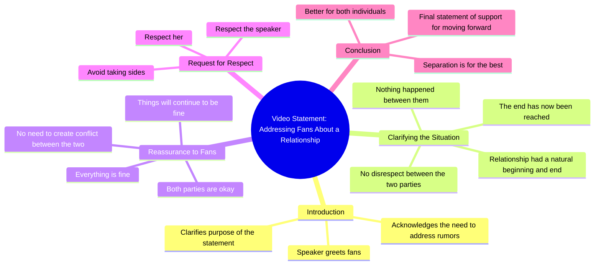

# My Statement About My Fans and Our Split

> 🌐 **Read this in:** **English** · [中文](../../zh-CN/2026-08/tiktok-transcript-tiktok-video-7649580881773989141-8d73.md)

> **Creator:** [@rigbylokao](https://www.tiktok.com/@rigbylokao) · **Views:** 24.8M · **Posted:** 2026-08-10 · **Niche:** entertainment
>
> **TL;DR:** The speaker immediately addresses fans with a sense of obligation, creating intrigue and emotional weight.

[Watch original video →](https://vt.tiktok.com/ZS4ngXoCV/)

## Why This Went Viral

## Hook (first 3 seconds)
- **Verbatim opening:** "oi people so neither nor say what's going on and unfortunately i have to speak here about my fans..."
- **Hook pattern:** Scene + direct address (breaking the fourth wall)
- **Why it stops scroll:** The creator immediately signals a personal, uncomfortable announcement — "unfortunately I have to speak" — creating an implied conflict. The casual "oi people" feels intimate, like a friend interrupting your feed. The ambiguity ("neither nor say what's going on") forces viewers to stay to decode what happened.

## Emotional Rhythm
1. **Curiosity (0–3s):** "What's going on?" — vague tension, something is wrong.
2. **Apprehension (3–8s):** "I have to speak about my fans" — implies a scandal or public dispute.
3. **Defensive clarity (8–15s):** "There was no disrespect between me and her, nothing happened" — attempts to kill rumors but keeps the "her" unnamed, sustaining mystery.
4. **Melancholy acceptance (15–20s):** "Couple is like that has a beginning and an end... we have reached the end" — a poetic, almost philosophical resignation that lands emotionally.
5. **Reassurance (20–28s):** "Everything is fine... respect her, respect me" — a plea for civility, softening the blow.
6. **Climax:** The phrase "unfortunately follow like this it will be better for the 2 of us" — the finality of the breakup delivered with reluctant authority.

## Keyword Density
- **"unfortunately"** (×3) — emotional pull, signals regret and weight.
- **"everything is fine"** (×2) — reassurance, but repeated so often it feels like overcompensation, driving comment speculation.
- **"respect"** (×2) — moral framing, invites audience alignment.
- **"fans"** (×2) — algorithmic reach: directly addresses the audience, boosts engagement.
- **"nothing happened"** — denial that fuels curiosity and debate.
- **"end"** (×2) — finality, emotional resonance.

*Algorithmic drivers:* "fans," "respect," "nothing happened" — these trigger comments, shares, and debate. *Emotional pull:* "unfortunately," "end," "everything is fine" — these sustain empathy and retention.

## Why It Spreads
- **Ambiguity engineered for engagement:** "Neither nor say what's going on" and the unnamed "her" force viewers to comment asking for context, boosting the algorithm.
- **Breakup-confession format is universally relatable:** The "couple has a beginning and an end" line is a poetic, meme-able soundbite that viewers will clip and reuse.
- **Direct fan address creates parasocial urgency:** By framing the video as a message *to fans*, viewers feel personally involved, increasing watch time and shares.
- **Denial + reassurance paradox:** Saying "nothing happened" while announcing a breakup invites speculation and conspiracy theories, driving repeat views and comment threads.
- **Low-production, raw delivery:** The unpolished, stream-of-consciousness style feels authentic and unscripted, which builds trust and shareability.

## What You Can Steal
1. **Lead with a "forced announcement" framing.** Start with "I have to speak about..." to create instant tension, even if your topic is mundane. It signals importance and stakes.
2. **Use poetic one-liners for emotional residue.** Craft a single memorable line (like "couple is like that has a beginning and an end") that viewers can quote, remix, or screenshot.
3. **Leave one deliberate gap.** Don't explain everything — keep one detail vague (the "her," the reason). Unresolved curiosity is the #1 driver of comments, shares, and repeat views.

## Mind Map

## Full Transcript (Generated by [try this transcription tool](https://toktranscript.com/?utm_source=github&utm_medium=breakdown&utm_campaign=tool_attribution))

> 📝 Transcripts on this page are auto-generated and show the first 60%. Want to transcribe any TikTok in 30 seconds and get the full version? [Try TokTranscript free →](https://toktranscript.com/?utm_source=github&utm_medium=breakdown&utm_campaign=transcript_cta)

oi people so neither nor say what's going on and unfortunately i have to speak here about my fans and say that people playing and also say that there was no disrespect between me and her nothing happened couple is like that has a beginning and an end unfortunately we have reached the end I just want to reassure you that everything is fine.

*[Read the full transcript on TokTranscript →](https://toktranscript.com/plaza/tiktok-transcript-tiktok-video-7649580881773989141-8d73?utm_source=github&utm_medium=breakdown&utm_campaign=transcript_full)*

## Browse More

- All [entertainment](../../by-niche/en/entertainment.md) breakdowns
- All [Direct address + reluctant confession](../../by-pattern/en/hook-direct-address-reluctant-confession.md) examples

## Video Info

| | |
|---|---|
| Creator | [@rigbylokao](https://www.tiktok.com/@rigbylokao) |
| Original video | [https://vt.tiktok.com/ZS4ngXoCV/](https://vt.tiktok.com/ZS4ngXoCV/) |
| Original title | TikTok video #7649580881773989141 |
| Views | 24.8M (24800000) |
| Posted | 2026-08-10 |
| Duration | 0s |
| Niche | `entertainment` |
| Hook pattern | `Direct address + reluctant confession` |
| Original language | `en` |
| Available languages | en, zh-CN |
| Generated | 2026-08-11 by [TokTranscript](https://toktranscript.com/) |

---

*This breakdown is for educational analysis under fair use. Original video © [@rigbylokao](https://www.tiktok.com/@rigbylokao). All transcripts are auto-generated and may contain errors.*

*Want to analyze your own TikToks like this? [TokTranscript.com →](https://toktranscript.com/viral-breakdown?utm_source=github&utm_medium=breakdown&utm_campaign=footer_cta)*