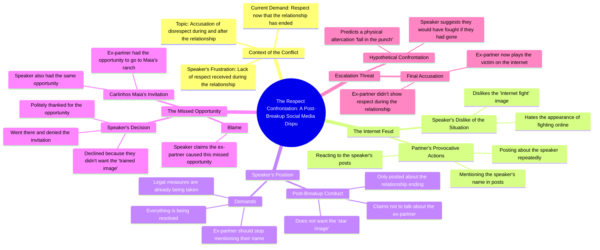

# Why Exes Demand Respect After Disrespecting You

> 🌐 **Read this in:** **English** · [中文](../../zh-CN/2026-08/tiktok-transcript-tiktok-video-7671785610285174037-0aae.md)

> **Creator:** [@rigbylokao](https://www.tiktok.com/@rigbylokao) · **Views:** 7.6M · **Posted:** 2026-08-09 · **Niche:** entertainment
>
> **TL;DR:** Starts with a pointed accusation that immediately creates tension and curiosity.

[Watch original video →](https://vm.tiktok.com/ZGdxAeRRu/)

## Why This Went Viral

## Hook (first 3 seconds)
- **Verbatim opening line:** "What I don't understand is that you didn't give me respect during my relationship... and now that we've forgotten, you want you to cover respect covers something like this."
- **Hook pattern:** Contrast + Accusation. It's a direct, confrontational address that flips the script — "You didn't respect me then, but you demand it now."
- **Why it stops the scroll:** It's a public rebuke of a known figure (the "you" is clearly a specific person). The raw, unfiltered anger and the phrase "cover respect" create instant intrigue — viewers immediately want the backstory.

## Emotional Rhythm
- **Beat 1 — Indignation (0-5s):** The accuser opens with righteous anger, establishing a clear wrong ("you didn't give me respect").
- **Beat 2 — Disgust ("I hate it"):** The speaker breaks the fourth wall, expressing visceral hatred for the situation. This feels authentic and unscripted.
- **Beat 3 — Defensiveness/Clarification:** "I don't talk about you... I don't want the star image." The speaker pivots to defend their own reputation, creating a "he said/she said" tension.
- **Beat 4 — Escalation/Threat:** "Take my name out of your mouth because the measures are already being taken." This is the **climax** — a legal threat that spikes the drama.
- **Beat 5 — Deflection/Challenge:** The speaker brings up a missed opportunity (Carlinhos Maia's ranch) and ends with a violent hypothetical: "We were going to fall in the punch." This leaves the viewer on a cliffhanger of unresolved conflict.

## Keyword Density
- **Respect** — The central theme; drives both emotional pull (dignity) and algorithmic reach (controversy).
- **Name** — "Take my name out of your mouth" — signals reputation warfare, a high-engagement topic.
- **Relationship** — Sets the personal context, drawing in viewers who relate to breakup drama.
- **Internet fight** — The speaker explicitly names the genre, making the video self-aware and shareable.
- **Opportunity** — Introduces a concrete plot point (the ranch invite) that fuels speculation.
- **Victim** — "Play the victim" — a classic accusation that triggers audience alignment (team-picking).

## Why It Spreads
- **Real-time drama:** The transcript reads like a live confrontation, not a scripted video. The stumbles, repetitions, and raw anger ("oh for the love of god") signal authenticity — the #1 currency for viral short-form.
- **Namedropping:** Mentioning "Carlinhos Maia" (a massive Brazilian influencer) piggybacks on his existing audience and search traffic, giving the video a built-in discovery engine.
- **Escalation hook:** The threat of "measures are already being taken" invites viewers to speculate on the outcome, driving comments and return visits.
- **Relatable core:** The emotional arc — feeling disrespected in a relationship, then being asked for respect after — is universally understood, even if the specifics are niche.
- **Open loop:** The final line ("we were going to fall in the punch") implies a physical altercation was narrowly avoided. It leaves the story unresolved, compelling viewers to seek part 2.

## What You Can Steal
- **Start with a direct accusation, not a greeting.** The first line names the offense and the offender. Your hook should immediately state the conflict — no "hey guys" preamble.
- **Use a "spiral" delivery.** The speaker repeats themselves ("I don't want the star image") and interjects ("I hate it"). This feels unpolished and real. Practice delivering your script with natural, emotional breaks — don't over-edit.
- **End on a threat or an open question.** "Measures are already being taken" is a cliffhanger. Always leave your audience with a reason to comment, guess, or demand a follow-up.

## Mind Map

## Full Transcript (Generated by [the tool we used to generate this](https://toktranscript.com/?utm_source=github&utm_medium=breakdown&utm_campaign=tool_attribution))

> 📝 Transcripts on this page are auto-generated and show the first 60%. Want to transcribe any TikTok in 30 seconds and get the full version? [Try TokTranscript free →](https://toktranscript.com/?utm_source=github&utm_medium=breakdown&utm_campaign=transcript_cta)

what i don't understand is that you didn't give me respect during my relationship our relationship and now that we've forgotten you want you to cover respect covers something like this oh for the love of god I hate I came here to say this I hate it because it looks like he's fighting giving internet fight i hate it but unfortunately you've been posting this all the time my name every time it was me who did something every time i posted something and I don't talk about you I don't speak at any time the relationship ended the only thing I posted was myment and it's over I don't want the star image and say it again I don't want the star image and if i were you I took my name out of my mouth because the measures are already being taken everything is being resolv

*[Read the full transcript on TokTranscript →](https://toktranscript.com/plaza/tiktok-transcript-tiktok-video-7671785610285174037-0aae?utm_source=github&utm_medium=breakdown&utm_campaign=transcript_full)*

## Browse More

- All [entertainment](../../by-niche/en/entertainment.md) breakdowns
- All [Direct accusation](../../by-pattern/en/hook-direct-accusation.md) examples

## Video Info

| | |
|---|---|
| Creator | [@rigbylokao](https://www.tiktok.com/@rigbylokao) |
| Original video | [https://vm.tiktok.com/ZGdxAeRRu/](https://vm.tiktok.com/ZGdxAeRRu/) |
| Original title | TikTok video #7671785610285174037 |
| Views | 7.6M (7600000) |
| Posted | 2026-08-09 |
| Duration | 0s |
| Niche | `entertainment` |
| Hook pattern | `Direct accusation` |
| Original language | `en` |
| Available languages | en, zh-CN |
| Generated | 2026-08-10 by [TokTranscript](https://toktranscript.com/) |

---

*This breakdown is for educational analysis under fair use. Original video © [@rigbylokao](https://www.tiktok.com/@rigbylokao). All transcripts are auto-generated and may contain errors.*

*Want to analyze your own TikToks like this? [try this transcription tool →](https://toktranscript.com/viral-breakdown?utm_source=github&utm_medium=breakdown&utm_campaign=footer_cta)*