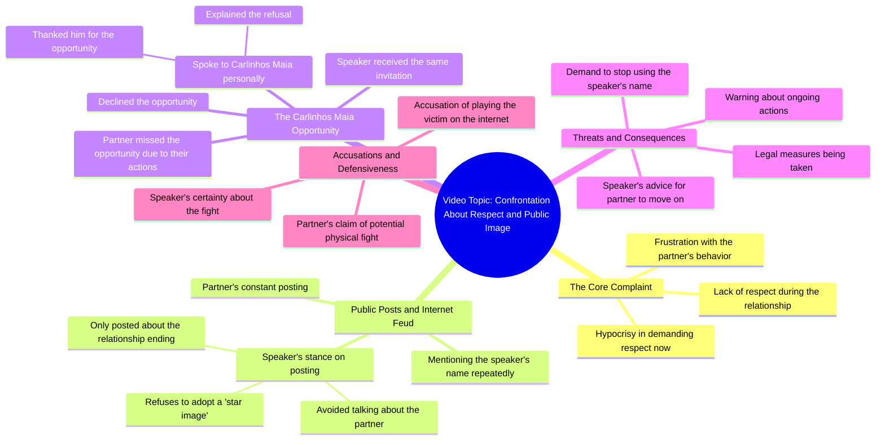

# Why Exes Demand Respect After Disrespecting You

> 🌐 **Read this in:** **English** · [中文](../../zh-CN/2026-08/tiktok-transcript-tiktok-video-7671785610285174037-d198.md)

> **Creator:** [@rigbylokao](https://www.tiktok.com/@rigbylokao) · **Views:** 7.9M · **Posted:** 2026-08-09 · **Niche:** entertainment
>
> **TL;DR:** Opens with a pointed accusation that immediately creates tension and curiosity.

[Watch original video →](https://vm.tiktok.com/ZGdxAL8ED/)

## Why This Went Viral

## Hook (first 3 seconds)
- **Verbatim opening:** "What I don't understand is that you didn't give me respect during my relationship... and now that we've forgotten, you want you to cover respect, covers something like this."
- **Hook pattern:** **Contrast + Accusation.** It sets up a direct moral contradiction ("no respect then" vs. "demanding respect now") and immediately names the other person as the wrongdoer.
- **Why it stops the scroll:** It drops the viewer straight into the middle of a live, unresolved conflict. The accusatory tone and the phrase "I don't understand" create instant cognitive tension—the viewer needs to know who is fighting and what happened.

## Emotional Rhythm
1. **Confusion/Curiosity:** "I don't understand" — viewer is pulled in to figure out the backstory.
2. **Tension/Outrage:** The accusation of disrespect and the "playing the victim" jab raise the stakes.
3. **Frustration/Disgust:** "Oh for the love of God, I hate it" — the speaker's raw emotion feels unscripted, authentic.
4. **Defensiveness/Clarity:** "I don't talk about you... the only thing I posted was my statement." The speaker tries to set the record straight, giving the viewer a side to root for.
5. **Escalation/Threat:** "Take my name out of your mouth because measures are already being taken." This is the tension peak—real-world consequences are implied.
6. **Deflection/Challenge:** "Go to work... you missed this opportunity because of you." Shifts blame and adds a practical, almost petty jab.
7. **Climax (Hypothetical Violence):** "We were going to fall in the punch there, I am sure of it." The mention of a physical fight is the explosive peak—it's the most shareable, shocking line.
8. **Resolution (Moral High Ground):** "Why didn't you respect me during our relationship, now you want to ask for respect?" — A circular, final punchline that brings the viewer back to the initial accusation.

## Keyword Density
- **"Respect"** (drives emotional pull — the core moral conflict).
- **"Image"** (drives emotional pull — ties to reputation and public persona).
- **"Opportunity"** (drives emotional pull — implies the other person wasted a chance).
- **"Relationship"** (drives algorithmic reach — high-search, high-interest relational drama topic).
- **"Internet/Posting"** (drives algorithmic reach — signals social media drama, a trending niche).
- **"Measures"** (drives emotional pull — implies legal or serious action, adds gravity).
- **"Victim"** (drives emotional pull — a highly charged accusation in online discourse).

## Why It Spreads
- **Real-time conflict, not a recap:** The speaker says "I came here to say this" and "you've been posting this all the time." It feels like a live, unedited reaction video, not a polished story. This authenticity triggers the "I need to see how this ends" response.
- **The threat of escalation:** "The measures are already being taken" and "we were going to fall in the punch" promise future content. Viewers share it to fuel the ongoing saga and speculate on what happens next.
- **Relatable relationship drama:** The core accusation—"you didn't respect me then, now you want respect"—is a universal relationship grievance. It makes the video feel applicable to anyone's personal drama, not just this specific feud.
- **Clear villain framing:** The speaker positions themselves as the wronged party who "denied" the same opportunity and "didn't talk about" the ex. This gives the audience a clear side to take, which drives comments and arguments—both of which boost the algorithm.
- **High-emotion, high-stakes language:** Phrases like "for the love of God," "I hate it," and "fall in the punch" are visceral. They're not diplomatic; they're raw, which makes the clip highly quotable and clip-able for reaction channels.

## What You Can Steal
- **Open with a moral contradiction:** Start your video by pointing out a flaw in someone else's logic or behavior ("You said X, but did Y"). This instantly creates conflict and curiosity without needing a setup.
- **Use escalating stakes:** Move from personal frustration to a concrete consequence ("measures are being taken"). This keeps viewers hooked because they know the situation is bigger than just a rant.
- **End with a circular callback:** Bring the viewer back to your opening line ("Why didn't you respect me then..."). This creates a satisfying, complete narrative arc that feels like a mic-drop, making the clip more shareable as a standalone unit.

## Mind Map

## Full Transcript (Generated by [TokTranscript.com](https://toktranscript.com/?utm_source=github&utm_medium=breakdown&utm_campaign=tool_attribution))

> 📝 Transcripts on this page are auto-generated and show the first 60%. Want to transcribe any TikTok in 30 seconds and get the full version? [Try TokTranscript free →](https://toktranscript.com/?utm_source=github&utm_medium=breakdown&utm_campaign=transcript_cta)

what i don't understand is that you didn't give me respect during my relationship our relationship and now that we've forgotten you want you to cover respect covers something like this oh for the love of god I hate I came here to say this I hate it because it looks like he's fighting giving internet fight i hate it but unfortunately you've been posting this all the time my name every time it was me who did something every time i posted something and I don't talk about you I don't speak at any time the relationship ended the only thing I posted was myment and it's over I don't want the star image and say it again I don't want the star image and if i were you I took my name out of my mouth because the measures are already being taken everything is being resolv

*[Read the full transcript on TokTranscript →](https://toktranscript.com/plaza/tiktok-transcript-tiktok-video-7671785610285174037-d198?utm_source=github&utm_medium=breakdown&utm_campaign=transcript_full)*

## Browse More

- All [entertainment](../../by-niche/en/entertainment.md) breakdowns
- All [Direct accusation with emotional contrast](../../by-pattern/en/hook-direct-accusation-with-emotional-contrast.md) examples

## Video Info

| | |
|---|---|
| Creator | [@rigbylokao](https://www.tiktok.com/@rigbylokao) |
| Original video | [https://vm.tiktok.com/ZGdxAL8ED/](https://vm.tiktok.com/ZGdxAL8ED/) |
| Original title | TikTok video #7671785610285174037 |
| Views | 7.9M (7900000) |
| Posted | 2026-08-09 |
| Duration | 0s |
| Niche | `entertainment` |
| Hook pattern | `Direct accusation with emotional contrast` |
| Original language | `en` |
| Available languages | en, zh-CN |
| Generated | 2026-08-10 by [TokTranscript](https://toktranscript.com/) |

---

*This breakdown is for educational analysis under fair use. Original video © [@rigbylokao](https://www.tiktok.com/@rigbylokao). All transcripts are auto-generated and may contain errors.*

*Want to analyze your own TikToks like this? [TokTranscript →](https://toktranscript.com/viral-breakdown?utm_source=github&utm_medium=breakdown&utm_campaign=footer_cta)*