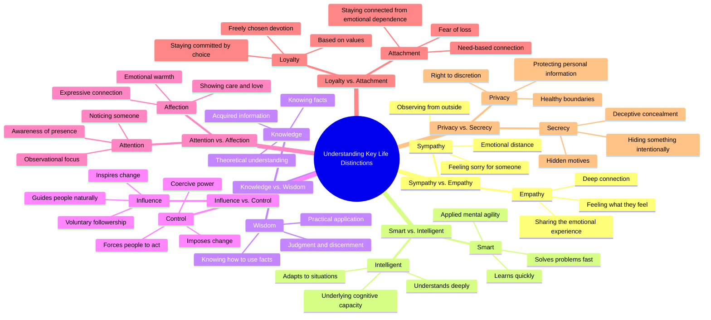

# Sympathy vs Empathy: Key Differences Explained

> 🌐 **Read this in:** **English** · [中文](../../zh-CN/2026-08/tiktok-transcript-what-s-the-difference-difference-learn-psychology-bff7.md)

> **Creator:** [@diffstick](https://www.tiktok.com/@diffstick) · **Views:** 4.6M · **Posted:** 2026-08-06 · **Niche:** entertainment
>
> **TL;DR:** The immediate juxtaposition of two similar concepts creates a knowledge gap that compels viewers to watch for the answer.

[Watch original video →](https://vt.tiktok.com/ZS4Qb4Pe7/)

## Why This Went Viral

## Hook (first 3 seconds)
- **Verbatim opening:** "This is sympathy, this is empathy. What's the difference?"
- **Hook pattern:** Contrast + rhetorical question (a "binary reveal" pattern)
- **Why it stops scroll:** It promises a clean, instantly-gratifying distinction between two words people routinely confuse. The visual pairing (likely two objects or gestures) creates a "pattern interrupt" — viewers feel an immediate gap in their own knowledge and want to close it.

## Emotional Rhythm
1. **Curiosity (0–3s):** "What's the difference?" — the question primes a knowledge gap.
2. **Satisfaction (3–6s):** Sympathy vs. empathy — a quick, crisp answer delivers a mini-reward.
3. **Anticipation (6–12s):** The pattern repeats (smart/intelligent, knowledge/wisdom) — viewers now *predict* the structure, which builds a rhythm of expected reward.
4. **Escalation (12–20s):** Influence vs. control, attention vs. affection — stakes rise from cognitive to relational/emotional.
5. **Tension (20–26s):** Loyalty vs. attachment — this is the emotional peak; it hits on relationships, vulnerability, and self-awareness.
6. **Climax (26–30s):** Privacy vs. secrecy — the final pair lands on a darker, more intimate note, leaving a lingering thought rather than a punchline.
7. **Resolution:** No explicit outro — the silence after the last line lets the viewer sit with the final contrast.

**Climax moment:** "Loyalty is staying committed by choice, while attachment is staying connected from emotional dependence." — This is the line most likely to be quoted, screenshotted, or reshared.

## Keyword Density
- **"This is"** (repeated 14×) — structural anchor; drives pattern recognition and watch-time.
- **"What's the difference?"** (repeated 7×) — the rhetorical engine; triggers curiosity and retention.
- **"While"** (repeated 7×) — the contrast pivot; makes each pair feel definitive.
- **"Feeling" / "Feel"** (empathy, affection) — emotional pull; drives comment-section engagement.
- **"Choice" vs. "Dependence"** (loyalty/attachment) — high-arousal words that spark debate.
- **"Knowledge" / "Wisdom" / "Intelligence"** — aspirational keywords; boost shareability among self-improvement audiences.

**Algorithmic reach drivers:** "What's the difference?" (searchable question format), "This is" (loopable structure).  
**Emotional pull drivers:** "Choice," "Dependence," "Hiding" — these create self-reflection and comments.

## Why It Spreads
- **Universal knowledge gap:** Everyone has *used* these words interchangeably. The video exposes a subtle error in the viewer's own vocabulary — a low-stakes "aha" that feels personal. (e.g., "Sympathy is feeling sorry for someone, while empathy is feeling what they feel.")
- **Rhythmic predictability + micro-rewards:** The 7-pair structure creates a cadence. Once viewers learn the pattern, they stay to see each new pair — a slot-machine effect. (e.g., "This is smart, this is intelligent… This is knowledge, this is wisdom.")
- **High-quoteability:** The loyalty/attachment line is a standalone aphorism. Viewers screenshot it, caption it, and repost it — turning the video into shareable text.
- **Comment-bait contrast:** The pairs are *not* universally agreed upon (e.g., "intelligence vs. smart" is debatable). This invites pushback, corrections, and "actually…" comments — which boosts engagement signals.
- **No face, no brand, no filler:** The pure text/visual format makes it platform-agnostic (TikTok, Reels, Shorts, X) and easy to remix or translate — extending its lifespan across audiences.

## What You Can Steal
- **Use the "binary reveal" structure:** Take two commonly conflated concepts (e.g., "confidence vs. arrogance," "busy vs. productive") and deliver a crisp, one-line distinction. Repeat the pattern 5–7 times to build rhythm.
- **Front-load the most relatable pair:** Start with a pair your audience *already* confuses (sympathy/empathy) to hook them, then escalate to a more emotionally charged pair (loyalty/attachment) for the climax.
- **End on a thought, not a call-to-action:** No "follow for more" or "like if you agree." The silence after the final contrast creates a reflective pause — viewers are more likely to share something that made them *think* than something that asked them to engage.

## Mind Map

## Full Transcript (Generated by [TokTranscript](https://toktranscript.com/?utm_source=github&utm_medium=breakdown&utm_campaign=tool_attribution))

> 📝 Transcripts on this page are auto-generated and show the first 60%. Want to transcribe any TikTok in 30 seconds and get the full version? [Try TokTranscript free →](https://toktranscript.com/?utm_source=github&utm_medium=breakdown&utm_campaign=transcript_cta)

This is sympathy, this is empathy. What's the difference? Sympathy is feeling sorry for someone, while empathy is feeling what they feel. This is smart, this is intelligent. What's the difference? Being smart is learning and solving quickly, while intelligence is understanding deeply and adapting. This is knowledge, this is wisdom. What's the difference? Knowledge is knowing facts, while wisdom is knowing how to use them. This is influence, this is control. What's the difference? Influence guides people naturally, while control forces people to act a certain way. This is attention, this is affection.

*[Read the full transcript on TokTranscript →](https://toktranscript.com/plaza/tiktok-transcript-what-s-the-difference-difference-learn-psychology-bff7?utm_source=github&utm_medium=breakdown&utm_campaign=transcript_full)*

## Browse More

- All [entertainment](../../by-niche/en/entertainment.md) breakdowns
- All [Curiosity gap with binary contrast](../../by-pattern/en/hook-curiosity-gap-with-binary-contrast.md) examples

## Video Info

| | |
|---|---|
| Creator | [@diffstick](https://www.tiktok.com/@diffstick) |
| Original video | [https://vt.tiktok.com/ZS4Qb4Pe7/](https://vt.tiktok.com/ZS4Qb4Pe7/) |
| Original title | What’s The Difference ?   #difference #learn #psychology  |
| Views | 4.6M (4600000) |
| Posted | 2026-08-06 |
| Duration | 0s |
| Niche | `entertainment` |
| Hook pattern | `Curiosity gap with binary contrast` |
| Original language | `en` |
| Available languages | en, zh-CN |
| Generated | 2026-08-07 by [TokTranscript](https://toktranscript.com/) |

---

*This breakdown is for educational analysis under fair use. Original video © [@diffstick](https://www.tiktok.com/@diffstick). All transcripts are auto-generated and may contain errors.*

*Want to analyze your own TikToks like this? [try this transcription tool →](https://toktranscript.com/viral-breakdown?utm_source=github&utm_medium=breakdown&utm_campaign=footer_cta)*