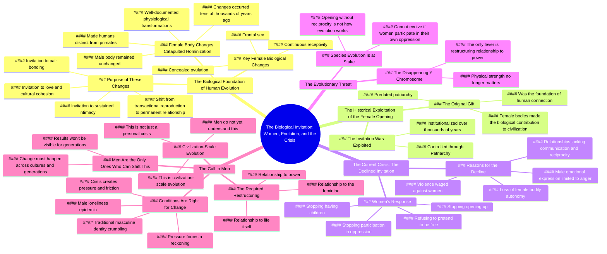

# Why Women Can’t Save Men: A Biological Truth

> 🌐 **Read this in:** **English** · [中文](../../zh-CN/2026-08/tiktok-transcript-women-cannot-save-men-or-the-human-species-will-not-continue-144a.md)

> **Creator:** [@kristen1942](https://www.tiktok.com/@kristen1942) · **Views:** 2.2M · **Posted:** 2026-08-06 · **Niche:** other
>
> **TL;DR:** Immediately challenges a common trope, creating curiosity and tension.

[Watch original video →](https://vt.tiktok.com/ZS4QJWLDm/)

## Why This Went Viral

## Hook (first 3 seconds)
- **Verbatim opening:** *"There is a biological reason that women cannot awaken men, that we cannot save you."*
- **Hook pattern:** Bold claim + direct address ("you") — a provocative, gendered assertion that immediately creates an "us vs. them" tension.
- **Why it stops scroll:** It flips a common spiritual/relationship trope ("women awaken men") into a hard biological determinism claim. The word "cannot" is absolute and challenges both male ego and female intuition simultaneously. It promises a hidden structural truth, not opinion.

## Emotional Rhythm
1. **Curiosity/Intrigue** — The bold claim sets up a "why?" question in the viewer's mind.
2. **Elevation/Validation (for women)** — The shift to "changes made solely to the female body made us human" gives female viewers a sense of historical importance and pride.
3. **Tension/Confrontation** — "The male body hasn't changed. You guys still operate sexually the same way that primates do." This is a direct insult disguised as anthropology — provokes defensiveness in men, agreement in women.
4. **Nostalgia/Resonance** — "That was a gift. It was an invitation." — reframes female biology as sacred, not shameful.
5. **Anger/Resentment (climax)** — "We cannot love men into mass awakening... We can't want you enough." — the emotional peak; a declaration of surrender and withdrawal.
6. **Threat/Urgency** — "The Y in your chromosome is disappearing." — introduces existential fear, raising stakes from social to species-level.
7. **Call to Action (veiled)** — "The only lever that matters now is whether enough of you... choose to fundamentally restructure your relationship to power." — ends with a challenge, not a solution, leaving tension unresolved.

**Climax moment:** *"We cannot love men into mass awakening."* — This is the line that gets clipped, quoted, and argued over. It's the emotional rupture.

## Keyword Density
- **"Female body"** (6×) — Core biological anchor; drives algorithmic reach via gender-related search and debate.
- **"Opening/Open up"** (7×) — Central metaphor; emotional pull (vulnerability) + political pull (bodily autonomy).
- **"Evolution/evolve"** (5×) — Pseudo-scientific authority; boosts shareability via "did you know" framing.
- **"Invitation"** (4×) — Romanticizes the argument; emotional resonance, makes it feel like a love letter and a breakup letter at once.
- **"Men"** (5×) — Direct target; ensures male viewers either engage defensively or share it to other men.
- **"Oppression"** (3×) — Political charge; drives algorithmic reach in feminist/anti-feminist echo chambers.
- **"Primates"** (2×) — Shock word; insults male viewers while creating a "gotcha" scientific tone.

**Algorithmic drivers:** "female body," "evolution," "oppression" — all high-search-volume terms with strong debate potential.

**Emotional pull:** "opening," "invitation," "cannot" — words that carry relational weight and personal stakes.

## Why It Spreads
1. **Gender-baiting with a scientific veneer.** The claim "female body made us human, male body didn't change" is a perfect outrage engine. It gives women a fact-based superiority narrative and gives men something to debunk — both sides share it for opposite reasons. *Evidence: "It is the female body that changed culture and pushed humans into being human."*
2. **The "Y chromosome disappearing" hook.** This is a real, documented scientific trend (genetic decay) that the speaker weaponizes as an existential threat. It's clickbait that feels like news. *Evidence: "The Y in your chromosome is disappearing."*
3. **It's a breakup letter to men, delivered publicly.** The emotional format — "we gave you a gift, you exploited it, we're done" — is universally relatable in relationship terms, even if the biological framing is contested. *Evidence: "That original invitation... has been declined."*
4. **Unresolved tension drives comments.** The video ends with a challenge ("the only lever that matters now is whether enough of you choose to restructure") but no solution. Viewers flood comments with "but what should men DO?" — engagement that boosts the algorithm. *Evidence: "The only lever that matters now is whether enough of you... choose to fundamentally restructure."*
5. **It flips the "men's rights" narrative into a "women's withdrawal" narrative.** Instead of framing women as victims asking for change, it frames women as the engine of evolution who are now *stopping* — a power move that gets shared in feminist circles as a mic-drop and in men's circles as a call to action.

## What You Can Steal
1. **Lead with a "cannot" claim that challenges a common belief.** Instead of "here's how to fix X," say "here's why X is biologically/structurally impossible." The absolute framing forces engagement — people either want to prove you wrong or share you as a truth-teller.
2. **Use a "gift → exploitation → withdrawal" three-act structure.** Frame your topic as something that was given, then taken for granted, then withdrawn. This creates a narrative arc that works for any topic — relationships, work, politics — and gives viewers a sense of tragic momentum.
3. **End with a threat, not a solution.** The video's most-shared line ("Y chromosome disappearing") is a threat. Leaving the viewer with an unresolved existential risk — not a tidy "here's what to do" — makes them comment, argue, and share to ask others what they think.

## Mind Map

## Full Transcript (Generated by [the tool we used to generate this](https://toktranscript.com/?utm_source=github&utm_medium=breakdown&utm_campaign=tool_attribution))

> 📝 Transcripts on this page are auto-generated and show the first 60%. Want to transcribe any TikTok in 30 seconds and get the full version? [Try TokTranscript free →](https://toktranscript.com/?utm_source=github&utm_medium=breakdown&utm_campaign=transcript_cta)

There is a biological reason that women cannot awaken men, that we cannot save you. And I don't say that as a criticism or you're on your own. I mean it as a structural, uh, truth about how our species works. Tens of thousands of years ago, changes happen to the female body that are very well documented. And those changes are what catapulted our entire species into hominization. Meaning that changes made solely, or that happened solely to the female body is what made us human. It's what propelled culture forward into something more intimate and more cohesive. And the male body hasn't changed. You guys still operate sexually the same way that primates do. It is the female body that changed culture and pushed humans into being human. That is a documented fact. And what those changes did, primarily frontal sex, concealed ovulation and continuous receptivity. All of that was an invitation to our male partners, an invitation to enter into us with sustained intimacy, an invitation into pair bonding, an invitation into something that looked more like love and cultural cohesion as a permanent state rather than just a seasonal one. A transactional act where we reproduce and move on. So, in a very real sense, the female body opened to the idea of prolonged love and relationship. And what happened over the thousands of years that followed since then is that opening, that opening up of us got exploited, it got institutionalized, it got controlled through Patriarchy. And here we are. But I want. What I want you to understand is this. That original invitation, that original opening, those original changes to the female body that allowed us to cross the chasm from primates to humans. That was a gift. It was an invitation. That was already the thing that women did for this species. That was the biological contribution to human connection and civilization. It was made by female bodies before patriarchy ever had a name. And now that invitation has been declined, seemingly through the loss of our own bodily autonomy, through relationships with no communication, no reciprocity, the only emotion capable of being expressed by our male counterparts being anger. Through the violence that gets waged against us. We cannot just pretend that we are free. We cannot just keep, keep opening.

*[Read the full transcript on TokTranscript →](https://toktranscript.com/plaza/tiktok-transcript-women-cannot-save-men-or-the-human-species-will-not-continue-144a?utm_source=github&utm_medium=breakdown&utm_campaign=transcript_full)*

## Browse More

- All [other](../../by-niche/en/other.md) breakdowns
- All [Provocative claim](../../by-pattern/en/hook-provocative-claim.md) examples

## Video Info

| | |
|---|---|
| Creator | [@kristen1942](https://www.tiktok.com/@kristen1942) |
| Original video | [https://vt.tiktok.com/ZS4QJWLDm/](https://vt.tiktok.com/ZS4QJWLDm/) |
| Original title | Women cannot save men or the human species will not continue to evolv... |
| Views | 2.2M (2200000) |
| Posted | 2026-08-06 |
| Duration | 0s |
| Niche | `other` |
| Hook pattern | `Provocative claim` |
| Original language | `en` |
| Available languages | en, zh-CN |
| Generated | 2026-08-07 by [TokTranscript](https://toktranscript.com/) |

---

*This breakdown is for educational analysis under fair use. Original video © [@kristen1942](https://www.tiktok.com/@kristen1942). All transcripts are auto-generated and may contain errors.*

*Want to analyze your own TikToks like this? [the tool we used to generate this →](https://toktranscript.com/viral-breakdown?utm_source=github&utm_medium=breakdown&utm_campaign=footer_cta)*