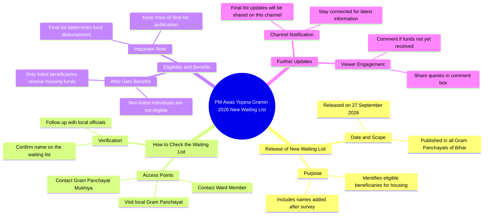

# PM Awas Yojana 2026 New List: Check Your Name

> 🌐 **Read this in:** **English** · [中文](../../zh-CN/2026-09/tiktok-transcript-1-1m-views-18k-reactions-pm-awas-2026-new-list-pm-awas-yojan-a696.md)

> **Creator:** [@Bk Online Update](https://www.tiktok.com/@Bk Online Update) · **Views:** 624.5K · **Posted:** 2026-09-28 · **Niche:** other
>
> **TL;DR:** Creates urgency by announcing a major update about a new beneficiary list for a popular government scheme.

[Watch original video →](https://www.facebook.com/share/v/1ErEpsH8hN/)

## Why This Went Viral

## Hook (first 3 seconds)
- **Verbatim opening:** "देखे अभी अभी एक बड़ी अपडेट निकल कर आ रही है" ("Look, a big update has just come out right now")
- **Hook pattern:** Breaking-news urgency + bold claim ("big update, just now") stacked with a named government scheme (Pradhan Mantri Awas Yojana Gramin 2026).
- **Why it stops the scroll:** It fuses three stop-triggers in one breath — recency ("just now"), scale ("big"), and self-interest (a housing subsidy the viewer may be owed). The viewer's brain instantly asks "am I on that list?" — a question only the video can answer.

## Emotional Rhythm
- **0–3s — Alert/curiosity:** "big update just dropped" + scheme name + date (27 September 2026).
- **3–15s — Rising tension (fear of exclusion):** "the list has been pasted in all Bihar gram panchayats" → implies a public, verifiable, time-sensitive event. Anxiety: *did my name make it?*
- **15–25s — Frustration/problem:** "people can't find the information" — validates the viewer's pain, builds trust.
- **25–35s — Relief/solution:** "ask your gram panchayat mukhiya or ward member" — gives a concrete action.
- **35–45s — Twist/stakes spike:** "only those on the list get the money; others get nothing" — hard binary, loss aversion peaks.
- **45–55s — Retention hook / CTA:** "I'll post the final list on this channel first" + "comment if you haven't received money yet."
- **Climax:** The line "उन्हीं लोगों को घर बनाने के लिए पैसा मिलेगा बाकी लोगों को इसका लाब नहीं मिल पाएगा" — the all-or-nothing stakes moment.

## Keyword Density
- **प्रधान मंत्री आवास योजना ग्रामीण** (scheme name) — algorithmic reach (high search volume).
- **नया वेटिंग लिस्ट / वेटिंग लिस्ट** — reach + emotional pull (identity check).
- **27 सितंबर 2026** — freshness signal, boosts recency ranking.
- **बिहार / ग्राम पंचायत** — geo-targeting, drives local feed distribution.
- **नाम / लिस्ट में डाल दिया गया** — emotional pull (belonging/exclusion).
- **पैसा मिलेगा / लाभ नहीं मिलेगा** — loss-aversion keyword, keeps watch-time.
- **मुखिया / वार्ड सदस्य** — practical search intent, saves/shares.
- **कमेंट बॉक्स में बताएं** — engagement bait, algorithmic lift.
- **Reach drivers:** scheme name + date + Bihar/panchayat. **Emotional drivers:** "नाम," "पैसा मिलेगा," "लाभ नहीं."

## Why It Spreads
- **Hyper-local identity trigger:** "बिहार के सभी ग्राम पंचायतों" makes every Bihar viewer feel personally addressed — shares go to family WhatsApp groups instantly.
- **Binary stakes = loss aversion:** "पैसा मिलेगा… बाकी लोगों को लाभ नहीं मिलेगा" forces viewers to act (watch, share, verify) rather than scroll past.
- **Information gap + authority:** The video positions itself as the first source ("अभी अभी," "मैं सूचना पहले दूंगा") — viewers share to look informed to their network.
- **Actionable path:** Naming "मुखिया या वार्ड सदस्य" gives a concrete next step, converting passive viewers into savers/sharers.
- **Comment-bait loop:** "कमेंट बॉक्स में जरूर बताएगा" triggers a comment flood, which the algorithm reads as high engagement and pushes further.

## What You Can Steal
- **Lead with a timestamped "just now" update** tied to a named scheme/event your audience already searches for — recency + specificity beats generic hooks.
- **Build the middle around a binary outcome** ("you get it / you don't") — loss aversion keeps watch-time high and drives shares.
- **End with a two-part CTA:** a promise ("I'll post the final list here first") + a comment prompt tied to the viewer's personal situation — this compounds retention and engagement signals.

## Mind Map

## Full Transcript (Generated by [free TikTok transcript generator](https://toktranscript.com/?utm_source=github&utm_medium=breakdown&utm_campaign=tool_attribution))

> 📝 Transcripts on this page are auto-generated and show the first 60%. Want to transcribe any TikTok in 30 seconds and get the full version? [Try TokTranscript free →](https://toktranscript.com/?utm_source=github&utm_medium=breakdown&utm_campaign=transcript_cta)

देखे अभी अभी एक बड़ी अपडेट निकल कर आ रही है पर्धान मंत्री अवास योजना गरामीन दोहजार चब्विस का नया बेटिंग लिष्ट आज यानि 27 सेप्टेमबर दोहजार चब्विस को बिहार के सभी ग्राम पंचायतों में जाड़ी कर दिया गया है तो इस गयारा सब कुछ हो चुका था लेकिन सर्वे होने के बाद बहुत सारे लोगों का नाम यहां पर बेटिंग लिश्ट में डाल दिया गया है और उन्हीं सभी लोगों का बेटिंग लिश्ट जो है आज यानि 27 सेप्टेंबर 2026 को बिहार के सभी ग्राम पंचैतों में जो है वो अबासे जूरी जनकारी नहीं मिल पाती है तो इसके लिए आपको क्या करना है आपके ग्राम पंचैत के जो भी मुख्या या फिर वाड सदसे हैं उनसे भी इसके बारे में आप पता कर सकते है

*[Read the full transcript on TokTranscript →](https://toktranscript.com/plaza/tiktok-transcript-1-1m-views-18k-reactions-pm-awas-2026-new-list-pm-awas-yojan-a696?utm_source=github&utm_medium=breakdown&utm_campaign=transcript_full)*

## Browse More

- All [other](../../by-niche/en/other.md) breakdowns
- All [Breaking News Alert](../../by-pattern/en/hook-breaking-news-alert.md) examples

## Video Info

| | |
|---|---|
| Creator | [@Bk Online Update](https://www.tiktok.com/@Bk Online Update) |
| Original video | [https://www.facebook.com/share/v/1ErEpsH8hN/](https://www.facebook.com/share/v/1ErEpsH8hN/) |
| Original title | 1.1M views · 18K reactions | 🚨 PM Awas 2026 New List जारी! 🏠 PM Awas Yojana New List 2026 कैसे चेक करें? लिस्ट में नाम कैसे चेक करें? 👀 पूरी जानकारी इस वीडियो में बताई गई है।👇 #PMAwasYojana #PMAwasList2026 #PMAY2026 #AwasYojana #BKOnlineUpdate | Bk Online Update |
| Views | 624.5K (624538) |
| Posted | 2026-09-28 |
| Duration | 0s |
| Niche | `other` |
| Hook pattern | `Breaking News Alert` |
| Original language | `en` |
| Available languages | en, zh-CN |
| Generated | 2026-09-29 by [TokTranscript](https://toktranscript.com/) |

---

*This breakdown is for educational analysis under fair use. Original video © [@Bk Online Update](https://www.tiktok.com/@Bk Online Update). All transcripts are auto-generated and may contain errors.*

*Want to analyze your own TikToks like this? [TokTranscript.com →](https://toktranscript.com/viral-breakdown?utm_source=github&utm_medium=breakdown&utm_campaign=footer_cta)*