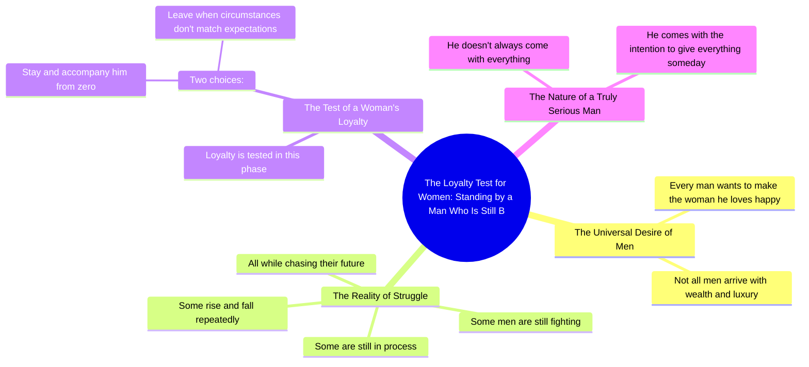

# Loyal Woman Stands by Struggling Man

> 🌐 **Read this in:** **English** · [中文](../../zh-CN/2026-09/tiktok-transcript-1-1m-views-32k-reactions-kadang-mburi-omah-on-reels-98c8.md)

> **Creator:** [@Kadang Mburi Omah](https://www.tiktok.com/@Kadang Mburi Omah) · **Views:** 433.7K · **Posted:** 2026-09-30 · **Niche:** entertainment
>
> **TL;DR:** It starts with a relatable universal statement that hooks viewers, then immediately introduces a contrasting reality to create tension.

[Watch original video →](https://www.facebook.com/share/r/19YwqbwfbX/)

## Why This Went Viral

## Hook (first 3 seconds)
- Opening line verbatim: "Pada dasarnya, semua lelaki ingin membahagiakan wanita yang dicintainya."
- Hook pattern: **Universal truth / bold generalization** ("basically, all men want to…")
- Why it stops the scroll: It makes an absolute claim about a whole gender in the first breath. Male viewers feel seen or challenged; female viewers test the claim against their own experience. The word "semua" (all) invites instant self-identification or disagreement — both keep the thumb still.

## Emotional Rhythm
- Beat 1 — **Validation** (0–3s): "all men want to make their woman happy" → warm, inclusive open.
- Beat 2 — **Reality check** (3–8s): "but not all men arrive with wealth and luxury" → mild deflation, tension introduced.
- Beat 3 — **Struggle / empathy** (8–14s): "some are still fighting, still processing, still falling and rising, chasing the future" → builds sympathy, rhythm accelerates with the repeated "masih."
- Beat 4 — **The test / suspense** (14–20s): "that's where a woman's loyalty is tested" → pivot to the viewer's own relationship; suspense peaks here.
- Beat 5 — **Binary choice** (20–24s): "stay and accompany from zero, or leave when things don't match expectations" → moral fork, emotional pressure.
- Beat 6 — **Climax / payoff** (24–30s): "a truly serious man doesn't always come with everything, but comes with the intention to give everything someday" → the twist reframes struggle as proof of love.
- **Climax moment:** the final line — the reversal from "doesn't have everything" to "intends to give everything."

## Keyword Density
- **lelaki / men** — anchor word, drives male self-identification and comment-section debate.
- **wanita / woman** — the target of the emotional promise; pulls female audience.
- **semua / all** — absolutist framing, boosts emotional pull and shareability.
- **membahagiakan / make happy** — core emotional keyword.
- **berjuang / masih / still** — repetition of "still" creates rhythm and relatability for the struggling demographic.
- **kesetiaan / loyalty** — the tension word; triggers guilt, pride, or defensiveness.
- **dari nol / from zero** — the relatability hook for working-class viewers.
- **niat / intention** — the resolution keyword; converts the message from complaint to hope.

Algorithmic reach: *lelaki, wanita, cinta, setia* (broad, high-search relationship terms). Emotional pull: *masih, berjuang, dari nol, niat* (personal, story-driven).

## Why It Spreads
- **Gender-tribal framing** — "semua lelaki" and "kesetiaan seorang wanita" split the audience into two camps, and both camps comment to defend or agree. Comments are the fuel.
- **The "from zero" relatability** — "mengejar masa depan" and "dari nol" speak directly to the majority who aren't wealthy, making them feel represented and compelled to tag a partner.
- **Built-in moral test** — the binary "bertahan atau pergi" forces viewers to self-audit their own relationship, which converts passive watching into sharing ("this is us").
- **Redemptive twist ending** — "datang dengan niat untuk memberikan segalanya" reframes struggle as romance, giving the video a quotable closing line people screenshot and repost.
- **Zero visual dependency** — the message is pure text/voiceover, so it travels easily across repost accounts, captions, and quote pages without losing meaning.

## What You Can Steal
- **Open with an absolute about a group** ("Every [X] wants…") to force instant self-identification, then immediately complicate it with "but not all."
- **Use rhythmic repetition of one word** ("masih… masih… masih") to build emotional momentum without adding new information.
- **End on a reversal line** that reframes the struggle as a virtue — a single sentence viewers can quote, screenshot, and repost as their own.

## Mind Map

## Full Transcript (Generated by [TokTranscript](https://toktranscript.com/?utm_source=github&utm_medium=breakdown&utm_campaign=tool_attribution))

> 📝 Transcripts on this page are auto-generated and show the first 60%. Want to transcribe any TikTok in 30 seconds and get the full version? [Try TokTranscript free →](https://toktranscript.com/?utm_source=github&utm_medium=breakdown&utm_campaign=transcript_cta)

Pada dasarnya, semua lelaki ingin membahagiakan wanita yang dicintainya. Tapi tidak semua lelaki langsung datang dengan harta dan kemewahan. Ada yang masih berjuang, masih berproses, masih jatuh bangun, mengejar masa depan. Disitulah kesetiaan seorang wanita diuji.

*[Read the full transcript on TokTranscript →](https://toktranscript.com/plaza/tiktok-transcript-1-1m-views-32k-reactions-kadang-mburi-omah-on-reels-98c8?utm_source=github&utm_medium=breakdown&utm_campaign=transcript_full)*

## Browse More

- All [entertainment](../../by-niche/en/entertainment.md) breakdowns
- All [Universal Truth + Contrast](../../by-pattern/en/hook-universal-truth-contrast.md) examples

## Video Info

| | |
|---|---|
| Creator | [@Kadang Mburi Omah](https://www.tiktok.com/@Kadang Mburi Omah) |
| Original video | [https://www.facebook.com/share/r/19YwqbwfbX/](https://www.facebook.com/share/r/19YwqbwfbX/) |
| Original title | 1.1M views · 32K reactions | Kadang Mburi Omah on Reels |
| Views | 433.7K (433682) |
| Posted | 2026-09-30 |
| Duration | 0s |
| Niche | `entertainment` |
| Hook pattern | `Universal Truth + Contrast` |
| Original language | `en` |
| Available languages | en, zh-CN |
| Generated | 2026-10-01 by [TokTranscript](https://toktranscript.com/) |

---

*This breakdown is for educational analysis under fair use. Original video © [@Kadang Mburi Omah](https://www.tiktok.com/@Kadang Mburi Omah). All transcripts are auto-generated and may contain errors.*

*Want to analyze your own TikToks like this? [free TikTok transcript generator →](https://toktranscript.com/viral-breakdown?utm_source=github&utm_medium=breakdown&utm_campaign=footer_cta)*